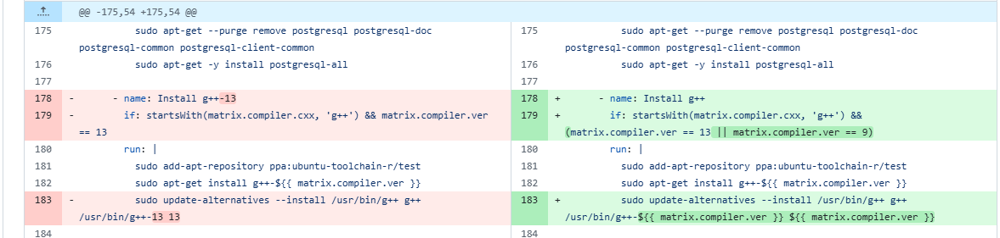

# 从一个宏定义看开源的依赖地狱：Drogon vs Trantor 分析

在开源软件开发中，依赖管理一直是一个充满挑战的话题。最近在 Drogon 中发现了这个问题

（用过rust和go的包管理后 再写c++真要哭了 每次build都是一场豪赌 也可能是还是太菜了

## 回顾

在使用 Conan 包管理器构建 Drogon 1.9.11 时遇到了编译错误：

```cpp
/home/gav2xlin/.conan2/p/b/drogo9f0dcc0bb5db8/b/src/lib/src/HttpResponseImpl.cc: In member function ‘std::shared_ptrtrantor::MsgBuffer drogon::HttpResponseImpl::renderToBuffer()’:
/home/gav2xlin/.conan2/p/b/drogo9f0dcc0bb5db8/b/src/lib/src/HttpResponseImpl.cc:657:54: 
error: ‘MICRO_SECONDS_PRE_SEC’ was not declared in this scope
657 | ((now.microSecondsSinceEpoch() / MICRO_SECONDS_PRE_SEC) !=
| ^~~~~~~~~~~~~~~~~~~~~
[101/148] Building CXX object CMakeFiles/drogon.dir/lib/src/IntranetIpFilter.cc.o
```

问题的根源在于：
- **Trantor 1.5.25** (Drogon 的底层依赖库) 将宏 `MICRO_SECONDS_PRE_SEC` 重命名为 `MICRO_SECONDS_PER_SEC`
- **Drogon 1.9.11** 仍在多处使用旧的宏名称
- 结果：编译失败

### 细节

在 Trantor 的 `Date.h` 中，原本的定义是：

```cpp
#define MICRO_SECONDS_PRE_SEC 1000000LL  // 已删除
```

而 Drogon 的多个文件中仍在使用：

```cpp
// HttpResponseImpl.cc
auto nowSecond = now.microSecondsSinceEpoch() / MICRO_SECONDS_PRE_SEC;

// Utilities.cc
return trantor::Date(epoch * MICRO_SECONDS_PRE_SEC);

// HttpDateTest.cc
CHECK(date.microSecondsSinceEpoch() / MICRO_SECONDS_PRE_SEC == 1591348778);
```

## 分析

1. 破坏性变更的隐蔽性

这个案例揭示了一个重要问题：**即使是修正拼写错误这样看似无害的改动，也可能成为破坏性变更**。

`PRE` → `PER` 的修改从语义上是正确的（per second 而非 pre second），但它违反了一个基本原则：

> **向后兼容性优先于代码美学**

#### 正确的做法应该是：

```cpp
// 方案 1: 保留旧宏并标记为废弃
#define MICRO_SECONDS_PRE_SEC 1000000LL  // @deprecated Use MICRO_SECONDS_PER_SEC
#define MICRO_SECONDS_PER_SEC 1000000LL

// 方案 2: 使用 C++ 的类型别名
namespace trantor {
    constexpr int64_t MICRO_SECONDS_PER_SEC = 1000000LL;
    [[deprecated("Use MICRO_SECONDS_PER_SEC")]]
    constexpr int64_t MICRO_SECONDS_PRE_SEC = MICRO_SECONDS_PER_SEC;
}
```

### 2. 语义化版本控制的重要性

根据 [Semantic Versioning 2.0.0](https://semver.org/)：

- **MAJOR** (主版本): 不兼容的 API 变更
- **MINOR** (次版本): 向后兼容的功能新增
- **PATCH** (补丁版本): 向后兼容的问题修正

Trantor 从 1.5.23 到 1.5.25 只增加了 PATCH 版本号

### 3. 依赖版本锁定策略

在 C++ 生态中，依赖管理比 npm、pip 等现代包管理器更为复杂：

| 包管理器 | 锁定文件          | 版本解析      |
| -------- | ----------------- | ------------- |
| npm      | package-lock.json | 自动          |
| pip      | requirements.txt  | 手动/自动     |
| Conan    | conanfile.lock    | 需配置        |
| vcpkg    | vcpkg.json        | 基于 baseline |

**Conan 的版本范围语法：**

```python
# conanfile.py
def requirements(self):
    # ❌ 危险：允许任何 1.5.x 版本
    self.requires("trantor/[>=1.5.0 <1.6.0]")
    
    # ✅ 安全：锁定到已知可用版本
    self.requires("trantor/1.5.23")
    
    # ✅ 更好：使用锁定文件
    # conan lock create . --lockfile-out=conan.lock
```

## 开源协作

对上游库维护者（Trantor）

#### 1. **变更影响分析**

在发布前使用工具检测 API 变更：

```bash
# 使用 abi-compliance-checker
abi-compliance-checker -lib trantor \
  -old v1.5.23.xml -new v1.5.25.xml

# 使用 include-what-you-use
iwyu_tool.py -p . > iwyu.log
```

#### 2. **渐进式废弃策略**

```cpp
// Version 1.5.24: 添加新宏，保留旧宏
#define MICRO_SECONDS_PER_SEC 1000000LL
#define MICRO_SECONDS_PRE_SEC MICRO_SECONDS_PER_SEC  // Deprecated

// Version 1.6.0: 添加编译警告
#ifdef __GNUC__
#pragma GCC warning "MICRO_SECONDS_PRE_SEC is deprecated"
#endif

// Version 2.0.0: 完全移除
// (only MICRO_SECONDS_PER_SEC exists)
```

#### 3. **详细的变更日志**

```markdown
## [1.5.25] - 2024-XX-XX

### ⚠️ Breaking Changes
- **DEPRECATED**: `MICRO_SECONDS_PRE_SEC` macro renamed to `MICRO_SECONDS_PER_SEC`
  - **Impact**: Projects using the old macro will fail to compile
  - **Migration**: Replace all occurrences with the new name
  - **Affected files**: `trantor/utils/Date.h`

### Migration Guide
```cpp
// Before
auto seconds = time / MICRO_SECONDS_PRE_SEC;

// After
auto seconds = time / MICRO_SECONDS_PER_SEC;
```
```

### 对下游项目（Drogon）

#### 1. **持续集成测试**

```yaml
# .github/workflows/ci.yml
name: CI with Multiple Trantor Versions

on: [push, pull_request]

jobs:
  test:
    strategy:
      matrix:
        trantor-version: ['1.5.23', '1.5.24', '1.5.25']
    steps:
      - name: Install Trantor ${{ matrix.trantor-version }}
        run: conan install trantor/${{ matrix.trantor-version }}
      
      - name: Build and Test
        run: |
          cmake --build build
          ctest --test-dir build
```

#### 2. **依赖版本范围声明**

在 `conanfile.py` 中明确兼容性：

```python
class DrogonConan(ConanFile):
    name = "drogon"
    version = "1.9.11"
    
    def requirements(self):
        # 明确声明兼容的 Trantor 版本
        self.requires("trantor/[>=1.5.0 <1.5.25]")
    
    def validate(self):
        # 运行时验证
        trantor_version = self.dependencies["trantor"].ref.version
        if trantor_version >= "1.5.25":
            self.output.warn(
                "Trantor >= 1.5.25 has breaking changes. "
                "Please use Trantor 1.5.23 or wait for Drogon update."
            )
```

#### 3. **快速响应机制**

```cpp
// 临时兼容层 (compatibility_shim.h)
#ifndef MICRO_SECONDS_PER_SEC
    #ifdef MICRO_SECONDS_PRE_SEC
        #define MICRO_SECONDS_PER_SEC MICRO_SECONDS_PRE_SEC
    #else
        #define MICRO_SECONDS_PER_SEC 1000000LL
    #endif
#endif
```

## 启示

### 1. C++ 生态的挑战

与 Rust、Go 等现代语言相比，C++ 面临独特的依赖管理挑战：

| 特性       | C++                           | Rust          | Go             |
| ---------- | ----------------------------- | ------------- | -------------- |
| 包管理器   | 多种...（Conan/vcpkg/Hunter） | Cargo（官方） | go mod（官方） |
| ABI 稳定性 | 编译器相关                    | 稳定          | 稳定           |
| 版本解析   | 复杂                          | 自动          | 自动           |
| 头文件依赖 | 需要                          | 无            | 无             |

### 2. 依赖地狱的类型

```
┌─────────────────────────────────────┐
│      依赖地狱的四种形态              │
├─────────────────────────────────────┤
│ 1. 版本冲突 (Version Conflict)      │
│    A → B@1.0, C → B@2.0             │
│                                     │
│ 2. 钻石依赖 (Diamond Dependency)    │
│    A → B → D@1.0                    │
│    A → C → D@2.0                    │
│                                     │
│ 3. 破坏性变更 (Breaking Change) ⭐   │
│    本案例：Trantor 改名宏定义        │
│                                     │
│ 4. 传递依赖 (Transitive Dependency) │
│    A → B → C → D (深层依赖链)       │
└─────────────────────────────────────┘
```

### 3. 解决方案

| 问题           | 短期方案     | 长期方案        |
| -------------- | ------------ | --------------- |
| **版本不兼容** | 锁定依赖版本 | 语义化版本 + CI |
| **API 变更**   | 兼容层/Shim  | 废弃策略        |
| **文档缺失**   | Issue 跟踪   | 自动化文档      |
| **测试不足**   | 手动测试     | 矩阵测试        |

建议

对于库维护者

```bash
# 1. 使用 API 变更检测工具
$ git diff v1.5.23 v1.5.25 -- include/ | grep -E "^-.*#define"

# 2. 自动化兼容性测试
$ ./scripts/test-downstream-projects.sh

# 3. 生成迁移指南
$ ./scripts/generate-migration-guide.sh v1.5.23 v1.5.25
```

对于库使用者

```python
# conanfile.py - 防御性编程
class MyProject(ConanFile):
    def requirements(self):
        # 使用版本范围并排除已知问题版本
        self.requires("trantor/[>=1.5.0 <1.5.25 || >=1.5.26]")
    
    def configure(self):
        # 启用严格模式
        self.options["trantor"].strict_abi = True
```

通用工具链

```bash
# 依赖分析
$ conan info . --graph=deps.html
$ cmake --graphviz=deps.dot .

# 版本锁定
$ conan lock create . --lockfile-out=conan.lock
$ conan install . --lockfile=conan.lock

# ABI 检查
$ abi-dumper libtrantor.so -o ABI-1.5.23.dump
$ abi-compliance-checker -l trantor \
    -old ABI-1.5.23.dump -new ABI-1.5.25.dump
```

这个看似简单的宏定义重命名事件，实际上反映了开源软件开发中的核心挑战：

1. **技术债务的累积**：拼写错误虽小，但修正成本巨大
2. **向后兼容的代价**：完美的代码 vs 可用的代码
3. **生态系统的脆弱性**：一个小改动可能影响数百个下游项目

### 要点

✅ **DO（应该做）**
- 使用语义化版本控制
- 提供详细的变更日志和迁移指南
- 在 CI 中测试多个依赖版本
- 采用渐进式废弃策略

❌ **DON'T（不应该做）**
- 在 PATCH 版本中引入破坏性变更
- 删除公共 API 而不提供过渡期
- 假设所有用户会立即更新
- 忽视下游项目的兼容性

### 思考

在开源世界中，**代码不仅仅是代码，更是一种契约**。当我们修改一个公共接口时，我们实际上在修改与成千上万开发者的约定。这个案例提醒我们：

> "With great power comes great responsibility."  

作为开源贡献者，我们需要==在代码质量和生态稳定性之间找到平衡==

参考

- [Semantic Versioning 2.0.0](https://semver.org/)
- [Hyrum's Law](https://www.hyrumslaw.com/)
- [Conan Documentation - Version Ranges](https://docs.conan.io/en/latest/versioning/version_ranges.html)
- [C++ ABI Compliance Checker](https://lvc.github.io/abi-compliance-checker/)

----

注意到另一个最近的pr fix

 CI 测试矩阵中新增了 g++-9 的测试，但之前没有对应的安装步骤，导致测试失败，所以有了这个修复



**统一了 CI 工作流中 g++ 编译器的安装逻辑，使 g++-9 和 g++-13 都通过同一个安装步骤处理，避免代码重复并提高可维护性。**

**Before (修改前):**
```yaml
- name: Install g++-13
  if: startsWith(matrix.compiler.cxx, 'g++') && matrix.compiler.ver == 13
  run: |
    sudo update-alternatives --install /usr/bin/g++ g++ /usr/bin/g++-13 13
```
- 只处理 g++-13
- 硬编码版本号

**After (修改后):**
```yaml
- name: Install g++
  if: startsWith(matrix.compiler.cxx, 'g++') && (matrix.compiler.ver == 13 || matrix.compiler.ver == 9)
  run: |
    sudo update-alternatives --install /usr/bin/g++ g++ /usr/bin/g++-${{ matrix.compiler.ver }} ${{ matrix.compiler.ver }}
```
- 同时支持 g++-9 和 g++-13
- 使用变量替换，更通用
