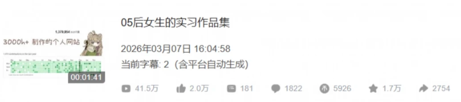
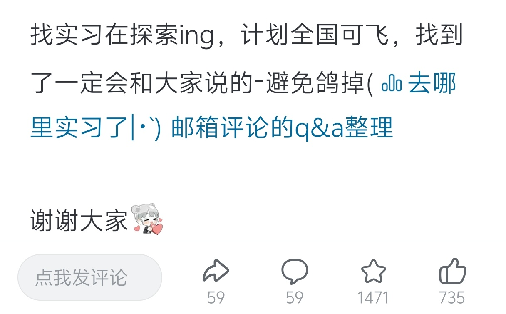
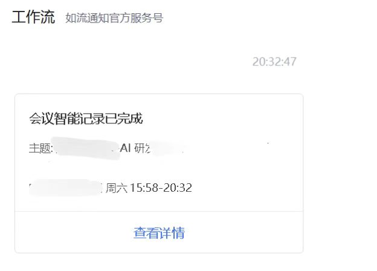

Hi  大家估计都是通过这个视频认识我的(｀・ω・´)

后面工作一直比较忙，这个周末有空看了一些评论

很多同学问`如何学习计算机和找工作`

于是有了这篇文章

其实这两部分是`相辅相成`的

面试准备

- 项目：[GitHub 项目整理](https://github.com/lvy010/X-Plore/blob/main/repo/github_repos_cn.md)

- 算法：[Leetcode](https://github.com/lvy010/Algo-Atlas)

- 理论：[博客](https://lvyovo-wiki.tech/share)
- 场景：[个人思考](https://github.com/lvy010/X-Plore)

投递准备

- [作品集](https://b23.tv/adNU4UH)

- [CV](https://github.com/lvy010/X-Plore/blob/main/data/CV.pdf)

计算机自学分享

- [2024 sum](https://lvynote.blog.csdn.net/article/details/145308270)

- [2025 sum](https://lvyovo-wiki.tech/blog/25sum)

- [如何科学的一年写3000题](https://github.com/lvy010/Algo-Atlas)

在平台上分享自己的博客笔记

- CS336课程笔记

- 写vllm原理时的联想

- deepseek的工程优化

- 从cloud code源码看agent设计

- agent的原理与未来

- 一个token的完整旅程
- ... ...

面试中学习到了很多，最后拿到了一些offer

碎碎念.做的一些分享运气比较好  被许多面试官看到过作品集/博客

影响比较深刻的是一个四个半小时的面试... 感谢一路上碰到的前辈

希望我的经历可以让更多人了解到一种可能性

大家都可以找到自己感兴趣的事情做下去

写代码是热爱，写到世界充满爱~！

