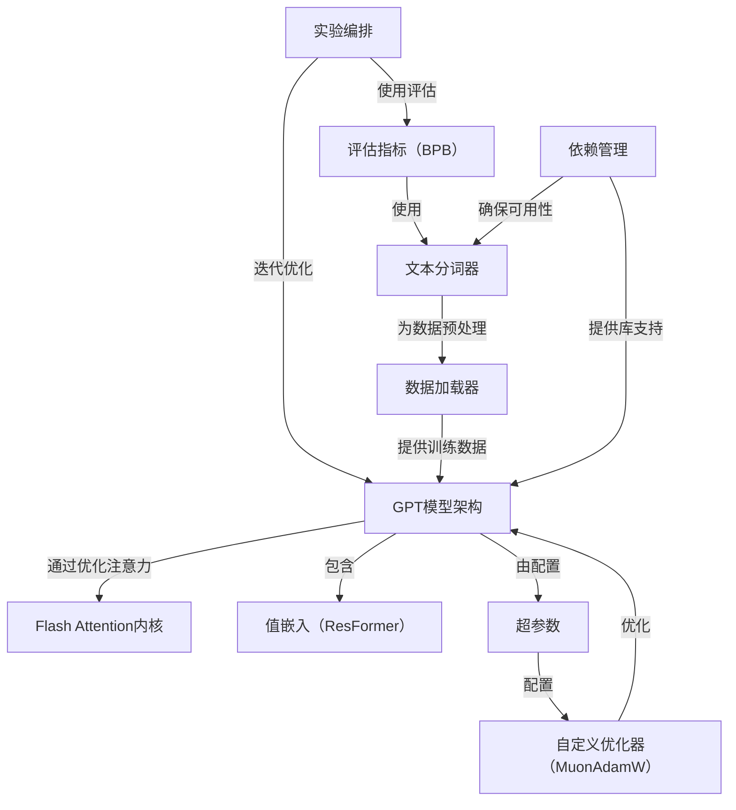
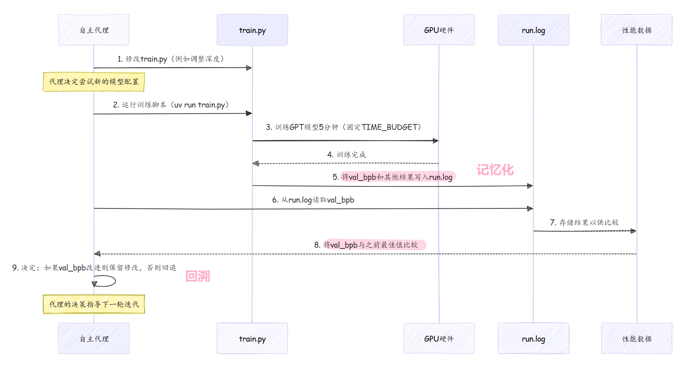

# autoresearch 

`autoresearch` 项目使**自主AI代理**能够通过==自身的研究改进==**GPT语言模型**。（a2a设计)

该代理会迭代修改模型的代码和超参数，在固定的5分钟时间预算内进行训练，并使用**验证指标（Bits Per Byte，BPB）**决定是否保留或丢弃更改

最终目标是通过持续的自主实验，实现**尽可能低的验证BPB值**。  

---

## 概览  



---

## 章节  

1. [实验编排](01_experimentation_orchestration_.md)  
2. [GPT模型架构](02_gpt_model_architecture_.md)  
3. [评估指标（BPB）](03_evaluation_metric__bpb__.md)  
4. [文本分词器](04_text_tokenizer_.md)  
5. [数据加载器](05_data_loader_.md)  
6. [超参数](06_hyperparameters_.md)  
7. [自定义优化器（MuonAdamW）](07_custom_optimizer__muonadamw__.md)  
8. [Flash Attention内核](08_flash_attention_kernel_.md)  
9. [值嵌入（ResFormer）](09_value_embeddings__resformer__.md)  
10. [依赖管理](10_dependency_management_.md)  

---

# 第一章：实验编排  

想象你是一名科学家，正在努力改进一台复杂的机器

你有了一个改进的想法，==尝试实施它，观察结果==，然后决定这个改变是否足够好，值得保留，还是应该放弃并尝试其他方法。这就是科学研究的核心  

在人工智能领域，尤其是构建像GPT这样的高级模型时，这种研究过程可能非常耗时。需要不断调整模型的结构、修改其设置（超参数）或改变其学习方式。如果我们能==自动化整个研究流程==，会怎样呢？  

这正是`autoresearch`项目中**实验编排**的核心目标。它是指导自主代理的“总体规划”或“研究流程”，可以看作是一种自动化的科学方法，用于持续改进AI模型。  

## 解决的问题  

模型改进的核心挑战在于**迭代试错过程**。手动操作通常包括以下步骤：  
1. **提出想法**：决定修改模型的哪些部分（例如，“如果增加模型大小会怎样？”）。  
2. **运行实验**：用新修改训练模型并等待完成。  
3. **分析结果**：根据特定性能指标检查修改是否真正改善了模型。  
4. **决定下一步**：如果改进有效，则采纳；否则回退并尝试其他方法。  

这一循环对人类来说非常缓慢。==实验编排自动化了这一过程，使得`autoresearch`能够不知疲倦地探索改进==，甚至在无人值守时也能持续运行

最终目标是简单的：在固定的时间预算内，找到**尽可能低的`val_bpb`**（衡量模型质量的指标，详见[评估指标（BPB）](03_evaluation_metric__bpb__.md)）。  

## 自动化研究循环  

实验编排定义了自主代理遵循的持续循环。以下是关键步骤的分解：  

### 1. 提出想法（代码修改）  

自主代理的“大脑”位于`program.md`文件中。该文件指示它寻找改进模型的方法。其“想法”直接转化为对`train.py`文件的修改。该文件包含完整的[GPT模型架构](02_gpt_model_architecture_.md)、[超参数](06_hyperparameters_.md)以及训练循环本身。  

例如，代理可能决定修改模型的`DEPTH`超参数：  

```python  
# --- 文件：train.py（简化示例）---  
# ... 其他超参数 ...  

# 模型大小  
DEPTH = 8               # 变换器层数  
DEVICE_BATCH_SIZE = 128 # 每设备批大小（内存不足时减少）  

# ... train.py的其余部分 ...  
```
代理可能会将`DEPTH = 8`改为`DEPTH = 10`，希望获得更好的模型。  

### 2. 运行固定时间的训练实验  

代理修改`train.py`后，会运行训练脚本。`autoresearch`的一个关键特点是，每个实验的**时间预算固定为5分钟**（300秒）。这种标准化确保了所有实验可以直接比较。目标不是寻找更快的模型，而是在相同时间内找到**更好的**模型。  

代理通过以下命令启动实验：  

```bash  
uv run train.py > run.log 2>&1  
```
该命令启动训练过程，并将所有输出（包括重要指标）记录到`run.log`文件中。  

在`train.py`中，`TIME_BUDGET`常量确保了固定时长：  

```python  
# --- 文件：prepare.py（导入到train.py中）---  
TIME_BUDGET = 300 # 5分钟（秒）  

# --- 文件：train.py（简化示例）---  
# ... 训练循环 ...  
total_training_time = 0  
step = 0  
while True:  
    # ... 执行训练步骤 ...  
    torch.cuda.synchronize()  
    t1 = time.time()  
    dt = t1 - t0  

    if step > 10: # 忽略初始编译时间  
        total_training_time += dt  

    # 时间到——但仅在热身步骤后停止，避免计入编译时间  
    if step > 10 and total_training_time >= TIME_BUDGET:  
        break  
# ... train.py的其余部分 ...  
```
这段代码确保无论修改了什么，训练循环都会在`TIME_BUDGET`到达时停止，为每个实验提供公平的比较。  

### 3. 分析性能指标  

5分钟训练完成后，模型会进行评估。主要指标是`val_bpb`（验证比特每字节），用于衡量模型在未见文本中预测下一个标记的能力。**`val_bpb`越低越好**。  

`train.py`脚本会在结束时自动计算该值并输出到`run.log`：  

```python  
# --- 文件：train.py（简化示例）---  
# ... 训练循环后 ...  
model.eval() # 切换到评估模式  
with autocast_ctx:  
    # 调用prepare.py中的评估函数  
    val_bpb = evaluate_bpb(model, tokenizer, DEVICE_BATCH_SIZE)  

# ... 打印摘要 ...  
print(f"val_bpb:          {val_bpb:.6f}")  
```
代理随后通过以下命令从`run.log`中提取这一关键数字：  

```bash  
grep "^val_bpb:" run.log  
```
输出类似：`val_bpb: 0.997900`。  

### 4. 决定采纳或回退  

根据`val_bpb`结果，代理做出决定：  
- 如果`val_bpb`比之前的最佳值更低（更好），则“保留”修改。代理提交代码并基于这一改进继续生成新想法。  
- 如果`val_bpb`相同或更差，则“丢弃”修改。代理将代码回退到之前的状态并尝试其他想法。  

这与人类研究员的操作方式完全一致，但由自主代理不知疲倦地执行，确保代码库仅包含确实能带来改进的更改。  

## 原理  

实验编排的流程：  



这一持续循环是`autoresearch`的核心

代理充当自动化科学家，不断用新想法测试模型，客观评估结果，并仅集成成功的改进。  

代理可以提出的“想法”非常广泛，例如：  

| 类别         | 修改示例（`train.py`文件）                                   |
| :----------- | :----------------------------------------------------------- |
| **模型大小** | `DEPTH`（层数）、`ASPECT_RATIO`、`HEAD_DIM`                  |
| **优化器**   | 学习率（`EMBEDDING_LR`、`MATRIX_LR`）、`ADAM_BETAS`、`WEIGHT_DECAY` |
| **架构**     | 注意力的`WINDOW_PATTERN`、块的内部逻辑                       |
| **训练循环** | `TOTAL_BATCH_SIZE`、学习率调度                               |

关键在于，编排机制能够执行和评估`train.py`文件中的**任何**修改，只要代码能够正常运行。  

## 总结  

实验编排是`autoresearch`项目的基础。它提供了一种自动化的“科学方法”，驱动模型改进。通过定义清晰的迭代流程（代码修改、固定时间实验、指标分析和决策），它使自主代理能够持续优化AI模型。  

在下一章中，我们将深入探讨这一编排机制试图改进的核心组件：[GPT模型架构](02_gpt_model_architecture_.md)，了解GPT模型如何构建以理解和生成文本。  

[下一章：GPT模型架构](02_gpt_model_architecture_.md)  

