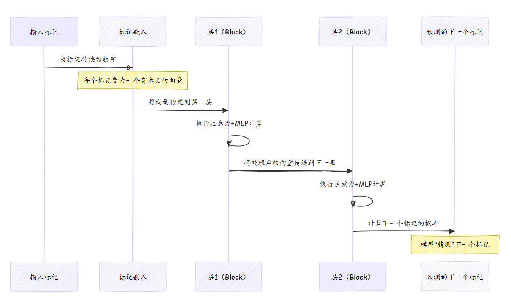

# 第二章：GPT模型架构  

在[第一章：实验编排](01_experimentation_orchestration_.md)中，我们学习了`autoresearch`项目如何自动调整和测试AI模型的修改

但那个被改进的AI模型到底是什么？这正是本章要探讨的内容：**GPT模型架构**。  

想象你正在尝试构建一个能够撰写引人入胜的故事或回答复杂问题的机器人。

你需要为其==“大脑”设计一份详细的蓝图==——它如何接收信息、处理信息，并生成新的连贯文本。GPT模型架构正是大型语言模型的蓝图。  

## 解决的问题  

GPT模型架构解决的核心问题是让计算机能够**理解人类语言并生成类人文本**。它是驱动从撰写电子邮件到编写代码等各种应用的引擎。如果没有这份蓝图，我们的AI代理将没有可以改进的“大脑”。  

举一个简单的例子：预测句子中的下一个单词。  

“The quick brown fox jumps over the lazy ____.”  

人类可以轻松猜到“dog”或“cat”。而GPT模型凭借其架构，也能做出类似的预测，甚至对于更长、更复杂的文本也是如此。

- 通过学习大量文本数据中隐藏的模式、语法和意义来实现这一点。  

## 核心理念：预测下一个标记  

GPT模型的核心能力是：给定一个单词（或单词的一部分）序列，预测最可能的下一个单词。

它通过将文本分解为称为**标记**的更小单元来实现这一点。我们将在[第四章：文本分词器](04_text_tokenizer_.md)中深入探讨其工作原理，但现在可以简单地将标记理解为单词或子词单元。  

当`autoresearch`训练GPT模型时，它会向模型输入大量文本示例，模型不断尝试预测下一个标记。如果预测正确，则学习；如果预测错误，则调整其内部“大脑”以提高下次的准确性。

这种持续的学习使其能够更好地理解上下文并生成自然流畅的文本。  

## 蓝图：关键架构组件  

GPT架构由多个关键组件组成，它们像复杂机器中的齿轮一样协同工作。  

### 1. 层（深度）  

将GPT模型视为具有多个“思考层”。处理文本时，它不会只看一次，而是将信息依次通过多个处理阶段。每一层都会细化其理解并基于前一层的结果进行构建。  

在`autoresearch`中，这些层的数量由名为`DEPTH`的参数控制。更多的层通常意味着模型更深、能力更强，但也需要更长的训练时间。  

```python  
# --- 文件：train.py（简化版）---  
# ...  
# 模型大小  
DEPTH = 8               # 变换器层数  
# ...  
```

`autoresearch`代理可能会将`DEPTH`从`8`改为`10`，以测试更深的模型是否表现更好。  

### 2. 嵌入：将单词转化为数字  

计算机无法直接理解单词，它们理解数字。**嵌入**就像一本字典，将每个标记转换为唯一的数字列表。这些数字表示标记的含义及其与其他标记的关系。  

当模型接收到单词“king”时，它看到的不是“king”，而是一个独特的数值向量，这个向量与“queen”的向量更“接近”，而与“apple”的向量较“远”。  

```python  
# --- 文件：train.py（简化版）---  
class GPT(nn.Module):  
    def __init__(self, config):  
        super().__init__()  
        # 'wte'代表“单词标记嵌入”  
        self.transformer = nn.ModuleDict({  
            "wte": nn.Embedding(config.vocab_size, config.n_embd), # 将标记ID转换为数值向量  
            # ... 其他组件 ...  
        })  
        # ...  
```
`nn.Embedding`层实现了这种神奇的转换。`config.vocab_size`是模型已知的唯一标记总数，`config.n_embd`是每个标记的数值向量的长度。  

### 3. 注意力：“聚焦”机制  

GPT模型中最强大的概念之一是**注意力**。想象你在阅读一个长句并试图理解某个单词的含义时，你不会平等对待其他所有单词，而是更关注那些最相关的单词。  

注意力机制正是为模型实现了这一点。对于它处理的每个标记，它会“关注”序列中的其他标记，并权衡它们的重要性。这使得模型能够理解每个单词周围的*上下文*，无论它们在文本中的距离有多远。这就是GPT模型擅长捕捉语言中长距离依赖关系的原因。  

我们将在[第八章：Flash Attention内核](08_flash_attention_kernel_.md)中了解其高效实现。  

### 4. MLP（多层感知机）：“思考处理器”  

在注意力机制帮助模型聚焦于输入的相关部分后，信息会通过一个**MLP块**。

这是模型的“思考”或“处理”单元。它接收来自注意力块的上下文感知信息，并执行进一步的计算以提取更高层次的特征和模式。  

这是一个标准的神经网络组件，帮助模型学习数据中复杂的非线性关系。  

### 5. 残差连接与归一化：保持信息流动  

深度神经网络在信息通过多层传递时可能会“遗忘”某些内容。**残差连接**通过创建“捷径”解决了这一问题。它们允许原始输入绕过某些处理层并在后续阶段重新加入，确保重要信息不会丢失。  

**归一化**有助于稳定训练过程，类似于电工确保电路中电压稳定。这些机制共同使得像GPT这样的深度模型能够有效训练。  

### 6. 值嵌入（ResFormer）  

一些先进的GPT架构（如`autoresearch`中使用的）会采用**值嵌入**。它们为注意力机制提供了额外的信息源，增强了模型理解和生成文本的能力。

可以将其视为一种额外的提示，帮助模型做出更准确的预测。我们将在[第九章：值嵌入（ResFormer）](09_value_embeddings__resformer__.md)中深入探讨。  

## `autoresearch`中的GPT模型架构  

`autoresearch`代理不仅*使用*固定的GPT架构，还会主动*修改*它以寻找改进。核心蓝图定义在`train.py`中的`GPTConfig`数据类和`GPT`类中。  

以下是`GPTConfig`如何设置模型的维度：  

```python  
# --- 文件：train.py（简化版）---  
@dataclass  
class GPTConfig:  
    sequence_len: int = 2048 # 模型一次能处理的最大标记数  
    vocab_size: int = 32768  # 唯一标记总数  
    n_layer: int = 12        # 变换器层数（DEPTH）  
    n_head: int = 6          # 注意力头数（用于并行聚焦）  
    n_kv_head: int = 6       # 键/值头数（与注意力相关）  
    n_embd: int = 768        # 每个标记的数值向量维度  
    window_pattern: str = "SSSL" # 注意力“观察”附近标记的方式  
```
`autoresearch`代理根据`program.md`的指导，可以直接修改`n_layer`（对应超参数中的`DEPTH`）、`n_head`或`n_embd`等值。每次修改都会生成一个新的GPT模型“设计”以供测试。  

例如，代理可能会尝试将`DEPTH`从`8`改为`12`，这意味着`GPTConfig`中的`n_layer`会变为`12`。  

`GPT`类随后根据这一配置构建实际模型：  

```python  
# --- 文件：train.py（简化版）---  
class GPT(nn.Module):  
    def __init__(self, config):  
        super().__init__()  
        self.config = config  
        self.transformer = nn.ModuleDict({  
            "wte": nn.Embedding(config.vocab_size, config.n_embd),  
            "h": nn.ModuleList([Block(config, i) for i in range(config.n_layer)]), # 构建N层  
        })  
        self.lm_head = nn.Linear(config.n_embd, config.vocab_size, bias=False)  
        # ... 其他部分如值嵌入和旋转嵌入 ...  
```
这段代码展示了`GPT`模型如何构建其核心组件。`nn.ModuleList([Block(config, i) for i in range(config.n_layer)])`是关键：它根据`config.n_layer`动态创建指定数量的`Block`（即“思考层”）。  

## 底层工作原理  

以下是标记在GPT模型中的旅程可视化：  



图中的每个“层（Block）”包含一个注意力机制和一个MLP（多层感知机）。以下是简化版的`Block`代码：  

```python  
# --- 文件：train.py（简化版）---  
class Block(nn.Module):  
    def __init__(self, config, layer_idx):  
        super().__init__()  
        self.attn = CausalSelfAttention(config, layer_idx) # “聚焦”部分  
        self.mlp = MLP(config)                           # “思考处理器”  

    def forward(self, x, ve, cos_sin, window_size):  
        # 残差连接 + 归一化  
        x = x + self.attn(norm(x), ve, cos_sin, window_size)  
        # 残差连接 + 归一化  
        x = x + self.mlp(norm(x))  
        return x  
```
可以看到，`Block`首先应用`CausalSelfAttention`（在归一化`x`之后），然后是`MLP`（同样在归一化`x`之后）。`x + ...`部分是残差连接，确保原始信息能够流动。  

### 因果自注意力  

`CausalSelfAttention`模块是模型学习聚焦的地方。“因果”意味着它只关注之前的标记来预测下一个标记，而不会看到未来的标记（以避免“作弊”）。  

```python  
# --- 文件：train.py（简化版）---  
class CausalSelfAttention(nn.Module):  
    def __init__(self, config, layer_idx):  
        super().__init__()  
        # 线性层，用于从输入生成查询（Q）、键（K）、值（V）  
        self.c_q = nn.Linear(self.n_embd, self.n_head * self.head_dim, bias=False)  
        self.c_k = nn.Linear(self.n_embd, self.n_kv_head * self.head_dim, bias=False)  
        self.c_v = nn.Linear(self.n_embd, self.n_kv_head * self.head_dim, bias=False)  
        self.c_proj = nn.Linear(self.n_embd, self.n_embd, bias=False)  
        # 可选：带门控的值嵌入（ResFormer）  
        self.ve_gate = nn.Linear(self.ve_gate_channels, self.n_kv_head, bias=False) if has_ve(layer_idx, config.n_layer) else None  
        # ...  

    def forward(self, x, ve, cos_sin, window_size):  
        # 从输入'x'计算Q、K、V  
        q = self.c_q(x).view(...)  
        k = self.c_k(x).view(...)  
        v = self.c_v(x).view(...)  

        # 值残差（ResFormer）：如果可用，混合值嵌入  
        if ve is not None:  
            v = v + gate.unsqueeze(-1) * ve # 简化版  

        # 应用旋转位置嵌入（理解单词顺序）  
        q, k = apply_rotary_emb(q, cos_sin[0], cos_sin[1]), apply_rotary_emb(k, cos_sin[0], cos_sin[1])  
        q, k = norm(q), norm(k)  

        # 执行Flash Attention（高效计算注意力）  
        y = fa3.flash_attn_func(q, k, v, causal=True, window_size=window_size)  
        y = y.contiguous().view(...)  
        y = self.c_proj(y) # 投影回原始维度  
        return y  
```
这是GPT模型中最复杂的部分。它接收输入（`x`），生成查询（`q`）、键（`k`）和值（`v`）（这是注意力的核心），应用**旋转嵌入**（帮助模型理解句子中单词的顺序），然后使用高度优化的**Flash Attention**内核（详见[第八章：Flash Attention内核](08_flash_attention_kernel_.md)）计算注意力输出`y`。  

### MLP块  

`MLP`（多层感知机）相对简单：  

```python  
# --- 文件：train.py（简化版）---  
class MLP(nn.Module):  
    def __init__(self, config):  
        super().__init__()  
        # 扩展维度，应用激活函数，然后投影回原始维度  
        self.c_fc = nn.Linear(config.n_embd, 4 * config.n_embd, bias=False) # 扩展特征  
        self.c_proj = nn.Linear(4 * config.n_embd, config.n_embd, bias=False) # 投影回原始维度  

    def forward(self, x):  
        x = self.c_fc(x)  
        x = F.relu(x).square() # 应用非线性激活函数  
        x = self.c_proj(x)  
        return x  
```
它接收来自注意力块的处理后信息，扩展其维度（使其“更丰富”），应用非线性激活函数以学习复杂模式，然后压缩回原始维度。  

## 总结  

GPT模型架构是让AI模型能够理解和生成人类语言的复杂蓝图。它由层、嵌入、注意力机制和MLP块组成，协同工作以预测序列中的下一个标记。  

`autoresearch`项目的自主代理通过调整架构中的参数（如`DEPTH`（层数）或`ASPECT_RATIO`（影响标记向量大小`n_embd`））不断进行实验，以寻找最高效和强大的配置

通过自动化这一过程，`autoresearch`能够比人类研究者更快地发现新的改进模型设计。  

在下一章中，我们将了解`autoresearch`用于衡量架构修改是否真正改进的关键标准：[评估指标（BPB）](03_evaluation_metric__bpb__.md)。  

[下一章：评估指标（BPB）](03_evaluation_metric__bpb__.md)  

