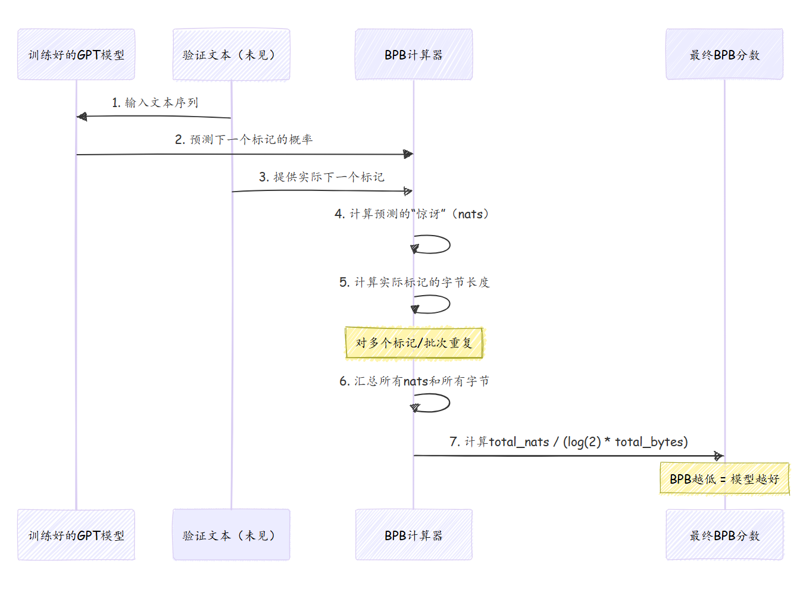

# 第三章：评估指标（BPB）

在[第一章：实验编排](01_experimentation_orchestration_.md)中，我们了解到`autoresearch`就像一个自动化科学家，不断尝试新想法来改进我们的AI模型

在[第二章：GPT模型架构](02_gpt_model_architecture_.md)中，我们窥探了模型本身的蓝图。但我们的自动化科学家如何*知道*它对蓝图的修改是否真正带来了改进呢？

这就是**评估指标（BPB）**的用武之地。想象你在玩一个游戏，你需要一种方法来记录分数，以判断你是否在进步。对于我们的AI模型来说，BPB就是它的“记分卡”。它用一个清晰、客观的数字告诉我们，训练好的模型在执行其主要任务（预测文本）时的表现如何。

## 解决的问题

核心挑战在于**量化模型质量**。当`autoresearch`代理对[GPT模型架构](02_gpt_model_architecture_.md)进行修改（例如增加其`DEPTH`）时，它需要一种可靠的方法来比较“新”模型与“旧”模型。如果没有明确的评分标准，就无法判断修改是否成功。

例如，如果代理修改了一个设置，模型训练了5分钟，我们如何知道它是否更好？我们是计算它猜对了多少单词吗？如果它对错误的猜测非常“自信”，或者对正确的猜测非常“不确定”，该怎么办？我们需要一个能够捕捉预测*效率*和*准确性*的指标。

这就是BPB解决的问题。它提供了一个简单易懂的数字，告诉我们：**BPB值越低，模型越好、越准确、越高效。**可以把它想象成高尔夫比赛：分数越低，表现越好！

## 什么是比特每字节（BPB）？

**BPB**代表**比特每字节**。这是一种特殊的方法，用于衡量模型在看到序列中的下一段文本时的“惊讶”程度。

以下是其核心思想：

- **预测效率**：如果模型非常擅长预测下一个字符或单词，意味着它对接下来出现的内容并不“惊讶”。它只需要很少的“比特”（信息单位）来表示其不确定性。
- **文本编码**：如果模型预测能力很差，它总是“惊讶”。它需要大量“比特”来编码其不确定性。
- **每字节**：我们将这种“惊讶”除以文本的实际字节数。这使得评分公平，无论文本有多长或使用了哪些具体单词。

BPB的一个关键优势在于，它**衡量模型预测文本的效率，与词汇量大小无关**。这一点很重要，因为不同的分词器（将文本分解为预测单元的工具）可能有不同的词汇表，但BPB仍然可以公平比较。

## `autoresearch`如何使用BPB

正如我们在[第一章：实验编排](01_experimentation_orchestration_.md)中学到的，`autoresearch`代理不断尝试找到尽可能低的`val_bpb`。

以下是这一循环的快速回顾：

1. **代理进行修改**（例如在`train.py`中）。
2. **模型训练5分钟**。
3. **模型被评估**，并计算`val_bpb`分数。
4. **代理将`val_bpb`与之前的最佳分数进行比较**。
   - 如果`val_bpb`*更低*（更好），则保留修改。
   - 如果`val_bpb`*更高*或相同（更差或没有改进），则放弃修改。

`val_bpb`（验证比特每字节）在每个5分钟的训练运行结束时直接打印到`run.log`文件中。代理随后读取这个值以做出决定。

以下是`train.py`在运行结束时报告`val_bpb`的简化版本：

```python
# --- 文件：train.py（简化示例）---
# ... 训练循环后 ...
model.eval() # 切换到评估模式
with autocast_ctx:
    # 调用prepare.py中的评估函数
    val_bpb = evaluate_bpb(model, tokenizer, DEVICE_BATCH_SIZE)

# ... 打印摘要 ...
print(f"val_bpb:          {val_bpb:.6f}")
```

这段代码显示，`train.py`调用了一个名为`evaluate_bpb`的函数（位于`prepare.py`中）以获取分数。然后，它以`autoresearch`代理易于读取的格式打印这个分数。

如[第一章：实验编排](01_experimentation_orchestration_.md)所述，代理使用类似`grep "^val_bpb:" run.log`的命令来查找这一行并提取数值，例如`0.997900`。

## 底层工作原理

让我们分解`evaluate_bpb`函数，以了解这一关键分数是如何计算的。

从概念上讲，`evaluate_bpb`函数执行以下操作：

1. 它接收训练好的模型和一些新的未见文本（称为“验证集”）。
2. 对于每一段文本，模型尝试预测下一个“标记”（可能是单词或单词的一部分）。
3. 它计算模型对*实际*下一个标记的“惊讶”程度。这种“惊讶”以**自然单位（nats）**衡量（类似于比特）。
4. 它还测量预测标记的*实际字节长度*。
5. 它汇总所有“惊讶”（总nats）和所有“实际字节长度”（总字节数）在一大段验证文本上。
6. 最后，它将总nats除以总字节数，并将结果从nats/byte转换为bits/byte（通过除以`math.log(2)`）。



以下是`prepare.py`中`evaluate_bpb`函数的简化代码。请注意，我们进行了大量简化以聚焦核心思想。

```python
# --- 文件：prepare.py（简化版）---
@torch.no_grad()
def evaluate_bpb(model, tokenizer, batch_size):
    # 加载词汇表中每个标记的字节长度
    token_bytes = get_token_bytes(device="cuda") # (A)

    val_loader = make_dataloader(tokenizer, batch_size, MAX_SEQ_LEN, "val")
    steps = EVAL_TOKENS // (batch_size * MAX_SEQ_LEN)
    total_nats = 0.0
    total_bytes = 0

    for _ in range(steps):
        x, y, _ = next(val_loader) # (B) 获取输入'x'和目标'y'
        
        # 计算损失（即每个标记的交叉熵，单位为nats）
        loss_flat = model(x, y, reduction='none').view(-1) # (C)
        y_flat = y.view(-1) # 实际目标标记

        nbytes = token_bytes[y_flat] # (D) 获取每个目标标记的字节长度
        mask = nbytes > 0 # (E) 排除特殊标记（它们的字节长度为0）
        
        # 仅对非特殊标记，累加到总nats和总字节
        total_nats += (loss_flat * mask).sum().item()
        total_bytes += nbytes.sum().item()
    
    # 最终计算：nats / (ln(2) * bytes) 得到比特每字节
    return total_nats / (math.log(2) * total_bytes) # (F)
```

让我们分解这段简化代码：

- **(A) `token_bytes = get_token_bytes(device="cuda")`**：加载一个列表，告诉我们分词器可以生成的每个可能标记的实际字节长度。对于特殊标记（如`<|reserved_0|>`），它们的字节长度记录为0。
- **(B) `x, y, _ = next(val_loader)`**：获取一批输入`x`（模型看到的内容）和目标`y`（模型*应该*预测的内容）。
- **(C) `loss_flat = model(x, y, reduction='none').view(-1)`**：模型预测下一个标记，并计算“损失”。当`reduction='none'`时，这个损失是*每个单独标记*的交叉熵，是“惊讶”程度的衡量，单位为**nats**。这里的数值越低，表示惊讶程度越低（预测越好）。
- **(D) `nbytes = token_bytes[y_flat]`**：对于每个*实际*目标标记`y_flat`，我们使用之前加载的`token_bytes`列表查找其实际字节长度。
- **(E) `mask = nbytes > 0`**：创建一个`mask`以忽略字节长度为0的任何标记。这些是我们的特殊标记，它们不像普通单词那样代表实际文本内容，因此我们不希望它们影响评分。
- **(F) `return total_nats / (math.log(2) * total_bytes)`**：最后，将所有收集到的`total_nats`（总惊讶）除以`total_bytes`（实际文本内容的总字节数）。然后除以`math.log(2)`，将单位从自然对数（nats）转换为以2为底的对数（比特）。

==详细的计算确保了BPB分数能够公平、准确地反映模型预测新的未见文本的能力==，真正捕捉其效率。

## 总结

评估指标（BPB）是指导`autoresearch`项目的关键“记分卡”。通过提供一个客观的、与词汇量无关的模型文本预测效率衡量标准（数值越低越好），它使自主代理能够自信地判断其实验性修改是否真正改进了AI模型

这一指标驱动了持续的改进循环，确保只有有益的修改被保留。

在下一章中，我们将探讨人类语言如何被分解为这些称为“标记”的小单元，以便GPT模型理解和预测，探索[文本分词器](04_text_tokenizer_.md)。

[下一章：文本分词器](04_text_tokenizer_.md)

