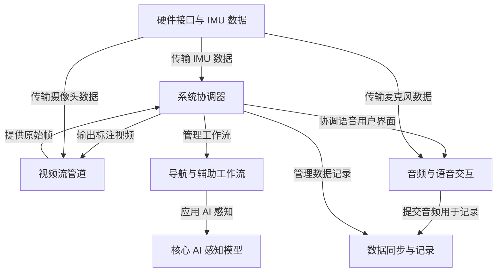
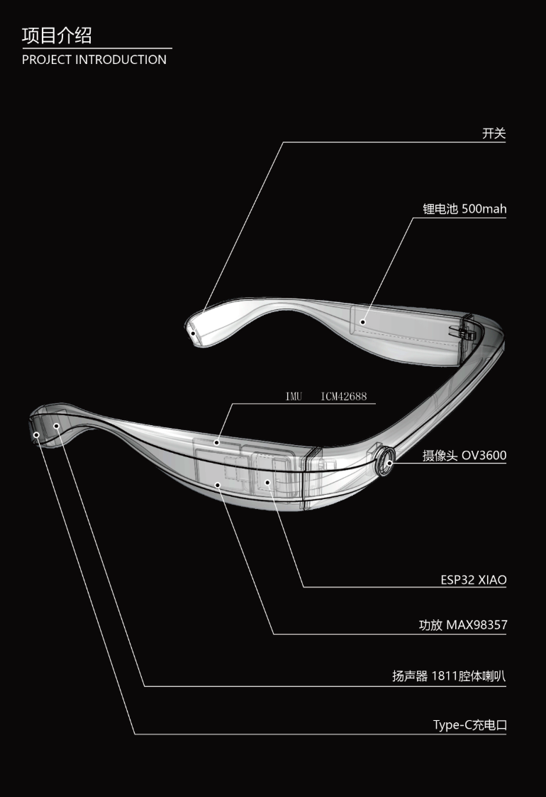

链接：[AIGlasses_for_navigation · 模型库](https://www.modelscope.cn/models/archifancy/AIGlasses_for_navigation)

# docs：OpenAI 导航眼镜

本项目是一个 **AI 智能眼镜系统**，旨在*帮助视障人士*进行实时辅助。

==充当中央大脑==，处理实时**视频、音频和传感器数据**，为**盲道导航**、**过马路**和*查找特定物体*等任务提供智能指导。

所有交互都通过直观的**语音命令**和语音反馈进行管理，使用户能够体验更无障碍的环境。

## 可视化

## 章节

1. [音频与语音交互
](01_audio___voice_interaction_.md)
2. [导航与辅助工作流
](02_navigation___assistance_workflows_.md)
3. [系统协调器
](03_system_orchestrator_.md)
4. [视频流管道
](04_video_stream_pipeline_.md)
5. [核心 AI 感知模型
](05_core_ai_perception_models_.md)
6. [硬件接口与 IMU 数据
](06_hardware_interface___imu_data_.md)
7. [数据同步与记录
](07_data_synchronization___recording_.md)

-------

### 效果图

看起来感觉像Fusion 360做的：https://www.autodesk.com/products/autocad/overview

