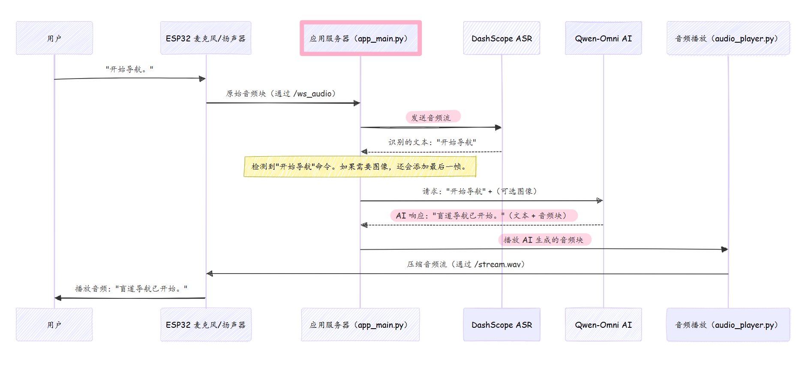

# 第 1 章：音频与语音交互

想象一下拥有一副智能眼镜，它就像一个乐于助人的助手，随时准备倾听、理解并与我们交谈。第一章的全部内容是关于这些"耳朵和嘴巴"如何工作，使我们能够自然地与 AI 眼镜交谈，就像与另一个人交谈一样。

## 眼镜的"耳朵和嘴巴"

从本质上讲，自然对话是我们 AI 眼镜的关键。我们不应该按按钮或打字；我们应该能够直接说话。该系统允许眼镜：

1.  **倾听**：在我们说话时捕捉我们的话语。
2.  **理解**：弄清楚我们的意思，无论是命令还是问题。
3.  **响应**：向我们回话，提供指导或答案。

整个过程实时发生，使交互感觉无缝且自然。

### 我们的第一次交互："开始导航"

让我们想象一个简单但强大的用例：我们戴上眼镜并说，**"开始导航。"**
接下来会发生什么？眼镜应该听到我们的话，理解我们想要开始导航，然后告诉我们类似"盲道导航已开始"的内容。这个简单的短语涉及音频和语音交互的完整循环！

本章将指导我们了解 AI 眼镜如何实现这一点，将复杂的部分分解为易于理解的步骤。

---

## 眼镜如何倾听、思考和说话

我们可以将音频和语音交互分解为三个主要阶段，加上一个重要的优化步骤：

1.  **倾听（ASR）**：系统的"耳朵"。这是我们说出的话语被捕获并转换为文本的地方。
2.  **思考（AI 模型）**：大脑部分。生成的文本（有时还有来自摄像头的图像！）被发送到一个强大的 AI 模型，该模型理解我们的意图并生成智能响应。
3.  **说话（TTS 和音频播放）**：系统的"嘴巴"。AI 的响应被转换回口语，系统声音也被管理。
4.  **音频压缩**：使声音变小以便高效传输到眼镜。

让我们更详细地看看每一个。

### 1. 倾听：语音转文本（ASR）

想象一下，我们的眼镜内部有一个超快速的速记员。一旦我们说话，这个"速记员"就会快速将我们的声音转换为书面文本。这个过程称为**自动语音识别（ASR）**。

我们的项目使用阿里云的强大云端 ASR 服务，称为 DashScope Paraformer。

**它的作用：**
-   **捕获音频**：ESP32（眼镜中的小型计算机）上的麦克风捕获我们的声音。
-   **发送到云端**：这些原始音频被无线发送到运行在更强大计算机（如我们的 PC 或服务器）上的主应用程序。
-   **转换为文本**：云端 ASR 服务然后处理这些音频并发送回我们所说内容的文本。

**在代码中如何使用：**
`app_main.py` 文件是接收来自 ESP32 音频的中央枢纽。然后它使用 `asr_core.py` 来处理实际的语音识别。

 `app_main.py` 如何设置音频接收:

```python
# app_main.py
@app.websocket("/ws_audio")
async def ws_audio(ws: WebSocket):
    global esp32_audio_ws
    esp32_audio_ws = ws
    await ws.accept()
    print("\n[AUDIO] client connected")
    # ... 更多设置代码 ...

    try:
        while True:
            msg = await ws.receive()
            if "bytes" in msg and msg["bytes"] is not None:
                # 在这里接收原始音频字节！
                # ... 然后发送到 asr_core 进行识别 ...
                pass
    except WebSocketDisconnect:
        # 用户断开连接
        pass
    finally:
        # 清理
        pass
```
这个代码片段显示 `app_main.py` 充当 WebSocket 服务器，不断监听来自 ESP32 麦克风的传入音频数据（作为 `bytes`）。

然后 `asr_core.py` 模块获取这些原始音频字节并将它们发送到 DashScope ASR 服务。一旦服务识别出语音，它使用一个特殊的"回调"函数将识别的文本发送回 `app_main.py`。

### 2. 思考：AI 模型交互

一旦我们的话语被转换为文本，眼镜需要*理解*它们并*决定做什么*。这就是我们强大的 AI 大脑发挥作用的地方。我们使用阿里云的 **Qwen-Omni-Turbo** 模型，这是一个"多模态"AI。这意味着它不仅可以理解文本，还可以理解图像！

**它的作用：**
-   **接收文本（可能还有图像）**：来自 ASR 的文本（如"开始导航"）被发送到 Qwen-Omni。如果我们问"我前面是什么？"，AI 模型还会获取眼镜的最新摄像头图像。
-   **处理请求**：Qwen-Omni 分析输入。如果是命令，它告诉眼镜要采取什么行动。如果是问题，它生成文本答案。
-   **生成响应**：AI 提供响应，可以包括文本和听起来像人类说话的音频片段。

**在代码中如何使用：**
`omni_client.py` 模块处理与 Qwen-Omni 模型的所有通信。它使用兼容 OpenAI 的接口，使交互变得容易。

`omni_client.py` 如何将我们的查询发送到 AI :

```python
# omni_client.py
from openai import OpenAI
# ... 客户端设置 ...

async def stream_chat(
    content_list: List[Dict[str, Any]], # 可以包括文本和图像
    voice: str = "Cherry",
    audio_format: str = "wav",
) -> AsyncGenerator["OmniStreamPiece", None]:
    """
    将我们的查询（文本 + 可选图像）发送到 Qwen-Omni 并流式传输回
    AI 的文本响应和生成的语音。
    """
    completion = oai_client.chat.completions.create(
        model=QWEN_MODEL,
        messages=[{"role": "user", "content": content_list}], # 我们的输入在这里！
        modalities=["text", "audio"], # 我们想要文本和音频
        audio={"voice": voice, "format": audio_format},
        stream=True, # 实时获取响应块
    )

    for chunk in completion:
        # ... 处理文本和音频块 ...
        yield OmniStreamPiece(text_delta=text_delta, audio_b64=audio_b64)
```
`stream_chat` 函数至关重要。它将我们的查询（`content_list` 可以包含文本和图像数据）发送到 AI。因为 `stream=True`，AI 开始逐位发送回其响应，允许眼镜在 AI 完成整个思考过程之前就开始说话！

### 3. 说话：文本转语音（TTS）和音频播放

在 AI "思考"并生成响应后，眼镜需要将其"说"回给我们。这涉及两个主要部分：将 AI 的文本转换为语音（如果 AI 没有直接提供音频，或用于系统提示）和播放任何音频。

**它的作用：**
-   **AI 生成的语音**：Qwen-Omni 可以直接发送回音频块，这些音频块会立即播放。
-   **预录制的系统提示**：对于常见短语，如"左转"或"检测到物体"，我们使用预录制的音频文件以提高速度和一致性。这些存储在 `music/` 和 `voice/` 文件夹中。
-   **实时流式传输**：所有音频，无论是 AI 生成的还是预录制的，都无线流式传输到 ESP32 的扬声器供我们听。这被有效处理以确保低延迟。
-   **节流**：为了避免让我们不知所措，系统智能地限制其说话频率，特别是对于重复的导航提示。

**在代码中如何使用：**
`audio_player.py` 模块管理播放所有这些不同的声音，而 `audio_stream.py` 处理实际的实时流式传输到 ESP32。

以下是 `audio_player.py` 如何播放预录制系统提示的方式：

```python
# audio_player.py
# ... AUDIO_MAP 存储 .wav 文件的路径 ...

def play_voice_text(text: str):
    """
    播放与给定中文文本匹配的预录制音频。
    它处理节流和文本变化。
    """
    global _last_voice_time, _last_voice_text
    # ... 节流逻辑 ...

    # 尝试找到匹配的音频文件
    if text in AUDIO_MAP:
        play_audio_threadsafe(text) # 添加到播放队列
        _last_voice_text = text
        _last_voice_time = time.time()
        return

    # ... 常见短语的后备逻辑 ...
    print(f"[AUDIO] 未找到匹配语音: {text}")

def play_audio_threadsafe(audio_key):
    """
    将音频文件排队以供工作线程播放。
    处理压缩并通过优先级确保实时播放。
    """
    # ... 队列管理 ...
    pcm_data = _audio_cache.get(filepath) # 获取预加载的音频
    # ... 如果需要则解压缩 ...
    _audio_queue.put_nowait((_audio_priority, pcm_data)) # 添加到队列
```
`play_voice_text` 函数是一种用户友好的方式来要求眼镜说话。我们给它一段中文文本，它会尝试找到匹配的预录制音频文件。如果找到，`play_audio_threadsafe` 将音频数据放入一个特殊队列。然后一个专用的"工作线程"从这个队列中获取音频并将其发送到 `audio_stream.py`。

`audio_stream.py` 模块负责通过特殊的 `/stream.wav` 端点将这些音频块广播到所有连接的 ESP32 扬声器：

```python
# audio_stream.py
# ... 导入和设置 ...

async def broadcast_pcm16_realtime(pcm16: bytes):
    """
    以 20 毫秒块的形式将原始 16 位 PCM 音频数据发送到所有连接的 ESP32。
    这也处理音频的记录。
    """
    # ... 记录音频的逻辑（sync_recorder）...

    off = 0
    while off < len(pcm16):
        take = min(BYTES_PER_20MS_16K, len(pcm16) - off)
        piece = pcm16[off:off + take]

        dead: List["StreamClient"] = []
        for sc in list(stream_clients):
            # ... 将音频片段添加到客户端队列 ...
            pass
        # ... 休眠 20 毫秒以控制节奏 ...
        off += take
```
这个 `broadcast_pcm16_realtime` 函数是实际的"扬声器电缆"。它获取原始音频数据，将其分解为微小的 20 毫秒块，并逐个发送到 ESP32。它甚至包括一个小延迟（`asyncio.sleep(0.020)`）以确保音频播放流畅，没有间隙或重叠。

### 4. 音频压缩

无线传输音频，特别是长时间传输，可能会消耗大量带宽。音频压缩就像有效地打包我们的行李箱——我们可以在更小的空间里放更多东西而不会丢失必需品。

**它的作用：**
-   **减小文件大小**：音频压缩算法显著减小音频数据的大小。
-   **保持质量**：对于语音，像 ADPCM（自适应差分脉冲编码调制）这样的方法可以实现高压缩比，同时保持语音足够清晰以便理解。
-   **更快传输**：更小的数据意味着更快地传输到 ESP32，减少通信延迟。

**在代码中如何使用：**
`audio_compressor.py` 模块提供压缩和解压缩的工具。它主要由 `audio_player.py` 使用，在应用程序启动时预压缩所有系统音频文件。这样，当需要播放声音时，它已经是紧凑形式，准备快速传输。

```python
# audio_compressor.py
# ... 导入 ...

class AudioCompressor:
    @staticmethod
    def pcm16_to_adpcm(pcm_data: bytes) -> bytes:
        """
        将 16 位 PCM 音频转换为 4 位 ADPCM。
        实现约 75% 的压缩，同时保持良好的语音质量。
        """
        # ... 复杂的 ADPCM 压缩逻辑 ...
        return header + bytes(adpcm_data)

    @staticmethod
    def adpcm_to_pcm16(adpcm_data: bytes) -> bytes:
        """
        将 4 位 ADPCM 转换回 16 位 PCM 以供播放。
        """
        # ... 复杂的 ADPCM 解压缩逻辑 ...
        return np.array(pcm_samples, dtype=np.int16).tobytes()

class CompressedAudioCache:
    def load_and_compress(self, filepath: str) -> Optional[bytes]:
        """加载 WAV 文件，转换为 8kHz，并压缩它。"""
        # ... 加载 WAV ...
        # ... 如果需要则转换为 8kHz ...
        compressed = AudioCompressor.pcm16_to_adpcm(frames)
        self._cache[filepath] = compressed # 存储压缩数据
        return compressed
```
`CompressedAudioCache` 加载每个 WAV 文件，将其转换为标准的 8kHz 采样率（如果需要），然后使用 `AudioCompressor.pcm16_to_adpcm` 使其变得更小。这些压缩数据存储在内存中，准备在需要时立即发送。当 ESP32 接收到压缩音频时，它会在播放前快速解压缩。

---

## 内部机制：完整的对话流程

让我们可视化 AI 眼镜交互的整个过程，从我们的声音到眼镜的口语响应。



这个图表显示了==系统的不同部分如何像接力赛一样协同工作==：

1.  **用户说话**：我们的声音被 ESP32 的麦克风拾取。
2.  **音频流到服务器**：ESP32 通过 WebSocket 连接（`/ws_audio`）不断向服务器上的 `app_main.py` 发送我们原始音频数据的小块。
3.  **语音识别**：`app_main.py` 将此音频流转发到 DashScope ASR 服务。
4.  **接收文本**：ASR 服务分析音频并将识别的文本（例如，"开始导航"）发送回 `app_main.py`。
5.  **命令/查询处理**：`app_main.py` 将文本识别为命令。如果是问题，它可能还会获取最新的摄像头图像。
6.  **AI 交互**：`app_main.py` 然后将此命令/查询（以及任何相关图像）发送到 Qwen-Omni AI 模型。
7.  **AI 响应**：Qwen-Omni 处理输入并流式传输回其响应，包括文本和生成的语音音频。
8.  **音频播放**：`app_main.py` 将 AI 的音频响应（或如果是简单命令则是预录制的系统声音）引导到 `audio_player.py` 模块。
9.  **流式传输到 ESP32**：`audio_player.py` 然后将此音频数据（通常是压缩的）推送到 `audio_stream.py` 模块，该模块通过 HTTP 流（`/stream.wav`）将其广播回 ESP32 的扬声器。
10. **用户听到响应**：ESP32 播放音频，我们听到眼镜的响应。

---

## 结论

在本章中，我们探讨了 AI 眼镜的"耳朵和嘴巴"：**音频与语音交互**系统。

我们了解了我们说出的话语如何==通过 **ASR** 转换为文本，由 **AI 模型**处理以理解和响应，然后使用 **TTS 和音频播放**转换回语音==供我们听。

还触及了**音频压缩**以确保流畅高效的通信。

这种无缝交互是我们与 AI 眼镜通信的基础。但是在眼镜理解我们的命令（如"开始导航"）之后会发生什么？它们实际上如何引导我们？这就是我们将在下一章中探讨的内容，我们将研究==眼镜可以采取的不同模式和操作来帮助我们==导航和提供帮助。

[下一章：导航与辅助工作流](02_navigation___assistance_workflows_.md)

