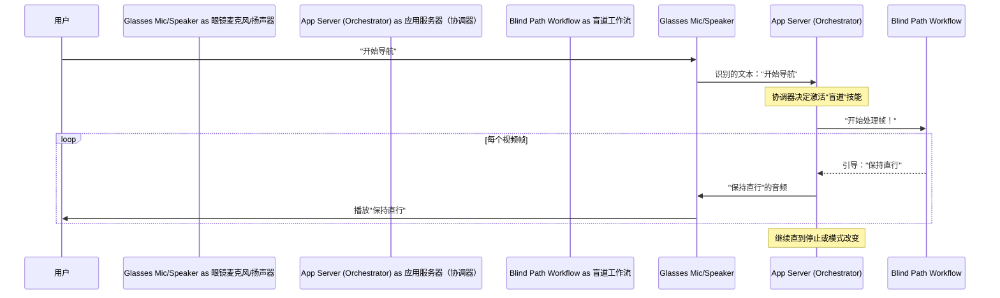
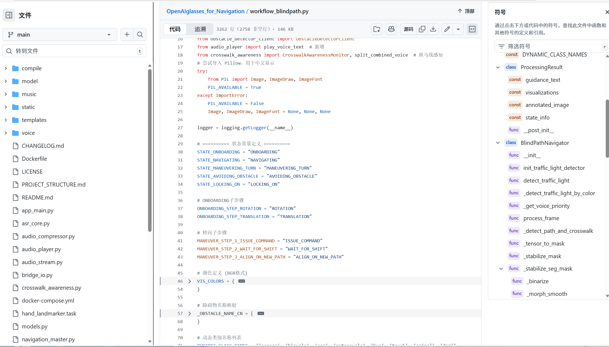

# 第 2 章：导航与辅助工作流

欢迎回来

在[第 1 章：音频与语音交互](01_audio___voice_interaction_.md)中，我们了解了 OpenAI 眼镜如何倾听我们的声音，理解我们的命令，并向我们回话。我们使用命令**"开始导航"**作为眼镜"耳朵和嘴巴"实际运作的示例。

但是在==眼镜听到"开始导航"并理解我们想要什么*之后*会发生什么==？它们实际上如何引导我们？这就是**导航与辅助工作流**发挥作用的地方

## 什么是"工作流"？

想象一下，我们的 AI 眼镜就像一个专家顾问团队。

我们不会让厨师修理汽车，对吧？每个顾问都有特殊技能。同样，我们的 AI 眼镜针对不同的工作有不同的"技能"或"模式"。这些专业技能就是我们所说的**工作流**。

每个工作流都是眼镜内部的一个专用小程序，旨在处理非常具体的任务。它有自己的逻辑，确切知道要寻找什么以及如何在特定情况下引导我们。

可以这样想：

*   **厨师工作流：** 引导我们完成烹饪食谱。
*   **机械师工作流：** 帮助我们诊断汽车问题。
*   **导游工作流：** 带领我们参观博物馆。

我们的 AI 眼镜有类似的专业工作流：

*   **盲道导航工作流：** 帮助我们保持在盲道上。
*   **过马路辅助工作流：** 安全地引导我们过马路，寻找人行横道和交通信号灯。
*   **物品搜索工作流：** 帮助我们找到正在寻找的特定物品。

这些工作流是眼镜有用行动背后的*实际大脑*。

## 我们的用例："开始导航"和盲道引导

让我们重新审视"开始导航"命令。当我们说这个时，系统选择**盲道导航工作流**，因为这就是在这种情况下"导航"的含义。

这个工作流接管并专注于：

1.  **看到盲道：** 它使用摄像头持续寻找为视障人士设计的特殊纹理路径。
2.  **检测障碍物：** 它还寻找可能挡路的任何东西（人、柱子等）。
3.  **引导我们：** 它用简单的口语告诉我们去哪里（例如，"保持直行"、"稍微左转"、"前方有障碍物"）。

因此，工作流赋予眼镜实际执行导航的"技能"。

## 工作流如何协同工作

让我们看看语音命令如何导致引导的全貌：



这个图表显示"应用服务器（协调器）"就像一个管理者。它听到我们的命令，然后告诉正确的"专家"（盲道工作流）开始工作。然后这个专家处理眼镜"看到"的内容并发送回指令，这些指令会向我们说出来。（我们将在[第 3 章：系统协调器](03_system_orchestrator_.md)中更深入地了解协调器）。

## 代码内部：激活工作流

当我们说"开始导航"时，以下是系统如何激活盲道导航工作流的一瞥。

首先，我们的命令到达主应用程序（`app_main.py`），然后将其传递给 `NavigationMaster`（"协调器"）以决定做什么。

让我们看看 `navigation_master.py`：

```python
# navigation_master.py
# ... 其他导入和代码 ...

# ========== 状态常量 ==========
IDLE = "IDLE"                          # 空闲状态
CHAT = "CHAT"                          # 对话模式
BLINDPATH_NAV = "BLINDPATH_NAV"        # 盲道导航模式
# ... 其他状态 ...

class NavigationMaster:
    def __init__(self, blind_nav, cross_nav, *, min_tts_interval: float = 1.2):
        self.blind = blind_nav # 这是我们的 BlindPathNavigator！
        self.cross = cross_nav # 这是我们的 CrossStreetNavigator！
        self.state = IDLE      # 系统从 IDLE 开始
        # ... 其他设置 ...

    def start_blind_path_navigation(self):
        """启动盲道导航模式"""
        self.state = BLINDPATH_NAV # 切换到盲道导航状态
        print(f"[NAV MASTER] Switched to state: {self.state}") # 用于调试
        if self.blind:
            self.blind.reset() # 重置盲道工作流
```

这里：
*   `BLINDPATH_NAV` 是一个特殊名称（一个"状态"），告诉系统我们处于"盲道导航"模式。
*   `NavigationMaster` 有一个对 `blind_nav` 的引用，它是我们 `BlindPathNavigator` 的一个实例（实际的工作流代码！）。
*   `start_blind_path_navigation()` 函数只是将系统的 `state` 更改为 `BLINDPATH_NAV`，然后告诉 `blind` 工作流 `reset()` 自己，准备好重新开始。

一旦 `NavigationMaster` 将 `self.state` 设置为 `BLINDPATH_NAV`，在来自眼镜的每个新视频帧中，`NavigationMaster` 将调用 `blind.process_frame()` 函数来获取引导。

### 查看工作流：盲道导航



现在，让我们看看 `workflow_blindpath.py` 内部。这是引导我们在盲道上的实际"技能"所在的地方。

```python
# workflow_blindpath.py
# ... 其他导入和代码 ...

class BlindPathNavigator:
    def __init__(self, seg_model, obs_model, device_id: str = "esp32"):
        self.seg_model = seg_model # 检测盲道的模型
        self.obstacle_detector = obs_model # 检测障碍物的模型
        self.state = "ONBOARDING" # 初始状态：尝试进入盲道
        # ... 其他设置变量 ...

    def process_frame(self, bgr_image: np.ndarray) -> ProcessingResult:
        """
        处理单个视频帧以提供盲道导航引导。
        此函数针对每个新帧重复调用。
        """
        current_time = time.time()
        annotated_image = bgr_image.copy()
        guidance_text = ""

        # 1. 检测盲道
        blind_path_mask = self._detect_blind_path(bgr_image) # 使用 AI 模型查找路径

        if blind_path_mask is not None:
            # 2. 分析盲道：计算方向、位置
            angle, offset = self._compute_direction(blind_path_mask)
            
            # 3. 检测障碍物
            detected_obstacles = self._detect_obstacles(bgr_image, blind_path_mask)

            # 4. 根据路径、障碍物和当前状态生成引导
            guidance_text = self._generate_guidance(angle, offset, detected_obstacles)
        else:
            guidance_text = "未检测到盲道，请寻找。" # 未找到盲道

        # ... 向 annotated_image 添加视觉标注 ...

        return ProcessingResult(
            annotated_image=annotated_image,
            guidance_text=guidance_text,
            visualizations=[]
        )
```

在 `workflow_blindpath.py` 的这个版本中：
*   `BlindPathNavigator` 是封装此特定任务所有逻辑的类。
*   它有自己的内部 `state`（如"ONBOARDING"、"NAVIGATING"等）来管理其进度。
*   `process_frame()` 方法是工作流的核心。它接收一个视频帧，运行 AI 模型来查找盲道和障碍物，找出最佳引导，并返回更新的图像（带有视觉提示）和口语 `guidance_text`。

这个 `guidance_text`（"保持直行"、"稍微左转"等）然后被发送回[第 1 章：音频与语音交互](01_audio___voice_interaction_.md)以大声说出来

## 工作流概览

`OpenAIglasses_for_Navigation` 项目包括几个关键工作流：

| 工作流名称     | 文件                        | 主要任务                         | 关键操作                                                  |
| :------------- | :-------------------------- | :------------------------------- | :-------------------------------------------------------- |
| 盲道导航       | `workflow_blindpath.py`     | 引导用户沿盲道行走。             | 检测盲道；避开障碍物；提供转弯/直行引导。                 |
| 过马路辅助     | `workflow_crossstreet.py`   | 安全地引导用户过马路。           | 检测人行横道和交通信号灯；对齐用户；提供"走"/"等待"指令。 |
| 物品搜索       | `yolomedia.py`              | 帮助用户找到特定物品。           | 使用文本提示检测物品；引导手朝向它；确认抓取。            |
| 交通信号灯检测 | `trafficlight_detection.py` | （独立辅助）检测交通信号灯状态。 | 识别红灯、绿灯、黄灯。（由过马路工作流使用）。            |

这些文件中的每一个都包含各自任务的专业"技能"逻辑，充当主系统在需要时可以激活的模块化组件。

## 结论

在本章中，我们探讨了**导航与辅助工作流**的概念。

这些是 AI 眼镜内的专业"技能"或"专家顾问"，每个都旨在处理特定的现实世界任务，如引导我们在盲道上或帮助我们过马路。我们看到"开始导航"命令如何激活盲道导航工作流，然后该工作流持续处理视频帧以提供口语引导。

我们现在了解到，在理解我们的话语之后，特定的工作流接管以执行实际的有用操作。但是==谁决定激活*哪个*工作流？系统如何在它们之间平滑切换==？这是"管理者"**系统协调器**的工作，我们将在下一章详细探讨

[下一章：系统协调器](03_system___orchestrator_.md)

