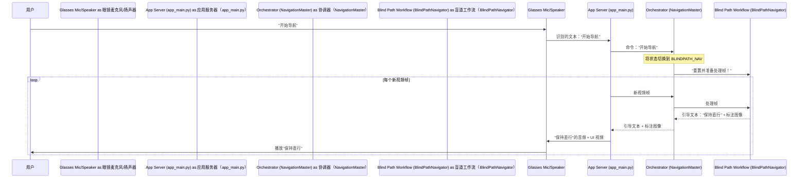

# 第 3 章：系统协调器

欢迎回来

在[第 2 章：导航与辅助工作流](02_navigation___assistance_workflows_.md)中，我们探讨了 AI 眼镜拥有的专业"技能"，如盲道导航或过马路辅助工作流。我们了解到，当我们说"开始导航"时，特定的工作流会接管来引导我们。

但是谁决定使用*哪个*技能？如果我们正在导航，然后突然提出一个问题会发生什么？谁是管理所有这些不同部分并确保它们平滑协同工作的"老板"，适应我们在任何时刻的需求？

这就是**系统协调器**发挥作用的地方

## 眼镜的"中央管理者"

想象一下，我们的 AI 眼镜就像一个繁忙的办公室，有许多有才华的员工，每个人都是特定任务的专家（就像我们的工作流）。系统协调器就像**中央管理者**或**管弦乐队的指挥**。它本身不进行导航，也不直接说话或倾听。相反，它的工作是：

1.  **理解总体目标**：眼镜*现在*应该做什么？（我们在导航吗？聊天吗？寻找物品吗？）
2.  **分配任务**：告诉正确的"员工"（工作流或模块）开始工作。
3.  **协调**：确保每个人协同工作，在他们之间传递信息。
4.  **切换模式**：如果目标改变（例如，我们从导航切换到提问），它会在不同任务之间平滑过渡。

它是主控制面板，确保一切像运转良好的机器一样运作，并智能地响应我们的命令。

### 我们的用例：无缝模式切换

让我们扩展之前的示例：

1.  我们说，**"开始导航。"**
2.  协调器听到这个（通过[第 1 章：音频与语音交互](01_audio___voice_interaction_.md)）。
3.  它意识到我们想要**导航**，所以它将眼镜切换到 `BLINDPATH_NAV` 模式。
4.  `BlindPathNavigator` 工作流（[第 2 章：导航与辅助工作流](02_navigation___assistance_workflows_.md)）现在开始处理视频帧，给我们引导。
5.  在导航时，我们突然说，**"帮我看看这是什么。"**
6.  协调器拦截了这个！它意识到我们已经切换到**问题**，所以它*暂停*导航，切换到 `CHAT` 模式，并告诉 AI 模型处理我们的图像和问题。
7.  在 AI 回答后，协调器记得我们之前在导航，并将我们**切换回 `BLINDPATH_NAV`**！

这种在不同"模式"之间的平滑、智能切换是系统协调器的核心工作。

## 协调器的关键职责

系统协调器在我们的项目中由 `NavigationMaster` 类（位于 `navigation_master.py` 中）实现，处理几个重要功能：

| 职责              | 类比                     | 在眼镜中的作用                                               |
| :---------------- | :----------------------- | :----------------------------------------------------------- |
| **状态管理**      | 一个人的"情绪"或"专注点" | 跟踪眼镜当前的操作模式（例如，`IDLE`、`CHAT`、`BLINDPATH_NAV`）。 |
| **命令解释**      | 理解请求                 | 接收我们的语音命令并将其转换为特定操作或模式更改。           |
| **工作流协调**    | 分配任务                 | 根据当前状态激活并向正确的[导航与辅助工作流](02_navigation___assistance_workflows_.md)提供数据。 |
| **数据路由**      | 邮件分拣                 | 确保传入数据（来自[第 4 章：视频流管道](04_video_stream_pipeline_.md)的视频帧、来自[第 1 章：音频与语音交互](01_audio___voice_interaction_.md)的音频、来自[第 6 章：硬件接口与 IMU 数据](06_hardware_interface___imu_data_.md)的 IMU）到达正确的处理模块。 |
| **AI 模型初始化** | 设置工具                 | 确保所有必要的 AI 模型（如来自[第 5 章：核心 AI 感知模型](05_core_ai_perception_models_.md)的盲道检测器或障碍物检测器）已加载并准备就绪。 |

## 协调器如何工作：逐步流程

让我们看看协调器如何管理从我们的语音命令到实际导航引导的过渡。



在这个流程中：
1.  **我们说话**：我们的声音被眼镜的麦克风拾取。
2.  **文本到应用服务器**：[音频与语音交互](01_audio___voice_interaction_.md)系统将我们的语音（"开始导航"）转换为文本并发送到主应用程序（`app_main.py`）。
3.  **命令到协调器**：`app_main.py` 将此命令传递给 `NavigationMaster`（协调器）。
4.  **协调器决定**：协调器理解此命令意味着开始盲道导航。它将其内部"状态"更改为 `BLINDPATH_NAV` 并告诉 `BlindPathNavigator` 工作流准备好。
5.  **逐帧处理**：从现在开始，每当来自摄像头的新视频帧到达时，`app_main.py` 将其发送到协调器。
6.  **委托给工作流**：由于协调器处于 `BLINDPATH_NAV` 状态，它将帧*委托*给 `BlindPathNavigator` 工作流。
7.  **工作流处理**：`BlindPathNavigator` 处理图像，检测路径和障碍物，并生成引导（如"保持直行"）和标注图像（带有视觉提示）。
8.  **协调器转发**：协调器接收此引导和图像，然后将其传回 `app_main.py`。
9.  **说话和显示**：`app_main.py` 告诉[音频与语音交互](01_audio___voice_interaction_.md)系统说出引导，标注图像被发送到 UI。

这个持续循环确保我们根据眼镜的当前状态接收实时引导。

## 探讨：代码中的 `NavigationMaster`

系统协调器主要通过 `NavigationMaster` 类在 `navigation_master.py` 中实现。

首先，让我们看看协调器可以处于的不同"状态"（或模式）。这些就像眼镜的预定义"情绪"：

```python
# navigation_master.py

# ========== 状态常量 ==========
IDLE = "IDLE"                          # 空闲/未启用
CHAT = "CHAT"                          # 对话模式
BLINDPATH_NAV = "BLINDPATH_NAV"        # 正在走盲道
SEEKING_CROSSWALK = "SEEKING_CROSSWALK"# 盲道阶段发现斑马线，正对准/靠近
WAIT_TRAFFIC_LIGHT = "WAIT_TRAFFIC_LIGHT" # 到达斑马线后等待交通灯
CROSSING = "CROSSING"                  # 正在过马路
SEEKING_NEXT_BLINDPATH = "SEEKING_NEXT_BLINDPATH" # 过完马路后寻找下一段盲道入口
RECOVERY = "RECOVERY"                  # 感知暂时丢失时
TRAFFIC_LIGHT_DETECTION = "TRAFFIC_LIGHT_DETECTION"  # 红绿灯检测模式
ITEM_SEARCH = "ITEM_SEARCH"            # 找物品模式
```
这些 `STATE` 变量是简单的文本标签，帮助协调器知道眼镜应该做什么。

### 初始化协调器

`NavigationMaster` 需要知道它将管理的不同工作流。当它被创建时，我们给它 `BlindPathNavigator` 和 `CrossStreetNavigator` 实例的引用：

```python
# navigation_master.py（简化版）
from workflow_blindpath import BlindPathNavigator
from workflow_crossstreet import CrossStreetNavigator

class NavigationMaster:
    def __init__(self,
                 blind_nav: BlindPathNavigator, # 盲道专家
                 cross_nav: CrossStreetNavigator, # 过马路专家
                 *,
                 min_tts_interval: float = 1.2):
        self.blind = blind_nav # 存储盲道工作流
        self.cross = cross_nav # 存储过马路工作流
        self.state = IDLE      # 从空闲状态开始
        self.last_guidance_ts = 0.0
        self.min_tts_interval = min_tts_interval
        # ... 其他设置变量 ...
```
这里，`self.blind` 和 `self.cross` 成为 `NavigationMaster` 用来与特定导航工作流交互的"句柄"。

### 处理命令和更改状态

当我们说"开始导航"时，`app_main.py` 代码调用协调器的 `start_blind_path_navigation` 函数（或类似的命令处理程序）。此函数只是更改当前状态：

```python
# navigation_master.py（简化版）
class NavigationMaster:
    # ... __init__ 和其他方法 ...

    def start_blind_path_navigation(self):
        """启动盲道导航模式"""
        self.state = BLINDPATH_NAV # 将眼镜的"情绪"更改为导航
        print(f"[NAV MASTER] Switched to state: {self.state}") # 用于调试
        if self.blind:
            self.blind.reset() # 告诉盲道工作流重置并准备好
        # 还应用冷却时间以防止快速状态更改
        self.cooldown_until = time.time() + self.COOLDOWN_SEC

    def stop_navigation(self):
        """停止导航并返回到对话模式"""
        self.state = CHAT # 将眼镜的"情绪"更改为聊天
        print(f"[NAV MASTER] Switched to state: {self.state}")
        if self.blind:
            self.blind.reset() # 清除盲道工作流状态
        self.cooldown_until = time.time() + self.COOLDOWN_SEC

    # ... 用于启动/停止其他模式的类似函数 ...
```
注意这些函数实际上并不*执行*导航；它们只是更新 `self.state` 并重置相关工作流，有效地"告诉"眼镜它们的新主要焦点应该是什么。

### 主循环：`process_frame()`

协调器的真正魔力发生在其 `process_frame()` 方法中。此方法由 `app_main.py` 针对来自眼镜摄像头的每个新视频帧重复调用。这就像管理者不断检查当前任务列表并委派：

```python
# navigation_master.py（简化版）
class NavigationMaster:
    # ... __init__ 和其他方法 ...

    def process_frame(self, bgr: np.ndarray) -> OrchestratorResult:
        now = time.time()

        # 如果处于 CHAT 模式，只返回原始图像
        if self.state == CHAT:
            return OrchestratorResult(annotated_image=bgr, guidance_text="", state="CHAT", extras={})
        
        # 如果处于 ITEM_SEARCH 模式，让 yolomedia 处理
        if self.state == ITEM_SEARCH:
            return OrchestratorResult(annotated_image=bgr, guidance_text="", state="ITEM_SEARCH", extras={})

        # --- 根据当前状态决定哪个工作流获取帧 ---
        if self.state in (BLINDPATH_NAV, SEEKING_CROSSWALK, SEEKING_NEXT_BLINDPATH, RECOVERY):
            # 如果我们处于任何盲道相关状态，使用 BlindPathNavigator
            bres = self.blind.process_frame(bgr) # 委托给盲道工作流！
            ann = bres.annotated_image
            say = bres.guidance_text
            
            # 协调器检查切换状态的条件
            # 例如，如果盲道工作流报告"crosswalk_ready"
            if self.state == BLINDPATH_NAV and bres.state_info.get("crosswalk_stage") == "ready":
                self.state = SEEKING_CROSSWALK # 切换到接近人行横道状态
                say = "正在接近斑马线，为您对准方向。" # 协调器给出这个特定指令

            return OrchestratorResult(ann, self._say(now, say), self.state, {"source": "blind"})

        elif self.state == WAIT_TRAFFIC_LIGHT:
            # 如果我们在等待交通信号灯，使用 TrafficLightDetector
            ann = bgr.copy()
            color, meta = self.tld.detect(bgr) # 协调器使用其内部交通信号灯检测器
            self.tl_major.push(color)
            major_color = self.tl_major.majority()
            if major_color == "green" and not self.in_cooldown:
                self.state = CROSSING # 切换到过马路状态
                say = "绿灯稳定，开始通行。"

            # ... 绘制交通信号灯状态 ...
            return OrchestratorResult(ann, self._say(now, say), self.state, {"traffic_light": major_color})

        elif self.state == CROSSING:
            # 如果我们在过马路，使用 CrossStreetNavigator
            cres = self.cross.process_frame(bgr) # 委托给过马路工作流！
            ann = cres.annotated_image
            say = cres.guidance_text

            # 如果过马路工作流建议结束，切换状态
            if cres.guidance_text == "过马路结束，准备上人行道。": # 简化检查
                 self.state = SEEKING_NEXT_BLINDPATH # 切换到寻找下一段盲道
                 say = "过马路结束，准备上人行道。"

            return OrchestratorResult(ann, self._say(now, say), self.state, {"source": "cross"})

        # 未处理状态的后备
        return OrchestratorResult(bgr.copy(), "", self.state, {})
```
这个 `process_frame` 方法是协调器的核心。它不断检查 `self.state` 来决定：
1.  **哪个工作流获取当前视频帧**进行处理。
2.  **是否需要根据活动工作流报告的内容更改眼镜的整体状态**（例如，如果 `BlindPathNavigator` 报告人行横道准备就绪，协调器可能会切换到 `SEEKING_CROSSWALK`）。
3.  **要说什么引导**（并且它应用一个小延迟以避免重复语音）。

## 结论

在本章中，我们揭示了**系统协调器**，这是管理 AI 眼镜所有不同"情绪"和"技能"的中央大脑。

我们了解了它如何处理我们的命令，在不同的操作状态之间切换，如 `IDLE`、`BLINDPATH_NAV`、`CHAT` 和 `ITEM_SEARCH`，并协调各种[导航与辅助工作流](02_navigation___assistance_workflows_.md)以提供无缝和智能的用户体验。

我们现在了解到==协调器是指挥，确保 AI 眼镜系统的每个部分在正确的时间发挥其作用==。但是协调器委托给工作流的那些关键视频帧实际上是如何从摄像头到达主应用程序的？这就是我们将在下一章中探讨的内容，我们将==探讨**视频流管道**==

[下一章：视频流管道](04_video_stream_pipeline_.md)

