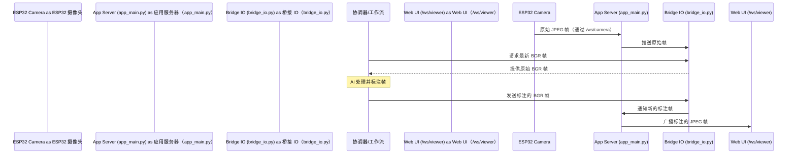

# 第 4 章：视频流管道

欢迎回来

在[第 3 章：系统协调器](03_system_orchestrator_.md)中，我们了解了 AI 眼镜的"中央管理者"，即 `NavigationMaster`。它负责理解我们的命令并告诉正确的"技能"（如 `BlindPathNavigator`）该做什么。

但所有这些令人惊叹的"技能"需要*看到*我们周围发生的事情！来自眼镜摄像头的原始图像如何到达智能工作流，得到分析，然后被发送回来，以便我们（以及监控屏幕上的其他人）可以看到眼镜的"视觉"？

这就是**视频流管道**发挥作用的地方。它是 AI 眼镜的"视觉"系统。

## 眼镜的"视觉"系统

想象一下，我们的智能眼镜有一条连续的、实时的视觉"传送带"：

1.  **原始图像输入**：每隔几分之一秒，ESP32 眼镜上的摄像头就会拍摄一张新照片（一个"帧"）。
2.  **分析站**：这张照片沿着传送带传送到一台强大的计算机。在这里，不同的 AI 模型（如检测盲道或障碍物的模型）开始行动，分析图像。
3.  **装饰与洞察**：当 AI 分析时，它用有用的信息"装饰"图像——在障碍物周围绘制框，突出显示盲道，或添加引导箭头。
4.  **标注图像输出**：现在"更智能"（已标注）的图像继续沿着传送带前进，并被高效地发送出去，准备让我们在监控屏幕上看到，或供眼镜用于生成语音引导。

整个过程发生得非常快，确保实时反馈和导航。

### 我们的用例："看到"盲道

让我们回到我们熟悉的命令：**"开始导航。"**

当[系统协调器](03_system_orchestrator_.md)切换到 `BLINDPATH_NAV` 模式时，`BlindPathNavigator` 工作流需要不断看到世界。它需要稳定的视频帧流来：

1.  **检测盲道**：找到地面上的纹理路径。
2.  **发现障碍物**：识别挡路的任何东西。
3.  **生成引导**：告诉我们"保持直行"或"左转"。

视频流管道是传递这些帧的无名英雄，使导航成为可能。

## 视频流如何流动

让我们可视化单个视频帧的旅程，从眼镜到 AI，然后返回到显示器：



这个图表显示：

1.  **摄像头到服务器**：ESP32 摄像头捕获原始 JPEG 图像并无线发送到我们的 `app_main.py` 服务器。
2.  **服务器到桥接**：`app_main.py` 立即将此原始图像传递给 `bridge_io.py`，它充当临时缓冲区。
3.  **工作流请求**：活动的 AI 工作流（例如，[盲道导航工作流](02_navigation___assistance_workflows_.md)，由[系统协调器](03_system_orchestrator_.md)管理）向 `bridge_io.py` 请求最新的原始图像。
4.  **AI 处理**：工作流处理图像，运行 AI 模型，并添加标注。
5.  **标注帧返回桥接**：工作流将*标注的*（装饰的）图像发送回 `bridge_io.py`。
6.  **桥接到服务器到 UI**：`bridge_io.py` 然后告诉 `app_main.py` 关于这个新标注图像，`app_main.py` 然后将其广播到任何连接的 Web 浏览器进行监控。

## 管道的关键组件

以下是构成我们视频流管道的核心模块的分解：

| 组件                 | 文件（`.py`）                                                | 角色（类比）               | 它的作用                                                    |
| :------------------- | :----------------------------------------------------------- | :------------------------- | :---------------------------------------------------------- |
| **摄像头输入处理器** | `app_main.py`                                                | 原始摄像头馈送的"接收码头" | 通过 WebSocket 接受来自 ESP32 的原始 JPEG 字节。            |
| **帧缓冲区**         | `bridge_io.py`                                               | "传送带缓冲区"和"帧分发器" | 临时存储原始帧；将它们提供给 AI；接受并分发标注帧。         |
| **AI 处理**          | `navigation_master.py` `workflow_blindpath.py` `yolomedia.py`（和其他） | "分析和装饰站"             | 请求原始帧，运行 AI 模型，添加视觉标注（框、线等）。        |
| **输出广播**         | `app_main.py`                                                | 处理帧的"交付服务"         | 将标注帧转换为 JPEG 并通过 WebSocket 发送到 Web UI 查看器。 |

## 代码

让我们看看这些部分如何在代码中交互。

### 1. 接收原始帧（`app_main.py`）

`app_main.py` 文件有一个 WebSocket 端点（`/ws/camera`），专门用于 ESP32 摄像头发送原始 JPEG 图像。

```python
# app_main.py（简化版）
@app.websocket("/ws/camera")
async def ws_camera_esp(ws: WebSocket):
    global esp32_camera_ws
    esp32_camera_ws = ws # 存储摄像头 WebSocket 连接
    await ws.accept()
    print("[CAMERA] ESP32 connected")

    try:
        while True:
            msg = await ws.receive()
            if "bytes" in msg and msg["bytes"] is not None:
                data = msg["bytes"] # 在这里接收原始 JPEG 字节！

                # 将原始 JPEG 推送到 bridge_io 缓冲区
                bridge_io.push_raw_jpeg(data)

                # ...（稍后，此数据由协调器/工作流使用）...
            # ...
    except WebSocketDisconnect:
        # ... 清理 ...
        pass
```
这个代码片段显示 `app_main.py` 充当 WebSocket 服务器，不断监听二进制 `bytes` 消息，这些消息是来自 ESP32 的原始 JPEG 帧。一旦帧到达，它就会立即被推送到 `bridge_io`。

### 2. 帧缓冲区和分发器（`bridge_io.py`）

`bridge_io.py` 模块是管道缓冲和分发的核心。它使用线程安全的 `deque`（一种类似列表的结构，设计用于从两端快速添加和删除）来存储帧。

```python
# bridge_io.py（简化版）
from collections import deque
import threading
import cv2
import numpy as np

_MAX_BUF = 4 # 最多存储 4 个原始帧
_frames = deque(maxlen=_MAX_BUF)
_cond = threading.Condition() # 用于线程安全访问

_sender_cb = None # 回调以将标注的 JPEG 发送到 UI

def set_sender(cb):
    """由 app_main.py 注册以将处理的 JPEG 发送到 UI。"""
    global _sender_cb
    _sender_cb = cb

def push_raw_jpeg(jpeg_bytes: bytes):
    """由 app_main.py 调用：从 ESP32 接收原始 JPEG。"""
    if not jpeg_bytes: return
    with _cond: # 使用锁防止多个线程同时访问
        _frames.append((time.time(), jpeg_bytes))
        _cond.notify_all() # 唤醒任何等待帧的线程

def wait_raw_bgr(timeout_sec: float = 0.5):
    """由 AI 工作流调用：等待并获取最新的原始 BGR 帧。"""
    last = None
    with _cond:
        # 等待直到帧可用或超时
        _cond.wait(timeout=timeout_sec)
        if _frames:
            last = _frames[-1] # 获取最新帧

    if last is not None:
        ts, jpeg = last
        arr = np.frombuffer(jpeg, dtype=np.uint8)
        bgr = cv2.imdecode(arr, cv2.IMREAD_COLOR) # 将 JPEG 解码为 BGR（OpenCV 格式）
        return bgr
    return None

def send_vis_bgr(bgr, quality: int = 80):
    """由 AI 工作流调用：将处理的 BGR 帧发送回 UI。"""
    if bgr is None: return
    
    ok, enc = cv2.imencode(".jpg", bgr, [int(cv2.IMWRITE_JPEG_QUALITY), int(quality)])
    if ok and _sender_cb:
        try:
            # 使用 app_main.py 注册的回调发送到 UI
            _sender_cb(enc.tobytes())
        except Exception:
            pass
```
-   `push_raw_jpeg()`：当 `app_main.py` 获取帧时，它调用此函数将其添加到 `_frames`。
-   `wait_raw_bgr()`：AI 工作流（如 `BlindPathNavigator`）调用此函数获取最新的原始帧。它将 JPEG 解码为 BGR（蓝-绿-红）图像，这是 OpenCV 和大多数 AI 模型的标准格式。
-   `send_vis_bgr()`：在 AI 工作流处理并标注帧后，它调用此函数将*处理的*帧发送回来。`bridge_io` 然后使用特殊回调（`_sender_cb`）将此帧发送到 Web UI。

### 3. AI 处理和标注（`navigation_master.py` 和 `workflow_blindpath.py`）

`NavigationMaster`（[第 3 章：系统协调器](03_system_orchestrator_.md)）不断请求新帧并将它们委托给活动工作流。

```python
# navigation_master.py（简化版）
class NavigationMaster:
    # ... 使用工作流初始化 ...

    def process_frame(self, bgr: np.ndarray) -> OrchestratorResult:
        # 此函数由 app_main.py 为每个新原始帧调用。
        
        # 检查当前状态（例如，BLINDPATH_NAV）
        if self.state in (BLINDPATH_NAV, SEEKING_CROSSWALK, ...):
            # 将帧委托给活动工作流（例如，BlindPathNavigator）
            bres = self.blind.process_frame(bgr) # BlindPathNavigator 获取帧！
            ann_image = bres.annotated_image # 它返回标注图像

            # ... 处理引导文本 ...
            return OrchestratorResult(ann_image, guidance_text, self.state, {"source": "blind"})
        # ...
        return OrchestratorResult(bgr.copy(), "", self.state, {})

# workflow_blindpath.py（简化版）
class BlindPathNavigator:
    # ... 使用 AI 模型初始化 ...

    def process_frame(self, bgr_image: np.ndarray) -> ProcessingResult:
        """
        处理单个视频帧以提供盲道导航引导。
        此函数针对每个新帧重复调用。
        """
        annotated_image = bgr_image.copy() # 从原始图像的副本开始

        # 1. 检测盲道（在 bgr_image 上使用 self.seg_model）
        blind_path_mask = self._detect_blind_path(bgr_image) 

        # 2. 检测障碍物（在 bgr_image 上使用 self.obstacle_detector）
        detected_obstacles = self._detect_obstacles(bgr_image, blind_path_mask)

        # 3. 向 annotated_image 添加视觉标注（绘制掩码、框等）
        # ... cv2.drawContours, cv2.rectangle 等 ...

        # 4. 生成引导文本
        guidance_text = self._generate_guidance(...)

        return ProcessingResult(
            annotated_image=annotated_image, # 返回装饰的图像
            guidance_text=guidance_text,
            visualizations=[]
        )
```
`app_main.py` 使用 `bridge_io.wait_raw_bgr()` 获取原始 BGR 帧，然后将其传递给 `navigation_master.process_frame()`。

`NavigationMaster` 然后调用当前活动工作流的 `process_frame()` 方法，如 `blind.process_frame(bgr)`。工作流执行所有 AI 魔法并返回 `annotated_image`，然后通过管道发送回来。

### 4. 向 Web UI 广播标注帧（`app_main.py`）

最后，`app_main.py` 负责获取处理的帧并将它们发送到任何连接的 Web 浏览器。这是通过 `app_main.py` 向 `bridge_io.py` 注册的特殊"发送者回调"完成的。

```python
# app_main.py（简化版）
@app.on_event("startup")
async def on_startup_register_bridge_sender():
    main_loop = asyncio.get_event_loop() # 获取主事件循环

    def _sender(jpeg_bytes: bytes):
        # 每当标注帧准备好时，bridge_io.py 调用此函数。
        # 它需要在主事件循环中运行以通过 WebSocket 广播。
        if main_loop.is_closed(): return
        
        async def _broadcast():
            # 将标注的 JPEG 发送到所有连接的 Web UI 查看器
            if not camera_viewers: return
            dead = []
            for ws in list(camera_viewers):
                try:
                    await ws.send_bytes(jpeg_bytes)
                except Exception:
                    dead.append(ws)
            for ws in dead:
                try: camera_viewers.remove(ws)
                except Exception: pass
        
        asyncio.run_coroutine_threadsafe(_broadcast(), main_loop) # 安排广播

    bridge_io.set_sender(_sender) # 向 bridge_io 注册我们的发送者回调

@app.websocket("/ws/viewer")
async def ws_viewer(ws: WebSocket):
    await ws.accept()
    camera_viewers.add(ws) # 跟踪所有连接的浏览器查看器
    print(f"[VIEWER] Browser connected. Total viewers: {len(camera_viewers)}")
    try:
        while True:
            await asyncio.sleep(60) # 保持连接活动
    except WebSocketDisconnect:
        print("[VIEWER] Browser disconnected")
    finally:
        try: camera_viewers.remove(ws)
        except Exception: pass
```
-   `on_startup_register_bridge_sender()`：此函数在应用程序启动时运行。它定义一个小的 `_sender` 函数，并告诉 `bridge_io.py` 在标注帧准备好时调用此 `_sender`。
-   `_sender()`：此函数获取标注的 JPEG 字节，然后安排 `_broadcast()` 协程在主应用程序循环中运行。
-   `_broadcast()`：此 `async` 函数遍历所有连接的浏览器客户端（`camera_viewers`）并向它们发送标注的 JPEG 图像。
-   `/ws/viewer`：此 WebSocket 端点允许任何 Web 浏览器连接并接收这些实时标注视频帧。

通过这个==编排的管道，原始视频帧被高效地移动==，由强大的 AI 处理，然后显示以为我们提供来自 AI 眼镜的智能引导。

## 结论

在本章中，我们探讨了**视频流管道**，即 AI 眼镜的基本"视觉"系统。

我们了解了来自 ==ESP32 摄像头的原始视频帧快速缓冲，由 AI 模型处理以添加有用的标注，然后高效地流式传输到 Web 界面进行实时监控==。这种持续的视觉信息流是眼镜提供的所有智能辅助的基础。

现在我们了解了视频帧如何进入系统并被分发，我们可能想知道：那些"AI 处理"步骤内部究竟发生了什么？使用什么模型来"看到"和"理解"世界？这正是我们将在下一章中探讨的内容，我们将揭示**核心 ==AI 感知模型==**

[下一章：核心 AI 感知模型](05_core_ai_perception_models_.md)

