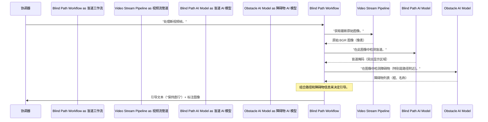

# 第 5 章：核心 AI 感知模型

欢迎回来

在[第 4 章：视频流管道](04_video_stream_pipeline_.md)中，我们了解了来自眼镜摄像头的原始视频帧如何高效地传输到我们的主应用程序。这个管道确保 AI 眼镜的"眼睛"不断发送新信息。

但仅仅*看到*是不够的；眼镜需要*理解*它们看到的内容。就像我们的大脑解释照射到眼睛的光线一样，AI 眼镜需要自己的"大脑"来理解传入的视频帧。这就是**核心 AI 感知模型**发挥作用的地方。

## 眼镜的"智能眼睛"

想象一下，我们的 AI 眼镜不仅仅是镜片，而是一组高度专业化的"智能眼睛"。每只眼睛都经过训练来发现非常具体的东西：一只寻找路径，另一只寻找障碍物，另一只寻找交通信号灯，还有一只几乎可以找到我们描述的任何东西

这些"智能眼睛"由先进的**机器学习模型**驱动。它们的工作是：

1.  **接收原始图像**：获取视频帧（只是像素）。
2.  **分析图像**：运行复杂的计算来查找特定模式。
3.  **理解和标记**：识别图像中的内容并以系统可以使用的方式描述它（例如，"这是盲道"、"那是汽车"、"灯是红色的"）。

这是将原始像素转换为有意义信息的"智能"，使眼镜能够有效地引导我们。

### 我们的用例：为导航"看到"和"理解"

让我们重新审视我们的主要命令：**"开始导航。"**

当我们发出此命令时，[系统协调器](03_system_orchestrator_.md)激活[盲道导航工作流](02_navigation___assistance_workflows_.md)。然后，此工作流需要不断理解其周围环境。它严重依赖这些核心 AI 感知模型来：

1.  **找到盲道**：识别地面上的纹理路径。
2.  **检测障碍物**：发现可能挡路的任何东西，如人、汽车或街道柱子。
3.  **识别人行横道和交通信号灯**：当我们接近十字路口时。

如果没有这些感知模型，眼镜只会向我们展示图片——它们不知道这些图片对我们的导航*意味着*什么！

## 🎢AI 感知模型的类型

我们的 AI 眼镜使用不同类型的模型，每个模型都专门从事特定的"看"任务。把它们想象成团队中的不同专家：

| 感知模型任务       | 它"看到"什么                     | 它如何"看"（模型类型）  | 示例输出                                                     |
| :----------------- | :------------------------------- | :---------------------- | :----------------------------------------------------------- |
| **盲道分割**       | 地面上的纹理路径。               | 物体分割                | 路径的**掩码**（像素级轮廓）。                               |
| **障碍物检测**     | 人、汽车、柱子、长椅等。         | 物体检测与分割          | 物体周围的**边界框**（矩形）、它们的**类别**（例如，"人"），以及可选的**掩码**。 |
| **交通信号灯检测** | 红、绿、黄交通信号灯。           | 物体检测与分类          | **分类**（例如，"红色"、"绿色"、"黄色"）。                   |
| **开放词汇搜索**   | 我们用自然语言描述的*任何*物体。 | 视觉-语言模型（YOLO-E） | 请求物体的**掩码**和**边界框**。                             |

这些模型提供原始的"感知数据"——掩码、边界框和分类——然后[导航与辅助工作流](02_navigation___assistance_workflows_.md)使用这些数据做出明智的决策并生成引导。

## AI 模型如何处理视频帧

让我们看看当眼镜在盲道上导航时，这些模型如何与系统交互。



以下是发生的事情：

1.  [系统协调器](03_system_orchestrator_.md)告诉活动的[盲道工作流](02_navigation___assistance_workflows_.md)处理最新的视频帧。
2.  `盲道工作流`向[视频流管道](04_video_stream_pipeline_.md)请求来自摄像头的最新原始图像。
3.  一旦有了图像，`盲道工作流`就会调用**盲道 AI 模型**来识别盲道在哪里。模型返回路径的"掩码"（数字轮廓）。
4.  接下来，`盲道工作流`调用**障碍物 AI 模型**来查找可能挡路的任何物体。此模型返回"人"或"柱子"等物体的边界框和名称。
5.  有了路径和障碍物信息，`盲道工作流`现在可以确定我们是否在路径上，是否有障碍物，以及要给出什么引导（"保持直行"、"前方有障碍物"）。
6.  最后，它将此引导和"标注的"（用绘图装饰的）图像发送回`协调器`。

## 代码

让我们看看这些"智能眼睛"如何在代码中加载和使用。

### 1. 加载模型（`app_main.py`）

当应用程序启动时，`app_main.py` 负责将各种 AI 模型加载到内存中。这可能需要一点时间，但它确保它们准备好以后快速处理。

```python
# app_main.py（简化版）
import os
import numpy as np
import cv2
import torch
from ultralytics import YOLO
from obstacle_detector_client import ObstacleDetectorClient # 我们的自定义包装器

# 全局变量来保存我们加载的模型
yolo_seg_model = None         # 用于盲道分割
obstacle_detector = None      # 用于一般障碍物检测

def load_navigation_models():
    """加载导航所需的所有 AI 模型。"""
    global yolo_seg_model, obstacle_detector

    # 加载盲道分割模型
    seg_model_path = os.getenv("BLIND_PATH_MODEL", "model/yolo-seg.pt")
    if os.path.exists(seg_model_path):
        print(f"[AI] Loading Blind Path Segmentation Model: {seg_model_path}")
        yolo_seg_model = YOLO(seg_model_path)
        if torch.cuda.is_available(): yolo_seg_model.to("cuda")
        print("[AI] Blind Path Model loaded.")

    # 加载障碍物检测器（使用我们的 YOLO-E 包装器）
    obstacle_model_path = os.getenv("OBSTACLE_MODEL", "model/yoloe-11l-seg.pt")
    if os.path.exists(obstacle_model_path):
        print(f"[AI] Loading Obstacle Detection Model: {obstacle_model_path}")
        obstacle_detector = ObstacleDetectorClient(model_path=obstacle_model_path)
        print("[AI] Obstacle Detector loaded and ready.")

# 在应用启动时调用此函数
load_navigation_models()
```
这个 `load_navigation_models()` 函数查找模型文件（如用于盲道的 `yolo-seg.pt`）并创建代表这些加载模型的特殊对象（`YOLO`、`ObstacleDetectorClient`）。如果可用，它还尝试将它们移动到 GPU（`.to("cuda")`），以便更快地处理。

### 2. 使用盲道模型（`workflow_blindpath.py`）

`BlindPathNavigator` 工作流使用加载的 `yolo_seg_model` 在每个传入的视频帧中查找盲道。

```python
# workflow_blindpath.py（简化版）
class BlindPathNavigator:
    def __init__(self, seg_model, obs_model, device_id: str = "esp32"):
        self.seg_model = seg_model # 这是我们的 YOLO 盲道模型！
        self.obstacle_detector = obs_model # 这是我们的 ObstacleDetectorClient！
        # ... 其他设置 ...

    def _detect_blind_path(self, bgr_image: np.ndarray) -> Optional[np.ndarray]:
        """使用 YOLO 模型查找并分割盲道。"""
        # 'predict' 方法在图像上运行 AI 模型
        results = self.seg_model.predict(bgr_image, verbose=False, conf=0.25)[0]

        if results.masks and len(results.masks) > 0:
            # 如果找到盲道，返回其掩码（轮廓）
            # 简化：只取第一个检测到的掩码
            mask_tensor = results.masks.data[0]
            # 将掩码从 PyTorch 张量转换为 NumPy 数组（图像格式）
            mask = (mask_tensor.cpu().numpy() > 0.5).astype(np.uint8) * 255
            # 如果需要，将掩码调整为原始图像尺寸
            H, W = bgr_image.shape[:2]
            if mask.shape[:2] != (H, W):
                mask = cv2.resize(mask, (W, H), interpolation=cv2.INTER_NEAREST)
            return mask
        return None
```
`_detect_blind_path` 函数接受 `bgr_image`（原始视频帧）并将其传递给 `self.seg_model.predict()`

这是 AI 模型"查看"图像的地方。如果它找到盲道，它返回 `mask`——一个黑白图像，其中白色像素勾勒出检测到的路径。

### 3. 使用障碍物检测模型（`obstacle_detector_client.py`）

`ObstacleDetectorClient` 是 `YOLOE` 模型的专用包装器

`YOLOE` 功能强大，因为它可以检测各种物体，而且至关重要的是，我们可以使用文本描述（"白名单"）告诉它要寻找*什么类型*的物体。

```python
# obstacle_detector_client.py（简化版）
from ultralytics import YOLOE # 实际的 AI 模型框架
import torch

class ObstacleDetectorClient:
    def __init__(self, model_path: str = 'model/yoloe-11l-seg.pt'):
        print(f"[OBS DETECTOR] Initializing YOLOE model from {model_path}")
        self.model = YOLOE(model_path)
        self.model.to("cuda" if torch.cuda.is_available() else "cpu")

        self.WHITELIST_CLASSES = [
            'person', 'car', 'motorcycle', 'bus', 'truck', 'bicycle', 'animal', 'dog',
            'pole', 'bench', 'chair', 'potted plant', 'hydrant', 'cone', 'stone', 'box'
        ]
        # 这是"魔法"：告诉 YOLOE 只寻找这些特定的东西！
        self.whitelist_embeddings = self.model.get_text_pe(self.WHITELIST_CLASSES)
        self.model.set_classes(self.WHITELIST_CLASSES, self.whitelist_embeddings)
        print(f"[OBS DETECTOR] YOLOE configured to detect {len(self.WHITELIST_CLASSES)} specific classes.")

    def detect(self, image: np.ndarray, path_mask: np.ndarray = None) -> List[Dict[str, Any]]:
        """检测图像中白名单中的物体。"""
        results = self.model.predict(image, verbose=False, conf=0.25)[0]
        
        detected_objects = []
        if results.masks is not None and len(results.masks.data) > 0:
            for i in range(len(results.masks.data)):
                # 获取检测到的物体的掩码、边界框和名称
                mask_tensor = results.masks.data[i]
                mask = (mask_tensor.cpu().numpy() > 0.5).astype(np.uint8) * 255
                box_coords = results.boxes.xyxy[i].cpu().numpy().astype(int)
                class_id = int(results.boxes.cls[i])
                class_name = self.model.names.get(class_id, "unknown")

                # 我们可以在这里添加进一步的过滤（例如，检查物体是否与 path_mask 重叠）
                # 为简单起见，我们只返回所有检测到的白名单物体
                detected_objects.append({
                    'name': class_name,
                    'mask': mask,
                    'box': box_coords
                })
        return detected_objects
```
`ObstacleDetectorClient` 使用 `WHITELIST_CLASSES` 列表（如 'person'、'car'、'pole'）初始化

然后它使用 `self.model.set_classes()` 告诉 AI 模型*只*寻找这些项目。当调用 `detect()` 时，模型高效地扫描图像并返回有关任何检测到的白名单物体的信息，包括它们的掩码和边界框。

### 4. 交通信号灯检测（`trafficlight_detection.py`）

对于交通信号灯检测等关键任务，我们有一个专用模块。

```python
# trafficlight_detection.py（简化版）
import os
import cv2
import numpy as np
from ultralytics import YOLO

_model = None # 全局实例，仅加载模型一次

def init_model():
    """初始化 YOLO 交通信号灯检测模型。"""
    global _model
    if _model is None:
        model_path = os.getenv("TRAFFIC_LIGHT_MODEL", "model/trafficlight.pt")
        print(f"[TRAFFIC LIGHT] Loading model: {model_path}")
        _model = YOLO(model_path)
        _model.to("cuda" if torch.cuda.is_available() else "cpu")
        print("[TRAFFIC LIGHT] Model loaded.")
    return True

def process_single_frame(image: np.ndarray) -> dict:
    """处理单个帧以进行交通信号灯检测。"""
    if _model is None: init_model() # 确保模型已加载
    
    results = _model(image, conf=0.25, verbose=False)[0]
    
    detected_light_status = "unknown"
    if results.boxes:
        for box in results.boxes:
            class_name = _model.names[int(box.cls[0])]
            # 我们寻找模型输出的特定类名
            if class_name in ["stop", "go", "countdown_go", "countdown_stop"]:
                detected_light_status = class_name # 例如，红灯为"stop"
                break # 找到最有信心的灯，所以停止搜索
    
    # 我们可以在这里添加视觉标注（在 'image' 上绘制框）
    return {'detected_light': detected_light_status, 'vis_image': image}
```
`trafficlight_detection.py` 模块加载专用的 `YOLO` 模型（`trafficlight.pt`）

然后 `process_single_frame` 函数使用此模型检查图像中的交通信号灯。它识别颜色/状态（如红色为"stop"或绿色为"go"）并返回此分类。

## 结论

在本章中，探讨了**核心 AI 感知模型**，这些"智能眼睛"使 AI 眼镜能够理解我们周围的世界。

我们看到了不同的专业模型如何协同工作来分割盲道、检测障碍物、识别交通信号灯，甚至找到我们要求的任何物体。

这些模型将原始视频帧转换为有意义的感知数据，这是眼镜提供的所有智能引导和辅助的基础。

现在我们了解了==眼镜如何"看到"和"思考"==，我们可能会好奇第一步：==系统如何从物理眼镜设备获取原始视频和其他传感器数据==？这就是我们将在下一章中揭示的内容，我们将深入探讨**硬件接口与 IMU 数据**

[下一章：硬件接口与 IMU 数据](06_hardware_interface___imu_data_.md)

