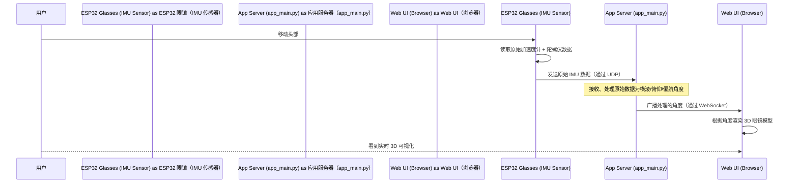

# 第 6 章：硬件接口与 IMU 数据

欢迎回来

在[第 5 章：核心 AI 感知模型](05_core_ai_perception_models_.md)中，我们探讨了 AI 眼镜如何使用先进的模型来"理解"它们看到的内容——从原始视频帧中检测盲道、障碍物和交通信号灯。这种智能令人惊叹，但这一切都始于从*物理*世界获取信息。

本章是关于链条中的第一个环节：`OpenAIglasses_for_Navigation` 项目如何连接到实际的智能眼镜设备（ESP32 微型计算机）并从其集成传感器接收关键数据。具体来说，我们将重点关注**惯性测量单元（IMU）数据**，它告诉我们眼镜在 3D 空间中如何移动和定向。

## 眼镜的"身体感觉"

想象一下我们自己的身体：即使闭上眼睛，我们也知道自己是站直、倾斜头部还是转身。我们的内耳和肌肉给我们这种"身体感觉"或平衡和方向感。

我们的 AI 眼镜需要类似的"身体感觉"。它们需要知道：
*   它们是向上还是向下倾斜？
*   它们是向左还是向右转？
*   它们是向前加速吗？

这些信息至关重要，原因有很多：
1.  **稳定导航**：如果眼镜知道它们倾斜了，它们可以纠正对地面的感知。
2.  **用户界面**：如果我们倾斜头部，也许 UI 应该随之移动。
3.  **视觉反馈**：在监控屏幕上，看到 3D 眼镜模型完全按照用户移动头部的方式移动是很酷的。

这种"身体感觉"来自眼镜内部一个称为**惯性测量单元（IMU）**的==微型传感器==。它结合了**加速度计**（测量加速度，帮助确定倾斜）和**陀螺仪**（测量旋转速度，帮助确定转向）。

### 我们的用例：在 3D 中可视化眼镜运动

让我们使用一个清晰的例子：我们戴上 `OpenAIglasses_for_Navigation` 并开始行走。当我们移动头部、转身或向上/向下看时，我们想在**计算机屏幕上看到眼镜的 3D 模型实时移动**，完全匹配我们头部的运动。这有助于开发人员和护理人员理解用户的视角。

要实现这一点，系统需要：
1.  从 ESP32 读取原始 IMU 数据（加速度计和陀螺仪）。
2.  无线将此数据发送到主应用程序。
3.  处理原始数据以估计设备的 3D 方向（横滚、俯仰、偏航）。
4.  将此方向数据广播到 Web 浏览器进行可视化。

## 硬件和软件如何连接

物理智能眼镜设备通常围绕 **ESP32** 微控制器构建，是"硬件"部分。它有摄像头、麦克风、扬声器和我们的 IMU 传感器。主要的"软件"部分是我们的 `app_main.py` 应用程序，它运行在更强大的计算机上（如我们的 PC 或服务器）。

数据在它们之间流动：
*   **视频**（摄像头）和**音频**（麦克风）使用 **WebSockets** 从 ESP32 传输到 `app_main.py`。WebSockets 就像一个持久、可靠的电话呼叫。
*   **IMU 数据**使用 **UDP（用户数据报协议）**从 ESP32 传输到 `app_main.py`。==UDP==就像发送明信片——它快速、轻量，但不保证传递或顺序。这对 IMU 数据来说没问题，因为我们获得了很多读数，==丢失几个并不重要，而速度很重要==。

### 流程：从眼镜到屏幕的 IMU 数据

以下是 IMU 数据如何从物理眼镜传输到监控屏幕上的 3D 可视化：



## 代码：ESP32 端

ESP32 固件（`compile/compile.ino`、`ICM42688.h`、`ICM42688.cpp`）负责读取 IMU 传感器并发送数据。

`ICM42688.h` 和 `ICM42688.cpp` 文件包含特定 IMU 传感器（ICM42688）的**设备驱动程序**。此驱动程序知道如何与传感器"对话"，要求它提供最新的加速度计和陀螺仪读数。

以下是 ESP32 如何读取传感器的简化视图（来自 `compile/ICM42688.cpp`）：

```cpp
// compile/ICM42688.cpp（简化版）
int ICM42688::readSensor() {
  uint8_t data[14];
  readRegisters(0x1D, 14, data); // 读取 14 字节的原始传感器数据

  // 从数据缓冲区提取原始 16 位值
  _ax = (int16_t)data[2] << 8 | data[3]; // 原始 X 轴加速度
  _ay = (int16_t)data[4] << 8 | data[5]; // 原始 Y 轴加速度
  _az = (int16_t)data[6] << 8 | data[7]; // 原始 Z 轴加速度
  _gx = (int16_t)data[8] << 8 | data[9]; // 原始 X 轴陀螺仪
  // ... _gy、_gz 等类似 ...
  
  return 0;
}
```
这个 `readSensor()` 函数直接与 IMU 芯片通信，获取加速度（`_ax`、`_ay`、`_az`）和旋转速度（`_gx`、`_gy`、`_gz`）的原始数值。

一旦 ESP32 有了这些原始值，它就会将它们打包成 JSON 格式，并通过 UDP 发送到我们的主应用程序。这会重复发生，通常每秒多次。

```cpp
// compile/compile.ino（概念性 C++ 代码片段）
#include <WiFiUdp.h>
// ... 其他包含和设置 ...

WiFiUDP Udp; // 我们的 UDP 对象
// ... 设置 Udp.begin(localPort) ...

void loop() {
  // 1. 读取 IMU 数据
  imu.readSensor(); // 调用我们上面看到的函数
  float ax = imu.getAccelX_mss(); // 获取校准值
  float ay = imu.getAccelY_mss();
  float az = imu.getAccelZ_mss();
  float gx = imu.getGyroX_dps(); // 获取以度/秒为单位的校准值
  float gy = imu.getGyroY_dps();
  float gz = imu.getGyroZ_dps();

  // 2. 格式化为 JSON 字符串
  String jsonPacket = "{";
  jsonPacket += "\"ts\":" + String(millis()) + ","; // 时间戳
  jsonPacket += "\"accel\":{\"x\":" + String(ax, 3) + ",\"y\":" + String(ay, 3) + ",\"z\":" + String(az, 3) + "},";
  jsonPacket += "\"gyro\":{\"x\":" + String(gx, 3) + ",\"y\":" + String(gy, 3) + ",\"z\":" + String(gz, 3) + "}";
  jsonPacket += "}";

  // 3. 通过 UDP 发送
  Udp.beginPacket(remoteIP, remotePort); // 准备发送到我们的应用服务器
  Udp.print(jsonPacket); // 发送 JSON 字符串
  Udp.endPacket(); // 完成发送 UDP 数据包

  delay(20); // 每 20 毫秒发送一次（每秒 50 次）
}
```
这个概念性的 `loop()` 函数持续读取 IMU，将原始值转换为结构化的 JSON 字符串，然后将此字符串作为 UDP 数据包发送到主应用程序服务器。

这确保了来自眼镜的"身体感觉"数据的持续流。

## 🎢代码：应用服务器端（`app_main.py`）

运行在 `app_main.py` 中的主应用程序需要：
1.  监听传入的 UDP 数据包。
2.  解析这些数据包中的 JSON 数据。
3.  处理原始 IMU 数据以计算横滚、俯仰和偏航角度。
4.  将这些处理的角度广播到任何连接的 Web 浏览器进行可视化。

### 1. 接收 UDP 数据

`app_main.py` 使用 `asyncio.DatagramProtocol` 设置 UDP 监听器。这就像专门为 UDP 明信片设置一个邮箱。

```python
# app_main.py（简化版）
import asyncio
import json

UDP_IP   = "0.0.0.0" # 监听所有可用的网络接口
UDP_PORT = 12345     # ESP32 发送到的端口

# ... IMU 处理的全局变量 ...

class UDPProto(asyncio.DatagramProtocol):
    def connection_made(self, transport):
        print(f"[UDP] listening on {UDP_IP}:{UDP_PORT}")

    def datagram_received(self, data, addr):
        try:
            s = data.decode('utf-8', errors='ignore').strip() # 将字节解码为字符串
            d = json.loads(s) # 将 JSON 字符串解析为 Python 字典
            
            # 此函数计算横滚/俯仰/偏航
            process_imu_and_maybe_store(d) 
            
            # 将原始数据广播到 Web 客户端进行可视化
            asyncio.create_task(imu_broadcast(json.dumps(d)))
        except Exception:
            # 忽略格式错误的数据包，因为 UDP 是无连接的
            pass

# 在 FastAPI 应用启动时调用
@app.on_event("startup")
async def on_startup():
    loop = asyncio.get_running_loop()
    # 创建 UDP 监听器
    await loop.create_datagram_endpoint(lambda: UDPProto(), local_addr=(UDP_IP, UDP_PORT))
```
`UDPProto` 类有一个 `datagram_received` 方法，每次 UDP 数据包到达时都会自动调用

在此方法内部，我们将原始字节解码为字符串，将其解析为 JSON，然后传递以进行处理和广播。

### 2. 处理 IMU 数据

`app_main.py` 中的 `process_imu_and_maybe_store()` 函数是将原始加速度计和陀螺仪读数转换为有意义的 3D 方向角度（横滚、俯仰、偏航）的"大脑"。此函数使用互补滤波器等先进技术来结合噪声加速度计数据（适用于长期倾斜）和易漂移的陀螺仪数据（适用于短期旋转），以获得设备方向的稳定和准确估计。

```python
# app_main.py（简化版 - 仅显示函数签名和目的）
def process_imu_and_maybe_store(d: Dict[str, Any]):
    """
    接收原始 IMU 数据（加速度计和陀螺仪读数）并
    应用传感器融合算法（例如，互补滤波器）来
    估计设备的 3D 方向（横滚、俯仰、偏航）。
    
    此函数更新保存当前估计方向的全局变量，
    使其可供应用程序的其他部分使用或广播到 UI。
    
    参数：
        d (Dict[str, Any])：包含原始 IMU 数据的字典，
                            例如，{"ts": 123.45, "accel": {"x":0.1, "y":0.2, ...}}
    """
    # ... 传感器融合、滤波和角度估计的复杂计算 ...
    
    # 更新的全局状态示例（概念性）
    # global Rf, Pf, Yf # 滤波后的横滚、俯仰、偏航
    # Rf = new_roll_angle
    # Pf = new_pitch_angle
    # Yf = new_yaw_angle
    
    # ... 还将原始数据存储在 `imu_store` 列表中 ...
    
    # 实际实现要长得多，但在概念上
    # 实现了稳定方向估计的目标。
```
此函数对于将原始传感器噪声转换为可用的方向数据至关重要。对于初学者，关键要点是它接受原始的 `accel` 和 `gyro` 值并计算眼镜的 `roll`（围绕前后轴的旋转）、`pitch`（围绕左右轴的旋转）和 `yaw`（围绕上下轴的旋转）。

### 3. 广播到 Web UI

最后，处理的（或甚至只是原始的）IMU 数据被发送到任何连接的 Web 浏览器。这是通过 WebSocket 端点完成的，类似于视频和音频的广播方式。

```python
# app_main.py（简化版）
imu_ws_clients: Set[WebSocket] = set() # 存储所有连接的浏览器客户端

# 此函数由 `UDPProto.datagram_received` 调用
async def imu_broadcast(msg: str):
    """
    通过 WebSocket 将 IMU 数据（作为 JSON 字符串）发送到所有连接的
    Web UI 客户端。
    """
    if not imu_ws_clients: return # 没有客户端连接，无需操作
    
    dead = []
    for ws in list(imu_ws_clients): # 遍历所有连接的客户端
        try:
            await ws.send_text(msg) # 发送 JSON 字符串
        except Exception:
            dead.append(ws) # 如果发送失败，标记客户端为已断开连接
    for ws in dead:
        imu_ws_clients.discard(ws) # 移除已断开连接的客户端

# 供浏览器连接的 WebSocket 端点
@app.websocket("/ws")
async def ws_imu(ws: WebSocket):
    await ws.accept()
    imu_ws_clients.add(ws) # 将新浏览器客户端添加到我们的集合
    print(f"[IMU] UI client connected. Total clients: {len(imu_ws_clients)}")
    try:
        while True:
            await asyncio.sleep(60) # 保持连接活动
    except WebSocketDisconnect:
        print("[IMU] UI client disconnected")
    finally:
        imu_ws_clients.discard(ws) # 断开连接时移除客户端
```
`imu_broadcast` 函数确保每次新的 IMU 数据到达并被处理时，它都会被发送到所有正在监控系统的浏览器。`/ws` 端点允许浏览器轻松订阅此流。

## Web UI：可视化运动（`static/visualizer.js`）

在 Web 浏览器端，`static/visualizer.js` 文件（使用名为 Three.js 的强大 3D 库）接收这些方向角度。==然后它使用这些角度实时旋转眼镜的 3D 模型，提供设备精确方向的直观可视化==。

这对于调试和理解用户的视角非常有帮助。

## 结论

在本章中，我们探讨了**硬件接口与 IMU 数据**，即 AI 眼镜的基本"身体感觉"系统。我们了解了==物理 ESP32 设备如何读取原始加速度计和陀螺仪数据，通过 UDP 高效地将其发送到主应用程序==，在那里它被处理以估计 3D 方向（横滚、俯仰、偏航），最后广播到 Web 界面进行实时 3D 可视化。

物理硬件和 AI 软件之间的这一基本链接确保眼镜不仅可以理解它们看到的*内容*，还可以理解它们在世界中的位置和移动*方式*。

我们现在了解了基本传感器数据如何进入系统。但是，所有这些不同的数据流——视频、音频和 IMU——==在不同时间进入并需要一起记录和分析==，我们如何保持一切整齐对齐？这就是我们将在下一章中揭示的内容，我们将深入探讨**数据同步与记录**

[下一章：数据同步与记录](07_data_synchronization___recording_.md)

