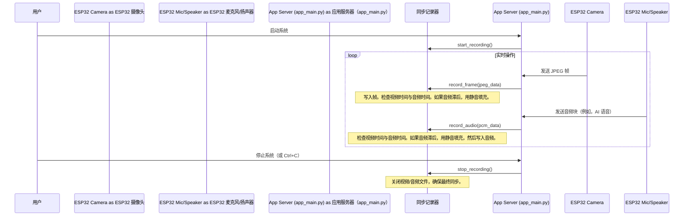

# 第 7 章：数据同步与记录

欢迎回来

在[第 6 章：硬件接口与 IMU 数据](06_hardware_interface___imu_data_.md)中，我们了解了 AI 眼镜如何连接到物理世界，捕获原始传感器数据，如视频帧、来自麦克风的音频和运动数据（IMU）。我们探讨了这些信息如何从 ESP32 设备流向主应用程序进行处理。

现在，想象一下收集所有这些重要信息——用户*看到*的内容（视频）、他们*说*和*听到*的内容（音频），以及眼镜如何*移动*（IMU）。这些数据片段在不同时间以不同速率到达。视频可能是每秒 15 帧，而音频以微小的、连续的块到达。

- 如果我们只是分别保存它们，我们怎么能确切知道用户在说某句话的精确时刻看到了什么，或者 AI 眼镜何时给出了特定指令？

这就是**数据同步与记录**发挥作用的地方

## 眼镜的"记忆管理员"

把这个模块想象成 AI 眼镜的超级有组织的图书管理员。它的主要工作是成为**"记忆管理员"**，确保收集的每一点信息都被精心记录在*一起*，完美地按时间对齐。这对以下方面非常重要：

1.  **调试**：如果出现问题（例如，眼镜给出错误的导航指令），开发人员可以查看记录，看到用户在那一刻*确切*看到和听到了什么，以找到错误。
2.  **分析**：了解用户在现实场景中如何与眼镜交互。
3.  **未来开发**：通过重放现实生活情况来创建更好的 AI 模型。

如果没有同步记录，调试就像试图通过在一个屏幕上观看视频并在完全独立的、不同步的播放器上听音频来理解电影——令人困惑且几乎不可能

### 我们的用例：回顾导航会话

让我们使用我们熟悉的导航示例。我们在盲道上行走，眼镜说"左转"。几秒钟后，我们不小心走出了路径。我们想向开发人员报告这个问题。

要理解为什么会发生这种情况，开发人员需要：
*   观看"左转"指令*之前*路径的视频。
*   清楚地听到"左转"指令，与视频*对齐*。
*   继续观看和听到一切，直到我们走出路径。

**数据同步与记录**模块通过自动保存每个会话的完整、完美对齐的视频和音频文件来实现这一点。

## 数据同步如何工作（挑战与解决方案）

==核心挑战是视频和音频是独立的流==。视频帧以固定速率到达，但音频可以是连续的或有间隙（静音）。为了在单个视频文件（通常有单个音轨）中保持它们对齐，我们需要一个"主时钟"和一种巧妙的方法来处理间隙。

我们的"记忆管理员"（`sync_recorder.py`）通过以下方式解决这个问题：
1.  **使用单一起始时间：**一切都相对于记录会话开始时计时。
2.  **记录视频帧：**每个帧根据视频的 FPS（每秒帧数）在其指定时间写入视频文件。
3.  **记录音频块：**所有说出的话（来自我们或 AI）都写入音频文件。
4.  **用静音填充：**这是最关键的部分，如果音频中有间隙（即没有人说话），记录器会自动在音频文件中==插入静音音频。这会"拉伸"音轨以精确匹配视频轨的持续时间，确保完美对齐==。

这种持续的静音填充保证了音频文件的持续时间始终与视频文件的持续时间同步。

### 流程：记录视频和音频

以下是 `SyncRecorder` 如何捕获和对齐数据的简化视图：



## 代码：`SyncRecorder`

数据同步和记录的核心逻辑由 `sync_recorder.py` 中的 `SyncRecorder` 类处理。

### 1. 初始化和开始记录

当我们的 `OpenAIglasses_for_Navigation` 应用程序启动时，它立即告诉 `SyncRecorder` 准备记录。

**`app_main.py`（启动）：**

```python
# app_main.py
# ... 导入 ...
import sync_recorder # 导入我们的记录器模块

# ... 其他设置 ...

# 【新增】启动同步录制
print("[RECORDER] 启动同步录制系统...")
sync_recorder.start_recording() # 这启动记录会话
print("[RECORDER] 录制系统已启动，将自动保存视频和音频")

# ... Ctrl+C 的清理处理程序 ...
```
这一行 `sync_recorder.start_recording()` 启动整个过程。

**`sync_recorder.py`（开始会话）：**

```python
# sync_recorder.py（简化版）
class SyncRecorder:
    def __init__(self, output_dir="recordings", fps=15.0):
        self.output_dir = output_dir
        self.fps = fps
        self.frame_duration = 1.0 / fps # 每个视频帧的持续时间
        # ... 其他变量 ...
        os.makedirs(output_dir, exist_ok=True) # 创建输出文件夹

    def start_recording(self):
        if self.is_recording: return False # 已经在记录
        
        # 生成带时间戳的唯一文件名
        timestamp = datetime.now().strftime("%Y%m%d_%H%M%S")
        self.video_path = os.path.join(self.output_dir, f"video_{timestamp}.avi")
        self.audio_path = os.path.join(self.output_dir, f"audio_{timestamp}.wav")
        
        self.start_time = time.time() # 这是我们的主时钟！
        self.frame_count = 0
        self.last_audio_time = 0.0 # 跟踪到目前为止记录的音频时长
        
        # 打开音频文件（视频文件在第一帧时打开）
        self.audio_writer = wave.open(self.audio_path, 'wb')
        self.audio_writer.setnchannels(self.channels)
        self.audio_writer.setsampwidth(self.sample_width)
        self.audio_writer.setframerate(self.sample_rate)
        
        self.is_recording = True
        return True
```
当调用 `start_recording()` 时，它创建唯一的文件名（例如，`video_20231026_103000.avi`、`audio_20231026_103000.wav`）并打开 `.wav` 文件进行写入。视频文件（`.avi`）仅在*第一个*视频帧到达时打开，因为我们需要知道帧的尺寸（宽度、高度）才能正确设置视频写入器。`self.start_time` 成为所有后续计时的锚点。

### 2. 记录视频帧

每次 ESP32 摄像头发送新的 JPEG 图像时，主应用程序都会将其传递给 `SyncRecorder`。

**`app_main.py`（接收摄像头帧）：**

```python
# app_main.py（简化版）
@app.websocket("/ws/camera")
async def ws_camera_esp(ws: WebSocket):
    # ... 设置 ...
    try:
        while True:
            msg = await ws.receive()
            if "bytes" in msg and msg["bytes"] is not None:
                data = msg["bytes"] # 原始 JPEG 字节

                # 【新增】录制原始帧
                try:
                    sync_recorder.record_frame(data) # 将原始 JPEG 传递给记录器
                except Exception as e:
                    # ... 记录错误 ...
                    pass
                
                # ... 其余帧处理 ...
    # ... 清理 ...
```
这是视频帧进入记录管道的时刻。

**`sync_recorder.py`（添加视频帧）：**

```python
# sync_recorder.py（简化版）
class SyncRecorder:
    # ... __init__ 和 start_recording ...

    def add_frame(self, jpeg_data: bytes):
        if not self.is_recording: return
        
        with self.lock: # 确保一次只有一个线程修改文件
            arr = np.frombuffer(jpeg_data, dtype=np.uint8)
            frame = cv2.imdecode(arr, cv2.IMREAD_COLOR) # 将 JPEG 解码为图像

            if frame is None: # 处理坏帧
                return
            
            # 如果这是第一帧，初始化视频写入器
            if self.video_writer is None:
                height, width = frame.shape[:2]
                fourcc = cv2.VideoWriter_fourcc(*'XVID') # 选择视频编解码器
                self.video_writer = cv2.VideoWriter(self.video_path, fourcc, self.fps, (width, height))
                if not self.video_writer.isOpened():
                    print(f"[RECORDER] 错误：视频写入器初始化失败")
                    self.is_recording = False
                    return
            
            self.video_writer.write(frame) # 将帧写入 AVI 文件
            self.frame_count += 1
            
            # --- 关键：将音频同步到当前视频时间 ---
            current_video_time = self.frame_count * self.frame_duration
            self._sync_audio_to_video(current_video_time)
```
`add_frame()` 方法解码 JPEG，将其写入 `.avi` 文件，然后，重要的是，调用 `_sync_audio_to_video()` 以确保音轨"赶上"当前视频持续时间。

### 3. 记录音频流

传入的用户音频（ASR 之前）和传出的 AI 语音（TTS 之后）都会被记录。对于传出的 AI 语音，这发生在 `audio_stream.py` 模块中，该模块处理向 ESP32 的扬声器发送音频。

**`audio_stream.py`（==广播 AI 语音==）：**

```python
# audio_stream.py（简化版）
async def broadcast_pcm16_realtime(pcm16: bytes):
    """以 20 毫秒块的形式将 16 位 PCM 音频数据发送到 ESP32。"""
    # 【新增】录制音频（在分发之前整体录制，避免分片）
    try:
        import sync_recorder
        sync_recorder.record_audio(pcm16, text="[Omni对话]") # 记录音频数据
    except Exception:
        pass # 如果记录有问题，静默失败，不要停止播放
    
    # ... 其余代码以将音频发送到 ESP32 ...
```
这确保了眼镜*说出*的每一段音频也被记录下来。

**`sync_recorder.py`（添加音频数据）：**

```python
# sync_recorder.py（简化版）
class SyncRecorder:
    # ... 方法 ...

    def add_audio(self, pcm_data: bytes, text: str = ""):
        if not self.is_recording: return
        
        with self.lock:
            # --- 关键：在添加新音频之前同步音频 ---
            # 我们想将静音填充到当前视频时间，*然后*添加真实语音。
            current_video_time = self.frame_count * self.frame_duration # 获取当前视频时间
            self._sync_audio_to_video(current_video_time) # 如果需要填充静音

            self.audio_writer.writeframes(pcm_data) # 写入实际音频
            audio_duration = len(pcm_data) / (self.sample_rate * self.sample_width)
            self.last_audio_time += audio_duration # 更新总记录音频时间
```
`add_audio()` 方法是同步魔法真正发生的地方：它==在写入实际说出的话*之前*调用 `_sync_audio_to_video()`。这确保了最后记录的音频和当前视频时间之间的任何间隙都用静音填充==。

### 4. 同步的核心：`_sync_audio_to_video()`

这个私有辅助方法由 `add_frame()` 和 `add_audio()` 调用。它负责确保音轨的长度（`self.last_audio_time`）与当前视频轨的长度（`video_time`）匹配。

**`sync_recorder.py`（同步逻辑）：**

```python
# sync_recorder.py（简化版）
class SyncRecorder:
    # ... 方法 ...

    def _sync_audio_to_video(self, video_time: float):
        """
        将音轨同步以匹配当前视频持续时间。
        如果音轨较短，它用静音填充间隙。
        """
        # 计算需要多少静音持续时间
        silence_duration = video_time - self.last_audio_time
        
        if silence_duration > 0.01: # 仅在间隙显著时填充（超过 10 毫秒）
            silence_samples = int(silence_duration * self.sample_rate)
            silence_bytes = silence_samples * self.sample_width
            silence_data = b'\x00' * silence_bytes # 原始静音（PCM 的全零）
            
            self.audio_writer.writeframes(silence_data) # 将静音写入音频文件
            self.audio_bytes_written += len(silence_data)
            self.last_audio_time = video_time # 音轨现在赶上了视频时间
```
这个函数至关重要。通过用 `silence_data`（全零字节）填充音频流，它确保音频文件的总持续时间（`self.last_audio_time`）始终与 `current_video_time` 匹配。

### 5. 停止和保存记录

当应用程序退出时（例如，我们关闭它或按 Ctrl+C），`SyncRecorder` 安全地停止并保存文件。

**`app_main.py`（清理）：**

```python
# app_main.py（简化版）
import signal
import atexit

# ...（其他代码）...

def cleanup_on_exit():
    """程序退出清理"""
    print("\n[SYSTEM] Shutting down recorder...")
    try:
        sync_recorder.stop_recording() # 调用停止方法
        print("[SYSTEM] Recording files saved")
    except Exception as e:
        print(f"[SYSTEM] Error during recorder shutdown: {e}")

# 注册信号处理程序以优雅退出
signal.signal(signal.SIGINT, cleanup_on_exit)  # 处理 Ctrl+C
atexit.register(cleanup_on_exit)  # 处理正常程序退出
```
这些行确保即使程序突然停止，记录器也会尝试保存当前会话。

**`sync_recorder.py`（停止记录）：**

```python
# sync_recorder.py（简化版）
class SyncRecorder:
    # ... 方法 ...

    def stop_recording(self):
        if not self.is_recording: return
        
        self.is_recording = False
        with self.lock:
            # 执行最终音频同步以确保完全对齐
            if self.frame_count > 0:
                final_video_time = self.frame_count * self.frame_duration
                self._sync_audio_to_video(final_video_time)
            
            # 关闭视频写入器
            if self.video_writer is not None:
                self.video_writer.release()
                self.video_writer = None
            
            # 关闭音频写入器
            if self.audio_writer is not None:
                self.audio_writer.close()
                self.audio_writer = None
            
            # 打印摘要统计信息
            print(f"[RECORDER] Recording complete: {self.video_path}, {self.audio_path}")
```
`stop_recording()` 最后调用 `_sync_audio_to_video()` 以完美对齐音轨的结尾与视频轨的结尾，然后关闭两个文件写入器。

## 输出文件

记录会话后，我们将在 `recordings/` 文件夹中找到成对的视频（`.avi`）和音频（`.wav`）文件，每个文件都以时间戳命名，如：

*   `recordings/video_20231026_103000.avi`
*   `recordings/audio_20231026_103000.wav`

然后可以在任何标准媒体播放器（如 VLC）中打开这些文件以查看同步体验，就像开发人员调试时一样

## 结论

在本章中，我们探讨了**数据同步与记录**模块，即 AI 眼镜的"记忆管理员"。

我们了解了为什么完美对齐的视频和音频记录对于调试、分析和未来开发至关重要。

- 我们看到了 `SyncRecorder` 如何通过==精确匹配音频持续时间与视频持续时间来确保这种对齐，智能地填充任何静音间隙==。

- 这种机制保证了与眼镜交互的每一刻，从看到的到听到的，都被捕获为一个连贯的、可查看的记录。

我们已经走过了整个系统，从眼镜如何倾听和说话，到它们如何导航、管理状态、处理视频、用 AI 理解、甚至感知自己的运动并记录一切

END *★,°*:.☆(￣▽￣)/.°★* 。