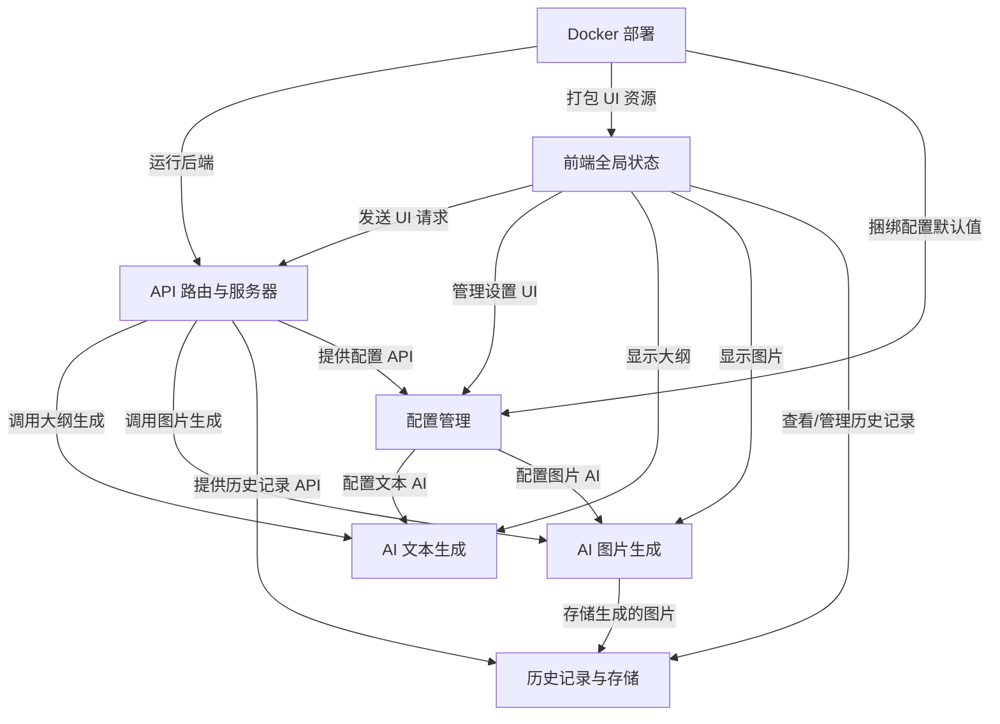
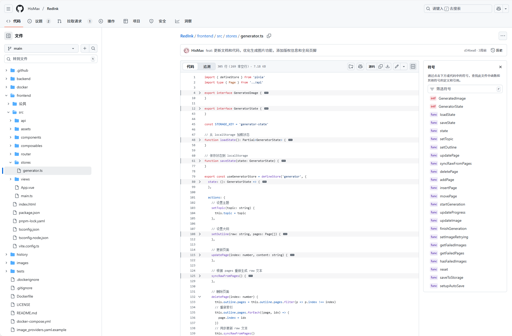
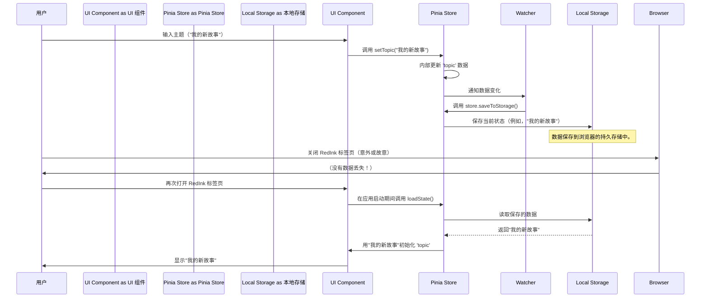

### 序言

这周学了不少底层 都比较抽象 但也很有意思

今天想到回应用层看看了...有种从虚拟到现实的感觉

好处是 看过特别抽象的之后 再看应用层看起来就很清晰很快了

还有一些对于应用层的思考

以这个专栏讲解的网站的盈利模式为例吧

怎么说呢 其实越底层越便宜吧 从低向上的ai生态其实就是一个 中间商不断赚差价的过程Bush (关于这个“自底向上” 之前有随记写到过--[随记]([lvynote/note/随记/1.md at main · lvy010/lvynote](https://github.com/lvy010/lvynote/blob/main/note/随记/1.md)))

em说是底层 也没必要全部手搓 还是一个找平衡的哲学，就像说真要从模型搓起也是不现实的，费时费力主要效果不好 没数据没资源...

所以自己用api key搭应用层是一个比较适合的个体方向，再换句话说 哪怕没有借此赚到差价 也可以减少被别人赚差价doge 其实要是服务做的足够好 这个差价也是有的该赚的。综上，学习可以减少被赚不值的差价，扩展我们看待事物的视角，保持头脑清醒很重要(╹ڡ╹ )

& 最近我做的一个ai demo 感觉也可以尝试接入xhs🤓👆

链接：[红墨 - 小红书图文生成器](https://redink.top/)

# docs：RedInk

RedInk 是一款**基于 AI 的内容生成工具**，专为小红书平台设计

通过接收用户的*主题*和*可选的参考图片*，自动生成*详细的多页大纲*，从而简化内容创作流程。根据大纲，它利用各种 AI 模型为每一页生成*视觉风格一致的图片*。

所有生成的内容，包括大纲和图片，都会被*归档以便轻松访问*，==整个应用程序通过 *Docker 便捷地打包和部署*==。


## 可视化



## 章节

1. [前端全局状态
](01_frontend_global_state_.md)
2. [AI 文本生成
](02_ai_text_generation_.md)
3. [AI 图片生成
](03_ai_image_generation_.md)
4. [历史记录与存储
](04_history_and_storage_.md)
5. [API 路由与服务器
](05_api_routing_and_server_.md)
6. [配置管理
](06_configuration_management_.md)
7. [Docker 部署
](07_docker_deployment_.md)

---

# 第 1 章：前端全局状态

在第一章中，我们将探索一个让应用程序感觉智能且响应迅速的基本概念：**前端全局状态**。

### 想象一下：我们的故事，始终被记住

想象我们正在使用 RedInk 创作一个精彩的故事。我们首先输入创意主题，比如"月球魔法之旅"。然后，RedInk 的 AI 开始工作，为我们的故事生成详细的大纲——可能是章节列表。之后，它开始为大纲的每一页创建精美的图片。

如果在这一切进行中，我们不小心关闭了浏览器标签页怎么办？或者网络突然中断了一秒钟？当我们回时，如果所有进度都消失了，我们会感到崩溃，对吧？我们必须从头开始！

这正是**前端全局状态**所解决的问题。

### 什么是前端全局状态？（应用程序的记忆）

可以把前端全局状态想象成应用程序的中央大脑，或者更像一个超级有条理的**"数字便签"**。用户界面（我们看到并与之交互的部分）需要记住的每一条重要信息都会写在这张便签上。

这张便签保存着我们当前故事创作工作流程从头到尾的所有关键内容：

*   **我们的故事创意（`topic`）：** 它记住"月球魔法之旅"。
*   **AI 的故事计划（`outline`）：** 它跟踪 AI 想出的所有章节和页面细节。
*   **我们所处的位置（`stage`）：** 应用程序是在等待我们的主题吗？它在生成大纲吗？还是正在忙着制作图片？便签知道
*   **图片生成进度（`progress`）：** 它跟踪已完成多少张图片以及还剩多少张
*   **我们生成的图片（`images`）：** 一旦图片准备好，它的 URL 就会被记录下来，这样我们就能看到它

最棒的部分？这张数字便签是**持久化的**

即使我们关闭 RedInk 并稍后再次打开它，它也会准确记住我们离开的地方，因为它会自动保存其内容

### Pinia：我们的便签管理器

RedInk 使用一个名为 **Pinia** 的特殊库来管理这个前端全局状态。Pinia 就像是我们数字便签的专职管理器。它提供了一种结构化的方式来在整个应用程序中一致地存储、访问和更新所有重要信息。

让我们看看 RedInk 如何使用这个记忆来管理我们的故事创作过程。下面的所有代码片段都来自 `frontend/src/stores/generator.ts`，这是我们主要的"故事生成器"便签所在的位置



#### 1. 记住我们的故事创意（`topic`）

当我们首次输入故事创意时，RedInk 使用全局状态来保存它。

```typescript
// frontend/src/stores/generator.ts 
import { defineStore } from 'pinia';

// 想象这是我们的"便签"结构
export interface GeneratorState {
  topic: string; // 我们的故事创意
  // ... 其他数据
}

export const useGeneratorStore = defineStore('generator', {
  state: (): GeneratorState => ({
    topic: '', // 开始时为空
    // ...
  }),
  actions: {
    setTopic(topic: string) {
      this.topic = topic; // 在我们的便签上更新主题
    },
    // ...
  }
});
```

**RedInk 如何使用它：**
在我们输入创意的组件中：

```typescript
// 在 Vue 组件或其他逻辑文件中
import { useGeneratorStore } from '../stores/generator'; // 获取我们的便签管理器
const store = useGeneratorStore(); // 访问便签

// 当我们输入"太空冒险"
store.setTopic("太空冒险");

// 稍后，应用程序的任何部分都可以询问："当前主题是什么？"
console.log(store.topic); // 输出："太空冒险"
```

**发生了什么：** 我们的应用程序现在将"太空冒险"记为我们的故事创意。这个主题可以在不同页面上显示，或被 AI 生成部分使用，始终保持一致。

#### 2. 存储故事大纲（`outline` 和 `pages`）

==在 AI 生成故事结构后，RedInk 保存这个大纲并将其分解为单独的 `pages`==。

```typescript
// frontend/src/stores/generator.ts 
import type { Page } from '../api'; // Page 描述一个章节/内容单元

export interface GeneratorState {
  // ...
  outline: {
    raw: string; // 完整的文本大纲
    pages: Page[]; // 分解为页面的大纲
  };
  stage: 'input' | 'outline' | 'generating' | 'result'; // 当前步骤
}

export const useGeneratorStore = defineStore('generator', {
  state: (): GeneratorState => ({
    // ...
    outline: { raw: '', pages: [] },
    stage: 'input', // 从 'input' 开始
  }),
  actions: {
    // ...
    setOutline(raw: string, pages: Page[]) {
      this.outline.raw = raw;
      this.outline.pages = pages;
      this.stage = 'outline'; // 我们已经移动到 'outline' 步骤
    },
    // ...
  }
});
```

**RedInk 如何使用它：**

```typescript
// 在 AI 完成创建大纲后
import { useGeneratorStore } from '../stores/generator';
// ...
const store = useGeneratorStore();

const aiGeneratedRawText = "第 1 章：初次相遇\n\n<page>\n\n第 2 章：回家之旅...";
const aiGeneratedPages = [
  { index: 0, type: 'cover', content: '史诗故事标题' },
  { index: 1, type: 'content', content: '第 1 章：初次相遇' },
  // ... 更多页面
];

store.setOutline(aiGeneratedRawText, aiGeneratedPages);

// 现在，应用程序知道故事的结构
console.log(store.outline.pages.length); // 输出：2（对于这个例子）
console.log(store.stage);               // 输出："outline"
```

**发生了什么：** 应用程序存储完整的故事计划。`stage` 更新为 'outline'，向用户界面发出信号，是时候显示大纲以供审查或编辑了

#### 3. 跟踪图片生成进度（`stage`、`progress`、`images`）

当需要生成图片时，全局状态成为实时进度跟踪器。

```typescript
// frontend/src/stores/generator.ts 
export interface GeneratedImage {
  index: number;
  url: string;
  status: 'generating' | 'done' | 'error';
}

export interface GeneratorState {
  // ...
  stage: 'input' | 'outline' | 'generating' | 'result';
  progress: {
    current: number; // 已完成多少张图片
    total: number;   // 要制作的总图片数
    status: 'idle' | 'generating' | 'done' | 'error';
  };
  images: GeneratedImage[]; // 生成的图片列表
}

export const useGeneratorStore = defineStore('generator', {
  state: (): GeneratorState => ({
    // ...
    progress: { current: 0, total: 0, status: 'idle' },
    images: [],
  }),
  actions: {
    // ...
    startGeneration() {
      this.stage = 'generating';
      this.progress.current = 0;
      this.progress.total = this.outline.pages.length;
      this.progress.status = 'generating';
      this.images = this.outline.pages.map(page => ({
        index: page.index, url: '', status: 'generating'
      }));
    },
    updateProgress(index: number, status: 'generating' | 'done' | 'error', url?: string) {
      const image = this.images.find(img => img.index === index);
      if (image) {
        image.status = status;
        if (url) image.url = url;
      }
      if (status === 'done') {
        this.progress.current++; // 增加已完成的图片数
      }
    },
    // ...
  }
});
```

**RedInk 如何使用它：**

```typescript
// 在用户审查大纲并点击"生成图片"后
import { useGeneratorStore } from '../stores/generator';
const store = useGeneratorStore();

store.startGeneration();
console.log(store.stage);          // 输出："generating"
console.log(store.progress.status); // 输出："generating"
console.log(store.images.length);   // 输出：（大纲中的页面数）

// 当 AI 服务器发送更新时（例如，图片 0 完成了！）
store.updateProgress(0, 'done', 'https://example.com/image_for_page_0.jpg');
console.log(store.progress.current); // 输出：1

// 如果图片 1 失败了
store.updateProgress(1, 'error');
```

**发生了什么：** 应用程序将其 `stage` 更改为 'generating' 并初始化 `progress` 和 `images` 列表。随着 AI 创建图片（我们将在 [AI 图片生成](03_ai_image_generation_.md) 中介绍），会调用 `updateProgress` 动作，更新每张图片的状态和 URL，并增加 `current` 进度计数。这允许 UI 显示动态进度条。

### 幕后的魔法：自动保存

"数字便签"很棒，但它的"持久化"功能呢？

这是通过浏览器中称为 **Local Storage（本地存储）** 的东西实现的。可以把==本地存储想象成浏览器专门为这个网站保留的一个小型个人记事本==。

#### 工作原理的分步说明

以下是 RedInk 如何确保我们的进度自动保存的简化序列：



#### 自动保存的代码

让我们看看 `frontend/src/stores/generator.ts` 中实现这一功能的关键部分：

1.  **加载状态（`loadState`）**：当 RedInk 首次启动时，它会检查本地存储中是否有任何保存的数据。

    ```typescript
    // frontend/src/stores/generator.ts - loadState 函数
    const STORAGE_KEY = 'generator-state';

    function loadState(): Partial<GeneratorState> {
      try {
        const saved = localStorage.getItem(STORAGE_KEY);
        if (saved) {
          return JSON.parse(saved); // 将保存的文本转换回对象
        }
      } catch (e) {
        console.error('Failed to load state:', e);
      }
      return {}; // 如果没有保存或出错，返回空对象
    }
    ```

    **发生了什么：** 这个函数就像检查"长期记事本"是否有任何现有笔记。如果找到了，它会将其带回应用程序的内存中。

2.  **保存状态（`saveState`）**：每当我们"数字便签"上的重要数据发生变化时，RedInk 就会保存它。

    ```typescript
    // frontend/src/stores/generator.ts - saveState 函数
    function saveState(state: GeneratorState) {
      try {
        // 我们只保存重要的部分，而不是复杂的文件对象
        const toSave = {
          stage: state.stage,
          topic: state.topic,
          outline: state.outline,
          progress: state.progress,
          images: state.images,
          taskId: state.taskId,
          recordId: state.recordId
        };
        localStorage.setItem(STORAGE_KEY, JSON.stringify(toSave)); // 保存为文本
      } catch (e) {
        console.error('Failed to save state:', e);
      }
    }
    ```

    **发生了什么：** 这个函数获取我们"便签"的当前状态，将其==转换为简单的文本格式（JSON），并将其写入浏览器的"长期记事本"==。

3.  **使用 `watch` 自动保存**：为了确保每当我们的数据发生变化时都会自动调用 `saveState`，我们使用 Vue 的 `watch` 功能。

    ```typescript
    // frontend/src/stores/generator.ts - setupAutoSave 函数
    import { watch } from 'vue';
    
    export function setupAutoSave() {
      const store = useGeneratorStore();
    
      // 这会"监视"我们便签中这些特定部分的变化
      watch(
        () => ({
          stage: store.stage,
          topic: store.topic,
          outline: store.outline,
          // ... 以及其他关键数据片段
          images: store.images,
          taskId: store.taskId,
          recordId: store.recordId
        }),
        () => {
          store.saveToStorage(); // 当它们中的任何一个发生变化时，保存所有内容！
        },
        { deep: true } // 这告诉监视器也要查看对象内部的变化
      );
    }
    ```

    **发生了什么：** 这个 `watch` 函数就像一个勤奋的助手。它不断==监控==我们的关键数据点（`stage`、`topic`、`outline` 等）。==一旦检测到变化，它就会自动触发 `store.saveToStorage()`==，确保我们的最新进度始终写入"长期记事本"。这使 RedInk 非常健壮且用户友好。

### 结论

在本章中，我们了解到 RedInk 中的前端全局状态就像应用程序的中央记忆，或者说是由 Pinia 管理的"数字便签"。

它跟踪所有重要内容，从我们最初的主题到生成的图片，甚至记住我们在流程中的位置。

- 由于自动保存到本地存储，我们的工作始终是安全的，即使我们关闭应用程序。

- 这个基础概念确保 RedInk 可靠并提供流畅、一致的体验。

现在我们了解了 RedInk 如何跟踪我们的故事，让我们了解它如何实际生成故事的文本。

[下一章：AI 文本生成](02_ai_text_generation_.md)

