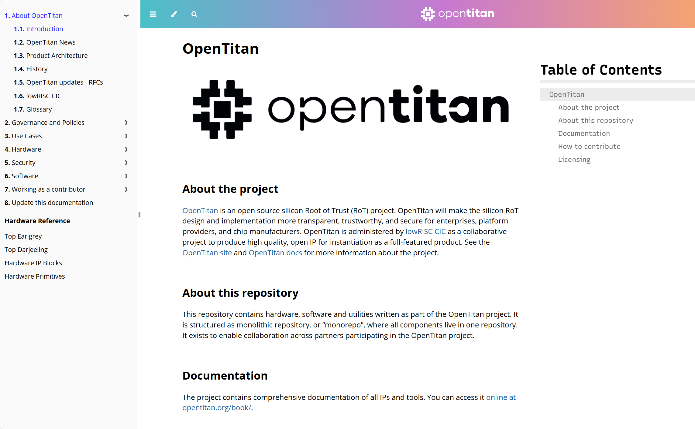
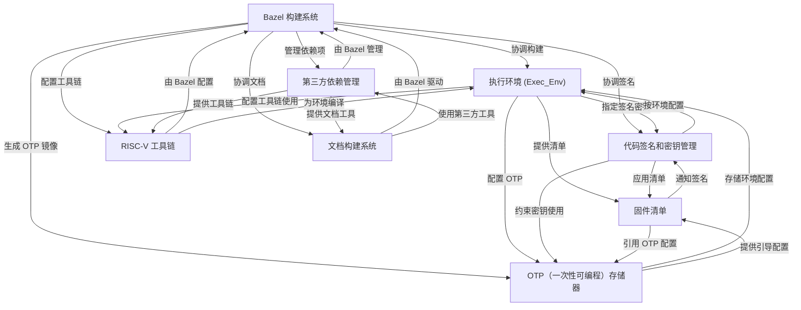

链接：[Introduction - OpenTitan Documentation](https://opentitan.org/book/)

# docs：opentitan

OpenTitan 是一个**开源硬件信任根**项目。它利用 **Bazel 构建系统**来协调所有组件的创建，从*硬件设计*到*软件二进制文件*和*文档*。核心重点是安全性，==采用**代码签名和密钥管理**来确保固件镜像的真实性和完整性==。

为测试和运行 RISC-V 软件定义了各种**执行环境**，管理**第三方依赖项**，并配置片上 **OTP 存储器**以实现关键安全设置。

## 可视化

## 章节

1. [OTP（一次性可编程）存储器
](01_otp__one_time_programmable__memory_.md)
2. [代码签名和密钥管理
](02_code_signing_and_key_management_.md)
3. [Bazel 构建系统
](03_bazel_build_system_.md)
4. [执行环境 (Exec_Env)
](04_execution_environments__exec_env__.md)
5. [固件清单
](05_firmware_manifest_.md)
6. [RISC-V 工具链
](06_risc_v_toolchain_.md)
7. [第三方依赖管理
](07_third_party_dependency_management_.md)
8. [文档构建系统
](08_documentation_build_system_.md)

----

SystemVerilog是一种**硬件描述和验证语言**,在Verilog基础上扩展了面向对象编程、约束随机验证、断言等高级特性

既可以用于数字电路的RTL设计,也可以构建复杂的芯片验证环境,是现代ASIC/FPGA开发的主流语言。