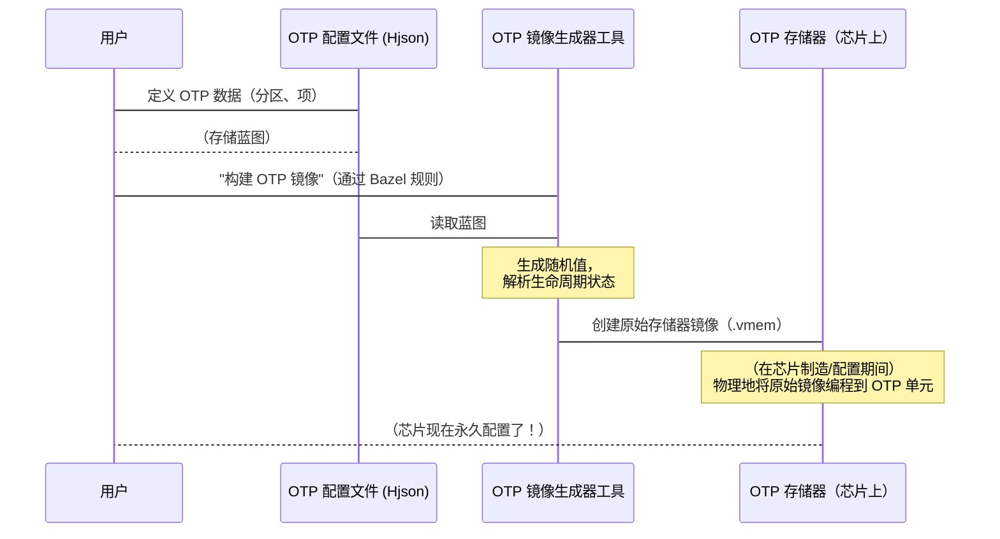

# 第 1 章：OTP（一次性可编程）存储器

欢迎来到 OpenTitan 

我们正在踏上理解如何==构建安全芯片==的旅程，我们的第一站是一个非常重要的概念：OTP 存储器。

想象一下我们正在构建一个超级安全的数字保险箱。这个保险箱需要一个特殊的组合锁，并且组合必须在保险箱制造时设置*一次*，永远不能更改或遗忘，即使保险箱断电也是如此。它就像一个不可磨灭的标记，定义了保险箱的核心身份和运行方式。

在计算机芯片的世界中，我们对关键信息有类似的需求。诸如秘密加密密钥、唯一设备 ID 或芯片的"生命周期阶段"（它还在测试中吗？它准备好交付给客户了吗？）之类的信息必须永久且安全地存储。如果这些数据可以轻易更改或擦除，芯片的整个安全性就会受到损害。

这正是 **OTP（一次性可编程）存储器**所解决的问题。

## 什么是 OTP 存储器？

OTP 存储器是直接内置在 OpenTitan 芯片中的一种特殊存储类型。它的名称告诉我们它最重要的特性：

*   **一次性可编程：**这意味着我们==只能向其写入数据*一次*==。把它想象成用永久性记号笔书写。一旦信息被写入，它就永远存在了。我们无法擦除它，也无法覆盖它。这种"不可变性"（不可更改的特性）正是使其对关键数据如此安全的原因。
*   **存储器：**与其他存储器类型一样，它存储数字信息（位和字节）。
*   **非易失性：**这是一种花哨的说法，意思是即使芯片关闭或断电，它也会记住其数据。与我们计算机中的临时存储器（RAM）不同，后者在关机时会忘记所有内容，OTP 会无限期地保留其秘密。

因此，简单来说，OTP 存储器就像芯片上的数字、不可磨灭的纹身。它用于存储最关键、最基础的信息，这些信息从芯片制造的那一刻起就定义了芯片的身份和安全规则。

### OpenTitan 的 OTP 中存储的关键信息：

| 数据类型             | 为什么存储在 OTP 中                                         | 类比                                         |
| :------------------- | :---------------------------------------------------------- | :------------------------------------------- |
| **加密密钥**         | 用于加密/解密、软件验证的唯一秘密。绝不能更改。             | 数字保险箱的秘密组合。                       |
| **设备生命周期状态** | 定义芯片的安全模式（例如，开发、生产、RMA）。决定芯片行为。 | 产品上的"状态标签"："原型"、"零售"、"退货"。 |
| **安全策略**         | 关于允许的操作、引导行为等的规则。基础安全规则。            | 保险箱不可更改的操作手册。                   |

## OpenTitan 如何使用 OTP：一个简单的用例

让我们考虑一个实际例子：当 OpenTitan 芯片制造时，它需要"诞生"时就具有唯一的身份和初始安全状态。我们将使用 OTP 来：

1.  **存储唯一的设备标识符（ID）。**==每个芯片都有一个序列号==。
2.  **存储主根密钥。**这是芯片信任的用于其最基本安全操作的终极秘密密钥。
3.  **设置其初始生命周期状态。**例如，最初将其标记为 `DEV`（开发）芯片。

这个过程确保每个芯片都以一个安全的基础开始，以后无法被篡改。

## 使用配置文件描述 OTP 数据

在 OpenTitan 中，我们不会在日常代码中直接"写入"OTP 存储器。相反，我们使用特殊的配置文件来描述*应该*放入 OTP 的内容。把这些想象成 OTP 存储器的蓝图。然后这些蓝图由工具处理，以创建实际编程到芯片上的数据镜像。

让我们看看如何使用 Bazel 规则定义这些蓝图，Bazel 规则是 OpenTitan 的构建系统命令。（如果 Bazel 对我们来说是新的，不用担心；我们将在[第 3 章：Bazel 构建系统](03_bazel_build_system_.md)中介绍它）。现在，只需理解这些就像准备 OTP 数据的指令。

定义 OTP 数据的关键部分是将其组织成"分区"。分区就像 OTP 存储器中的部分或文件夹，每个部分都保存相关的信息片段。例如，我们可能有一个"设备身份"分区或一个"安全密钥"分区。

以下是 OpenTitan 中如何定义分区的简化视图：

```python
# 来自：rules/otp.bzl

def otp_partition(name, **kwargs):
    partition = {
        "name": name,
    }
    partition.update(kwargs)
    return json.encode(partition)
```
**解释：**
`otp_partition` 函数是 OpenTitan 的 Bazel 规则中的一个辅助函数。它创建一小段 JSON（一种常见的数据格式），描述 OTP 存储器的一个部分（分区）。我们给它一个 `name`（如"设备身份"），然后作为 `kwargs`（关键字参数）提供有关该分区的其他详细信息。`json.encode` 部分只是将其转换为可以轻松处理的文本字符串。

一旦我们定义了一个或多个分区，我们就使用另一个名为 `otp_json` 的 Bazel 规则来收集它们并创建一个单一的 Hjson 配置文件。这个文件是 OTP 存储器的完整蓝图。

```python
# 来自：rules/otp.bzl

# ... 在 Bazel 构建文件中 ...

otp_json(
    name = "example_otp_json",
    partitions = [
        otp_partition(
            name = "DeviceIdentity",
            lock = True, # 此分区在编程后将被锁定
            items = {
                "DEVICE_ID": "<random>", # 生成随机唯一 ID
                "MASTER_ROOT_KEY": "<random_seed>", # 主密钥的种子
            }
        ),
        otp_partition(
            name = "LifecycleState",
            lock = True,
            items = {
                "LC_STATE": "DEV", # 将初始生命周期状态设置为开发
            }
        ),
    ],
)
```
**解释：**
这个 `otp_json` 规则要求 OpenTitan 的构建系统创建一个名为 `example_otp_json.json` 的 OTP 配置文件。

*   它包括两个分区："DeviceIdentity"和"LifecycleState"。
*   两者都标记为 `lock = True`，意味着一旦编程，它们的内容就无法更改。
*   "DeviceIdentity"分区有两个 `items`：`DEVICE_ID` 和 `MASTER_ROOT_KEY`。`<random>` 和 `<random_seed>` 值是 OTP 生成工具创建唯一随机数据的特殊指令。
*   "LifecycleState"分区有一个项 `LC_STATE` 设置为"DEV"。

这个 `otp_json` 规则的输出将是一个类似 `example_otp_json.json` 的文件，看起来像这样

```json
{
  "partitions": [
    {
      "name": "DeviceIdentity",
      "lock": true,
      "items": [
        {"name": "DEVICE_ID", "value": "some_random_hex_value"},
        {"name": "MASTER_ROOT_KEY", "value": "another_random_hex_value"}
      ]
    },
    {
      "name": "LifecycleState",
      "lock": true,
      "items": [
        {"name": "LC_STATE", "value": "DEV_STATE_ENUM"}
      ]
    }
  ]
}
```
**输出解释：**
这个 JSON 文件是"蓝图"。它还不包含实际的随机值，但它清楚地描述了应该生成什么数据以及它应该放在 OTP 存储器的什么位置。`DEV_STATE_ENUM` 将是表示 `DEV` 生命周期状态的特定数值。

## 从蓝图到芯片：OTP 镜像生成过程

一旦我们有了 OTP 配置蓝图（`.json` 文件），下一步就是将其转换为可以编程到硅芯片上的物理存储器镜像。OpenTitan 为此使用专用工具。



**过程解释：**

1.  **用户定义 OTP 数据：**我们作为设计师或开发人员，使用 `otp_partition` 和 `otp_json` 规则在 Bazel 构建文件中指定必要的 OTP 数据。这会创建 Hjson 配置文件。
2.  **生成 OTP 镜像工具：**OpenTitan 有一个工具 `gen-otp-img`，它将此 Hjson 配置文件作为输入。
3.  **创建原始存储器镜像：**`gen-otp-img` 工具读取配置，生成任何所需的随机值（如加密密钥），将人类可读的状态（如"DEV"）转换为数值，然后生成原始存储器镜像文件（例如，`.vmem` 文件）。这个 `.vmem` 文件包含需要"烧录"到物理 OTP 单元中的精确位模式。
4.  **物理编程：**在芯片制造或特殊配置步骤期间，专用硬件使用此 `.vmem` 文件永久编程硅芯片上的 OTP 存储器。这就是"一次性"编程操作。

整个过程由另一个名为 `otp_image` 的 Bazel 规则管理：

```python
# 来自：rules/otp.bzl

# ... 在 Bazel 构建文件中 ...

otp_image(
    name = "my_chip_otp_image",
    src = ":example_otp_json", # 我们之前的蓝图
    lc_state_def = "//hw/ip/lc_ctrl/data:lc_ctrl_state.hjson",
    mmap_def = "//hw/top:top_otp_map",
)
```
**解释：**
`otp_image` 规则告诉 Bazel 使用 `gen-otp-img` 工具（由 `_tool` 属性指定，默认为 `//util/design:gen-otp-img`）。
*   `name = "my_chip_otp_image"`：这将是最终存储器镜像文件的名称（例如，`my_chip_otp_image.24.vmem`）。
*   `src = ":example_otp_json"`：这指向我们之前生成的 OTP 配置文件（蓝图）。
*   `lc_state_def` 和 `mmap_def`：这些是其他配置文件，告诉工具有关芯片生命周期状态和 OTP 硬件布局（存储器映射）的信息。它们对于工具正确理解和放置数据至关重要。

这个 `otp_image` 规则的输出将是一个 `.vmem` 文件，这是准备编程到物理 OTP 存储器中的最终数据。

## 为什么这对 OpenTitan 很重要？

OpenTitan 的核心是"硅信任根"，这意味着其安全性从硬件本身开始。OTP 存储器对这一目标至关重要，因为它允许 OpenTitan：

*   **建立身份：**每个芯片都可以有一个唯一的、不可更改的身份。
*   **执行安全策略：**关键的安全规则和生命周期状态被永久设置，使芯片能够抵抗篡改。
*   **存储秘密：**对于安全引导、数据加密和设备认证至关重要的加密密钥可以安全存储，因为我们知道它们不会因为简单地关闭芯片而被窃取。

## 结论

在本章中，我们探讨了 OTP（一次性可编程）存储器，了解到它是 OpenTitan 中用于在芯片上安全存储不可变（不可更改）数据的关键组件。

- 我们看到它如何像数字、不可磨灭的纹身一样工作，保存着诸如加密密钥和设备生命周期状态等重要信息。
- 我们还了解到，我们使用 OpenTitan 构建系统中的专用工具处理的配置文件来定义放入 OTP 的内容。

理解 OTP 是掌握 OpenTitan 如何建立其基于硬件的安全基础的关键。在下一章中，我们将探讨另一个关键的安全概念：==如何使用**代码签名和密钥管理**来验证 OpenTitan 上的软件是可信的==。这个过程严重依赖于我们讨论过的存储在 OTP 中的安全密钥

[下一章：代码签名和密钥管理](02_code_signing_and_key_management_.md)

