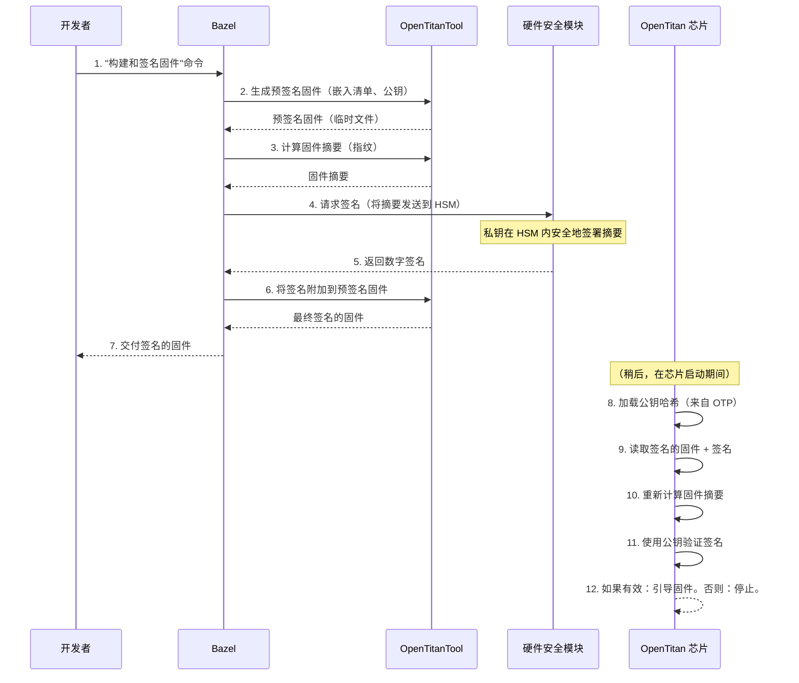

# 第 2 章：代码签名和密钥管理

欢迎回来

相关前文传送：[[Linux#60][HTTPS] 加密 | 数字指纹 | 详解HTTPS工作方案 | CA认证](https://lvynote.blog.csdn.net/article/details/142642574)

在[第 1 章：OTP（一次性可编程）存储器](01_otp__one_time_programmable__memory_.md)中，我们了解了 OpenTitan 如何使用特殊的一次性可编程存储器来存储重要的、不可更改的信息，如加密密钥和芯片的生命周期状态。这些永久存储的秘密构成了 OpenTitan 安全性的基石。

现在，想象一下我们有了带有秘密组合锁（OTP 中的密钥）的安全芯片。如果有人可以欺骗它运行恶意软件，那么安全的保险箱有什么用呢？我们如何确保我们的 OpenTitan 芯片运行的软件或"固件"确实来自可信来源，并且没有被攻击者秘密更改？

这就是**代码签名和密钥管理**发挥作用的地方。这就像为芯片上运行的所有软件配备数字公证人，确保其真实性和完整性。

## 代码签名解决什么问题？

把固件想象成我们 OpenTitan 芯片的操作指令。如果攻击者可以用他们自己的指令替换这些指令，他们就可以完全控制芯片，即使它具有强大的硬件安全功能。代码签名是防止这种情况的解决方案。

核心思想是验证：
1.  **真实性**：固件确实来自原始的、可信的开发者（例如，OpenTitan 项目）。
2.  **完整性**：固件自签名以来没有被篡改或损坏。

## 数字公证人：代码签名如何工作

代码签名使用一种称为**数字签名**的技术，它依赖于一对特殊的加密密钥：**私钥**和**公钥**。

### 加密密钥：我们的数字蜡封

想象一下我们有一个只有我们拥有的独特蜡封印章。我们使用这个印章在重要文件上盖上我们的官方印记。任何人都可以看到我们的印记，因为它是独特的，他们知道文件来自我们并且没有被更改（因为假印记会很明显）。

在数字世界中：

*   **私钥**：这就像我们秘密的、独特的蜡封印章。只有可信实体（例如，OpenTitan 项目或芯片制造商）才能访问此密钥。它用于为固件**创建**数字签名。它*必须*保持极其安全。
*   **公钥**：这就像一个参考指南，帮助任何人识别我们独特的蜡封印记。它可以广泛共享。OpenTitan 芯片本身知道这个公钥（通常安全地存储在 [OTP 存储器](01_otp__one_time_programmable__memory_.md)中）。芯片使用这个公钥来**验证**固件上的数字签名。

**魔法：**如果一段固件的签名可以用公钥成功验证，芯片就知道它*必须*是由相应的私钥签名的。这保证了真实性和完整性。

## 密钥管理：保护我们的秘密印章

由于私钥如此强大（拥有它的人可以签署可信固件），因此保持其安全至关重要。这就是**密钥管理**发挥作用的地方。

实践中有两种主要的密钥管理方式：

| 密钥存储方法            | 描述                                                 | 用例                                           | 安全级别 | 类比                             |
| :---------------------- | :--------------------------------------------------- | :--------------------------------------------- | :------- | :------------------------------- |
| **本地文件**            | 私钥作为文件存储在开发者的计算机上。                 | 开发、测试、模拟，其中高安全性不是最重要的。   | 较低     | 我们桌子上的保险箱。             |
| **硬件安全模块（HSM）** | 专用的、防篡改的物理设备，旨在安全地存储和使用私钥。 | 生产签名、关键安全操作。密钥永远不会离开 HSM。 | 最高     | 用于我们蜡封印章的高安全性金库。 |

对于生产中的 OpenTitan 芯片，私钥*始终*存储在 HSM 中。这可以防止密钥被盗或滥用，因为 HSM 在内部执行签名操作，而不会将私钥暴露给外部世界。

## OpenTitan 的安全引导用例：固件验证

代码签名在 OpenTitan 中最关键的应用之一是**安全引导**。这确保了在芯片上运行的第一批软件（如 ROM_EXT 固件）在执行之前是可信的。

以下是其工作原理的简化概述：

1.  **固件开发**：开发人员为 OpenTitan 芯片编写和编译固件。
2.  **预签名**：工具通过嵌入清单（有关固件的信息）和将用于验证的公钥来准备固件。
3.  **摘要生成**：计算预签名固件的唯一"指纹"（称为摘要）。此摘要是整个固件的小型、固定大小的表示。
4.  **签名仪式**：摘要被发送到安全签名环境（通常涉及 HSM）。HSM 内的私钥签署此摘要，生成数字签名。
5.  **签名附加**：数字签名附加到固件。
6.  **片上验证**：当 OpenTitan 芯片启动时，它读取签名的固件。它提取清单、嵌入的公钥和签名。然后它重新计算固件的摘要，并使用公钥验证附加的签名与此摘要的匹配。
7.  **信任决策**：
    *   如果签名有效，芯片信任固件并继续执行它。
    *   如果签名无效，芯片检测到篡改或不可信来源并停止，防止恶意固件运行。

整个过程确保只有经过身份验证且未被篡改的固件才能在 OpenTitan 芯片上运行，从硬件向上建立强大的"信任根"。

## 理解 OpenTitan 签名过程

让我们看看 OpenTitan 如何使用其构建系统 Bazel（我们将在[第 3 章：Bazel 构建系统](03_bazel_build_system_.md)中探讨）管理代码签名。

### 1. 定义签名工具

OpenTitan 定义了不同的"签名工具"，指定*如何*生成签名——在本地或通过与 HSM 交互。

以下是 OpenTitan 配置中的一个示例，定义了本地签名工具和基于 HSM 的签名工具：

```python
# 来自：signing/tokens/BUILD

load("//rules:signing.bzl", "signing_tool")

# 这定义了一个使用本地文件作为密钥的签名工具。
signing_tool(
    name = "local",
    location = "local", # 密钥存储在本地
    tool = "//sw/host/opentitantool", # 用于签名的工具
)

# 这定义了一个使用 Nitrokey（一种 HSM 类型）的签名工具。
signing_tool(
    name = "nitrokey",
    # ... 连接到 Nitrokey 的其他配置 ...
    location = "token", # 密钥存储在安全令牌（HSM）中
    tool = "//sw/host/hsmtool", # 与 HSM 交互的工具
)
```
**解释：**
`signing_tool` 规则创建签名方法的定义。
*   `name`：此签名方法的唯一标识符（例如，`local`、`nitrokey`）。
*   `location`：指示私钥存储的位置（文件为 `local`，HSM 为 `token`）。
*   `tool`：指定 OpenTitan 使用哪个可执行文件来执行签名操作。`opentitantool` 可以处理本地签名，而 `hsmtool` 用于 HSM。

### 2. 准备固件进行签名

在签名之前，需要准备固件二进制文件。这涉及将"清单"（有关镜像的元数据）和*公钥*嵌入到二进制文件中，然后计算整个准备好的包的加密"摘要"（简短、唯一的指纹）。这个摘要是实际将被签名的内容。

```python
# 来自 rules/signing.bzl（_presigning_artifacts 函数）的简化代码片段

def _presigning_artifacts(ctx, opentitantool, src, manifest, ecdsa_key, rsa_key, spx_key, ...):
    # ...（省略初始设置）...

    # 1. 使用清单和公钥更新固件二进制文件
    pre = ctx.actions.declare_file("{}.pre-signing".format(basename))
    ctx.actions.run(
        outputs = [pre],
        inputs = [src, manifest, ecdsa_key.file], # 简化的输入
        arguments = [
            "image", "manifest", "update",
            "--manifest={}".format(manifest.path),
            "--ecdsa-key={}".format(ecdsa_key.file.path),
            "--output={}".format(pre.path),
            src.path,
        ],
        executable = opentitantool,
        mnemonic = "PreSigningArtifacts",
    )

    # 2. 计算预签名二进制文件的摘要（指纹）
    digest = ctx.actions.declare_file("{}.digest".format(basename))
    ctx.actions.run(
        outputs = [digest],
        inputs = [pre],
        arguments = [
            "image", "digest",
            "--bin={}".format(digest.path),
            pre.path,
        ],
        executable = opentitantool,
        mnemonic = "PreSigningDigest",
    )
    return struct(pre = pre, digest = digest, ...)
```
**解释：**
这段代码片段显示了两个关键步骤：
1.  **`image manifest update`**：`opentitantool` 获取原始固件（`src`）、`manifest` 文件（描述固件）和 `ecdsa_key`（公钥）以生成 `pre-signing` 二进制文件。这个二进制文件现在准备好获取其"指纹"。
2.  **`image digest`**：然后 `opentitantool` 获取这个 `pre-signing` 二进制文件并计算 `digest`（其唯一指纹）。这个 `digest` 是实际将由私钥加密签名的数据。

### 3. 执行签名

一旦生成摘要，它就会被发送到选定的签名工具（可能是 HSM）以使用私钥创建签名。

```python
# 来自 rules/signing.bzl（_hsmtool_sign 函数）的简化代码片段

def _hsmtool_sign(ctx, tool, digest, ecdsa_key, ..., profile = None):
    # ...（错误检查和设置）...

    sig = ctx.actions.declare_file(paths.replace_extension(digest.basename, ".ecdsa-sig"))
    
    ctx.actions.run(
        outputs = [sig],
        inputs = [digest, tool.tool] + tool.data, # 摘要和 hsmtool
        arguments = [
            "--profile={}".format(profile), # 使用哪个特定的密钥配置文件
            "ecdsa", "sign",
            "--label={}".format(ecdsa_key.name), # HSM 中密钥的标签
            "--output={}".format(sig.path),
            digest.path, # 要签名的摘要
        ],
        executable = tool.tool, # hsmtool 二进制文件
        execution_requirements = {"no-sandbox": ""}, # 允许与外部 HSM 交互
        env = tool.env,
        mnemonic = "HsmtoolEcdsaSign",
    )
    return sig, None, None # 返回 ECDSA 签名文件
```
**解释：**
这个代码片段显示了如何使用 `hsmtool` 签署摘要：
*   它将 `digest` 文件（固件的指纹）作为输入。
*   它使用 `profile`（指向 HSM 中的特定密钥）和密钥的 `label`。
*   `hsmtool` 与 HSM 通信，HSM 使用其私钥安全地签署摘要。
*   输出是 `sig`，数字签名文件。关键是，私钥永远不会离开 HSM。

### 4. 附加签名

最后，生成的数字签名被附加到预签名的固件二进制文件，以创建完整的、签名的固件镜像。

```python
# 来自 rules/signing.bzl（_post_signing_attach 函数）的简化代码片段

def _post_signing_attach(ctx, opentitantool, pre, ecdsa_sig, rsa_sig, spx_sig):
    # ...（错误检查和设置）...

    signed = ctx.actions.declare_file(paths.replace_extension(pre.basename, ".signed.bin"))
    inputs = [pre]

    args = [
        "image", "manifest", "update",
        "--output={}".format(signed.path),
        pre.path,
    ]

    if ecdsa_sig:
        inputs.append(ecdsa_sig)
        args.append("--ecdsa-signature={}".format(ecdsa_sig.path))

    # ...（如果存在，添加 RSA 和 SPX 签名）...

    ctx.actions.run(
        outputs = [signed],
        inputs = inputs,
        arguments = args,
        executable = opentitantool,
        mnemonic = "PostSigningAttach",
    )
    return signed
```
**解释：**
这个代码片段使用 `opentitantool` 来：
*   获取 `pre`（预签名固件）和 `ecdsa_sig`（数字签名）。
*   将它们组合以生成 `signed` 固件二进制文件。这是最终的、可验证的固件镜像。

### OpenTitan 中的流程

从开发者的角度到芯片验证固件的完整过程：



### 真实签名仪式日志的示例

OpenTitan 项目非常重视安全性，关键固件更新要经过正式的"签名仪式"。这是一个记录在案的过程，多个可信个人验证固件并使用高度安全的 HSM 对其进行签名。

以下是真实签名仪式日志的一小部分，显示了使用 `hsmtool` 与 HSM 的情况：

```
# 来自：signing/logs/2024-01-18.md

# ...（省略 HSM 的设置和身份验证）...

## 签名

# ProdC 签名
$ mkdir prodc
$ cd prodc
$ tar xvf ../prodc.tar # 提取固件摘要
$ ../hsmtool -t earlgrey_a0 -u user exec presigning.json
[
  {
    "command": "rsa-sign",
    "result": {
      "success": true
    }
  },
  # ...（更多签名）...
]
```
**解释：**
这个日志片段说明了：
*   使用 `hsmtool` 命令，针对特定的 HSM 令牌（`-t earlgrey_a0`）和用户配置文件（`-u user`）。
*   它执行 `presigning.json` 文件，其中包含 HSM 关于*什么*摘要要签名以及*哪些*密钥要使用的指令。
*   输出显示 HSM 成功执行了 `rsa-sign` 命令。这意味着关键固件摘要收到了它们的官方数字签名。

这个精心设计的过程和 HSM 的使用是 OpenTitan 旨在实现的"硅信任根"的基础。它确保在硬件上运行的软件与硬件本身一样值得信赖。

## 结论

在本章中，我们探讨了代码签名和密钥管理的关键概念。我们了解了数字签名如何使用私钥和公钥对，充当数字公证人来保证固件的真实性和完整性。我们还理解了安全管理私钥的重要性，特别是通过硬件安全模块（HSM）用于生产 OpenTitan 芯片。最后，我们看到了 OpenTitan 如何将这些概念集成到其构建系统中，以实现安全引导过程，确保只有可信软件在芯片上运行。

软件的这个安全基础与 OpenTitan 如何构建和管理其代码深深交织在一起。在下一章中，我们将==探讨 **Bazel 构建系统**，这是 OpenTitan 用来管理其所有组件的强大工具==，包括我们刚刚讨论的代码签名流程。

[下一章：Bazel 构建系统](03_bazel_build_system_.md)

