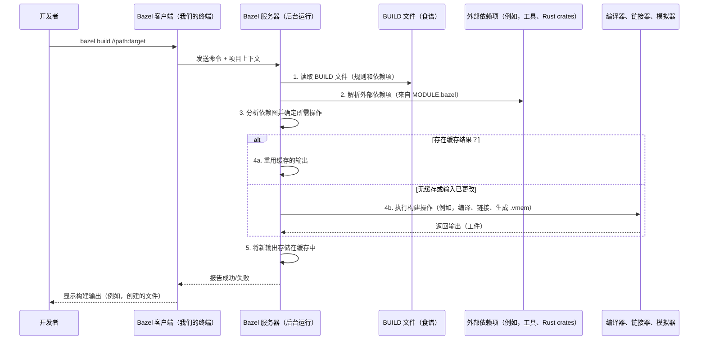

# 第 3 章：Bazel 构建系统

欢迎回来

在上一章[第 2 章：代码签名和密钥管理](02_code_signing_and_key_management_.md)中，我们探讨了 OpenTitan 如何使用数字签名来确保固件的真实性和完整性，以及如何安全地管理重要的加密密钥。这些关键的安全措施被集成到芯片的开发中，但 OpenTitan 如何管理构建如此复杂的系统——包括其硬件设计、软件，甚至文档——同时确保这些安全步骤得到正确应用？

这就是 **Bazel 构建系统**发挥作用的地方。==把 Bazel 想象成整个 OpenTitan 项目的主协调者==，或者是一位高效的主厨。它确保每一个组件，从最小的软件片段到完整的硬件设计，都能正确、高效地构建，并应用所有必要的安全措施，就像主厨精确地遵循食谱和烹饪步骤来制作完美的餐点一样。

## Bazel 在 OpenTitan 中解决什么问题？

构建像 OpenTitan 这样的安全芯片是一项极其复杂的工作。它涉及许多不同类型的组件，用各种编程语言编写（C、C++、Rust、Python、Verilog、SystemVerilog 等），并针对不同的环境（模拟器、FPGA 板、实际硅片）。

如果没有智能系统，试图构建所有这些部分将是一场噩梦：
*   **"这个软件需要哪些文件？"**
*   **"如果我更改这个硬件模块，需要重新编译什么软件？"**
*   **"如何确保固件在放入芯片之前使用正确的密钥签名？"**
*   **"如何在不同的开发者机器和持续集成（CI）系统中一致地构建完全相同的东西？"**

> Bazel 提供一种**封闭的、可重现的、高效的**方式来定义和执行构建过程来回答这些问题。

## 核心思想：食谱和配料

从本质上讲，Bazel 的工作方式就像一本食谱书。

*   **我们的项目（厨房）：**这是我们整个 OpenTitan 代码库，从根目录开始。Bazel 称之为**工作空间**。
*   **BUILD 文件（食谱书）：**在我们的 OpenTitan 项目中散布着名为 `BUILD`（或 `BUILD.bazel`）的特殊文件。这些文件是项目特定部分的"食谱书"。它们告诉 Bazel 在该目录中可以构建*什么*。
*   **目标（菜肴或配料）：**在 `BUILD` 文件中，我们定义**目标**。目标是 Bazel 可以构建的东西。它可以是：
    *   一个软件应用程序（`cc_binary`、`opentitan_binary`）
    *   一个库（`cc_library`）
    *   一个测试（`opentitan_test`）
    *   一组文件（`filegroup`）
    *   甚至硬件设计
*   **依赖项（所需配料）：**每个目标指定其**依赖项**——它需要构建的其他目标或文件。Bazel 自动理解这个"依赖图"。如果食谱 A 需要配料 B，而配料 B 需要配料 C，==Bazel 知道要先制作 C，然后是 B，然后是 A==。

这个系统确保 Bazel 只重建必要的内容，从而实现更快的构建，并保证每次构建都是一致的。

### 为什么 OpenTitan 选择 Bazel：

| 特性         | 描述                                                         | OpenTitan 的好处                                             |
| :----------- | :----------------------------------------------------------- | :----------------------------------------------------------- |
| **封闭性**   | 构建是隔离的，只使用明确声明的输入。相同的输入总是产生相同的输出。 | 确保在所有机器上可重现的构建，对安全认证至关重要。           |
| **可重现性** | 每次构建，给定相同的源代码和构建环境，都会产生相同的结果。   | 对验证芯片安全性至关重要；消除"在我的机器上可以运行"的问题。 |
| **可扩展性** | 设计用于处理包含数百万行代码和数千个目标的超大型代码库。     | 高效管理 OpenTitan 的广泛硬件和软件组件。                    |
| **并行性**   | 自动确定构建的哪些部分可以同时运行并并行执行它们。           | 加快构建时间，特别是在强大的开发机器和 CI 服务器上。         |
| **缓存**     | 缓存构建结果。如果组件没有更改，Bazel 会重用其先前的输出。   | 大幅减少开发者的重建时间。                                   |
| **多语言**   | 开箱即用地支持多种编程语言和构建步骤。                       | 非常适合 OpenTitan 的 C/C++、Rust、Python、Verilog、SystemVerilog、文档的混合。 |

## 我们的第一个 Bazel 命令：构建固件

让我们通过构建一个简单的固件来将其付诸实践。在 OpenTitan 中，固件和测试通常使用专门的 Bazel 规则定义，如 `opentitan_binary` 和 `opentitan_test`。这些规则封装了 OpenTitan 所需的所有复杂步骤（如处理工具链、内存映射，甚至[代码签名](02_code_signing_and_key_management_.md)）。

我们的目标：为 Earlgrey 芯片的 DV（设计验证）模拟环境构建 `test_rom` 固件。

```python
# 来自：sw/device/lib/testing/test_rom/BUILD.bazel

load("//rules/opentitan:defs.bzl", "opentitan_binary", "opentitan_test")

opentitan_binary(
    name = "test_rom",
    srcs = ["test_rom.c"],
    exec_env = [
        "//hw/top_earlgrey:sim_dv", # 设计验证模拟的目标
    ],
    deps = [
        "//sw/device/lib/base:mmio",
        "//sw/device/lib/runtime:ibex",
        # ... 许多其他依赖项 ...
    ],
)
```
**解释：**
这个 `BUILD.bazel` 文件定义了一个名为 `test_rom` 的 `opentitan_binary` 目标。
*   `name = "test_rom"`：这是此 `BUILD.bazel` 文件中目标的特定名称。
*   `srcs = ["test_rom.c"]`：这些是构成此固件的 C 源文件。
*   `exec_env = ["//hw/top_earlgrey:sim_dv"]`：这是 OpenTitan 的关键部分。它告诉 Bazel 应该为*哪个环境*构建此二进制文件。`sim_dv` 指的是 `earlgrey` 芯片的设计验证模拟环境。（我们将在[第 4 章：执行环境 (Exec_Env)](04_execution_environments__exec_env__.md) 中深入探讨）。
*   `deps = [...]`：这些是 `test_rom.c` 依赖的其他 OpenTitan 库或组件。Bazel 将确保首先构建这些。

要构建它，我们在 OpenTitan 工作空间根目录中打开终端并输入：

```bash
bazel build //sw/device/lib/testing/test_rom:test_rom_sim_dv
```

*   `bazel build`：告诉 Bazel 构建某些东西的命令。
*   `//sw/device/lib/testing/test_rom`：这是**包路径**——它告诉 Bazel `BUILD.bazel` 文件在哪个目录中。
*   `:test_rom_sim_dv`：这是**目标名称**。注意 `test_rom` 如何与 `sim_dv`（来自 `exec_env`）结合以创建特定的输出目标名称。这个最终名称指的是专门为 `sim_dv` 环境构建的固件。

运行此命令后，Bazel 将：
1.  **解析** `BUILD.bazel` 文件。
2.  **分析**依赖项。
3.  **编译** `test_rom.c` 及其所有依赖项以用于 RISC-V 架构。
4.  **链接**所有内容到可执行的 ELF（可执行和可链接格式）文件。
5.  **转换** ELF 为模拟所需的其他格式（例如，用于 Verilator/DV 的 `.vmem` 文件）。

我们将在特殊的 Bazel 输出目录中找到输出文件（ELF、`.vmem`、反汇编等），通常是 `bazel-bin/sw/device/lib/testing/test_rom/`。

## Bazel 的核心工作流程：幕后

当我们输入 `bazel build` 命令时，幕后会发生很多事情。



**过程解释：**

1.  **请求：**我们告诉 Bazel 客户端（我们的终端）要构建什么。
2.  **分析：**Bazel 服务器（一个保持活动以提高速度的后台进程）读取我们项目的 `BUILD` 文件和 `MODULE.bazel` 文件（指定外部依赖项，如 Rust crates 或 C++ 库）。它构建所有目标及其依赖项的完整图。
3.  **操作规划：**Bazel 计算出生成最终输出所需的确切步骤（称为"操作"）。这可能涉及编译 C 代码、链接、运行自定义脚本或转换文件。
4.  **执行：**Bazel 执行这些操作，通常是并行的。关键是，在运行操作之前，Bazel 会检查是否已经从完全相同的输入在其缓存中构建了相同的输出。如果是，它会重用缓存的结果，节省大量时间。如果不是，它会运行必要的工具（编译器、链接器、自定义脚本）。
5.  **缓存和输出：**操作完成后，Bazel 将其输出存储在缓存中以供将来使用，并使最终请求的工件在我们工作空间的 `bazel-bin` 目录中可用。

### OpenTitan 如何使用 Bazel 规则定义其构建系统

OpenTitan 使用自己的自定义规则扩展了 Bazel 的功能，这些规则用一种称为 Starlark 的语言（Python 的一种方言）编写。这允许 OpenTitan 专门为安全硬件开发定制构建过程。

让我们看看如何完成此操作的简化代码片段：

#### 1. 工作空间根：`MODULE.bazel`

OpenTitan 项目根目录的 `MODULE.bazel` 文件声明外部依赖项并设置整体构建环境。

```python
# 来自：MODULE.bazel

module(name = "lowrisc_opentitan") # 定义我们项目的名称

# 声明 OpenTitan 所需的外部依赖项
bazel_dep(name = "bazel_skylib", version = "1.7.1")
bazel_dep(name = "rules_cc", version = "0.1.2")
bazel_dep(name = "rules_python", version = "1.2.0")
# ... 更多依赖项 ...

# 注册工具链（例如，用于 C/C++ 编译）
register_toolchains("//rules/opentitan:localtools")
register_toolchains("//toolchain:cc_toolchain_opentitan")
```
**解释：**
*   `module(name = "lowrisc_opentitan")`：为我们的项目提供唯一名称。
*   `bazel_dep(...)`：指定 OpenTitan 依赖的其他 Bazel 模块（如用于 C/C++ 构建的 `rules_cc` 或用于 Python 构建的 `rules_python`）及其版本。Bazel 会自动从互联网获取这些。
*   `register_toolchains(...)`：这告诉 Bazel 在哪里找到它需要的特定编译器、链接器和其他工具，用于不同的语言或架构。例如，`//toolchain:cc_toolchain_opentitan` 是 OpenTitan 定义其 RISC-V C/C++ 编译器的地方。

#### 2. 定义 OpenTitan 特定的构建规则：`rules/opentitan/defs.bzl`

此文件包含定义我们之前看到的 `opentitan_binary` 和 `opentitan_test` 规则的 Starlark 宏和函数。这些是 Bazel 原生 `cc_binary` 和 `cc_test` 规则的包装器，添加了 OpenTitan 特定的逻辑。

```python
# 来自：rules/opentitan/defs.bzl（简化版）

load("@lowrisc_opentitan//rules/opentitan:cc.bzl", "_opentitan_binary") # 加载实际实现

def opentitan_binary(name, exec_env, **kwargs):
    # 此宏根据活动的 top（例如，'earlgrey'）过滤 'exec_env'
    # 然后调用内部 _opentitan_binary 规则。
    _opentitan_binary(
        name = name,
        exec_env = opentitan_select_top(select_map, []), # 动态选择 exec_envs
        **kwargs
    )
```
**解释：**
这里的 `opentitan_binary` 实际上是一个"宏"，它预处理其输入（如根据当前硬件配置选择正确的 `exec_env`），然后调用内部规则 `_opentitan_binary`，后者执行实际的繁重工作。这允许 OpenTitan 以灵活的方式定义适应不同硬件的二进制文件。

#### 3. 底层实现：`rules/opentitan/cc.bzl`

`_opentitan_binary` 规则的实现是 OpenTitan 的 C/C++ 二进制文件的实际编译和链接发生的地方，以及集成诸如[代码签名](02_code_signing_and_key_management_.md)之类的步骤。

```python
# 来自：rules/opentitan/cc.bzl（高度简化）

load("@rules_cc//cc:find_cc_toolchain.bzl", "find_cc_toolchain")
load("@lowrisc_opentitan//rules:signing.bzl", "sign_binary") # 用于代码签名！

def ot_binary(ctx, **kwargs):
    # 此函数使用 Bazel 的 C++ 规则进行编译和链接。
    cc_toolchain = find_cc_toolchain(ctx) # 找到正确的 RISC-V 编译器

    # 执行 C/C++ 编译
    cctx, cout = cc_common.compile(
        # ... 输入、源、编译器标志 ...
        cc_toolchain = cc_toolchain,
    )

    # 执行 C/C++ 链接
    lout = cc_common.link(
        # ... 编译的对象、链接器标志 ...
        cc_toolchain = cc_toolchain,
        compilation_outputs = cout,
    )
    return lout.executable, mapfile # 返回 ELF 二进制文件和映射文件

def _build_binary(ctx, exec_env, name, deps, kind):
    # 这协调完整的二进制构建过程。
    elf, binary = ot_binary(ctx, name=name, deps=deps, kind=kind) # 1. 编译和链接

    # 2. 执行代码签名（如果环境需要）
    if ctx.attr.manifest and (ctx.attr.rsa_key or ctx.attr.ecdsa_key):
        signed_bin = sign_binary(
            ctx,
            bin = binary,
            # ... 密钥、清单、签名工具 ...
        )
    else:
        signed_bin = None

    # 3. 应用特定于环境的转换（例如，为模拟生成 .vmem）
    provides = exec_env.transform(
        ctx,
        exec_env,
        elf = elf,
        binary = binary,
        signed_bin = signed_bin.get("signed"),
    )
    return provides, signed_bin
```
**解释：**
*   `ot_binary` 函数（由 `_build_binary` 内部调用）使用 Bazel 的 `cc_common.compile` 和 `cc_common.link` 函数。这些是知道如何运行编译器和链接器的原生 Bazel 操作。
*   它首先 `find_cc_toolchain` 来定位 OpenTitan RISC-V 目标的正确 C/C++ 编译器和链接器。
*   在生成 ELF 二进制文件后，`_build_binary` 然后有条件地调用 `sign_binary`（我们在[第 2 章：代码签名和密钥管理](02_code_signing_and_key_management_.md)中讨论过）来对固件进行数字签名（如果构建环境需要）。
*   最后，它使用 `exec_env.transform` 来生成特定于目标[执行环境](04_execution_environments__exec_env__.md)的其他输出格式（例如，用于模拟的 `.vmem` 文件）。

#### 4. RISC-V 工具链定义：`toolchain/BUILD`

当 `ot_binary` 调用 `find_cc_toolchain` 时，它需要知道*使用什么*编译器。OpenTitan 在 `toolchain/BUILD` 中定义其自定义 RISC-V 工具链。

```python
# 来自：toolchain/BUILD（简化版）

load("@rules_cc//cc/toolchains:toolchain.bzl", "cc_toolchain")
load("@rules_cc//cc/toolchains:tool_map.bzl", "cc_tool_map")

platform( # 定义 OpenTitan 的目标平台
    name = "opentitan_platform",
    constraint_values = [
        "@platforms//cpu:riscv32", # RISC-V 32 位 CPU
        "@platforms//os:none",     # 无操作系统（裸机）
    ],
)

cc_toolchain( # 我们为 OpenTitan 定制的 C/C++ 工具链
    name = "opentitan_toolchain",
    # ... 许多配置选项 ...
    tool_map = ":tool_map", # 指向实际工具定义的位置
)

cc_tool_map( # 将编译操作映射到特定的可执行工具
    name = "tool_map",
    tools = {
        "@rules_cc//cc/toolchains/actions:c_compile": "@lowrisc_rv32imcb_toolchain//:clang",
        "@rules_cc//cc/toolchains/actions:link_actions": "@lowrisc_rv32imcb_toolchain//:clang",
        # ... 其他工具，如 'ar'、'objcopy'、'strip' ...
    },
)
```
**解释：**
*   `platform(...)`：这定义了*目标* OpenTitan 芯片的特性：在裸机上运行的 RISC-V 32 位 CPU（无操作系统）。
*   `cc_toolchain(...)`：这将我们的 `opentitan_platform` 的 C/C++ 编译的所有设置和工具捆绑在一起。
*   `cc_tool_map(...)`：这是 Bazel 了解到对于 `c_compile` 或 `link_actions`（常见的 C/C++ 构建步骤），它应该使用来自 `@lowrisc_rv32imcb_toolchain` 的 `clang`（这是一个外部依赖项，指向我们特定的 RISC-V LLVM/Clang 编译器）的地方。

这个详细的配置是 Bazel 知道如何使用正确的编译器和正确的标志来为 OpenTitan 的独特硬件架构构建的方式。

## 常见的 Bazel 命令

除了 `bazel build`，这里还有一些其他基本命令：

*   `bazel test //path/to/...`：运行任何定义的 `opentitan_test` 目标。
*   `bazel run //path:target`：构建然后立即执行可运行的目标（例如，主机端实用工具）。
*   `bazel clean`：删除 Bazel 的输出目录和缓存，强制进行全新构建。
*   `bazel query 'deps(//path:target)'`：显示目标的所有依赖项。对于理解复杂项目非常有用。
*   `bazel info`：显示有关 Bazel 工作空间和服务器的信息。

## 结论

在本章中，我们揭开了 **Bazel 构建系统**的神秘面纱，理解了它作为 OpenTitan 中构建所有内容的中央协调者的角色

我们了解到 Bazel 使用 `BUILD` 文件作为"食谱"来定义"目标"及其"依赖项"，确保封闭的、可重现的和高效的构建。我们看到了 OpenTitan 如何使用自定义 Bazel 规则来集成复杂的步骤，如[代码签名](02_code_signing_and_key_management_.md)并针对特定的硬件架构。

理解 Bazel 是浏览 OpenTitan 代码库和构建其各种组件的关键。与 Bazel 构建一起经常提到的一个关键概念是**执行环境**的想法。在下一章中，我们将==探讨这些[执行环境 (Exec_Env)](04_execution_environments__exec_env__.md)，看看它们如何允许 OpenTitan 为不同的平台构建和测试==，从模拟器到真实硅片。

[下一章：执行环境 (Exec_Env)](04_execution_environments__exec_env__.md)

