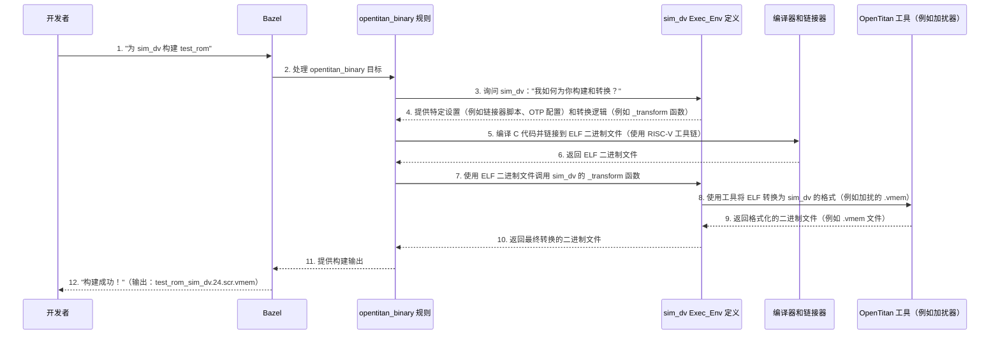

# 第 4 章：执行环境 (Exec_Env)

欢迎回来

在[第 3 章：Bazel 构建系统](03_bazel_build_system_.md)中，我们了解了 Bazel 如何充当 OpenTitan 的主厨，协调从硬件设计到软件的所有组件的构建。Bazel 确保一切都高效且可重现地构建。

但 OpenTitan 不仅仅是一个单一的东西；它的代码需要在许多不同的"地方"运行和测试。想象一下我们设计了一款新车型。我们会想以不同的方式测试它：

*   **软件模拟器：**运行详细的计算机模拟来检查其发动机的每一个微小部分。
*   **测试赛道上的原型：**构建一个物理原型并在封闭赛道上测试它。
*   **公共道路上的实际量产车：**一旦完美，就将其发布给客户。

这些"测试场地"中的每一个都有独特的需求：不同的工具、不同的细节级别以及与汽车交互的特定方式。在 OpenTitan 世界中，这些"测试场地"被称为**执行环境 (Exec_Env)**。

## 执行环境解决什么问题？

OpenTitan 代码，无论是固件还是诊断测试，都需要在各种平台上正确工作：

*   **软件模拟器：**这些是模仿 OpenTitan 芯片行为的计算机程序。它们范围从高度详细的、周期精确的**设计验证 (DV) 模拟器**（如检查每个齿轮齿）到更快的、功能性的 **QEMU 仿真器**（如检查汽车是否向前行驶）。
*   **FPGA 板：**这些是可重新配置的硬件芯片，可以"假装"成 OpenTitan 芯片。它们是物理原型（如我们的测试赛道汽车）。
*   **实际硅芯片：**真正的、制造的 OpenTitan 芯片本身（量产车）。

这些平台中的每一个都需要以略微不同的方式构建软件：

*   **内存布局：**代码存放在哪里（Flash、ROM、RAM）？每个平台可能有不同的内存地址。
*   **OTP 配置：**应该将哪些初始 [OTP（一次性可编程）存储器](01_otp__one_time_programmable__memory_.md)设置"烧录"到虚拟或真实芯片中？
*   **二进制格式：**原始编译的代码（ELF 文件）可能需要转换为模拟器或编程工具理解的特定格式（例如，`.vmem` 文件）。
*   **调试/测试工具：**不同的平台使用不同的工具来加载和运行测试。

如果没有抽象，管理这些差异将非常复杂。每次我们想在新平台上测试固件时，我们都必须手动调整构建设置、链接器脚本和工具。

**执行环境 (Exec_Env)** 通过将所有特定于平台的设置、工具和转换步骤捆绑到一个单一的、连贯的定义中来解决这个问题。这就像为每个测试场地准备一个特定的"设置套件"。

## 核心思想：特定于平台的设置套件

将**执行环境**视为为特定目标平台构建和测试 OpenTitan 软件的完整配方。当我们告诉 Bazel 构建一段固件时，我们还告诉它要为*哪个* Exec_Env 构建它。

Exec_Env 定义：

*   **目标：**是 `sim_dv`、`fpga_cw310` 还是 `silicon`？
*   **内存映射：***该特定目标*上的内存如何布局。
*   **所需工具：**准备二进制文件需要哪些工具（例如，闪存加扰工具、OTP 镜像生成器）。
*   **二进制转换：**如何将通用软件输出（如 ELF 文件）转换为*该目标*可用的格式（例如，生成特定的 `.vmem` 文件，处理真实硬件的[代码签名](02_code_signing_and_key_management_.md)）。
*   **测试调度：**关于*如何*在该特定环境上运行测试的指令。

这意味着核心固件代码不需要更改，即使它在完全不同的硬件或模拟模型上运行。Exec_Env 在幕后处理所有必要的调整。

## 我们的第一步：选择 Exec_Env

让我们重温[第 3 章：Bazel 构建系统](03_bazel_build_system_.md)中的 `test_rom` 示例。我们想为 Earlgrey 芯片的设计验证 (DV) 模拟环境构建 `test_rom`。

在 OpenTitan 的 `BUILD.bazel` 文件中，像 `opentitan_binary` 或 `opentitan_test` 这样的软件目标使用 `exec_env` 属性指定它们的执行环境。

```python
# 来自：sw/device/lib/testing/test_rom/BUILD.bazel（简化版）

load("//rules/opentitan:defs.bzl", "opentitan_binary")

opentitan_binary(
    name = "test_rom",
    srcs = ["test_rom.c"],
    # 这是我们指定执行环境的地方！
    exec_env = [
        "//hw/top_earlgrey:sim_dv", # 为 Earlgrey 的 DV 模拟器构建
    ],
    deps = [
        "//sw/device/lib/base:mmio",
        # ... 其他依赖项 ...
    ],
)
```
**解释：**
`exec_env = ["//hw/top_earlgrey:sim_dv"]` 这一行是关键。它告诉 Bazel 专门为 `sim_dv` 环境准备此 `test_rom` 二进制文件，该环境是为 `top_earlgrey` 硬件设计配置的。

要构建它，我们会运行：

```bash
bazel build //sw/device/lib/testing/test_rom:test_rom_sim_dv
```

注意目标名称中的 `_sim_dv` 后缀。这表明 Bazel 正在专门为 `sim_dv` 执行环境构建 `test_rom` 固件。

如果我们想为 QEMU 模拟构建相同的 `test_rom`，我们可能有另一个 `exec_env` 条目，例如 `"//hw/top_earlgrey:sim_qemu"`，我们会用以下命令构建它：

```bash
bazel build //sw/device/lib/testing/test_rom:test_rom_sim_qemu
```

神奇之处在于 `test_rom.c` 源代码本身保持不变。Exec_Env 定义告诉 Bazel 如何为每个目标调整构建过程。

## 幕后：Exec_Env 协调

当我们为特定的 Exec_Env 运行 `bazel build` 命令时，以下是发生的事情的简化视图：



**过程解释：**

1.  **开发者请求：**我们要求 Bazel 为特定的执行环境（`sim_dv`）构建特定的固件（`test_rom`）。
2.  **Bazel 调用规则：**Bazel 找到 `test_rom` 的 `opentitan_binary` 规则定义。
3.  **Exec_Env 查询：**`opentitan_binary` 规则然后查询 `sim_dv` 执行环境定义（本身是一个特殊的 Bazel 规则）以获取所有必要的特定于平台的详细信息。
4.  **设置和逻辑：**`sim_dv` Exec_Env 定义提供：
    *   **配置：**要使用的特定链接器脚本、默认的 [OTP](01_otp__one_time_programmable__memory_.md) 内存映射、硬件配置文件的路径。
    *   **转换逻辑：**一个函数（通常命名为 `_transform`），知道如何获取通用编译的二进制文件（ELF）并将其转换为 `sim_dv` 模拟器所需的特定格式。
5.  **编译和链接：**`opentitan_binary` 规则配备了 Exec_Env 的链接器脚本和其他设置，编译 C 源代码并将其链接到 ELF（可执行和可链接格式）二进制文件。
6.  **二进制转换：**`opentitan_binary` 规则然后调用 `sim_dv` Exec_Env 提供的 `_transform` 函数。此函数使用各种 OpenTitan 工具（如内存加扰器）将 ELF 转换为适合模拟器的格式（例如，加扰的 `.vmem` 文件，如 [OTP](01_otp__one_time_programmable__memory_.md) 中讨论的）。
7.  **输出：**`_transform` 函数返回最终的、特定于平台的二进制文件，然后 Bazel 在我们的 `bazel-bin` 目录中使其可用。

## 在 OpenTitan 中定义执行环境

OpenTitan 使用自定义 Bazel 规则定义其执行环境，类似于我们在[第 3 章：Bazel 构建系统](03_bazel_build_system_.md)中看到的。这些规则用 Starlark（一种类似 Python 的语言）编写。

### 1. 核心 `ExecEnvInfo` 提供者

其核心是 `ExecEnvInfo` 提供者，在 `rules/opentitan/exec_env.bzl` 中定义。这就像*任何*执行环境必须描述的内容的蓝图。

```python
# 来自：rules/opentitan/exec_env.bzl（简化版）

ExecEnvInfo = provider(
    doc = "执行环境信息",
)

_FIELDS = {
    "design": ("attr.design", True),             # 例如，"earlgrey"
    "linker_script": ("attr.linker_script", False), # 特定链接器脚本的路径
    "otp": ("file.otp", False),                 # OTP 镜像配置的路径
    "manifest": ("file.manifest", False),         # 用于固件签名（见第 5 章）
    "flash_scramble_tool": ("attr.flash_scramble_tool", False), # 加扰闪存的工具
    "rom_scramble_tool": ("attr.rom_scramble_tool", False),   # 加扰 ROM 的工具
    "openocd": ("attr.openocd", False),           # 调试工具（用于硬件目标）
    # ... 更多用于特定配置、工具等的字段 ...
}

def exec_env_as_dict(ctx):
    # 此辅助函数从 Exec_Env 规则收集所有属性
    # 及其基础，创建所有这些字段的字典。
    # 它确保所有"必需"字段都存在。
    # ...（简化实现）...
    return {
        "design": getattr(ctx.attr, "design"),
        "linker_script": getattr(ctx.attr, "linker_script"),
        "otp": getattr(ctx.file, "otp"),
        # ...（收集其他字段）...
    }
```
**解释：**
`ExecEnvInfo` 是一个"数据结构"，保存 Exec_Env 的所有信息。`_FIELDS` 字典列出了 Exec_Env 可以拥有的所有可能属性，例如 `design` 名称、`linker_script` 位置、`otp` 配置和各种工具。`exec_env_as_dict` 是一个辅助函数，在创建 Exec_Env 规则时收集所有这些特定值。

### 2. 定义特定的执行环境：`sim_dv` 示例

现在，让我们看看如何定义像 `sim_dv`（用于设计验证模拟）这样的具体 Exec_Env。这在 `rules/opentitan/sim_dv.bzl` 中找到。

```python
# 来自：rules/opentitan/sim_dv.bzl（简化版）

load(
    "//rules/opentitan:exec_env.bzl",
    "ExecEnvInfo",
    "exec_env_common_attrs",
)
load(
    "@lowrisc_opentitan//rules/opentitan:transform.bzl",
    "convert_to_scrambled_rom_vmem", # 将 ELF 转换为加扰的 ROM VMEM
    "convert_to_vmem",               # 将 ELF 转换为常规 VMEM
    "scramble_flash",                # 加扰闪存
)

def _transform(ctx, exec_env, name, elf, binary, signed_bin, disassembly, mapfile):
    """将二进制文件转换为 sim_dv 的首选形式。"""
    # 此函数在编译后由 opentitan_binary 规则调用。
    # 它的工作是生成 sim_dv 需要的*特定*二进制格式。

    if ctx.attr.kind == "rom": # 如果固件是 ROM 镜像
        # 为 ROM 生成加扰的 VMEM。
        # 这使用 Exec_Env 中定义的 'rom_scramble_tool'。
        (rom, hashfile) = convert_to_scrambled_rom_vmem(
            ctx, src = elf, suffix = "39.scr.vmem",
            rom_scramble_tool = exec_env.rom_scramble_tool,
            top_gen_hjson = exec_env.top_gen_hjson, # 使用顶层硬件配置
        )
        # 还生成一个非加扰的 VMEM，用于更快的测试。
        rom32 = convert_to_vmem(ctx, src = binary, word_size = 32)
        vmem = rom # 加扰的 VMEM 是默认输出

    elif ctx.attr.kind == "flash": # 如果固件用于闪存
        # 首先将二进制文件转换为基本 VMEM。
        vmem_base = convert_to_vmem(ctx, src = signed_bin or binary, word_size = 64)
        # 然后使用特定工具和 OTP 配置加扰闪存 VMEM。
        vmem = scramble_flash(
            ctx, src = vmem_base, suffix = "64.scr.vmem",
            otp = exec_env.otp,
            otp_mmap = exec_env.otp_mmap, # 使用 OTP 内存映射
            _tool = exec_env.flash_scramble_tool.files_to_run,
        )
    # ... 处理其他类型，如 "ram" ...

    return {
        "elf": elf,        # 原始编译的 ELF
        "default": vmem,   # 此 Exec_Env 的主要 VMEM 输出
        "rom": rom,        # 加扰的 ROM VMEM（如果适用）
        "rom32": rom32,    # 未加扰的 ROM VMEM（如果适用）
        # ... 其他输出，如反汇编、日志 ...
    }

def _sim_dv(ctx):
    """sim_dv 规则的实现函数。"""
    fields = exec_env_as_dict(ctx) # 获取所有常见的 Exec_Env 属性
    return ExecEnvInfo(
        provider = SimDvBinaryInfo, # DV 二进制文件的特定提供者
        test_dispatch = _test_dispatch, # 在此环境上运行测试的函数
        transform = _transform,       # 我们的二进制转换函数
        **fields # 传递所有收集的字段
    )

# sim_dv 的实际 Bazel 规则
sim_dv = rule(
    implementation = _sim_dv,
    attrs = exec_env_common_attrs(), # 继承常见属性
    toolchains = [LOCALTOOLS_TOOLCHAIN],
)
```
**解释：**
1.  **`_transform` 函数：**这是核心逻辑。它获取编译的软件（ELF/二进制文件），并根据其 `kind`（ROM、RAM 或 Flash），生成 `sim_dv` 模拟器所需的特定内存镜像（`.vmem` 文件）。例如，它调用 `convert_to_scrambled_rom_vmem` 来创建 ROM 的物理精确表示。它使用 `exec_env` 本身中定义的工具，例如 `rom_scramble_tool`。
2.  **`_sim_dv` 实现：**此函数是实际"构建"`sim_dv` Exec_Env 规则的地方。它收集所有默认设置（使用 `exec_env_as_dict`），关键是，它告诉 Bazel 使用 `_transform` 作为其二进制转换步骤，使用 `_test_dispatch`（此处未显示，但类似于 `_transform` 用于测试执行）来运行测试。
3.  **`sim_dv = rule(...)`：**这定义了名为 `sim_dv` 的实际 Bazel 规则。当使用 `exec_env = ["//hw/top_earlgrey:sim_dv"]` 时，Bazel 会查找此规则。

### 3. `sim_dv` 的测试调度

就像 `_transform` 处理二进制生成一样，`_test_dispatch` 处理如何在给定环境上实际运行测试。

```python
# 来自：rules/opentitan/sim_dv.bzl（简化版）

_TEST_SCRIPT = """#!/bin/bash
set -e

readonly DVSIM="util/dvsim/dvsim.py" # DV 模拟器运行器
TEST_CMD=({test_cmd})
echo "此时，dvsim.py 必须手动运行（在构建 SW 之后）通过：
${{DVSIM}} {args} $@ ${{TEST_CMD[@]}}"
"""

def _test_dispatch(ctx, exec_env, firmware):
    """为 sim_dv 环境调度测试。"""
    # ... 测试工具、数据文件、参数的常见设置 ...

    # 构造一个为运行 DV 模拟定制的 shell 脚本
    script = ctx.actions.declare_file(ctx.attr.name + ".bash")
    ctx.actions.write(
        script,
        _TEST_SCRIPT.format(
            # 将参数传递给 dvsim.py 运行器
            args = " ".join(args).format(**param),
            test_cmd = test_cmd,
        ),
        is_executable = True,
    )
    return script, data_files
```
**解释：**
`_test_dispatch` 函数生成一个小的 shell 脚本（`.bash` 文件），其中包含在 `sim_dv` 环境中运行测试所需的命令。它知道对于 `sim_dv`，它需要使用特定参数调用 `util/dvsim/dvsim.py`，然后使用生成的固件二进制文件启动实际模拟。

## 🎢不同风格的执行环境

OpenTitan 使用各种 Exec_Env 来满足其多样化的测试和部署需求：

| 执行环境        | 描述                                                         | 典型用例                                           | 关键特性                                                     |
| :-------------- | :----------------------------------------------------------- | :------------------------------------------------- | :----------------------------------------------------------- |
| `sim_dv`        | **设计验证 (DV) 模拟器。**高度详细、周期精确的 RTL 模型。    | 硬件 IP 的详尽功能和安全验证。                     | 为 ROM 和 Flash 生成高度特定的加扰 `.vmem` 文件。需要 `dvsim.py` 来执行。最慢但最准确的模拟。 |
| `sim_verilator` | **基于 Verilator 的 RTL 模拟器。**比 DV 更快，细节更少。     | 功能验证，IP 开发期间的快速迭代。                  | 更简单的 `.vmem` 输出，通常用于快速检查。                    |
| `sim_qemu`      | **用于 RISC-V 的 QEMU 系统仿真器。**快速、功能性、系统级仿真。 | 软件开发、快速迭代、大规模持续集成 (CI) 固件测试。 | 仿真 CPU 和基本外设。生成 QEMU 特定的 `.ini` 配置文件、原始 OTP 和闪存镜像。需要可变文件进行测试。 |
| `fpga_cw310`    | **FPGA 板（例如，Google 的 CW310）。**用于早期硬件/软件协同开发的物理原型。 | 硬件原型设计、真实世界软件测试、性能分析。         | 需要用于 FPGA 配置的比特流。与物理 I/O 交互。在板上使用真实的 [OTP 存储器](01_otp__one_time_programmable__memory_.md)。可以修改 OTP。 |
| `silicon`       | **实际的 OpenTitan 硅芯片。**最终的生产硬件。                | 最终验证、制造测试和产品部署。                     | 最高保真度。需要特定的配置工具，可能需要 JTAG 访问。处理实际的安全功能和物理限制。 |

这些环境中的每一个都使用 `ExecEnvInfo` 框架来定义其独特的特性和行为，使 OpenTitan 能够有效地管理其复杂的硬件/软件协同设计。

## 结论

在本章中，我们探讨了**执行环境 (Exec_Env)**，这是 OpenTitan 用于定义其==代码在何处以及如何运行的强大抽象==。

我们了解到 Exec_Env 捆绑了所有特定于平台的设置、工具和转换，允许相同的软件在不同的目标（如模拟器、FPGA 板和实际硅芯片）上构建和测试，而无需修改源代码。这种==模块化方法与 [Bazel 构建系统](03_bazel_build_system_.md)无缝集成，对于 OpenTitan 的开发效率及其在许多不同物理现实中实现安全"硅信任根"的能力至关重要==。

理解 Exec_Env 是浏览 OpenTitan 构建过程的关键，并确保我们的固件为其预期目的地正确准备。接下来，我们将探讨与固件及其执行密切相关的另一个关键概念：**固件清单**，它==提供有关固件的基本元数据，确保芯片正确加载和验证它==。

[下一章：固件清单](05_firmware_manifest_.md)

