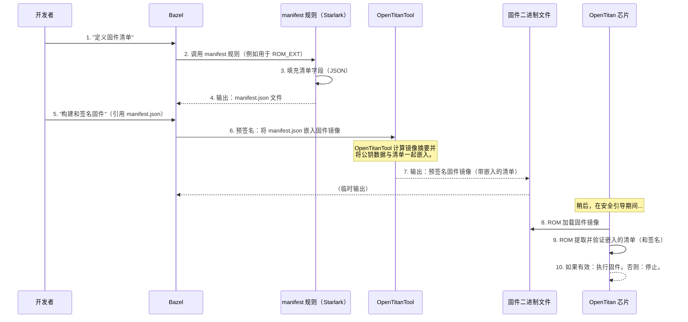

# 第 5 章：固件清单

欢迎回来

在上一章[第 4 章：执行环境 (Exec_Env)](04_execution_environments__exec_env__.md)中，我们探讨了 OpenTitan 如何使用"执行环境"在从模拟器到真实硅片的不同平台上构建和测试其软件。这种灵活性至关重要，但一旦固件构建完成，OpenTitan 芯片本身如何知道该固件是否合法、其目的是什么以及是否可以安全运行？

想象一下我们正在进行国际旅行。我们有一本**护照**，其中包含我们所有的重要信息：姓名、照片、出生日期、国籍，甚至可能还有签证印章或出入境记录。当我们到达一个新国家时，海关人员会检查我们的护照以验证我们的身份并确保我们符合该国的入境要求。

在 OpenTitan 的世界中，==固件（在芯片上运行的软件）也需要一本"护照"==。这本数字护照被称为**固件清单**。它是直接嵌入固件镜像中的==结构化元数据块==，提供芯片内置可信软件（如 ROM）在允许固件执行之前验证的关键信息。

## 固件清单解决什么问题？

当 OpenTitan 芯片启动时，它的第一个软件是不可变的（不可更改的）**ROM**（只读存储器）。

ROM 的工作是安全地启动系统。它最关键的任务之一是加载和验证下一阶段的固件，通常称为 **ROM_EXT**（ROM 扩展）。

但 ROM 如何知道它即将加载的 ROM_EXT 是否可信？
*   它是正确的版本，还是攻击者试图加载一个旧的、有漏洞的版本？（防回滚保护）
*   它是为*这个特定芯片*准备的，还是从另一个设备复制的？（设备特定约束）
*   自制造商签名以来是否被篡改？（[代码签名](02_code_signing_and_key_management_.md)验证）
*   可执行代码在镜像中的实际起始和结束位置在哪里？

如果没有清单，ROM 将无法可靠地回答这些问题。==**固件清单**通过提供关于固件本身的可靠、防篡改的真实来源来解决这个问题==。

## 核心思想：固件护照

固件清单本质上是一个描述其所附加的固件镜像的数据结构。它包含 ROM（我们的"海关人员"）检查和验证的关键字段。如果清单的任何细节与芯片的期望或安全策略（通常存储在 [OTP 存储器](01_otp__one_time_programmable__memory_.md)中）不匹配，固件将被拒绝，引导过程将停止。

以下是我们在固件清单中会找到的信息类型：

| 清单字段               | 描述                                                         | 为什么重要（类比）                               |
| :--------------------- | :----------------------------------------------------------- | :----------------------------------------------- |
| **标识符**             | 此固件镜像的唯一 ID。                                        | 就像护照中的文档类型（例如，"护照"）。           |
| **版本（主要/次要）**  | 软件版本号，用于兼容性。                                     | 我们软件的"发布编号"。                           |
| **安全版本**           | 用于防回滚保护的特定版本号。                                 | 就像护照的签发日期；旧的可能会被拒绝。           |
| **代码起始/结束/入口** | 定义可执行代码在固件镜像中的位置。                           | 固件"大脑"所在的位置。                           |
| **使用约束**           | 关于*何时*和*何处*可以运行此固件的规则（例如，特定的[生命周期状态](01_otp__one_time_programmable__memory_.md)、设备 ID）。 | 签证要求："仅对此国家有效"，"仅对此类设备有效"。 |
| **公钥模数**           | （间接地）用于验证固件签名的公钥。                           | 验证护照真实性的数字"印章"。                     |

## OpenTitan 的安全引导用例：验证 ROM_EXT

固件清单在 OpenTitan 中最关键的用途是在**安全引导**过程中。当 ROM 需要加载 ROM_EXT 时，它执行以下步骤，严重依赖清单：

1.  **定位清单：**ROM 知道在候选 ROM_EXT 镜像中哪里可以找到清单块。
2.  **读取清单：**它读取清单中的所有字段。
3.  **验证完整性（摘要）：**ROM 计算整个 ROM_EXT 镜像的加密哈希（"指纹"或"摘要"），并根据嵌入固件的数字签名进行验证（如[第 2 章：代码签名和密钥管理](02_code_signing_and_key_management_.md)中讨论的）。清单通常包含*公钥*或对它的引用。
4.  **检查安全版本：**它将清单中的 `security_version` 与存储在 [OTP 存储器](01_otp__one_time_programmable__memory_.md)中的值进行比较。如果清单的版本早于 OTP 中的版本，则表示回滚攻击，固件将被拒绝。
5.  **评估使用约束：**ROM 根据芯片当前的[设备生命周期状态](01_otp__one_time_programmable__memory_.md)（也来自 [OTP 存储器](01_otp__one_time_programmable__memory_.md)）和其他设备特定 ID 检查清单中的 `usage_constraints`。例如，"生产"固件清单可能指定它只能在 `PROD` 生命周期状态的芯片上运行。
6.  **验证代码区域：**ROM 使用 `code_start`、`code_end` 和 `entry_point` 来确保固件的可执行部分在预期边界内。
7.  **决策：**
    *   如果所有检查都通过，ROM 信任 ROM_EXT 并将控制权转移到其 `entry_point`。
    *   如果任何检查失败，ROM 检测到安全违规并停止，防止潜在的恶意或不兼容的固件运行。

这个由固件清单驱动的强大验证过程是 OpenTitan "硅信任根"的基石。

## 如何在 OpenTitan 中定义固件清单

在 OpenTitan 中，我们使用一个名为 `manifest` 的特殊 Bazel 规则来定义固件清单。这个规则用 Starlark（一种类似 Python 的语言）编写，将所有必要的信息作为属性，并生成一个表示清单的 JSON 文件。然后在构建过程中将此 JSON 文件嵌入到固件二进制文件中。

让我们看一个 OpenTitan 如何为其 ROM_EXT 固件定义清单的简化示例：

```python
# 来自：sw/device/silicon_creator/rom_ext/BUILD.bazel（简化版）

load("//rules:manifest.bzl", "manifest")
load("//rules:const.bzl", "CONST", "hex")

# 为 ROM_EXT 固件定义清单。
manifest(
    name = "manifest", # 此清单目标的名称
    identifier = hex(CONST.ROM_EXT), # ROM_EXT 的唯一 ID
    manifest_version_major = "0x1",
    manifest_version_minor = "0x0",
    security_version = "0x0", # 初始安全版本
    length = "0x10000", # ROM_EXT 的最大长度
    code_start = "0x0",
    code_end = "0x10000",
    entry_point = "0x0",
    life_cycle_state = hex(CONST.LCV_SW.DEV), # 仅用于 'DEV' 生命周期
    # ... 为简洁起见省略了许多其他字段 ...
)
```
**解释：**
这个 `manifest` 规则正在定义固件的属性。
*   `name = "manifest"`：这是此清单定义的 Bazel 目标名称。
*   `identifier = hex(CONST.ROM_EXT)`：为此固件类型 `ROM_EXT` 设置特定 ID，转换为十六进制字符串。
*   `manifest_version_major`、`manifest_version_minor`：指定*清单格式*本身的版本。
*   `security_version = "0x0"`：这是防回滚的关键字段。攻击者不能使用 `security_version` 早于芯片预期的清单。
*   `length`、`code_start`、`code_end`、`entry_point`：这些定义固件占用的内存区域及其执行开始的位置。
*   `life_cycle_state = hex(CONST.LCV_SW.DEV)`：这是一个**使用约束**。它指定此固件只允许在当前处于 `DEV`（开发）[生命周期状态](01_otp__one_time_programmable__memory_.md)的芯片上运行。如果芯片处于 `PROD`（生产）状态，此固件将被拒绝。

这个 `manifest` 规则生成一个 JSON 文件（例如，`manifest.json`），看起来像这样（简化版）：

```json
{
  "identifier": "0x4552544f",
  "manifest_version": {
    "major": "0x1",
    "minor": "0x0"
  },
  "security_version": "0x0",
  "length": "0x10000",
  "code_start": "0x0",
  "code_end": "0x10000",
  "entry_point": "0x0",
  "usage_constraints": {
    "life_cycle_state": "0x0b5a75e0",
    "selector_bits": 0x400
    // ... 其他使用约束 ...
  }
}
```
**输出解释：**
这个 JSON 文件是原始的"护照"数据。它将被嵌入到固件二进制文件中。`life_cycle_state` 值 `0x0b5a75e0` 是 `CONST.LCV_SW.DEV` 的十六进制表示。

## 幕后：清单生成和嵌入

固件清单不仅仅是一个独立的文件；它是整个固件镜像的关键部分。以下是它如何创建和合并的简化序列：



**过程解释：**

1.  **开发者定义清单：**我们使用 `manifest` Bazel 规则定义清单的属性。
2.  **清单规则执行：**Bazel 执行 `manifest` 规则的实现（一个 Starlark 函数）。此函数收集我们提供的所有属性（如 `security_version`、`life_cycle_state` 等）。
3.  **JSON 输出：**`manifest` 规则生成一个包含所有这些结构化元数据的 JSON 文件。
4.  **固件构建和签名：**当我们然后构建和签名实际固件（例如，`rom_ext`）时，构建系统（使用 `opentitantool`，如[第 2 章：代码签名和密钥管理](02_code_signing_and_key_management_.md)中讨论的）将此清单 JSON 文件作为输入。
5.  **嵌入：**`opentitantool` 将此 JSON 内容（以及公钥和填充等其他数据）嵌入到固件二进制文件中的特定、已知位置。`opentitantool` 还计算整个镜像（包括清单）的加密摘要以进行签名。
6.  **片上验证：**在启动期间，OpenTitan 芯片的 ROM 加载此固件二进制文件。它确切地知道在哪里可以找到嵌入的清单。ROM 提取这本"护照"并根据其自己的内部状态（[OTP 存储器](01_otp__one_time_programmable__memory_.md)）和清单的内容执行所有必要的检查。
7.  **执行或停止：**根据清单的有效性，ROM 要么继续执行固件，要么停止引导过程。

## 探讨：`_manifest_impl` 函数

`manifest` Bazel 规则由 `rules/manifest.bzl` 中名为 `_manifest_impl` 的 Starlark 函数实现。此函数负责获取各种属性并将它们组装成最终的 JSON 结构。

让我们看一下 `_manifest_impl` 逻辑的简化、重点版本，以了解它如何处理一些关键字段：

```python
# 来自：rules/manifest.bzl（高度简化）

def _manifest_impl(ctx):
    mf = {} # 这将是我们构建 JSON 的字典

    # 直接从属性分配简单字段
    if ctx.attr.identifier:
        mf["identifier"] = ctx.attr.identifier
    if ctx.attr.length:
        mf["length"] = ctx.attr.length
    if ctx.attr.security_version:
        mf["security_version"] = ctx.attr.security_version

    # 将 version_major/minor 处理为嵌套字典
    mf_version = {}
    if ctx.attr.manifest_version_major:
        mf_version["major"] = ctx.attr.manifest_version_major
    if ctx.attr.manifest_version_minor:
        mf_version["minor"] = ctx.attr.manifest_version_minor
    if mf_version:
        mf["manifest_version"] = mf_version

    # 处理使用约束 - 安全策略的关键部分
    uc = {} # usage_constraints 的字典
    selector_bits = 0

    # 示例：处理 'life_cycle_state'
    if ctx.attr.life_cycle_state:
        uc["life_cycle_state"] = ctx.attr.life_cycle_state
        # 在 selector_bits 中设置一位以表示此约束处于活动状态
        selector_bits |= (1 << 10) # 来自 rules/manifest.bzl 的 _SEL_LIFE_CYCLE_STATE
    else:
        # 如果未提供，使用默认值（如"不关心"或"任何状态"）
        uc["life_cycle_state"] = hex(CONST.DEFAULT_USAGE_CONSTRAINTS)

    # 自动计算或使用提供的 selector_bits
    if ctx.attr.selector_bits:
        uc["selector_bits"] = ctx.attr.selector_bits
    else:
        uc["selector_bits"] = selector_bits # 使用计算的值

    mf["usage_constraints"] = uc # 将使用约束添加到主清单

    # 最后，将字典写入 JSON 文件
    file = ctx.actions.declare_file("{}.json".format(ctx.attr.name))
    ctx.actions.write(file, json.encode_indent(mf))
    return DefaultInfo(files = depset([file]))

_manifest = rule(
    implementation = _manifest_impl,
    attrs = {
        "identifier": attr.string(),
        "length": attr.string(),
        "security_version": attr.string(),
        "manifest_version_major": attr.string(),
        "manifest_version_minor": attr.string(),
        "life_cycle_state": attr.string(),
        "selector_bits": attr.string(),
        # ... 更多属性 ...
    },
)
```
**解释：**
*   `mf = {}`：初始化一个空的 Python 字典来构建清单的 JSON 结构。
*   **直接分配：**许多字段，如 `identifier`、`length` 和 `security_version`，直接从提供给 `manifest` 规则的属性分配。
*   **嵌套结构：**像 `manifest_version` 这样的字段被处理为嵌套字典。
*   **使用约束（`uc`）：**这是编码安全策略的地方。如果提供了 `life_cycle_state` 属性，它会设置所需的特定生命周期状态。关键是，`selector_bits` 字段也会更新。这个 `selector_bits` 是一个位掩码，告诉 ROM *哪些*使用约束是活动的并且应该被检查。如果设置了一位，ROM 就知道要将清单中的特定约束与芯片的 [OTP 存储的](01_otp__one_time_programmable__memory_.md)值进行比较。
*   **`json.encode_indent(mf)`：**此函数（来自 Bazel 的 Starlark 环境）将 Python 字典 `mf` 转换为格式良好的 JSON 字符串。
*   `ctx.actions.write(file, ...)`：Bazel 的操作系统将此 JSON 字符串写入输出文件（例如，`manifest.json`）。

`manifest` 规则中使用的 `CONST` 值（如 `CONST.ROM_EXT`、`CONST.LCV_SW.DEV`、`CONST.DEFAULT_USAGE_CONSTRAINTS`）来自 `rules/const.bzl`。此文件为 OpenTitan 定义了许多重要常量，确保硬件和软件之间的一致性。

## 结论

在本章中，我们揭开了**固件清单**的概念，将其理解为 OpenTitan 固件的"护照"。

我们了解到这个嵌入在固件镜像中的结构化元数据块如何提供关键信息，如版本号、安全约束（[使用约束](01_otp__one_time_programmable__memory_.md)）和代码位置。我们看到了芯片的 ==ROM 在安全引导期间严格验证此清单==，以确保只有真实的、未被篡改的、符合策略的固件才能执行。我们还演练了如何使用 OpenTitan 的 Bazel 规则定义这些清单并将其处理为 JSON 文件以进行嵌入。

> 固件清单与 [OTP 存储器](01_otp__one_time_programmable__memory_.md)和[代码签名](02_code_signing_and_key_management_.md)一起，构成了支撑 OpenTitan 硬件支持的安全性的强大三位一体。

要构建这个安全固件，我们需要特定的编译器和工具。在下一章中，我们将深入探讨 **RISC-V 工具链**，这是一组用于将人类可读代码转换为 OpenTitan 芯片的 RISC-V 处理器可以理解的机器指令的基本软件工具。

[下一章：RISC-V 工具链](06_risc_v_toolchain_.md)

