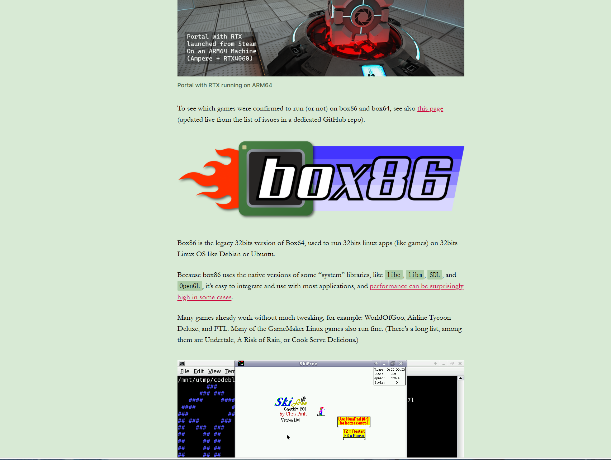
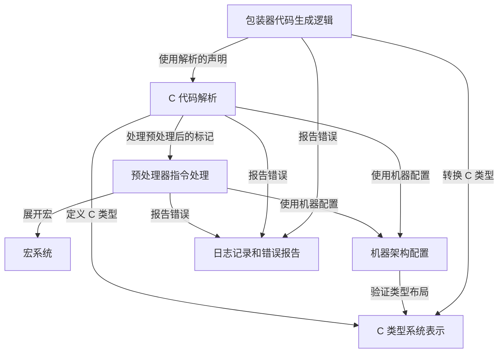
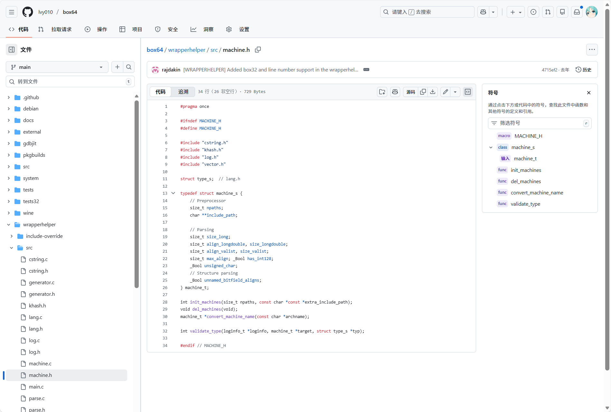
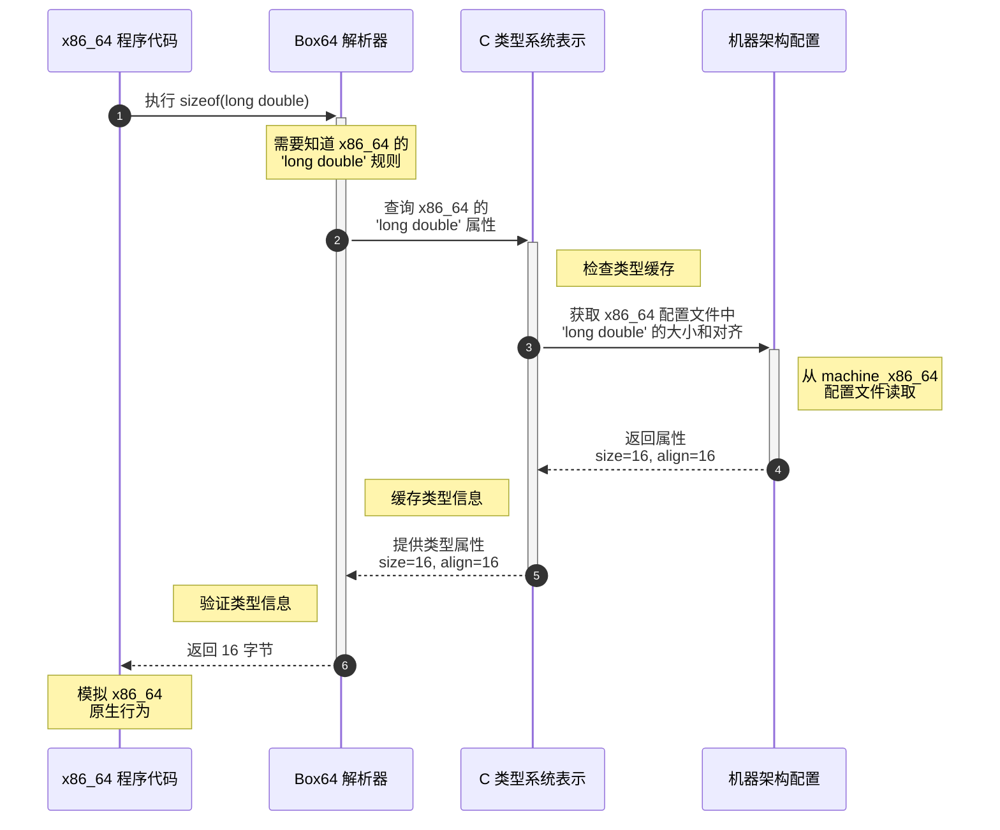

链接：[Box86 / Box64 – Linux Userspace x86 and x86_64 Emulator with a Twist](https://box86.org/)



没错...又是为了玩游戏看的代码  或许有人问博主博主泥这三天没看项目代码干什么去了 玩游戏去了...😗

前文传送：

[[游戏设计原理_1] 对称性和同步性 | 合作与对抗 | 公平 | 反馈循环](https://lvynote.blog.csdn.net/article/details/148397365)

[[游戏实时地图] 地图数据 | 兴趣点数据 | 虚幻引擎SDK接口](https://lvynote.blog.csdn.net/article/details/148672013)

[[shad-PS4] Vulkan渲染器 | 着色器_重新编译器 | SPIR-V 格式](https://lvynote.blog.csdn.net/article/details/149175920)

..more (随手贴了三篇，并没有什么规律

不多说了 我们来看这个项目

# docs：box64

`box64` 是一个用于==**弥合**不同 *CPU 架构*之间的**差距**==的项目

通过智能处理 C 源文件来实现这一目标，以**生成专用的包装器代码**。这些==包装器充当中间层==，使为一个系统构建的应用程序能够在另一个系统上*无缝执行*，有效地促进跨架构仿真。


## 可视化



## 章节

1. [机器架构配置
](01_machine_architecture_configuration_.md)
2. [C 类型系统表示
](02_c_type_system_representation_.md)
3. [日志记录和错误报告
](03_logging_and_error_reporting_.md)
4. [预处理器指令处理
](04_preprocessor_directive_handling_.md)
5. [宏系统
](05_macro_system_.md)
6. [C 代码解析
](06_c_code_parsing_.md)
7. [包装器代码生成逻辑
](07_wrapper_code_generation_logic_.md)

---

# 第 1 章：机器架构配置

欢迎来到探索 Box64 内部工作原理之旅的第一章

Box64 是一个令人惊叹的工具，允许我们在 ARM64 计算机（如树莓派或 Apple Silicon Mac）上运行为 x86_64 计算机（如大多数台式 PC）设计的应用程序。为了实现这一魔法，Box64 需要理解这些截然不同的计算机架构之间的细微差异。

## 挑战：不同的计算机架构

想象一下我们有一个蛋糕的配方。这个配方假设我们有特定的烤箱、某些量杯和标准尺寸的配料。现在，如果我们试图在一个完全不同的厨房中使用该配方会怎样？也许烤箱的加热方式不同，我们的量杯尺寸不同，或者某些配料具有意想不到的特性。我们需要一个指南来将原始配方转换到我们的新厨房。

在计算机世界中，"CPU 架构"就像那个厨房。它定义了计算机大脑（CPU）如何工作、如何存储信息以及如何执行计算的基本规则。Box64 正面应对这一挑战：它==需要在另一个"厨房"（例如 ARM64）中运行为一个"厨房"（例如 x86_64）编写的程序==。

**Box64 通过"机器架构配置"解决的核心问题就是这种转换。** 它需要知道程序构建时*原始*架构的确切"规则"，即使在不同的*主机*架构上运行也是如此。

### 用例：`long double` 的大小是多少？

让我们考虑一个常见的编程任务：查找数据类型的大小。在 C 编程中，我们可能会使用 `sizeof(long double)` 来查看 `long double` 数字在内存中占用多少字节。

> 问题在哪里？这个大小不是固定的

*   在较旧的 x86（32 位）系统上，`long double` 可能是 12 字节。
*   在现代 x86_64（64 位）系统上，它通常是 16 字节。
*   在 ARM64 系统上，它也通常是 16 字节，但其内部结构可能略有不同。

如果 Box64 在 ARM64 机器上运行 x86_64 程序，并且该程序请求 `sizeof(long double)`，Box64 必须报告 *16 字节*，而不是 ARM64 的原生大小（即使在这种特定情况下它们恰好相同）。它必须模拟*目标* x86_64 系统的行为。这对于正确的程序执行至关重要。

## Box64 如何管理架构规则

Box64 使用称为"机器架构配置"的抽象来跟踪这些==架构规则。就像为它需要支持的每种 CPU 类型提供详细的说明手册==。

### `machine_t` 蓝图

Box64 将这些规则存储在一个名为 `machine_t` 的特殊结构中

将 `machine_t` 视为特定 CPU 架构的"配置文件"或"数据表"。每个配置文件都包含关键特征。

让我们看一下来自 `wrapperhelper/src/machine.h` 的这个蓝图



```c
//  wrapperhelper/src/machine.h
typedef struct machine_s {
    size_t size_long;           // 'long' 整数的大小（例如，4 或 8 字节）
    size_t align_longdouble;    // 'long double' 的内存对齐
    size_t size_longdouble;     // 'long double' 的大小（例如，12 或 16 字节）
    size_t align_valist;        // 可变参数列表的内存对齐
    size_t size_valist;         // 可变参数列表的大小
    _Bool has_int128;           // 此架构是否支持 128 位整数？
    _Bool unsigned_char;        // 'char' 默认是无符号的吗？
    // ... 其他架构细节 ...
} machine_t;
```
这个 `machine_t` 结构保存数值，这些数值定义了基本数据类型和其他 C 语言构造在特定 CPU 架构上的行为方式。例如，`size_longdouble` 告诉 Box64 该特定机器的 `long double` 应该有多大。

## Box64 如何使用 `machine_t` 配置文件

当 Box64 遇到它试图理解的程序中的类型（如我们的 `long double` 示例）时，它会==查询*目标*架构的 `machine_t` 配置文件。这确保 Box64 完全按照原始编译器的方式计算大小和内存布局，保持兼容性==。

(还是我们再加一层的 抽象统一思想)

`validate_type` 函数（我们稍后会简化并看到）是应用这些架构规则的主要位置之一

负责根据所选的 `machine_t` 配置文件确定每个 C 类型的正确大小和对齐。

### 逐步：获取 `long double` 大小

让我们追踪 Box64 如何为 x86_64 程序确定 `long double` 的大小：



1.  **程序请求**：x86_64 程序的代码通过 Box64 运行时，到达需要知道 `sizeof(long double)` 的点。
2.  **Box64 解析器**：Box64 的内部解析器（读取 C 代码结构）拦截此请求。它知道它正在处理 x86_64 程序。
3.  **C 类型系统**：然后解析器向 Box64 的 [C 类型系统表示](02_c_type_system_representation_.md)（负责理解 C 数据类型）询问特定于 x86_64 架构的 `long double` 的详细信息。
4.  **机器配置**：C 类型系统反过来查询"机器架构配置"（我们的 `machine_t` 配置文件）以获取 x86_64 配置文件的 `size_longdouble` 和 `align_longdouble` 值。
5.  **数据检索**：`machine_x86_64` 配置文件提供其特定值（例如，大小为 16 字节，对齐为 16 字节）。
6.  **结果返回程序**：然后 Box64 将这个 16 字节的大小提供回正在执行的 x86_64 程序，确保它的行为就像在原生 x86_64 机器上运行一样。

## 底层实现：实现机器配置

Box64 为它支持的架构预定义了这些 `machine_t` 配置文件。让我们看看这在代码中是如何完成的。

### 声明机器配置文件

在 `wrapperhelper/src/machine.c` 中，我们会找到每个支持的架构的全局变量：

```c
// 简化自 wrapperhelper/src/machine.c
machine_t machine_x86_64;  // 64 位 x86 架构的配置文件
machine_t machine_x86;     // 32 位 x86 架构的配置文件
machine_t machine_aarch64; // 64 位 ARM 架构的配置文件
```
这些是准备填充架构规则的空"数据表"。

### 初始化配置文件

当 Box64 启动时，`init_machines` 函数用每个架构的正确值填充这些 `machine_t` 变量。注意 x86 和 x86_64 之间 `long double` 的不同值！

```c
// 简化自 wrapperhelper/src/machine.c
int init_machines(size_t npaths, const char *const *extra_include_path) {
    // ... x86_64 的设置 ...
    #define CUR_MACHINE x86_64
        machine_x86_64.size_long = 8;
        machine_x86_64.align_longdouble = 16;
        machine_x86_64.size_longdouble = 16; // x86_64 long double 是 16 字节
        machine_x86_64.align_valist = 8;
        machine_x86_64.size_valist = 24;
        machine_x86_64.has_int128 = 1; // x86_64 有 128 位整数
        // ... 包含路径设置 ...
    #undef CUR_MACHINE

    // ... x86 的设置 ...
    #define CUR_MACHINE x86
        machine_x86.size_long = 4;
        machine_x86.align_longdouble = 4;
        machine_x86.size_longdouble = 12; // x86 long double 是 12 字节！
        machine_x86.align_valist = 4;
        machine_x86.size_valist = 4;
        machine_x86.has_int128 = 0; // x86 通常没有 128 位整数
        // ... 包含路径设置 ...
    #undef CUR_MACHINE

    // ... aarch64 的设置 ...
    #define CUR_MACHINE aarch64
        machine_aarch64.size_long = 8;
        machine_aarch64.align_longdouble = 16;
        machine_aarch64.size_longdouble = 16; // AArch64 long double 是 16 字节
        machine_aarch64.align_valist = 8;
        machine_aarch64.size_valist = 32;
        machine_aarch64.has_int128 = 1; // AArch64 有 128 位整数
        machine_aarch64.unsigned_char = 1; // 'char' 在 AArch64 上默认是无符号的
        // ... 包含路径设置 ...
    #undef CUR_MACHINE

    return 1; // 成功
}
```
这个代码片段清楚地显示了特定属性（如 `long double` 的大小或是否支持 `__int128`）如何为每个架构进行不同配置。这种精确配置对于准确仿真至关重要。还要注意 `char` 在 x86/x86_64 上默认是有符号的，但在 AArch64 上是无符号的。

### 使用 `validate_type` 应用配置

`validate_type` 函数是使用这些配置值的地方。当 Box64 需要确定类型的实际大小和对齐时，它会将*目标*架构的 `machine_t` 配置文件传递给此函数。

```c
// 简化自 wrapperhelper/src/machine.c
int validate_type(loginfo_t *loginfo, machine_t *target, type_t *typ) {
    // ... 检查和验证 ...

    // 此 switch 语句处理不同的 C 内置类型
    switch (typ->typ) {
    case TYPE_BUILTIN:
        switch (typ->val.builtin) {
            // ... char、int、float 等的情况 ...

        case BTT_LONGDOUBLE: // 处理 'long double' 时
        case BTT_ILONGDOUBLE:
            // 直接从目标机器的配置文件获取大小和对齐
            typ->szinfo.align = target->align_longdouble;
            typ->szinfo.size = target->size_longdouble;
            return 1; // 成功验证
        
        case BTT_VA_LIST: // 同样适用于 va_list
            typ->szinfo.align = target->align_valist;
            typ->szinfo.size = target->size_valist;
            return 1;
        
        case BTT_INT128: // 检查 128 位整数支持
        case BTT_SINT128:
        case BTT_UINT128:
            if (!target->has_int128) { // 如果目标机器没有 __int128
                log_error(loginfo, "target does not have type __int128\n");
                typ->szinfo.align = typ->szinfo.size = 0; return 0; // 错误
            }
            // 如果有，继续设置 size/align
            /* FALLTHROUGH */
        case BTT_FLOAT128:
        case BTT_IFLOAT128: typ->szinfo.align = typ->szinfo.size = 16; return 1;
        
        // ... 其他类型 ...
        }
    // ... 其他类型类别（数组、指针、结构、函数）...
    }
    return 0; // 失败
}
```
这个代码片段演示了 `validate_type` 如何直接使用 `target->align_longdouble` 和 `target->size_longdouble` 值来为 `long double` 类型分配正确的大小和对齐，确保仿真程序看到它期望的大小。它还检查目标架构是否甚至支持像 `__int128` 这样的类型。

### 预处理器定义

除了 `machine_t` 结构之外，Box64 还提供特定于架构的预处理器定义。这些就像编译器使用的全局常量。Box64 包含特定于每个架构的文件，如 `stdc-predef.h`（例如，`wrapperhelper/include-override/x86_64/stdc-predef.h`）。这些文件定义了通常在原生系统上存在的宏。

这里是一瞥：

```c
// 简化自 wrapperhelper/include-override/x86_64/stdc-predef.h
#define __SIZEOF_LONG__        8
#define __SIZEOF_POINTER__     8
#define __SIZEOF_LONG_DOUBLE__ 16 // x86_64 特定
// ... 更多特定于架构的定义 ...
```

```c
// 简化自 wrapperhelper/include-override/x86/stdc-predef.h
#define __SIZEOF_LONG__        4 // x86 不同！
#define __SIZEOF_POINTER__     4 // x86 不同！
#define __SIZEOF_LONG_DOUBLE__ 12 // x86 不同！
// ...
```
这些宏确保如果仿真程序依赖于预定义常量（如 `__SIZEOF_LONG_DOUBLE__`）（许多编译器提供），Box64 会为*目标*架构提供正确的值。

## 结论

在本章中，我们探讨了 Box64 中的"机器架构配置"。==了解到不同的 CPU 架构在数据类型大小、对齐和其他特性方面有不同的规则==。Box64 通过为它支持的每个架构维护 `machine_t` 配置文件来解决这个问题，就像架构规则的字典一样。

这使 Box64 能够准确模拟目标系统的行为，即使在不同的主机上运行也是如此。

对 Box64 如何为不同架构配置自身的这一基本理解对于其核心功能至关重要。接下来，我们将==探讨 Box64 如何使用这些架构规则来构建对 C 数据类型本身的全面理解==，详见 [C 类型系统表示](02_c_type_system_representation_.md)。

