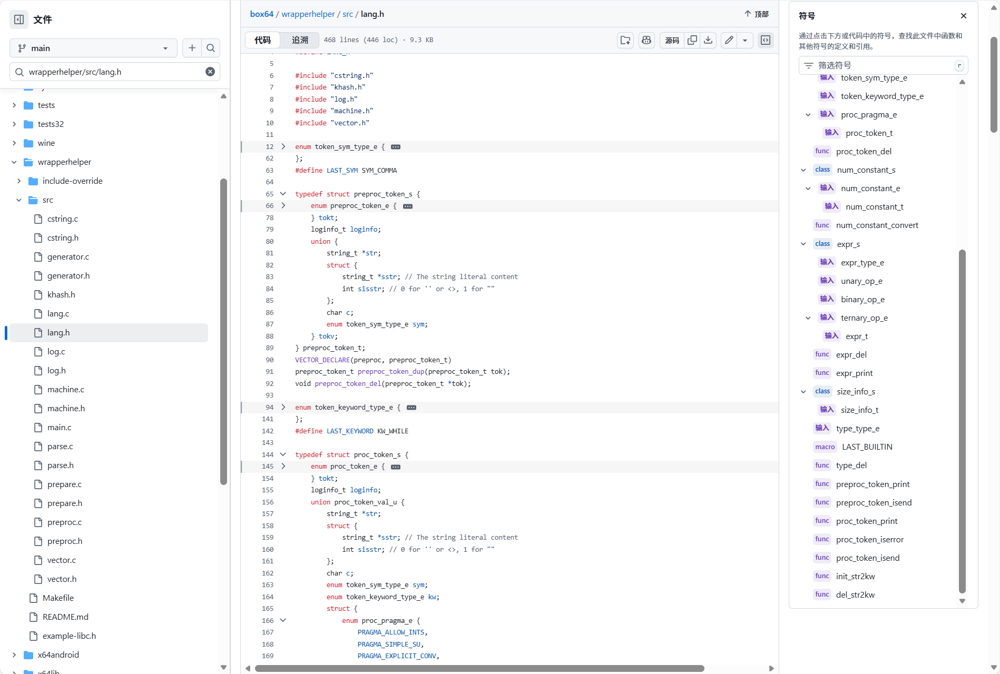
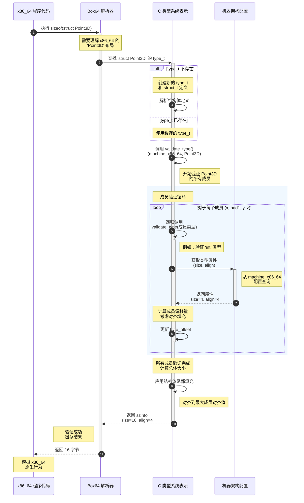

# 第 2 章：C 类型系统表示

欢迎回来

在 [第 1 章：机器架构配置](01_machine_architecture_configuration_.md) 中，我们了解了 Box64 如何识别不同计算机架构的核心规则，例如了解 x86_64 系统上 `long double` 的确切大小与较旧的 x86 系统上的大小。这个基础知识至关重要，因为在 C 编程世界中，一切都围绕着**类型**。

现在，我们将探讨 Box64 如何采用这些架构规则并构建对*每个 C 数据类型*的全面理解。本章解释了"C 类型系统表示"——Box64 所有可能的 C 数据类型的内部字典。

## 挑战：理解所有 C 数据类型

想象一下我们是一名建筑师，我们有一座房子的详细蓝图（机器配置）。但在我们建造之前，我们还需要了解房子中的每个单独组件：什么是"门"的规格？"窗户"有多大？"砖墙"与"木墙"有什么区别？这些部件如何组合在一起？

==在 C 中，数据类型就是这些组件==。它们定义了变量可以保存什么类型的数据（例如，整数、小数、字符）以及该数据在内存中的布局方式。为了让 Box64 正确地将 x86_64 程序转换为在 ARM64 机器上运行，它需要理解程序中*每个*数据片段的"蓝图"，而不仅仅是基本的内置类型。

**Box64 通过"C 类型系统表示"解决的核心问题是为每个 C 数据类型创建详细的内部模型。** 这个模型包括其基本性质（它是整数吗？指针吗？复杂结构吗？）、其大小、在内存中的对齐方式以及它可能具有的任何特殊属性。

### 用例：确定自定义数据结构（`struct`）的大小

让我们考虑一个常见的 C 构造：`struct`。这允许程序员将不同的数据类型分组到单个自定义类型中。

```c
// C 结构示例
struct Point3D {
    int x;
    char pad1; // 编译器可能会在这里插入填充
    short y;
    int z;
};
```

如果 x86_64 程序使用 `sizeof(struct Point3D)`，Box64 必须提供 x86_64 编译器会计算的*确切*大小。这不仅仅是 `sizeof(int) + sizeof(char) + sizeof(short) + sizeof(int)` 的总和。编译器通常会在成员之间添加隐藏的"填充"字节，以确保它们在内存中正确对齐，这可能会对总大小产生很大影响。这些==填充规则取决于目标机器的架构==（正如我们在第 1 章中看到的）。

Box64 需要一个内部表示来理解：
1.  `Point3D` 是一个 `struct`。
2.  它的成员是什么（`x`、`pad1`、`y`、`z`）。
3.  每个成员的*类型*（`int`、`char`、`short`）。
4.  最重要的是，如何==根据*目标*机器的规则计算其总大小和对齐==。

## Box64 如何表示 C 数据类型：`type_t` 蓝图

Box64 使用一个名为 `type_t`（"type"的缩写）的特殊数据结构来表示它遇到的每个 C 数据类型

将 `type_t` 视为任何 C 类型的通用数据表。在 `wrapperhelper/src/lang.h` 中定义。

### `type_t` 结构：通用类型描述



 `type_t` 结构

```c
typedef struct type_s {
    // 类型限定符和状态的标志
    unsigned is_const : 1;      // 这是 'const' 类型吗？
    unsigned is_atomic : 1;     // 这是 '_Atomic' 类型吗？
    unsigned is_incomplete : 1; // 其大小/布局已知吗？（例如，定义前的 'struct Foo;'）
    unsigned is_validated : 1;  // 其大小/对齐已计算吗？

    enum type_type_e {
        TYPE_BUILTIN,      // 基本类型：int、float、char、void
        TYPE_ARRAY,        // 数组：int myArray[10]
        TYPE_STRUCT_UNION, // 结构和联合：struct Foo、union Bar
        TYPE_ENUM,         // 枚举：enum Color
        TYPE_PTR,          // 指针：int* myPtr
        TYPE_FUNCTION,     // 函数签名：int func(char, float)
    } typ; // 这是什么*类型*的类型？

    union {
        enum type_builtin_e builtin; // 对于 TYPE_BUILTIN：哪个特定的内置类型？
        struct type_s *typ;          // 对于 TYPE_PTR/TYPE_ENUM：指向基本类型
        struct {                     // 对于 TYPE_ARRAY：元素类型和大小
            struct type_s *typ;
            size_t array_sz;
        } array;
        struct struct_s *st;         // 对于 TYPE_STRUCT_UNION：指向 struct/union 定义
        struct {                     // 对于 TYPE_FUNCTION：返回类型、参数
            struct type_s *ret;
            size_t nargs;
            struct type_s **args;
            // ... 更多函数详情 ...
        } fun;
    } val; // 特定于类型种类的详细信息

    struct size_info_s { // 验证后计算的大小和对齐
        size_t size, align;
    } szinfo;
    // ... 其他字段，如用于内存管理的引用计数 ...
} type_t;
```

让我们分解最重要的部分：

*   **`is_const`、`is_atomic` 等**：这些是简单的标志，表示**类型限定符**。例如，`const int*` 会为指向的 `int` 类型设置 `is_const` 标志。
*   **`typ`（枚举 `type_type_e`）**：此字段告诉我们 C 类型的*一般类别*。它是基本的 `int` 吗？指针吗？`struct` 吗？这很关键，因为 Box64 如何处理类型取决于其类别。
*   **`val`（联合）**：这是存储每个类型类别的特定详细信息的地方。
    *   如果 `typ` 是 `TYPE_BUILTIN`，`val.builtin` 告诉我们 `BTT_INT`、`BTT_FLOAT` 等。
    *   如果 `typ` 是 `TYPE_PTR`，`val.typ` 指向*另一个* `type_t`，描述指针指向什么（例如，`int*` 会有 `val.typ` 指向表示 `int` 的 `type_t`）。
    *   如果 `typ` 是 `TYPE_STRUCT_UNION`，`val.st` 指向 `struct_t` 结构，它提供 struct 或 union 的完整定义，包括其成员。
*   **`szinfo`**：此重要字段存储*目标架构*的类型的计算 `size` 和 `align`ment。这由 Box64 的 `validate_type` 函数填充，使用第 1 章中的 `machine_t` 配置。
*   **`is_incomplete`**：如果编译器只看到声明（例如，`struct MyStruct;`）而不是完整定义（`struct MyStruct { ... };`），则设置此标志。在类型完整之前，无法完全确定其 `szinfo`。

### `struct_t` 和 `st_member_t` 结构：详细说明自定义类型

当 `type_t` 描述 `struct` 或 `union`（`typ == TYPE_STRUCT_UNION`）时，其 `val.st` 字段指向 `struct_t` 对象。这个 `struct_t` 保存自定义数据结构的实际蓝图。

```c
typedef struct st_member_s {
    string_t *name;         // 成员的名称（例如，"x"、"y"）
    type_t *typ;            // 此成员的类型（例如，'int' 的 'type_t'）
    _Bool is_bitfield;      // 此成员是位字段吗？
    size_t bitfield_width;  // 如果是位字段，有多少位？
    // 由 validate_type 填充的字段：
    size_t byte_offset;     // 从结构开始的偏移量（以字节为单位）
    unsigned char bit_offset; // 字节内的偏移量（用于位字段）
} st_member_t;

typedef struct struct_s {
    string_t *tag;          // struct/union 的名称（例如，"Point3D"）
    int is_defined;         // 此 struct/union 是否完全定义？
    int is_struct;          // struct 为 1，union 为 0
    size_t nmembers;        // 它有多少成员？
    st_member_t *members;   // 成员定义数组
    // ... 其他标志，如 'has_self_recursion' ...
} struct_t;
```

*   **`struct_t`**：包含有关 struct/union 的总体信息，包括其 `tag`（名称）、它是 `struct` 还是 `union`，最重要的是 `st_member_t` 定义数组。
*   **`st_member_t`**：描述 `struct` 或 `union` *内*的每个单独成员。它保存成员的 `name` 和指向*另一个* `type_t` 的指针，该指针描述成员自己的类型（例如，`int`、`char`，甚至另一个 `struct`）。它还存储其在父结构内计算的 `byte_offset` 和 `bit_offset`。

这种嵌套结构允许 Box64 表示任意复杂的 C 类型，例如包含指向其他 `struct` 的指针数组的 `struct`。

## 解决用例：确定 `struct Point3D` 的大小

让我们重新审视我们的 `struct Point3D` 示例：

```c
struct Point3D {
    int x;
    char pad1;
    short y;
    int z;
};
```

以下是 Box64 如何使用 `type_t`、`struct_t` 和 `machine_t` 为 x86_64 目标确定其大小和对齐：



1.  **程序请求**：x86_64 程序请求 `struct Point3D` 的大小。
2.  **Box64 解析器**：解析器识别 `struct Point3D` 并需要其属性。
3.  **C 类型系统**：它查找或构造表示 `struct Point3D` 的 `type_t`。这个 `type_t` 的 `typ` 设置为 `TYPE_STRUCT_UNION`，`val.st` 指向定义 `x`、`pad1`、`y`、`z` 为成员的 `struct_t`。
4.  **`validate_type` 调用**：Box64 调用 `validate_type` 函数（来自 `wrapperhelper/src/machine.c`），传入 `x86_64` 的 `machine_t` 和 `Point3D` 的 `type_t`。
5.  **成员验证循环**：
    *   `validate_type` 遍历 `Point3D` 的 `struct_t` 中的每个成员。
    *   对于 `x`（类型 `int`）：它递归调用 `int` 的 `validate_type`。这向 `machine_x86_64` 询问 `int` 的大小（4 字节）和对齐（4 字节）。它计算 `x` 的偏移量（0 字节）。
    *   对于 `pad1`（类型 `char`）：`validate_type` 获取 `char` 的大小（1 字节）和对齐（1 字节）。其偏移量为 4 字节。
    *   对于 `y`（类型 `short`）：`validate_type` 获取 `short` 的大小（2 字节）和对齐（2 字节）。*关键的是*，因为 `char` 是 1 字节，`short` 需要 2 字节对齐，编译器可能会在 `pad1` 之后插入 1 字节填充，使 `y` 从偶数地址开始（偏移量 6）。
    *   对于 `z`（类型 `int`）：`validate_type` 获取 `int` 的大小（4 字节）和对齐（4 字节）。它将根据 `y` 的大小和对齐规则计算其偏移量。
6.  **总大小计算**：在处理所有成员并考虑填充后，`validate_type` 确定 `struct Point3D` 的总 `size`（例如，x86_64 上为 16 字节）和 `align`ment（例如，4 字节，从最大成员的对齐派生）。
7.  **结果**：此 `szinfo` 存储在 `Point3D` 的 `type_t` 中，并将大小返回给程序。

## 底层实现：内部实现细节

该系统的核心在于 `wrapperhelper/src/lang.h` 和 `wrapperhelper/src/lang.c` 中==定义 `type_t` 和 `struct_t` 结构==，以及 `wrapperhelper/src/machine.c` 中的 `validate_type` 函数，该==函数计算它们的最终大小和对齐==。

### `lang.h`：定义类型结构

我们之前看到的 `type_t` 和 `struct_t` 定义在这里找到。它们充当在 Box64 内创建 C 类型实例的蓝图。

```c
// ... (如上所示的 type_t 定义) ...
typedef struct st_member_s {
	string_t *name;
	type_t *typ; // 递归！type_t 指向其他 type_t 或 struct_t。
	_Bool is_bitfield;
	size_t bitfield_width;
	size_t byte_offset;
	unsigned char bit_offset;
} st_member_t;

typedef struct struct_s {
	string_t *tag;
	int is_defined; // 是否已解析完整定义？
	int is_struct;  // struct 为 1，union 为 0
	size_t nmembers;
	st_member_t *members; // 成员数组
    // ...
} struct_t;
```
注意 `st_member_t` 如何包含 `type_t* typ`，这==允许成员是任何 C 类型，包括其他 `struct` 或指针==。这种递归性质是表示复杂 C 类型的基础。

像 `type_new()` 和 `struct_new()` 这样的辅助函数用于在 Box64 解析 C 代码时创建这些结构的新实例。

```c
// wrapperhelper/src/lang.c
type_t *type_new(void) {
    type_t *ret = malloc(sizeof *ret);
    // ... 初始化 ...
    ret->typ = TYPE_BUILTIN; // 默认为 int，将在解析期间更改
    ret->val.builtin = BTT_INT;
    ret->nrefs = 1; // 从一个引用开始
    return ret;
}

struct_t *struct_new(int is_struct, string_t *tag) {
    struct_t *ret = malloc(sizeof *ret);
    // ... 初始化 ...
    ret->is_struct = is_struct;
    ret->tag = tag; // 存储结构的名称
    ret->is_defined = 0; // 尚未定义，仅声明
    ret->nrefs = 1;
    return ret;
}
```
`type_new` 和 `struct_new` 是基本的分配和初始化函数

`nrefs`（引用计数）字段对于内存管理很重要：类型通常是共享的，只有在没有任何东西指向它们时才会被释放。

### `machine.c`：`validate_type` 函数

第 1 章中介绍的 `validate_type` 函数是将 `type_t` 信息与 `machine_t` 配置合并以计算最终 `szinfo`（大小和对齐）的地方。

```c
//  wrapperhelper/src/machine.c
int validate_type(loginfo_t *loginfo, machine_t *target, type_t *typ) {
    if (typ->is_validated) return 1; // 已处理！
    typ->is_validated = 1; // 标记为正在处理

    switch (typ->typ) {
    case TYPE_BUILTIN:
        // 处理 int、float、char、long double 等。
        // 直接使用 target->size_longdouble、target->max_align 等。
        // 示例：
        case BTT_LONGDOUBLE:
            typ->szinfo.align = target->align_longdouble;
            typ->szinfo.size = target->size_longdouble;
            return 1;
        // ... 许多其他内置情况 ...

    case TYPE_PTR: // 指针始终具有 long 整数的大小和对齐
        typ->szinfo.size = target->size_long;
        typ->szinfo.align = target->size_long;
        // 递归验证它指向的类型
        return validate_type(loginfo, target, typ->val.typ);

    case TYPE_ARRAY:
        // 递归获取元素类型的大小/对齐
        if (!validate_type(loginfo, target, typ->val.array.typ)) return 0;
        // 根据 array_sz 和元素大小计算总大小
        typ->szinfo.size = typ->val.array.array_sz * typ->val.array.typ->szinfo.size;
        typ->szinfo.align = typ->val.array.typ->szinfo.align;
        return 1;

    case TYPE_STRUCT_UNION: {
        // 这是计算 struct/union 布局的地方
        if (!typ->val.st->is_defined) return typ->is_incomplete; // 未定义的结构没有大小
        size_t max_align = 1, current_size = 0;
        for (size_t i = 0; i < typ->val.st->nmembers; ++i) {
            st_member_t *member = &typ->val.st->members[i];
            // 递归验证每个成员的类型
            if (!validate_type(loginfo, target, member->typ)) return 0;

            // 根据成员的对齐更新 max_align
            if (max_align < member->typ->szinfo.align) max_align = member->typ->szinfo.align;

            if (typ->val.st->is_struct) {
                // 对于结构，添加填充然后添加成员大小
                current_size = (current_size + member->typ->szinfo.align - 1) & ~(member->typ->szinfo.align - 1);
                member->byte_offset = current_size; // 存储成员的偏移量
                current_size += member->typ->szinfo.size;
            } else { // 它是联合
                // 对于联合，大小是所有成员的最大值
                if (current_size < member->typ->szinfo.size) current_size = member->typ->szinfo.size;
            }
        }
        // 最终 struct/union 大小填充到其整体对齐
        typ->szinfo.align = max_align;
        typ->szinfo.size = (current_size + max_align - 1) & ~(max_align - 1);
        return 1;
    }
    // ... 其他类型类别（函数、枚举）...
    }
    return 0; // 失败
}
```
`validate_type` ：

*   它如何使用 `target` `machine_t`（来自第 1 章）来获取内置类型的大小和对齐。
*   **递归性质**：`validate_type` 为指针目标、数组元素和 `struct`/`union` 的成员调用自身。这确保所有嵌套类型都正确调整大小。
*   **struct 布局**的逻辑：它通过遍历成员来计算 `current_size` 和 `max_align`。对于 `struct`，它添加填充（`current_size = (current_size + align - 1) & ~(align - 1);`），然后添加成员的大小。对于 `union`，它只是跟踪 `max_size`。
*   最后，它根据 `max_align` 将整体填充应用于结构的 `typ->szinfo.size`。

这种复杂的计算==确保 Box64 准确模拟 x86_64 编译器会生成的内存布局，无论它在哪个主机机器上运行==。

## 结论

在本章中，我们探讨了 Box64 的"C 类型系统表示"。我们了解了 Box64 如何使用 `type_t` 作为通用蓝图来描述任何 C 数据类型，从简单的整数到复杂的嵌套结构和函数签名。

我们看到了 `struct_t` 和 `st_member_t` 如何为自定义数据结构提供详细定义，以及 `validate_type` 函数如何将这些类型定义与 [机器架构配置](01_machine_architecture_configuration_.md) 中的架构规则相结合，以确定它们的确切大小和对齐。

这个强大的类型系统是 Box64 理解和正确转换 x86_64 程序能力的基础。在下一章中，我们将把重点转移到 Box64 在==处理代码时如何提供清晰的反馈和处理问题==：[日志记录和错误报告](03_logging_and_error_reporting_.md)。（调试和构造一样重要，因为构造就是在不断调试和迭代的过程中完成的）

