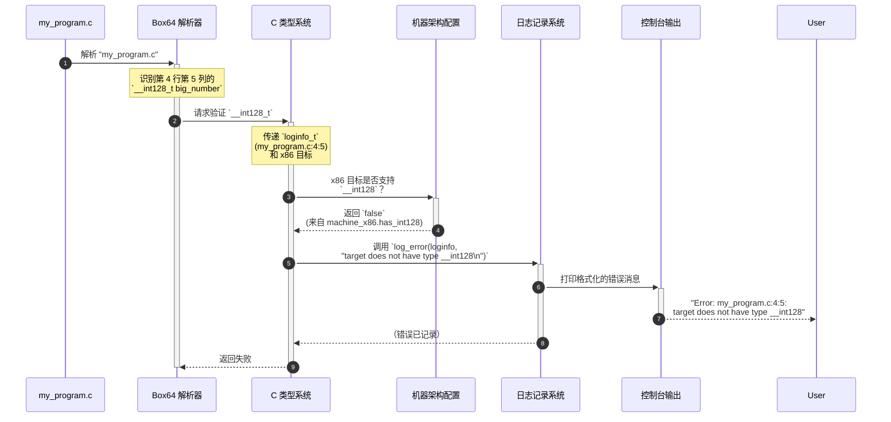

# 第 3 章：日志记录和错误报告

欢迎回来

在 [第 2 章：C 类型系统表示](02_c_type_system_representation_.md) 中，我们了解了 Box64 如何创建所有 C 数据类型的内部映射，使用架构规则来确定它们的大小和布局。但是当 Box64 遇到它不理解的东西，或者在这个复杂过程中出现问题时会发生什么？它如何告诉我们出了什么问题，更重要的是，在原始源代码中*哪里*出了问题？这就是"日志记录和错误报告"的作用。

## 挑战：理解正在发生的事情

想象 Box64 是一位技艺精湛的翻译。它试图将 x86_64 程序的概念转换为 ARM64 机器可以理解的东西。在这个复杂的翻译过程中，许多事情可能会出错：
*   原始 x86_64 程序可能使用了在 ARM64 目标上根本不可用或未明确定义的功能（如非常特定的数据类型）。
*   Box64 自己的内部逻辑可能遇到意外情况。
*   配置文件可能丢失，或者 Box64 本身可能存在错误。

如果没有清晰的系统来报告这些事件，开发人员将完全迷失。他们不知道程序失败是因为其自身代码中的问题、Box64 的限制还是目标架构的问题。

**Box64 通过"日志记录和错误报告"解决的核心问题是提供关于其操作的清晰、标准化的消息，包括在处理源代码时发生问题时的精确位置信息。** 这就像一个全面的警报系统，引导开发人员理解程序行为、识别问题并准确定位问题的起源。

### 用例：报告不支持的类型

让我们重温 [第 1 章：机器架构配置](01_machine_architecture_configuration_.md) 中的一个场景。我们看到某些架构（如较旧的 32 位 x86）不支持 128 位整数（`__int128`）。

考虑名为 `my_program.c` 的文件中的这个简单 C 代码片段：

```c
// my_program.c
#include <stdio.h>

int main() {
    __int128_t big_number = 12345; // 第 4 行，第 5 列
    printf("Big number: %llu\n", (unsigned long long)big_number);
    return 0;
}
```

如果 Box64 的 `wrapperhelper` 试图为*不*支持 `__int128_t` 的目标架构（例如，32 位 x86 系统）处理此代码，它需要清楚地告诉我们。更重要的是，它需要告诉我们*确切地*在 `my_program.c` 的哪里发生了这个问题。一个好的错误消息应该是这样的：

`Error: my_program.c:4:5: target does not have type __int128`

这种详细的报告对开发人员来说非常宝贵。

## Box64 如何报告事件：`loginfo_t` 和日志记录函数

Box64 使用一个名为 `loginfo_t`（"log information"的缩写）的特殊结构来捕获源代码中发生事件或错误的确切位置。然后，它使用各种日志记录函数来打印具有不同严重性级别的消息。

### `loginfo_t` 蓝图：精确定位位置

`loginfo_t` 结构在 `wrapperhelper/src/log.h` 中定义，就像我们代码的"GPS 坐标"。

```c
// 简化自 wrapperhelper/src/log.h
typedef struct loginfo_s {
    const char *filename; // 文件名（例如，"my_program.c"）
    size_t lineno;        // 起始行号（例如，4）
    size_t colno;         // 起始列号（例如，5）
    size_t lineno_end;    // 结束行号（对多行错误有用）
    size_t colno_end;     // 结束列号
} loginfo_t;
```
*   `filename`：正在处理的 C 源文件的名称。
*   `lineno`、`colno`：与日志消息相关的代码段的起始行号和列号。这通常是快速找到问题的最重要部分。
*   `lineno_end`、`colno_end`：这些提供可选的结束位置，对于突出显示代码范围很有用，尽管通常起始位置对于初学者级别的错误就足够了。

### 不同类型的警报：日志记录函数

Box64 提供了几个函数来报告不同类型的消息，从次要警告到严重错误。每个函数都接受一个 `loginfo_t`（或者如果没有可用位置则使用特殊占位符）和一个格式化消息（如 `printf`）。

| 函数名称       | 目的                                  | 严重性   |
| :------------- | :------------------------------------ | :------- |
| `log_error`    | 报告重大错误，通常会停止处理。        | **高**   |
| `log_warning`  | 报告可能仍允许处理的潜在问题。        | 中等     |
| `log_internal` | 报告 Box64 自身代码中的错误（错误）。 | **严重** |
| `log_TODO`     | 报告尚未实现的功能。                  | 中等     |
| `log_memory`   | 报告严重的内存分配失败。              | **致命** |

这些函数确保消息被清晰分类并一致格式化，使开发人员更容易理解问题的性质。

## 解决用例：`validate_type` 报告错误

让我们看看我们的 `validate_type` 函数（来自 `wrapperhelper/src/machine.c`），我们在第 1 章和第 2 章中讨论过，如何使用这个日志记录系统来报告 `__int128` 错误。

```c
// 简化自 wrapperhelper/src/machine.c
int validate_type(loginfo_t *loginfo, machine_t *target, type_t *typ) {
    // ... 其他检查 ...

    switch (typ->typ) {
    case TYPE_BUILTIN:
        switch (typ->val.builtin) {
            // ... char、int、float 等的情况 ...
            
        case BTT_INT128: // 处理 '__int128' 时
        case BTT_SINT128:
        case BTT_UINT128:
            if (!target->has_int128) { // 如果目标机器没有 __int128
                // 这里：我们使用 log_error 来报告问题！
                log_error(loginfo, "target does not have type __int128\n");
                typ->szinfo.align = typ->szinfo.size = 0; return 0; // 错误！
            }
            // 如果有，继续设置 size/align
            /* FALLTHROUGH */
        // ... 其他类型 ...
        }
    // ... 其他类型类别 ...
    }
    return 0; // 如果没有匹配的情况则失败
}
```

在这个片段中：
1.  当 `validate_type` 遇到类型 `BTT_INT128`（表示 `__int128`）时。
2.  它检查 `target->has_int128`（来自 [机器架构配置](01_machine_architecture_configuration_.md)）。
3.  如果 `target->has_int128` 是 `0`（假），这意味着当前目标架构不支持 `__int128`。
4.  然后 Box64 调用 `log_error`。它传递 `loginfo`（包含在 `my_program.c` 中找到 `__int128` 的 `filename`、`lineno`、`colno`）和错误消息 "target does not have type \_\_int128\n"。
5.  最后，`validate_type` 返回 `0` 以表示失败。

### `__int128` 错误的示例流程



这个序列显示了 `loginfo_t` 如何随着解析过程传递，当满足错误条件时，它被日志记录系统直接使用，为用户提供精确且有用的消息。

## 底层实现：实现日志记录系统

日志记录系统主要在 `wrapperhelper/src/log.h`（用于声明）和 `wrapperhelper/src/log.c`（用于定义）中实现。

### `log.h`：定义接口

以下是 `log.h` 的关键部分：

```c
// 简化自 wrapperhelper/src/log.h
#ifndef __LOG_H__
#define __LOG_H__

#include <stddef.h>

// 保存源代码位置信息的结构
typedef struct loginfo_s {
	const char *filename; // NULL = 无日志信息
	size_t lineno;        // 0 = 无（起始）行/列号
	size_t colno;
	size_t lineno_end;    // 0 = 无结束行/列号
	size_t colno_end;
} loginfo_t;

// 帮助编译器检查类似 printf 的格式字符串的属性
#define ATTRIBUTE_FORMAT(i, j) __attribute__((format(printf, i, j)))

// 不同日志级别的函数声明
void loginfo_print(const loginfo_t *info, int print_sz); // 打印 loginfo 的内部辅助函数
void log_error(const loginfo_t *info, const char *format, ...) ATTRIBUTE_FORMAT(2, 3);
void log_internal(const loginfo_t *info, const char *format, ...) ATTRIBUTE_FORMAT(2, 3);
void log_memory(const char *format, ...) ATTRIBUTE_FORMAT(1, 2);
void log_TODO(const loginfo_t *info, const char *format, ...) ATTRIBUTE_FORMAT(2, 3);
void log_warning(const loginfo_t *info, const char *format, ...) ATTRIBUTE_FORMAT(2, 3);

// 当没有可用位置信息时的辅助宏
#define log_error_nopos(...) log_error(&(loginfo_t){0}, __VA_ARGS__)
// ... log_internal_nopos、log_TODO_nopos、log_warning_nopos 的类似宏 ...

#endif // __LOG_H__
```
*   如前所述，`loginfo_t` 结构在这里定义。
*   `ATTRIBUTE_FORMAT(i, j)` 是一个特殊的编译器提示。它告诉编译器检查传递给 `log_error`（或类似函数）的参数是否与 `printf` 样式的格式字符串匹配，就像它对 `printf` 本身所做的那样。这有助于及早发现常见错误。`i` 指格式字符串参数索引，`j` 指第一个可变参数索引。
*   列出了函数声明（`log_error`、`log_warning` 等）。
*   `log_error_nopos` 宏很方便。如果 Box64 的某个部分想要记录错误但没有特定的文件/行/列信息（例如，初始设置期间的错误），它可以使用 `log_error_nopos("Initialization failed\n")`。此宏自动创建一个用零/NULL 填充的临时 `loginfo_t` 结构，有效地告诉 `loginfo_print` 不要显示位置信息。

### `log.c`：核心逻辑

`log.c` 文件包含这些函数的实际实现。

#### `loginfo_print`：格式化位置

这个辅助函数负责获取 `loginfo_t` 并以一致的方式打印文件、行和列信息。

```c
// 简化自 wrapperhelper/src/log.c
void loginfo_print(const loginfo_t *info, int print_sz) {
	if (!info || !info->filename) { // 如果没有信息或没有文件名，不打印任何内容或填充
		if (print_sz > 0) printf("%*s", print_sz, ""); // print_sz 用于对齐
		return;
	}
	print_sz -= printf("%s:", info->filename); // 打印文件名
	if (!info->lineno) { // 如果没有行号，在这里停止
		print_sz -= printf(" ");
		if (print_sz > 0) printf("%*s", print_sz, "");
		return;
	}
	print_sz -= printf("%zu:", info->lineno); // 打印行号
	if (!info->colno) { // 如果没有列号，在这里停止
		print_sz -= printf(" ");
		if (print_sz > 0) printf("%*s", print_sz, "");
		return;
	}
	print_sz -= printf("%zu", info->colno); // 打印列号
	// ... lineno_end/colno_end 的逻辑（为清晰起见简化）...
	print_sz -= printf(": "); // 添加最后的冒号和空格
	if (print_sz > 0) printf("%*s", print_sz, "");
}
```
此函数智能地仅打印 `loginfo_t` 中可用的信息。如果 `filename` 是 `NULL`，它不打印任何内容。如果 `lineno` 是 `0`，它只打印文件名。这种灵活性允许消息被正确格式化，无论是否存在完整的位置信息。`print_sz` 参数用于输出的可选对齐，但对于初学者，我们现在可以忽略它。

#### `log_error`：将所有内容组合在一起

`log_error` 函数（以及其他类似 `log_warning` 的函数）结合了前缀、位置和实际消息。

```c
// 简化自 wrapperhelper/src/log.c
#include "log.h"
#include <stdarg.h> // 用于 va_list、va_start、vprintf、va_end
#include <stdio.h>

void log_error(const loginfo_t *info, const char *format, ...) {
	printf("Error: "); // 打印 "Error: " 前缀
	loginfo_print(info, 0); // 打印位置信息（filename:lineno:colno）
	va_list args;           // 声明可变参数列表
	va_start(args, format); // 用 'format' 后的参数初始化它
	vprintf(format, args);  // 使用 vprintf 打印实际消息
	va_end(args);           // 清理可变参数列表
}
// log_internal、log_memory、log_TODO、log_warning 的类似实现
```
*   `printf("Error: ");`：这打印错误消息的标准前缀。
*   `loginfo_print(info, 0);`：这调用我们的辅助函数来打印源代码位置，使用 `print_sz` 为 `0`，因为我们不关心这里的特定对齐。
*   `va_list args; va_start(args, format); vprintf(format, args); va_end(args);`：这是接受可变数量参数的函数的标准 C 样板代码（如 `printf`）。`vprintf` 是与 `va_list` 一起使用的 `printf` 版本。这允许 `log_error` 接受格式字符串和参数，就像 `printf` 一样，为详细的错误消息提供了极大的灵活性。

这种结构化方法确保 Box64 生成的所有日志消息都是一致的、易于阅读的，并包含调试和理解 `wrapperhelper` 行为所需的重要信息。

## 结论

在本章中，我们探讨了 Box64 的"日志记录和错误报告"系统。我们了解了为什么清晰的、位置感知的消息对于像 Box64 这样的复杂项目至关重要，以及 `loginfo_t` 结构如何充当代码的"GPS 坐标"。我们看到了不同的日志记录函数（`log_error`、`log_warning` 等）如何提供标准化的方式来报告具有不同严重性级别的事件。最后，我们了解了 `loginfo_print` 如何格式化位置数据，以及 `log_error` 如何使用可变参数组合前缀、位置和自定义消息。

这个系统对于使 Box64 的内部过程透明和可调试至关重要。接下来，我们将继续探索 Box64 如何通过==探索 [预处理器指令处理](04_preprocessor_directive_handling_.md) 来处理 C 代码的复杂性==。

