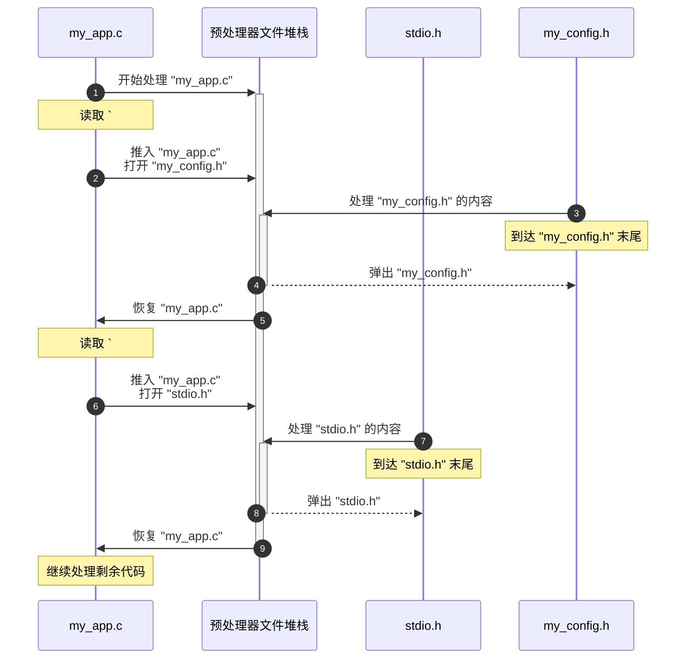

# 第 4 章：预处理器指令处理

欢迎回来

在 [第 3 章：日志记录和错误报告](03_logging_and_error_reporting_.md) 中，我们探讨了 Box64 如何提供重要反馈并精确定位它处理的 C 源代码中的问题。在所有这些日志记录或深入类型分析发生之前，==Box64 需要理解原始 C 文本本身==。这就是"预处理器指令处理"的作用。

## 挑战：组织原始 C 代码

想象一下我们正在准备一份非常重要的报告。这份报告不仅仅是一个文档；它是许多子文档的集合，其中一些可能只在特定条件下相关（例如，"仅在我们处于'欧洲'市场时包含此部分"）。此外，草稿中充满了需要在最终版本之前删除的注释和评论。

C 源代码非常相似。程序员使用：
*   `#include` 指令从其他文件引入代码（如导入子文档）。
*   条件编译指令，如 `#ifdef`、`#else` 和 `#endif`，根据各种条件选择不同的代码块（如根据市场条件包含部分）。
*   注释（`//` 或 `/* ... */`）来解释代码，这些需要在编译代码之前剥离掉。

在 Box64 甚至开始理解 C 程序的类型或结构之前（如 [第 2 章：C 类型系统表示](02_c_type_system_representation_.md) 中所讨论的），它首先需要处理所有这些指令。如果不这样做，它将尝试解析代码的不完整或不正确版本。

**Box64 通过"预处理器指令处理"解决的核心问题是==将原始的、混乱的 C 源文件转换为干净、完整且正确的有意义的"单词"（标记）流==，以便解析的下一阶段可以理解。** 

就像一位细致的秘书组织传入的文档：引入相关的子文档，过滤掉不相关的部分，并删除所有内部注释，==只留下最终的、可操作的文本==。

### 用例：准备复杂的 C 文件

让我们考虑一个常见的 C 源文件，`my_app.c`：

```c
// my_app.c
#include "my_config.h" // 本地配置文件
#include <stdio.h>     // 标准系统头文件

#define VERSION_MAJOR 1
#define DEBUG_BUILD   // 这个宏只是被定义

// 条件代码块
#ifdef DEBUG_BUILD
    int log_level = 3; // 在调试模式下记录所有内容
    /* 多行
     * 注释块 */
#else
    int log_level = 1; // 在生产环境中只记录严重错误
#endif

void greet() {
    // 单行注释
    printf("App version %d.%d\n", VERSION_MAJOR, 0);
}
```

为了让 Box64 正确处理此文件，其预处理器必须：
1.  **处理 `#include`**：查找并将 `my_config.h` 和 `stdio.h` 的内容插入到流中，完全按照真正的 C 编译器的方式。
2.  **评估 `#define`**：跟踪 `VERSION_MAJOR` 是 `1`，`DEBUG_BUILD` 已定义。（详细的宏处理将在 [第 5 章：宏系统](05_macro_system_.md) 中介绍，但预处理器需要知道它们）。
3.  **处理条件块**：由于 `DEBUG_BUILD` 已定义，它应该包含 `int log_level = 3;` 并完全丢弃 `int log_level = 1;`。
4.  **删除注释**：剥离 `// 本地配置文件`、`/* 多行 ... */` 和 `// 单行注释`。
5.  **替换宏**：在 `printf("App version %d.%d\n", VERSION_MAJOR, 0);` 中，它应该将 `VERSION_MAJOR` 替换为 `1`。

只有在这些步骤之后，解析器才会看到一个连贯的标记流，如 `void`、`greet`、`(`、`)`、`{`、`printf`、`(`、`"App version %d.%d\n"`、`,`、`1`、`,`、`0`、`)`、`;`、`}`。

## Box64 如何处理预处理器指令

Box64 的预处理器分阶段工作，就像工厂流水线一样。

### 1. 初始文本清理：`prepare_t` 阶段（原始文本处理器）

在其他任何事情之前，Box64 需要将文件中的原始字符转换为基本的"预处理器标记"并去除注释。这由 `prepare_t` 抽象处理。

**类比**：将 `prepare_t` 视为我们秘书团队中的第一个人。他们接收原始的手写笔记，擦除所有涂鸦（注释），处理棘手的格式，如延续到下一页的行（行尾的 `\`），并将所有内容组织成基本的、可理解的"单词"或"符号"。他们还不理解这些单词的含义，只是知道它们是不同的文本片段。

`prepare_t` 负责：
*   从输入文件读取单个字符。
*   将字符组合成更高级别的单元，如标识符（例如，`printf`、`DEBUG_BUILD`）、数字（例如，`1`、`0`）和字符串（例如，`"Hello"`）。
*   删除 `//`（单行）和 `/* ... */`（多行）注释。
*   处理行继续，其中行尾的反斜杠 `\` 意味着下一行是当前行的继续。
*   跟踪当前文件、行号和列号，以便准确报告错误（使用 [第 3 章：日志记录和错误报告](03_logging_and_error_reporting_.md) 中的 `loginfo_t`）。

**代码片段：获取原始字符和处理注释（`prepare.c`）**

```c
// 简化自 wrapperhelper/src/prepare.c

// 此函数读取下一个字符，处理行尾和反斜杠继续。
static char_t get_char(prepare_t *src) {
    // ... 缓冲区处理 ...
    int c = getc(src->f); // 从文件读取一个字符
    if (c == '\\') { // 如果是反斜杠
        c = getc(src->f); // 读取下一个字符
        if (c == '\n' || c == '\r') { // 如果是换行符，这是行继续
            ++src->li.lineno; // 增加行号
            src->li.colno = 1; // 重置列
            return get_char(src); // 递归获取*真正的*下一个字符
        }
        // ... 分别存储反斜杠和下一个字符 ...
    }
    // ... 处理 '\n'、'\r' 并更新行/列信息 ...
    return (char_t){ .c = c, .li = src->li }; // 返回字符及其位置
}

// 这是获取下一个预处理器标记的主要函数。
preproc_token_t pre_next_token(prepare_t *src, int allow_comments) {
    // ... 跳过空白的逻辑 ...
    char_t c = get_char(src); // 获取下一个字符

    if (c.c == '/') { // 可能是注释的开始
        char_t c2 = get_char(src);
        if (c2.c == '/') { // 这是单行注释（//）
            do {
                c2 = get_char(src); // 读取直到换行符或 EOF
            } while ((c2.c != EOF) && (c2.c != '\n'));
            // 注释被删除，所以我们循环回去获取下一个真正的标记
            if (c2.c != EOF) unget_char(src, c2); // 如果不是 EOF，放回换行符
            goto start_next_token; // 重新开始标记提取
        } else if (c2.c == '*') { // 这是多行注释（/*）
            int last_star = 0;
            while ((c2.c != EOF) && (!last_star || (c2.c != '/'))) {
                last_star = c2.c == '*'; // 跟踪上一个字符是否为 '*'
                c2 = get_char(src);
            }
            if (c2.c != EOF) goto start_next_token; // 循环回去
            // ... 如果注释未完成则报错 ...
        } else {
            unget_char(src, c2); // 不是注释，放回 c2
        }
    }
    // ... 解析标识符、数字、字符串和符号的其他逻辑 ...
    // ... 最后返回 preproc_token_t（例如，标识符标记、数字标记）...
}
```
这个简化的代码片段显示了 `get_char` 如何检索字符，处理常见的 C 特定格式，如行继续。当 `pre_next_token` 遇到 `//` 或 `/*` 时，它会消耗所有字符直到注释结束，有效地从更高级别处理将看到的标记流中"擦除"它们。

### 2. 协调文件：`preproc_t` 阶段（项目经理）

`preproc_t` 抽象从 `prepare_t` 获取基本标记，并执行核心预处理器任务：处理 `#include` 指令、条件编译和宏展开。

**类比**：`preproc_t` 是我们的项目经理。当它看到 `#include` 指令时，它会暂停当前任务，打开一个"子项目"（包含的文件），完全处理该项目，然后在完全离开的地方恢复主项目。对于条件编译，它充当决策者，根据预定义的条件（`#ifdef`）选择要执行的计划部分。

#### 文件包含（`#include`）

Box64 通过维护输入文件的"堆栈"来处理嵌套的 `#include` 指令。当一个新文件被 `#include` 时，它被推入堆栈。当包含的文件到达其末尾时，它被弹出，并在前一个文件中恢复处理。



**底层实现：`ppsource_t` 堆栈（`preproc.c`）**

`preproc_t` 结构保存一个 `VECTOR(ppsource) *prep`。这个 `prep` 向量实际上是 `ppsource_t` 对象的堆栈，其中每个 `ppsource_t` 表示当前的标记源（文件的 `prepare_t` 或展开的宏序列）。

```c
// 简化自 wrapperhelper/src/preproc.h 和 preproc.c
typedef struct ppsource_s {
    enum ppsrc_e {
        PPSRC_PREPARE = 0, // 源是由 'prepare_t' 准备的文件
        // ... 其他类型，如用于宏展开的 PPSRC_PPTOKENS ...
    } srct;
    union {
        struct {
            prepare_t *st; // 指向文件的实际 'prepare_t' 对象的指针
            char *old_dirname; // 前一个文件的目录
            char *old_filename; // 前一个文件的名称
            // ... 条件编译深度信息 ...
        } prep;
        // ... 其他源类型的联合成员 ...
    } srcv;
} ppsource_t;

// 打开新文件（本地或系统头文件）的函数
static int try_open_dir(preproc_t *src, string_t *filename) {
    // ... 构造完整路径（例如，"my_app_dir/my_config.h"）...
    FILE *f = fopen(fn, "r"); // 尝试打开文件
    if (f) {
        // 为此文件创建新的 'ppsource_t'
        // 将其推入 'src->prep' 堆栈
        // 更新 'src' 中的当前文件/目录信息
        return 1; // 成功
    }
    return 0; // 失败
}

// 系统包含路径的类似函数
static int try_open_sys(preproc_t *src, string_t *filename, size_t array_off) {
    // ... 遍历标准包含路径（来自 machine_t 配置）...
    // ... 类似于 try_open_dir 的逻辑，打开并将文件推入堆栈 ...
    return 0; // 失败
}
```
当 `preproc_t` 启动时，它首先将初始文件（`my_app.c`）推入其 `prep` 堆栈。然后，它*还*自动包含系统特定的头文件，如 `stdc-predef.h`，以定义标准宏，确保 Box64 正确镜像真实编译器的环境。

```c
// 简化自 wrapperhelper/src/preproc.c
preproc_t *preproc_new_file(machine_t *target, FILE *f, char *dirname, const char *filename) {
    preproc_t *ret = malloc(sizeof *ret);
    // ... 宏、内部状态等的初始化 ...

    // 将初始文件推入堆栈
    if (!vector_push(ppsource, ret->prep, PREPARE_NEW_FILE(f, filename, NULL, NULL, 0, 0))) {
        // ... 错误处理 ...
    }

    // 还包含 'stdc-predef.h'（它将在请求的文件之前解析）
    string_t *stdc_predef = string_new_cstr("stdc-predef.h");
    if (!try_open_sys(ret, stdc_predef, 0)) {
        log_error_nopos("failed to open file 'stdc-predef.h'\n");
        // ... 错误处理 ...
    }
    string_del(stdc_predef);
    return ret;
}
```
`preproc_new_file` 确保当 Box64 开始处理 C 文件时，它首先通过包含特定于架构的 `stdc-predef.h`（来自 `wrapperhelper/include-override/`）来设置必要的环境。这些文件包含关键的预定义宏，如 `__SIZEOF_LONG__`，它们模拟真实编译器的环境，直接使用我们在 [第 1 章：机器架构配置](01_machine_architecture_configuration_.md) 中看到的 `machine_t` 配置。

#### 选择性代码：条件编译（`#if` 和相关指令）

在处理注释和文件包含之后，`preproc_t` 评估条件指令，如 `#if`、`#ifdef`、`#else` 和 `#endif`。这决定了哪些代码块实际传递到解析的下一阶段。

**类比**：这就像我们的项目经理查阅规则手册。如果规则手册说"DEBUG_MODE 处于活动状态"，他们会保留报告的调试特定部分并跳过生产特定部分。这个过程可以嵌套，就像规则中的子规则。

Box64 维护内部"深度"计数器来跟踪嵌套的 `#if` 块。当它处于应该跳过的部分时，它会消耗并丢弃标记，直到找到改变条件的指令（`#elif`、`#else`、`#endif`）。

**底层实现：条件逻辑（`preproc.c`）**

`preproc.c` 中的 `proc_next_token_aux` 函数包含一个循环（`check_if_depth`），负责在预处理器处于"非活动"条件块时跳过标记。

```c
// 简化自 wrapperhelper/src/preproc.c

// 此函数获取下一个处理的标记，处理预处理器指令。
static proc_token_t proc_next_token_aux(preproc_t *src) {
    // ... 检查未获取的标记 ...

check_if_depth:
    // 检查我们当前是否处于非活动条件块中
    ppsource_t *ppsrc = &vector_last(ppsource, src->prep); // 获取当前源
    if ((ppsrc->srct == PPSRC_PREPARE) && (ppsrc->srcv.prep.ok_depth != ppsrc->srcv.prep.cond_depth)) {
        // 我们在条件为假的 #if 块内。
        // 我们必须忽略所有标记，直到匹配的 #elif、#else 或 #endif。
        while (1) { // 循环跳过标记
            preproc_token_t tok = ppsrc_next_token(src); // 获取原始预处理标记

            if (tok.tokt == PPTOK_NEWLINE) { src->st = PPST_NL; } // 跟踪换行符
            else if (tok.tokt == PPTOK_EOF) {
                // 在条件块仍然打开时到达文件末尾。
                log_warning(&tok.loginfo, "file ended before closing all conditionals\n");
                vector_pop(ppsource, src->prep); // 弹出当前文件
                goto check_if_depth; // 检查堆栈上的下一个文件（如果有）
            }
            // 如果它是行首的 '#'（src->st == PPST_NL），
            // 则将其作为预处理器命令处理。
            else if ((tok.tokt == PPTOK_SYM) && (src->st == PPST_NL) && (tok.tokv.sym == SYM_HASH)) {
                src->st = PPST_NONE;
                tok = ppsrc_next_token(src); // 获取命令（例如，"if"、"else"）

                // 处理 #if/#ifdef/#ifndef：增加 cond_depth
                if (!strcmp(string_content(tok.tokv.str), "if") ||
                    !strcmp(string_content(tok.tokv.str), "ifdef") ||
                    !strcmp(string_content(tok.tokv.str), "ifndef")) {
                    ++ppsrc->srcv.prep.cond_depth; // 嵌套条件，仍在跳过
                    // ... 消耗标记直到换行符 ...
                }
                // 处理 #elif：如果我们刚刚跳过，则评估条件
                else if (!strcmp(string_content(tok.tokv.str), "elif")) {
                    if ((ppsrc->srcv.prep.ok_depth == ppsrc->srcv.prep.cond_depth - 1) && !ppsrc->srcv.prep.entered_next_ok_cond) {
                        // 这个 #elif 可能为真并允许标记通过
                        // ... 使用 preproc_eval 评估 #elif 条件 ...
                        // 如果为真，增加 ok_depth 并从跳过循环中断
                        // 如果为假，继续跳过
                    }
                    // ... 消耗标记直到换行符 ...
                }
                // 处理 #else：切换跳过状态
                else if (!strcmp(string_content(tok.tokv.str), "else")) {
                    if ((ppsrc->srcv.prep.ok_depth == ppsrc->srcv.prep.cond_depth - 1) && !ppsrc->srcv.prep.entered_next_ok_cond) {
                        // 我们正在跳过，现在我们进入 #else 块
                        ++ppsrc->srcv.prep.ok_depth; // 开始处理此块
                        // ... 消耗标记直到换行符 ...
                        goto check_if_depth; // 重新开始标记处理
                    }
                    // ... 消耗标记直到换行符（仍在跳过）...
                }
                // 处理 #endif：减少深度，可能停止跳过
                else if (!strcmp(string_content(tok.tokv.str), "endif")) {
                    // 减少条件深度
                    --ppsrc->srcv.prep.cond_depth;
                    // 如果 ok_depth 匹配条件深度，也减少它
                    if (ppsrc->srcv.prep.ok_depth > ppsrc->srcv.prep.cond_depth) {
                        --ppsrc->srcv.prep.ok_depth;
                    }
                    // ... 消耗标记直到换行符 ...
                    goto check_if_depth; // 重新开始标记处理
                }
                // ... 处理其他指令，如 #define、#undef、#error、#warning、#pragma ...
            }
            preproc_token_del(&tok); // 删除跳过的标记
        }
    }
    // 如果我们到达这里，我们处于活动条件块（或没有条件块）
    // 并且可以继续获取下一个实际标记。
    // ... 继续正常获取和处理标记 ...
}
```
`ppsrc->srcv.prep.ok_depth` 和 `ppsrc->srcv.prep.cond_depth` 变量在这里至关重要。`cond_depth` 跟踪 `#if`/`#ifdef`/`#ifndef` 指令的嵌套级别。`ok_depth` 跟踪*活动*条件块的数量。如果 `ok_depth` 小于 `cond_depth`，这意味着 Box64 当前处于条件为 `false` 的条件块内，它必须跳过所有后续标记，直到 `#elif`、`#else` 或 `#endif` 可能重新激活标记处理。

对于 `#if` 和 `#elif` 指令，需要评估条件。这由 `preproc_eval` 函数完成：

```c
// 简化自 wrapperhelper/src/preproc.c
static int64_t preproc_eval(const VECTOR(preproc) *cond, int *aux_ret, int ptr_is_32bits) {
    // ... 初始化评估堆栈 ...
    // 循环遍历条件中的标记（例如，"DEBUG_MODE == 1"）
    vector_for(preproc, tok, cond) {
        if (tok->tokt == PPTOK_NUM) { // 如果是数字
            // 转换为整数（处理不同的基数、后缀）
            // ... 将数字存储在评估堆栈上 ...
        } else if ((tok->tokt == PPTOK_IDENT) || (tok->tokt == PPTOK_IDENT_UNEXP)) {
            // 如果是标识符（如 "DEBUG_MODE" 或 "MY_MACRO"）
            // 在预处理器 `#if` 表达式中，未定义的标识符评估为 0。
            // ... 在评估堆栈上存储 0 ...
        } else if (tok->tokt == PPTOK_SYM) { // 如果是运算符（例如，'+'、'=='、'&&'）
            // ... 对堆栈上的值执行算术或逻辑运算 ...
        }
    }
    // ... 最后，返回评估结果（布尔值为 0 或 1，或数字）...
}
```
`preproc_eval` 接受预处理器标记列表（条件表达式，例如 `DEBUG_MODE == 1`）并对其进行评估。它知道 `#if` 表达式中未定义的标识符应被视为 `0`，这是标准 C 预处理器规则。此函数确定条件块应该是活动的还是非活动的。

## 解决用例：`my_app.c` 预处理

让我们追踪 Box64 的预处理器如何处理我们的 `my_app.c` 示例：

```mermaid
sequenceDiagram
    autonumber
    participant MainFile as my_app.c
    participant PrepareT as prepare_t<br/>(原始处理器)
    participant PreprocT as preproc_t<br/>(文件管理器)
    participant FileStack as 文件堆栈
    participant OutputTokens as 输出标记流

    MainFile->>+PreprocT: 开始处理 "my_app.c"
    PreprocT->>FileStack: 推入 my_app.c
    
    PreprocT->>PreprocT: 自动 #include "stdc-predef.h"
    Note right of PreprocT: 设置标准环境<br/>定义架构相关宏
    
    rect rgb(245, 245, 250)
        Note over MainFile,OutputTokens: 主预处理循环
        
        PreprocT->>+PrepareT: 获取下一个原始标记
        PrepareT->>MainFile: 读取字符流
        Note right of PrepareT: 字符级处理：<br/>• 处理行继续 (\)<br/>• 跟踪行号/列号
        
        alt 遇到单行注释 (//)
            PrepareT->>PrepareT: 消耗直到换行符
            Note over PrepareT: 注释被移除
        else 遇到多行注释 (/* */)
            PrepareT->>PrepareT: 消耗直到 */
            Note over PrepareT: 注释被移除
        end
        
        PrepareT-->>-PreprocT: 返回标记<br/>#, include, "my_config.h"
        
        alt 处理 #include "my_config.h"
            PreprocT->>FileStack: 推入当前状态
            Note right of FileStack: 保存：<br/>• 文件位置<br/>• 条件深度<br/>• 目录路径
            PreprocT->>+PreprocT: 打开 my_config.h
            PreprocT->>PreprocT: 递归处理包含文件
            PreprocT-->>-FileStack: 弹出，恢复 my_app.c
            Note right of PreprocT: 恢复上下文
        end
        
        alt 处理 #include <stdio.h>
            PreprocT->>FileStack: 推入当前状态
            PreprocT->>+PreprocT: 在系统路径查找 stdio.h
            Note right of PreprocT: 搜索顺序：<br/>1. 标准包含路径<br/>2. 系统路径
            PreprocT->>PreprocT: 递归处理系统头文件
            PreprocT-->>-FileStack: 弹出，恢复 my_app.c
        end
        
        PrepareT-->>PreprocT: 返回 #define 标记
        PreprocT->>PreprocT: 注册宏定义
        Note right of PreprocT: VERSION_MAJOR = 1<br/>DEBUG_BUILD (无值)
        
        PrepareT-->>PreprocT: 返回 #ifdef DEBUG_BUILD
        PreprocT->>PreprocT: 查询宏表
        Note right of PreprocT: DEBUG_BUILD 已定义
        
        PreprocT->>PreprocT: 更新条件状态
        Note right of PreprocT: cond_depth++<br/>ok_depth++<br/>进入活动块
        
        PrepareT-->>PreprocT: 返回 int log_level = 3;
        PreprocT->>+OutputTokens: 输出标记流
        Note right of OutputTokens: int<br/>log_level<br/>=<br/>3<br/>;
        
        PrepareT-->>PreprocT: 返回 #else
        PreprocT->>PreprocT: 切换条件状态
        Note right of PreprocT: 标记为非活动块<br/>entered_next_ok_cond = true
        
        rect rgb(255, 240, 240)
            Note over PreprocT: 跳过模式激活
            
            loop 跳过非活动块
                PrepareT-->>PreprocT: 返回 int log_level = 1;
                PreprocT->>PreprocT: 丢弃标记
                Note right of PreprocT: ok_depth != cond_depth<br/>标记被忽略
            end
        end
        
        PrepareT-->>PreprocT: 返回 #endif
        PreprocT->>PreprocT: 更新条件深度
        Note right of PreprocT: cond_depth--<br/>ok_depth--<br/>退出条件块
        
        PrepareT-->>PreprocT: 返回 void greet() {
        PreprocT->>OutputTokens: 输出标记流
        Note right of OutputTokens: void<br/>greet<br/>(<br/>)<br/>{
        
        PrepareT-->>PreprocT: 返回 printf(..., VERSION_MAJOR, ...)
        PreprocT->>PreprocT: 宏展开
        Note right of PreprocT: VERSION_MAJOR → 1<br/>（详见第 5 章）
        
        PreprocT->>OutputTokens: 输出展开后的标记
        Note right of OutputTokens: printf<br/>(<br/>"App version %d.%d\n"<br/>,<br/>1<br/>,<br/>0<br/>)<br/>;
        
        PrepareT-->>PreprocT: 返回 }
        PreprocT->>OutputTokens: 输出 }
        deactivate OutputTokens
    end
    
    PreprocT->>FileStack: 检查堆栈
    Note right of FileStack: 堆栈为空<br/>所有文件已处理
    
    PreprocT-->>MainFile: 预处理完成
    Note over PreprocT: 生成完整的<br/>标记流供解析器使用
    deactivate PreprocT
```



## 结论

在本章中，我们探讨了 Box64 的"预处理器指令处理"。我们了解了这个关键阶段如何通过删除注释、合并包含的文件（使用基于堆栈的方法）以及根据条件编译指令（如 `#if` 和 `#ifdef`）选择性地处理代码块来准备原始 C 源代码。我们看到了 `prepare_t` 如何处理低级字符处理和注释删除，而 `preproc_t` 如何协调文件包含并评估条件表达式，以生成干净的、标记化的 C 代码流，为进一步解析做好准备。

这个基础预处理确保 Box64 准确地解释 C 代码，就像原始 x86_64 编译器一样，为正确的仿真奠定基础。接下来，我们将更深入地探讨 Box64 如何处理预处理器最强大且通常最复杂的功能之一：[宏系统](05_macro_system_.md)。

