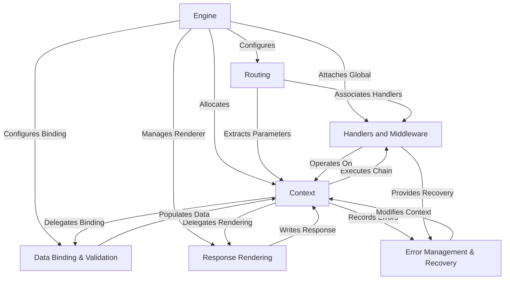
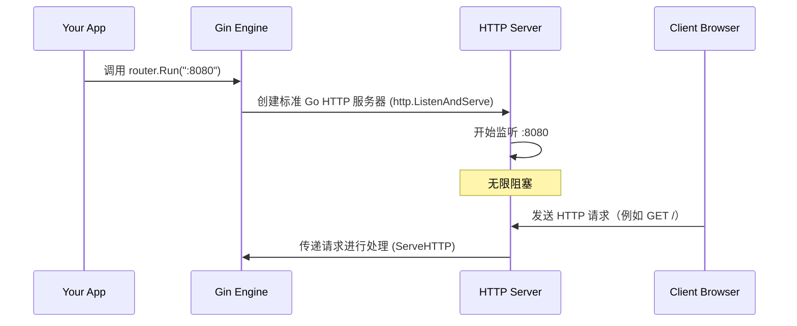

链接：[Gin Web Framework | Gin Web Framework](https://gin-gonic.com/)

# docs：gin

`gin` 是一个**高性能的 Go Web 框架**，旨在高效构建 Web 应用程序和 API。

提供了一个*轻量级和灵活*的架构，围绕一个管理`路由`并应用`中间件`的 `Engine` 进行设计。

对于每个传入请求，都会创建一个 `Context` 对象，以*处理所有请求特定的数据、输入解析、输出渲染和错误管理*。

## 可视化



## 章节

1. [Engine
](01_engine_.md)
2. [Routing
](02_routing_.md)
3. [Handlers and Middleware
](03_handlers_and_middleware_.md)
4. [Context
](04_context_.md)
5. [Data Binding & Validation
](05_data_binding___validation_.md)
6. [Response Rendering
](06_response_rendering_.md)
7. [Error Management & Recovery
](07_error_management___recovery_.md)

---

# 第 1 章：引擎

在这一章中，我们将会见到任何 Gin 应用程序中最基本的部分：`Engine`。

可以将 `Engine` 想象成我们 Web 服务器的中央控制室。它是所有事情的起点，设置应用程序的全局规则，并告诉它如何响应不同的 Web 请求。

## 引擎解决了什么问题？

想象一下，我们想构建一个简单的网站，只显示 "Hello Gin!"。为此，我们的计算机需要：
1.  监听来自 Web 浏览器（如 Chrome 或 Firefox）的传入请求。
2.  理解浏览器请求的内容（例如，"给我主页"）。
3.  生成正确的响应（例如，文本 "Hello Gin!"）。
4.  将该响应发送回浏览器。

整个过程需要一个中央组件来管理这些任务，从在网络端口上监听到决定哪一部分代码应该处理特定请求。这正是 `Engine` 解决的问题。它是我们 Web 乐团的指挥，确保应用程序的不同部分协同工作。

## 开始使用：你的第一个引擎

让我们看看如何轻松创建和运行我们的 Gin 应用程序，使用 `Engine`。

启动 `Engine` 的最快方法是使用 `gin.Default()`。这个方便的函数为我们提供了一个功能齐全的 `Engine`，内置了一些有用的功能，比如日志记录（查看发生了什么）和恢复（优雅地处理意外错误）。

以下是初始化 `Engine` 的方式：

```go
package main

import (
	"net/http" // 标准 Go 包，用于 HTTP 状态码
	"github.com/gin-gonic/gin" // Gin Web 框架
)

func main() {
	// 1. 创建一个 Gin 引擎
	// gin.Default() 初始化一个带有 Logger 和 Recovery 中间件的引擎。
	router := gin.Default() 

	// 2. 定义一个路由：当有人访问根 URL ("/") 并使用 GET 方法时，运行以下函数。
	router.GET("/", func(c *gin.Context) {
		// 发送一个纯文本响应："Hello Gin!"
		// http.StatusOK 是 HTTP 200 OK 状态码的常量。
		c.String(http.StatusOK, "Hello Gin!")
	})

	// 3. 在端口 8080 启动 Web 服务器。
	// 这将无限阻塞，处理请求直到程序停止。
	router.Run(":8080") 
}
```

**解释：**

1.  `router := gin.Default()`: 这一行创建了我们的 `Engine` 实例。我们将其命名为 `router`，因为它的主要任务之一是处理路由（我们将在[路由](02_routing_.md)中详细介绍）。`Default()` 函数设置引擎的一些常见默认值，使其立即可以使用。
2.  `router.GET("/", ...)`: 这告诉 `Engine` 在收到对根路径 (`/`) 的 HTTP `GET` 请求时该怎么做。我们告诉它执行一个小函数，将 "Hello Gin!" 返回给客户端。
3.  `router.Run(":8080")`: 这个命令使我们的 `Engine` 开始监听端口 `8080` 上的传入 Web 请求。当我们运行这个程序时，我们的 Web 服务器将处于活动状态，准备处理请求。

**如何运行这段代码：**

1.  将上述代码保存为 `main.go` 在一个新目录中。
2.  在该目录中打开终端或命令提示符。
3.  运行 `go mod init <your-module-name>` （例如，`go mod init myfirstginapp`）。
4.  运行 `go get github.com/gin-gonic/gin`。
5.  运行 `go run main.go`。

我们应该看到类似以下的输出：

```
[GIN-debug] GET / --> main.main.func1 (3 handlers)
[GIN-debug] Listening and serving HTTP on :8080
```

现在，打开我们的 Web 浏览器并访问 `http://localhost:8080`。我们应该看到浏览器中显示 "Hello Gin!"。恭喜我们，我们刚刚构建并运行了第一个 Gin Web 应用程序！

## 引擎内部：引擎的作用

让我们来看看在创建和运行 `Engine` 时，以及当请求到达时内部发生了什么。

### 1. 创建引擎（`gin.Default()`）

当我们调用 `gin.Default()` 时，下面是一个简化的视图：

```mermaid
sequenceDiagram
    participant Your App
    participant Gin Default()
    participant Gin New()
    participant Logger Middleware
    participant Recovery Middleware
    participant Gin Engine

    Your App->>Gin Default(): 调用 gin.Default()
    Gin Default()->>Gin New(): 创建一个新的引擎
    Gin New()->>Gin Engine: 返回一个基本的引擎实例
    Gin Default()->>Logger Middleware: 将 Logger 附加到引擎
    Gin Default()->>Recovery Middleware: 将 Recovery 附加到引擎
    Gin Default()->>Your App: 返回配置好的 Gin 引擎
```

如序列所示，`gin.Default()`（来自 `gin/gin.go` 和 `gin/mode.go`）首先调用 `gin.New()` 来获取一个新的 `Engine` 实例。然后，它立即将两个重要的全局特性（称为"中间件"）添加到它上面：
*   **Logger()**：这个中间件记录有关每个传入请求和传出响应的详细信息到我们的控制台。这对调试非常有帮助。它的实现可以在 `gin/logger.go` 中找到。
*   **Recovery()**：这个中间件捕获在请求处理过程中可能发生的任何意外错误（恐慌），防止我们的服务器崩溃，而是返回一个 500 内部服务器错误。它的代码在 `gin/recovery.go` 中。

这些是"全局"的，因为它们适用于我们的 `Engine` 处理的*每个*请求。

### 2. 运行引擎（`router.Run(":8080")`）

当我们调用 `router.Run(":8080")` 时，我们的 `Engine` 成为一个活动的 Web 服务器：



`Run` 方法（在 `gin/gin.go` 中找到）本质上包装了标准 Go HTTP 服务器（`http.ListenAndServe`）。它告诉这个服务器使用我们的 `Gin Engine` 作为所有传入 HTTP 请求的主要处理程序。

### 3. 引擎作为 `http.Handler` 的角色

Gin 的 `Engine` 实现了 Go 标准库中的 `http.Handler` 接口。这意味着它有一个特殊的方法叫做 `ServeHTTP`。每当 Web 请求到达时，Go HTTP 服务器会调用 `engine.ServeHTTP(w, req)`，其中 `w` 是响应写入器，`req` 是传入请求。

在 `ServeHTTP`（在 `gin/gin.go` 中）内部，`Engine` 执行了很多工作：
*   它从池中获取一个 `Context` 对象（为了效率，稍后我们将了解[Context](04_context_.md)）。
*   它使用当前请求的详细信息重置 `Context`。
*   然后它调用 `handleHTTPRequest`，负责将传入请求的 URL 路径和 HTTP 方法（如 GET 或 POST）与我们注册的路由（如我们的 `router.GET("/")` 示例）进行匹配。
*   一旦匹配到路由，`Engine` 执行相关的"处理程序"（我们的函数和任何中间件）。
*   最后，它将 `Context` 对象返回到池中，准备处理下一个请求。

这是一个简化的视图，但它突显了 `Engine` 不断监听和引导应用程序内部的流量。

## 引擎的核心属性

`Engine`（在 `gin/gin.go` 中定义）具有许多可配置属性，这些属性影响其全局行为。虽然我们不需要立即担心所有这些属性，但以下是一些示例，说明它作为"控制室"的角色：

| 属性                     | 描述                                                         |
| :----------------------- | :----------------------------------------------------------- |
| `RedirectTrailingSlash`  | 如果为 `true`，请求 `/users` 将重定向到 `/users/`（如果 `/users/` 有处理程序），反之亦然。帮助保持 URL 一致性。 |
| `HandleMethodNotAllowed` | 如果为 `true`，当路径存在但请求的 HTTP 方法没有路由时，`Engine` 将响应 `405 Method Not Allowed` 错误。 |
| `MaxMultipartMemory`     | 设置解析多部分表单（例如，文件上传）时使用的最大内存量。较大的文件将写入磁盘。 |
| `TrustedPlatform`        | 用于识别通过 Cloudflare 或 Google App Engine 等代理的客户端真实 IP 地址。 |
| `UseH2C`                 | 启用 HTTP/2 明文（H2C）支持，允许在没有 TLS 的情况下通过普通 TCP 使用 HTTP/2。 |

这些属性以及其他属性使我们能够微调 Gin 应用程序的全局行为，即使在处理任何特定路由之前。

## 结论

`Engine` 是任何 Gin 应用程序的基本起点。它负责设置服务器，应用全局配置和中间件，如日志记录和错误恢复，并充当所有传入 Web 请求的中央调度员。我们初始化一次，定义路由，然后告诉它 `Run()`。

现在我们了解了核心 `Engine` 以及如何启动我们的 Gin 服务器，下一步是学习如何为我们的 Web 应用程序定义不同的路径和操作。

[下一章：路由](02_routing_.md)

