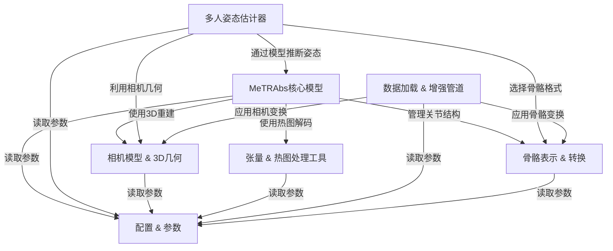
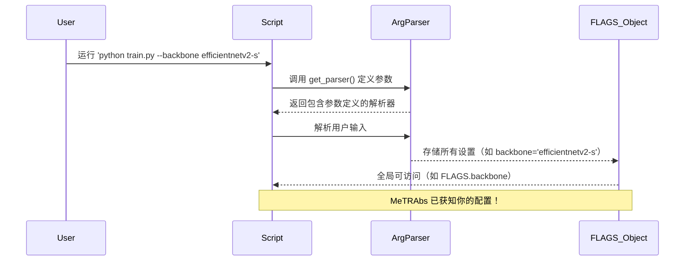

link:[metrabs_demo.ipynb - Colab](https://colab.research.google.com/github/isarandi/metrabs/blob/master/metrabs_demo.ipynb#scrollTo=hTsWkCfCMCH4)

**Google Colab** 是 Google 提供的**免费云端 Jupyter Notebook 环境**，可在浏览器里直接运行 Python 代码，自带免费 GPU/TPU，用于机器学习和数据分析。

就像 **Google Docs**，但是用来写和运行 **Python 代码** 的，还送你一台带 GPU 的云服务器。

# docs：MeTRAbs  

MeTRAbs 是一个专注于**3D人体姿态估计**的项目，能够识别并预测图像中多人的*3D关节位置*。


其核心神经网络模型通过处理单个人物裁剪图像，并结合全面的相机模型与3D几何知识，实现对人体关节的空间精确定位。

整个流程由==高效的数据管道、底层张量操作和可适配的骨骼==表示系统支撑，并通过灵活的配置系统统一管理。

---

## 概览  



---

## 章节  

1. [配置 & 参数](01_configuration___flags_.md)  
2. [相机模型 & 3D几何](02_camera_model___3d_geometry_.md)  
3. [骨骼表示 & 转换](03_skeleton_representation___conversion_.md)  
4. [MeTRAbs核心模型](04_metrabs_core_model_.md)  
5. [张量 & 热图处理工具](05_tensor___heatmap_processing_utilities_.md)  
6. [多人姿态估计器](06_multi_person_pose_estimator_.md)  
7. [数据加载 & 增强管道](07_data_loading___augmentation_pipeline_.md)  

---

# MeTRAbs 绝对3D人体姿态估计器  
提供独立的TensorFlow模型（SavedModel格式），便于下游研究直接调用。加载模型后，仅需一行Python代码即可完成推理，无需依赖本代码库。  
**示例**：  

```python
import tensorflow as tf
import tensorflow_hub as tfhub

model = tfhub.load('https://bit.ly/metrabs_l')
image = tf.image.decode_jpeg(tf.io.read_file('img/test_image_3dpw.jpg'))
pred = model.detect_poses(image)
pred['boxes'], pred['poses2d'], pred['poses3d']
```
更多示例参见`demos`文件夹。  

**PyTorch实验版**：  
```bash
wget -O - https://bit.ly/metrabs_l_pt | tar -xzvf -
python -m metrabs_pytorch.scripts.demo_image --model-dir metrabs_eff2l_384px_800k_28ds_pytorch --image img/test_image_3dpw.jpg
```

---

## 演示 
- **单图推理**：运行`./demo.py`自动下载模型并可视化结果（需Matplotlib或PoseViz）。  
- **视频推理**：运行`./demo_video.py 视频文件路径或URL`。  

- **核心特性**  
  - 支持多骨骼格式（如COCO、SMPL、H36M）。  
  - 支持批量/单张图像预测。  
  - 并行化裁剪、抗锯齿（图像金字塔与超采样）、伽马校正缩放。  
  - GPU加速的针孔/径向/切向畸变校正。  
  - 输出3D世界坐标（需标定）与2D像素坐标。  
  - 可配置的测试时增强（TTA）：旋转、翻转、亮度调整。  
  - 自动过滤不合理姿态及3D非极大抑制。  
  - 多主干网络（EfficientNetV2、MobileNetV3）支持速度-精度权衡。  

----

# 第一章：配置与参数  

欢迎来到MeTRAbs教程的第一章

在这里，我们将揭开MeTRAbs如何管理其众多设置的神秘面纱，从神经网络的训练方式到结果的保存路径。可以将本章视为理解MeTRAbs的“控制面板”。

---

## MeTRAbs的控制面板：它是什么？为什么需要它？  

想象你有一台高科技机械臂。你希望它能抓取不同的物体——有时是一朵娇嫩的小花，有时是一个沉重的坚固块体。每次需要调整抓握力度或速度时，你会重新编程整个操作系统吗？当然不会！你只需在控制面板上转动旋钮或拨动开关即可。  

在MeTRAbs的世界里，我们的“机械臂”是一个强大的3D人体姿态估计器，而“旋钮和开关”就是我们所说的**配置**和**参数**。这些设置和超参数控制着MeTRAbs的运行方式，包括：  

- **神经网络架构**：MeTRAbs使用的“大脑”（主干模型）类型。  
- **训练计划**：训练时长或学习速度（学习率）。  
- **数据处理**：图像在输入模型前如何调整大小或增强。  
- **文件路径**：模型加载或结果保存的位置。  

这种抽象解决的问题至关重要：**它允许你无需修改核心代码即可微调MeTRAbs的行为**。这种灵活性非常强大，因为你可以轻松尝试不同的设置、数据集或训练策略，使MeTRAbs适应多种任务。  

---

### 第一个用例：自定义模型训练  

假设想训练MeTRAbs从图像中估计姿态，但有以下需求：  
- 使用更小、更快的神经网络`efficientnetv2-s`作为“主干”（核心处理单元）。  
- 将输入图像调整为`128x128`像素（默认`256x256`），以加快速度（可能牺牲一些精度）。  

这些正是配置参数的用武之地

无需深入深度学习代码，只需告诉MeTRAbs该怎么做。  

---

## MeTRAbs如何管理设置  

MeTRAbs结合以下工具提供“控制面板”功能：  

1. **`argparse`**：Python标准库，用于解析命令行输入，定义可用的“旋钮”（参数）及其值类型。  
2. **`simplepyutils.FLAGS`**：来自`simplepyutils`库的工具，集中存储`argparse`定义的设置，便于代码全局访问。  
3. **Hydra（PyTorch专用）**：在PyTorch版本中，Hydra与`argparse`配合，通过YAML文件管理更复杂的配置，支持结构化设置。  

---

### 命令行参数调整设置  

最常见的调整方式是在运行MeTRAbs脚本时添加**命令行参数**。  

回到之前的用例：使用`efficientnetv2-s`和`128`像素的`proc-side`。运行训练脚本（假设为`train.py`）时，只需添加以下参数：  

```bash
python train.py --backbone efficientnetv2-s --proc-side 128
```

**解释**：  
- `python train.py`：启动训练程序。  
- `--backbone efficientnetv2-s`：指定使用`efficientnetv2-s`作为主干模型。  
- `--proc-side 128`：设置输入图像处理尺寸为`128`像素。  

若不提供这些参数，MeTRAbs将使用默认值。  

---

### 查看当前配置  

MeTRAbs启动后会记录解析后的参数。你可以通过日志查看当前生效的设置：  

```text
Host: your-computer-name
Process id (pid): 12345
Slurm job id: None
Raw command: python train.py --backbone efficientnetv2-s --proc-side 128
Parsed flags: FLAGS(workers=None, multi_gpu=None, train=None, predict=None, export_file=None, ...)
```

`Parsed flags:`行显示所有当前设置，包括你自定义的`--backbone`和`--proc-side`。  

---

## 控制面板的内部原理  

MeTRAbs如何处理这些参数。核心逻辑发生在MeTRAbs环境初始化阶段。  

### 流程

运行带参数的MeTRAbs脚本时



1. **用户输入**：通过命令行运行脚本并传递参数。  
2. **定义参数**：`get_parser()`函数向`argparse`注册所有支持的参数（如`--backbone`、`--proc-side`）。  
3. **解析参数**：`argparse`匹配命令行输入并提取值。  
4. **存储参数**：提取的值存入`simplepyutils.FLAGS`对象。  
5. **使用参数**：代码中通过`FLAGS.backbone`等方式读取设置。  

---

### 代码：`get_parser()` 与 `FLAGS`  

以`metrabs_pytorch/init.py`为例（TensorFlow版本类似）：  

**定义参数**：  
```python
def get_parser():
    parser = argparse.ArgumentParser(description='MeTRAbs 3D Human Pose Estimator', allow_abbrev=False)
    parser.add_argument('--comment', type=str, default=None)
    parser.add_argument('--seed', type=int, default=1, help='随机数种子')
    parser.add_argument('--proc-side', type=int, default=256, help='网络处理的图像边长')
    parser.add_argument('--backbone', type=str, default='efficientnetv2-s', help='预测网络的主干模型')
    return parser
```

**初始化与存储**：  
```python
from simplepyutils import FLAGS, logger

def initialize(args=None):
    spu.argparse.initialize_with_logfiles(get_parser(), logdir_root=f'{DATA_ROOT}/experiments', args=args)
    logger.info(f'Parsed flags: {FLAGS}')
    if FLAGS.checkpoint_dir is None:  # 示例：访问参数
        FLAGS.checkpoint_dir = FLAGS.logdir
    FLAGS.backbone = FLAGS.backbone.replace('_', '-')  # 示例：修改参数
```

---

### Hydra配置（PyTorch专用）  

PyTorch版本通过Hydra从YAML文件加载默认配置。例如`metrabs_pytorch/config/config.yaml`：  

```yaml
proc_side: 256  # 默认处理尺寸
backbone: efficientnetv2-s  # 默认主干模型
```

**Hydra加载代码**：  
```python
@functools.lru_cache()
def get_config(config_name=None):
    hydra.initialize(config_path='config', version_base='1.1')
    _cfg = hydra.compose(config_name=config_name or spu.FLAGS.config_name)
    return _cfg
```

Hydra允许通过命令行覆盖YAML中的设置（如`python train.py backbone=resnet50`），适合复杂项目。  

---

## 总结  

MeTRAbs的“控制面板”--配置与参数让我们无需修改核心代码即可定制MeTRAbs的行为。了解：  
- 什么是==配置==与参数（项目设置和`超参数`）。  
- 它们的重要性（灵活性和实验便捷性）。  
- 如何通过==命令行==使用（如`--backbone efficientnetv2-s`）。  
- 内部如何通过`argparse`、`FLAGS`和Hydra==处理==。  

==这种抽象能力为后续高级操作奠定了基础==。  

接下来，我们将探索MeTRAbs如何理解周围世界，详见[第二章：相机模型与3D几何](02_camera_model___3d_geometry_.md)。  

