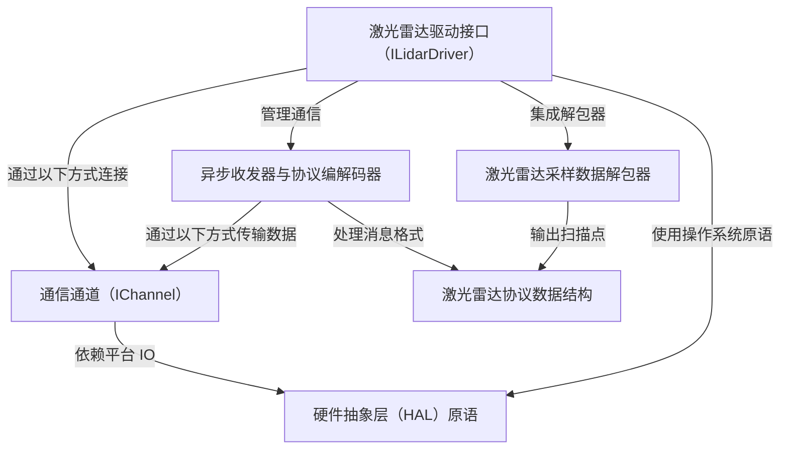

链接：[Lidar - Wikipedia](https://en.wikipedia.org/wiki/Lidar)

# docs：rplidar_sdk

`rplidar_sdk` 是一个 **C++ SDK**，促进与 Slamtec RPLIDAR 传感器的*高级交互*。

允许开发人员轻松**控制激光雷达**（例如，开始扫描、获取设备信息）和**获取扫描数据**，同时抽象掉底层*硬件通信的复杂性*和*数据解释*。

## 可视化

## 章节

1. [激光雷达驱动接口（ILidarDriver）
](01_lidar_driver_interface__ilidardriver__.md)
2. [激光雷达采样数据解包器
](02_lidar_sample_data_unpacker_.md)
3. [激光雷达协议数据结构
](03_lidar_protocol_data_structures_.md)
4. [异步收发器与协议编解码器
](04_asynchronous_transceiver___protocol_codec_.md)
5. [通信通道（IChannel）
](05_communication_channel__ichannel__.md)
6. [硬件抽象层（HAL）原语
](06_hardware_abstraction_layer__hal__primitives_.md)

