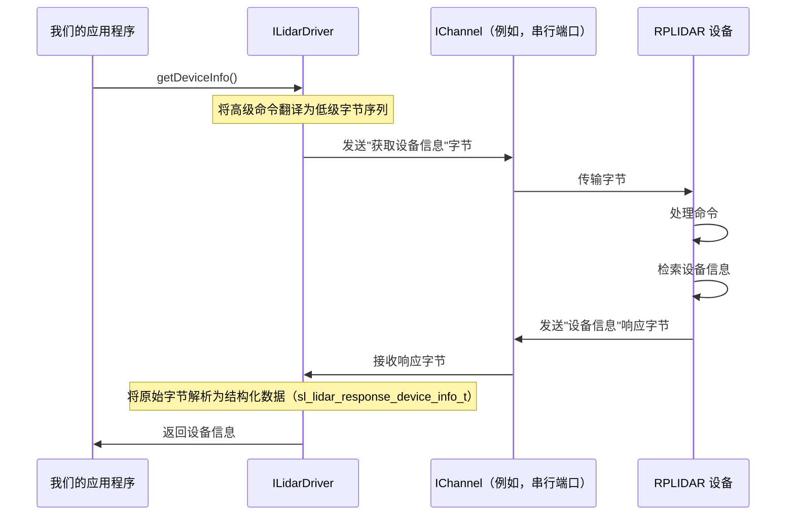

# 第 1 章：激光雷达驱动接口（ILidarDriver）

在第一章中将介绍与激光雷达交互的核心：`ILidarDriver`。

### `ILidarDriver` 解决什么问题？

想象一下我们有一个强大的机械臂，但它配备了一个复杂的控制面板，上面有数百个小按钮、电线和开关。要让它移动，我们==需要确切地知道哪根电线连接到哪里==，以及按特定顺序按下哪个按钮。这听起来很难，对吧？

我们的 RPLIDAR 传感器也类似。它是一个复杂的设备，不断旋转并发出激光束来测量距离，创建周围环境的地图。与这个==物理设备通信涉及通过串行端口或网络发送精确的命令并理解复杂的数据格式==。这种"低级"通信对开发人员来说可能非常具有挑战性。

这就是 `ILidarDriver` 来拯救我们的地方

### 我们的 RPLIDAR 的"方向盘和踏板"

将 `ILidarDriver` 想象成**汽车的方向盘和踏板**，而不是复杂的发动机或变速器。当我们开车时，我们不需要了解发动机如何混合燃料和空气，或者齿轮如何在内部换挡。我们只需==使用方向盘转向，使用踏板加速或制动==。(还是我们再加一层的封装思想-来便于调用)

同样，`ILidarDriver` 是我们用于 RPLIDAR 的高级控制面板。它允许我们的软件发送简单的命令，如"开始扫描"、"获取设备信息"或"设置电机速度"，而无需深入了解这些命令实际上是如何通过电线发送的，或者激光雷达如何响应的细节。

它是我们的软件控制 RPLIDAR 传感器并从中获取数据的**主要入口点**。

### `ILidarDriver` 的关键功能

`ILidarDriver` 接口提供了一组强大的函数（就像汽车仪表板上的按钮和操纵杆），用于与激光雷达交互：

*   **连接管理：** 建立和断开与传感器的通信。
*   **设备信息：** 检索有关激光雷达的重要详细信息，例如其型号、固件版本和健康状态。
*   **扫描控制：** 启动和停止激光雷达的扫描过程。
*   **电机控制：** 调整激光雷达旋转电机的速度。
*   **数据检索：** 获取传感器收集的实际距离测量值（扫描数据）。

通过使用 `ILidarDriver`，我们可以更轻松地将 RPLIDAR 集成到我们的应用程序中，专注于我们想要用激光雷达数据*做什么*，而不是如何与激光雷达硬件*对话*。

### 我们的第一步：获取激光雷达信息

让我们演练一个简单的用例：如何连接到 RPLIDAR 并获取其基本信息（如其型号和固件版本）。这是使用传感器的任何应用程序的常见第一步。

#### 1. 包含必要的头文件

首先，我们需要告诉我们的 C++ 程序在哪里找到 `ILidarDriver` 定义。我们通常会包含 `sl_lidar_driver.h`。

```cpp
#include "sl_lidar.h"
#include "sl_lidar_driver.h" // 包含 ILidarDriver
```
这些行确保我们的程序知道 `ILidarDriver` 接口和其他基本定义。

#### 2. 创建通信通道

在我们可以与激光雷达对话之前，我们需要一种发送和接收数据的方式。这由**[通信通道（IChannel）](05_communication_channel__ichannel__.md)**处理。对于大多数 RPLIDAR，这是一个串行端口连接。SDK 提供了一个辅助函数 `createSerialPortChannel` 来设置它。

```cpp
// 为串行端口创建通信通道实例
// 将 "/dev/ttyUSB0" 替换为我们的激光雷达的串行端口（例如，Windows 上的 "COM11"）
// 将 115200 替换为我们的激光雷达型号的正确波特率。
sl::Result<sl::IChannel*> channelResult = sl::createSerialPortChannel("/dev/ttyUSB0", 115200);

// 始终检查通道是否成功创建
if (!channelResult) {
    fprintf(stderr, "创建串行端口通道失败！\r\n");
    return -1; // 处理错误
}
sl::IChannel* _channel = *channelResult; // 从 Result 对象获取原始指针
```
此代码创建一个 `IChannel` 对象，表示与我们的激光雷达的物理连接。我们将其包装在 `sl::Result` 中以处理创建期间的潜在错误。

#### 3. 创建 `ILidarDriver` 实例

现在我们有了通道，我们需要"驱动程序"本身。SDK 提供了一个函数 `createLidarDriver()` 来给我们一个 `ILidarDriver` 实例。

```cpp
// 创建激光雷达驱动实例
sl::Result<sl::ILidarDriver*> lidarResult = sl::createLidarDriver();

// 检查驱动程序是否成功创建
if (!lidarResult) {
    fprintf(stderr, "创建激光雷达驱动程序失败！\r\n");
    delete _channel; // 如果驱动程序创建失败，清理通道
    return -1; // 处理错误
}
sl::ILidarDriver* lidar = *lidarResult; // 获取原始指针
```
这一行为我们提供了 `ILidarDriver` 对象，这是我们与传感器的主要接口。

#### 4. 将驱动程序连接到通道

准备好 `ILidarDriver` 和 `IChannel` 后，我们现在可以建立连接。

```cpp
// 将激光雷达驱动程序连接到通信通道
sl_result res = lidar->connect(_channel);

if (SL_IS_FAIL(res)) {
    fprintf(stderr, "连接到激光雷达失败！错误代码：%08x\r\n", res);
    delete lidar;
    delete _channel;
    return -1; // 处理错误
}
```
`connect()` 函数告诉 `ILidarDriver` 开始使用提供的 `IChannel` 与物理激光雷达通信。`SL_IS_FAIL` 是一个宏，用于检查操作是否成功。

#### 5. 获取设备信息

连接后，我们可以使用 `ILidarDriver` 的 `getDeviceInfo()` 方法来检索有关传感器的信息。

```cpp
sl_lidar_response_device_info_t deviceInfo;
res = lidar->getDeviceInfo(deviceInfo);

if (SL_IS_OK(res)) {
    printf("激光雷达设备信息：\n");
    printf("  型号：%d\n", deviceInfo.model);
    printf("  固件版本：%d.%d\n",
           deviceInfo.firmware_version >> 8, deviceInfo.firmware_version & 0xffu);
    printf("  硬件版本：%d\n", deviceInfo.hardware_version);
    // ... 如果需要，我们可以打印更多信息
} else {
    fprintf(stderr, "从激光雷达获取设备信息失败！错误代码：%08x\r\n", res);
}
```
此代码片段用型号、固件和硬件版本等详细信息填充 `deviceInfo` 结构。这些对于调试和确保我们连接到正确的设备很有价值。

#### 6. 清理

最后，在我们完成后断开连接并释放资源是一个好习惯。

```cpp
// 断开激光雷达连接
lidar->disconnect();

// 删除激光雷达驱动程序和通道实例以释放内存
delete lidar;
delete _channel;
```
这确保我们的应用程序正确释放硬件连接并清理内存。

### 当我们调用 `ILidarDriver` 方法时，"幕后"发生了什么？

现在我们知道如何使用 `ILidarDriver`，让我们窥探幕后，了解当我们调用 `connect()` 或 `getDeviceInfo()` 等方法时发生了什么。

`ILidarDriver` 是一个*接口*。这意味着它是函数的蓝图，而不是实际的实现。SDK 提供了一个具体的类（例如，SDK 内部代码中的 `SlamtecLidarDriver`）来实现此接口。当我们调用 `createLidarDriver()` 时，我们得到这个具体类的对象。

这个具体的驱动程序类处理所有复杂的交互：

1.  **翻译命令：** 我们的高级 `getDeviceInfo()` 命令被翻译成 RPLIDAR 传感器理解的特定低级命令包。
2.  **通过通道发送：** 然后通过提供的[通信通道（IChannel）](05_communication_channel__ichannel__.md)（例如，串行端口）发送此命令包。
3.  **等待响应：** 驱动程序等待来自 RPLIDAR 的响应。
4.  **解析响应：** 然后解析从传感器接收的原始数据，并将其结构化为友好的格式（如 `sl_lidar_response_device_info_t` 结构），供我们的应用程序使用。

 `getDeviceInfo()` 的事件序列：



#### 代码

让我们看一下 SDK 中如何定义和使用 `ILidarDriver` 的高度简化版本。

`ILidarDriver` 接口在 `sdk/include/sl_lidar_driver.h` 中声明：

```cpp
// 来自：sdk/include/sl_lidar_driver.h
class ILidarDriver
{
public:
    virtual ~ILidarDriver() {} // 虚拟析构函数用于正确清理

public:
    // 具体类必须实现的虚拟函数
    virtual sl_result connect(IChannel* channel) = 0; // 连接到激光雷达
    virtual void disconnect() = 0;                   // 从激光雷达断开连接
    virtual bool isConnected() = 0;                  // 检查连接状态

    // 获取设备信息的函数示例
    virtual sl_result getDeviceInfo(sl_lidar_response_device_info_t& info, sl_u32 timeout = DEFAULT_TIMEOUT) = 0;
    // ... 许多其他函数，如 startScan、grabScanDataHq 等。
};

// 创建 ILidarDriver 实例的函数
sl::Result<ILidarDriver*> createLidarDriver();
```
`virtual ... = 0;` 语法意味着这些是**纯虚函数**，这使得 `ILidarDriver` 成为一个**抽象类**（或接口）。我们不能直接创建 `ILidarDriver` 对象。相反，我们得到一个*继承*自 `ILidarDriver` 并实现所有这些函数的类的对象。

实际实现，如 `sdk/src/sl_lidar_driver.cpp` 中的 `SlamtecLidarDriver`，看起来像这样

```cpp
// 来自：sdk/src/sl_lidar_driver.cpp（简化）
class SlamtecLidarDriver : public ILidarDriver
{
public:
    sl_result connect(IChannel* channel) override {
        // 在内部存储通道
        _channel = channel;
        // 打开通信通道（例如，串行端口）
        if (_channel && _channel->open()) {
            _isConnected = true;
            return SL_RESULT_OK;
        }
        _isConnected = false;
        return SL_RESULT_OPERATION_FAIL;
    }

    sl_result getDeviceInfo(sl_lidar_response_device_info_t& info, sl_u32 timeout) override {
        // 1. 构造低级"获取设备信息"命令包
        // 2. 使用 _channel->write() 将命令字节发送到激光雷达
        // 3. 使用 _channel->read() 接收原始响应字节
        // 4. 将原始字节解析为 'info' 结构
        // 这是复杂的通信逻辑发生的地方，对我们的应用程序隐藏！
        // ...（实际的复杂实现涉及协议编解码器和收发器）
        
        // 为了演示，假设我们从激光雷达获得了这个：
        info.model = 0x18; // 示例型号 A1M8
        info.firmware_version = (0x1 << 8) | 24; // 固件 1.24
        info.hardware_version = 5;
        return SL_RESULT_OK; // 或适当的错误代码
    }

private:
    bool _isConnected;
    IChannel* _channel; // 存储连接的通道
    // ... 其他内部组件，如协议处理程序、数据解包器
};

// 此函数创建并返回 SlamtecLidarDriver 的实例
sl::Result<ILidarDriver*> createLidarDriver()
{
    return new SlamtecLidarDriver();
}
```
正如我们所看到的，`SlamtecLidarDriver` 负责所有低级通信。它使用 `IChannel` 发送和接收原始字节，然后解释这些字节。我们的应用程序只与干净的 `ILidarDriver` 接口交互，完全不知道这些内部复杂性。

### 总结

在本章中，我们了解到 `ILidarDriver` 是我们控制 RPLIDAR 传感器并从中获取数据的主要接口。

提供了一个用户友好的高级命令"方向盘"，使我们免受复杂的低级通信细节的影响。我们看到了如何创建 `ILidarDriver` 实例，使用 `IChannel` 连接它，以及检索基本设备信息。

在下一章中，我们将深入地了解从==激光雷达接收的原始数据如何被我们的应用程序处理和理解==，特别关注**[激光雷达采样数据解包器](02_lidar_sample_data_unpacker_.md)**。

