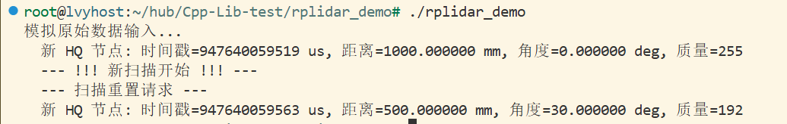
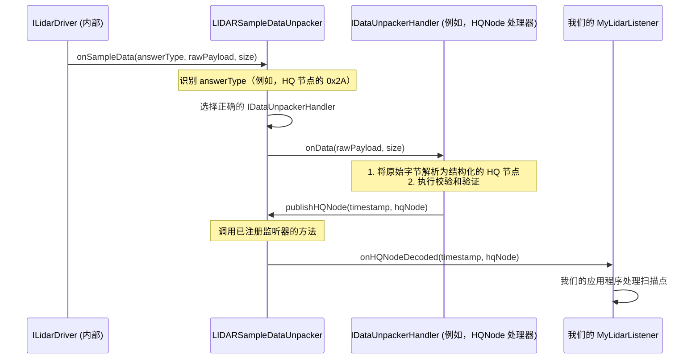

# 第二章：激光雷达样本数据解包器

欢迎回来

在[第一章：激光雷达驱动接口 (ILidarDriver)](01_lidar_driver_interface__ilidardriver__.md)中，我们了解到 `ILidarDriver` 就像我们汽车的仪表盘，允许我们发送诸如"开始扫描"之类的高级命令并接收信息。但是，当 `ILidarDriver` 说它正在检索"扫描数据"时，它到底给我们什么呢？

想象一下我们正在驾驶汽车，仪表盘告诉我们："数据已接收！"这很好，但我们实际上看不到道路，也不知道发生了什么。我们==需要一个系统来获取那个"已接收的数据"并将其转换为清晰、可理解的周围环境图像==。这就是**激光雷达样本数据==解包器==**的作用所在。

### 激光雷达样本数据解包器解决什么问题？

当我们的 `ILidarDriver` 与 RPLIDAR 传感器通信时，它会接收原始的字节束。可以把这些想象成来自激光雷达的**神秘包裹**。每个包裹都包含大量数字，但它们对我们的应用程序来说并不是立即有用的。我们不知道每个数字的含义——它是距离吗？角度吗？质量测量值吗？这个包裹是否有效，还是在传输过程中出现了损坏？

激光雷达样本数据解包器就像是这些神秘包裹的**专业分拣和组装机器**。它的工作是：

1.  **打开包裹：** 将原始字节解码为可理解的块。
2.  **验证内容：** 检查错误（如错误的校验和）以确保数据可靠。
3.  **组装成可用部分：** 将这些块组合成我们的程序可以轻松使用的标准化格式，例如包含距离、角度和质量信息的单个"扫描点"。

如果没有解包器，我们将被困在原始字节中，试图自己弄清楚它们的含义——这是一项非常困难且容易出错的任务，它将低级的内部表示转换为对我们的应用程序有意义的东西。

### 我们激光雷达扫描点的"流水线"

`LIDARSampleDataUnpacker` 接收这些原始的、已解码的 `ProtocolMessage` 对象（这些对象来自 SDK 的较低层，我们将在[第四章：异步收发器和协议编解码器](04_asynchronous_transceiver___protocol_codec_.md)中看到）并将它们处理成易于使用的扫描点。

我们经常想要获取的主要扫描点类型是 `sl_lidar_response_measurement_node_hq_t`。该结构通常包含：

*   **`distance_q2`**：到物体的测量距离（经过编码以节省空间）。
*   **`angle_z_q14`**：进行测量的角度（也经过编码）。
*   **`quality`**：该特定测量的可靠程度。
*   **`flag`**：特殊标志，例如这是否是新的 360 度扫描的开始。

解包器处理激光雷达可能发送数据的不同方式，例如各种"胶囊"格式或"HQ 节点"格式。这就像为不同类型的产品设置不同的流水线，但它们都生产标准化的输出。

### 如何使用激光雷达样本数据解包器

作为使用 `ILidarDriver` 的应用程序开发者，我们通常不会直接与 `LIDARSampleDataUnpacker` 交互。

- `ILidarDriver` 在内部使用它来处理从传感器接收的原始数据，然后再给我们提供漂亮的、结构化的扫描点。

然而，理解它的作用至关重要，如果我们要绕过 `ILidarDriver` 或实现自定义驱动程序，我们*将*直接使用它。让我们看看 SDK 本身是如何使用它的，这向我们展示了这种模式。

#### 1. 定义我们的数据监听器

由于解包器的工作是*发布*处理过的数据，它需要一种方式与我们的应用程序"对话"。它通过**监听器接口** `LIDARSampleDataListener` 来实现这一点。我们创建自己的类，该类继承自此接口，并告诉它在新扫描点准备好时该做什么。

```cpp
#include "sl_lidar_driver.h" // For sl_lidar_response_measurement_node_hq_t
#include "dataunpacker/dataunpacker.h" // For LIDARSampleDataUnpacker

// 我们需要在正确的命名空间中使用解包器组件
using namespace sl::rplidar::dataunpacker;

// 我们的自定义类，将"监听"解包的数据
class MyLidarListener : public LIDARSampleDataListener {
public:
    // 当解码新的 HQ 测量节点时调用此函数
    void onHQNodeDecoded(_u64 timestamp_uS, const rplidar_response_measurement_node_hq_t* node) override {
        printf("  新 HQ 节点: 时间戳=%llu us, 距离=%f mm, 角度=%f deg, 质量=%d\n",
               timestamp_uS,
               static_cast<float>(node->distance_q2)/4.0f,   // 将 Q2 转换为 mm
               static_cast<float>(node->angle_z_q14)/16384.0f, // 将 Q14 转换为度
               node->quality);
        if (node->flag & RPLIDAR_RESP_MEASUREMENT_HQ_SYNCBIT) {
            printf("  --- !!! 新扫描开始 !!! ---\n");
        }
    }

    // 如果开始新的扫描旋转（完整 360 度）时调用
    void onHQNodeScanResetReq() override {
        printf("  --- 扫描重置请求 ---\n");
    }

    // 为自定义数据类型调用（在这个基本示例中我们将忽略）
    void onCustomSampleDataDecoded(_u8 ansType, _u32 customCode, const void* data, size_t size) override {}

    // 如果有解码错误时调用
    void onDecodingError(int errMsg, _u8 ansType, const void* payload, size_t size) override {
        fprintf(stderr, "  解码错误: %d 对于 AnsType: %d\n", errMsg, ansType);
    }
};
```
在这段代码中，`MyLidarListener` 是我们的应用程序对解包过程*结果*的处理程序。当调用 `onHQNodeDecoded` 方法时，我们会得到一个干净的 `rplidar_response_measurement_node_hq_t` 结构，可以直接使用。注意原始的 `distance_q2` 和 `angle_z_q14` 如何转换为浮点值以便于理解。

#### 2. 创建和使用解包器

现在，让我们看看如何创建 `LIDARSampleDataUnpacker` 并向它提供一些（模拟的）原始数据。

```cpp
// 1. 创建我们的监听器实例
MyLidarListener myListener;

// 2. 创建激光雷达样本数据解包器实例
LIDARSampleDataUnpacker* unpacker = LIDARSampleDataUnpacker::CreateInstance(myListener);

if (!unpacker) {
    fprintf(stderr, "创建激光雷达样本数据解包器失败！\r\n");
    return -1; // 处理错误
}

// 3. 启用解包器以开始处理数据
unpacker->enable();

// --- 模拟从激光雷达接收一些原始数据 ---
// （在实际应用中，ILidarDriver 会在内部调用此方法）
// 例如，让我们模拟一个单独的 HQ 节点响应（HQ 节点的答案类型 0x2A）
// 这是一个简化的硬编码示例。实际数据来自传感器。
rplidar_response_measurement_node_hq_t simulated_hq_node;
simulated_hq_node.quality = 0xFF; // 最大质量
simulated_hq_node.angle_z_q14 = (0 * 16384 / 360) | RPLIDAR_RESP_MEASUREMENT_HQ_SYNCBIT; // 角度 0 度，新扫描
simulated_hq_node.distance_q2 = 1000 * 4; // 距离 1000mm（1 米）

_u8 ansType = 0x2A; // 这是 HQ 节点的答案类型
const void* raw_data_ptr = &simulated_hq_node;
size_t raw_data_size = sizeof(rplidar_response_measurement_node_hq_t);

// 4. 将原始数据提供给解包器
printf("模拟原始数据输入...\n");
unpacker->onSampleData(ansType, raw_data_ptr, raw_data_size);

// 模拟另一个节点，可能是 30 度，500mm
simulated_hq_node.quality = 0xC0;
simulated_hq_node.angle_z_q14 = (30 * 16384 / 360);
simulated_hq_node.distance_q2 = 500 * 4;
unpacker->onSampleData(ansType, raw_data_ptr, raw_data_size);

// 5. 完成后，禁用并释放解包器
unpacker->disable();
LIDARSampleDataUnpacker::ReleaseInstance(unpacker);
```

当运行这段（模拟的）代码时，我们会看到如下输出：



这展示了每次解包器成功将原始数据包处理成有意义的扫描点时，如何调用我们监听器中的 `onHQNodeDecoded` 方法。

### "底层"发生了什么？

让我们揭开帷幕，了解 `LIDARSampleDataUnpacker` 是如何完成其工作的。

`ILidarDriver` 通过[通信通道 (IChannel)](05_communication_channel__ichannel__.md)从激光雷达接收原始字节。然后，这些原始字节由[异步收发器和协议编解码器](04_asynchronous_transceiver___protocol_codec_.md)处理，形成 `ProtocolMessage` 对象。当这些 `ProtocolMessage` 对象包含扫描数据时，`ILidarDriver` 的内部逻辑将这些消息的*有效载荷*传递给 `LIDARSampleDataUnpacker`。

事件序列：



#### 代码

`LIDARSampleDataUnpacker` 被设计为模块化的。它不直接知道如何解码*所有*类型的激光雷达扫描数据。相反，它为不同的数据格式使用不同的**"处理器"**。

1.  **创建解包器 (`LIDARSampleDataUnpacker::CreateInstance`)**：
    当我们调用 `LIDARSampleDataUnpacker::CreateInstance` 时，它会创建一个内部的 `LIDARSampleDataUnpackerImpl` 对象。然后，该实现会自动注册各种 `IDataUnpackerHandler` 对象。

    来自 `sdk/src/dataunpacker/dataunpacker.cpp`：
    ```cpp
    // 来自: sdk/src/dataunpacker/dataunpacker.cpp（简化）
    static bool _registerDataUnpackerHandlers(std::vector<IDataUnpackerHandler *> & handlerList)
    {
        REGISTER_HANDLER(UnpackerHandler_NormalNode);
        REGISTER_HANDLER(UnpackerHandler_HQNode);      // HQ 节点的处理器！
        REGISTER_HANDLER(UnpackerHandler_CapsuleNode); // 胶囊节点的处理器
        // ... 其他胶囊类型
        return true;
    }
    
    LIDARSampleDataUnpacker* LIDARSampleDataUnpacker::CreateInstance(LIDARSampleDataListener& listener)
    {
        LIDARSampleDataUnpackerImpl* impl = new LIDARSampleDataUnpackerImpl(listener);
        std::vector<IDataUnpackerHandler*> list;
        _registerDataUnpackerHandlers(list); // 调用以注册处理器
        for (auto itr = list.begin(); itr != list.end(); ++itr) {
            impl->registerHandler((*itr)->getSampleAnswerType(), (*itr)); // 将处理器映射到其答案类型
        }
        return impl;
    }
    ```
    这展示了不同的处理器（如用于 HQ 测量的 `UnpackerHandler_HQNode`，或用于较旧"胶囊"格式测量的 `UnpackerHandler_CapsuleNode`）是如何创建并与来自激光雷达的特定"答案类型"关联的。

2.  **接收原始数据 (`LIDARSampleDataUnpackerImpl::onSampleData`)**：
    当调用 `onSampleData` 时（由 `ILidarDriver` 在内部调用），`LIDARSampleDataUnpackerImpl` 会查看 `ansType`（答案类型）以找到正确的处理器。

    来自 `sdk/src/dataunpacker/dataunpacker.cpp`
    ```cpp
    // 来自: sdk/src/dataunpacker/dataunpacker.cpp（简化）
    bool LIDARSampleDataUnpackerImpl::onSampleData(_u8 ansType, const void* buffer, size_t size) {
        if (!_enabled) return false;
    
        if (_lastActiveAnsType != ansType) {
            // 如果答案类型改变，取消选择旧处理器并选择新处理器
            // 这对于处理来自激光雷达的不同数据格式很重要
            onDeselectHandler();
            auto itr = _handlerMap.find(ansType); // 按答案类型查找处理器
            if (itr != _handlerMap.end()) {
                onSelectHandler(ansType, itr->second);
            } else {
                onSelectHandler(ansType, nullptr); // 此类型没有处理器
            }
        }
    
        if (_lastActiveHandler) {
            // 将原始数据传递给选定的处理器进行处理
            _lastActiveHandler->onData(this, reinterpret_cast<const _u8 *>(buffer), size);
            return true;
        } else {
            // 未找到此答案类型的处理器
            publishDecodingErrorMsg(0, ansType, buffer, size);
            return false;
        }
    }
    ```
    `onSampleData` 方法根据传入数据的 `ansType` 智能地在不同处理器之间切换。这使得系统能够支持各种激光雷达型号和数据格式，而无需在一个地方使用复杂的逻辑。

3.  **处理特定数据 (`IDataUnpackerHandler::onData`)**：
    每个具体的处理器（例如 `UnpackerHandler_HQNode`）都有自己的 `onData` 方法。这是实际解码、校验和验证以及转换为 `sl_lidar_response_measurement_node_hq_t` 的地方。

    来自 `sdk/src/dataunpacker/unpacker/handler_hqnode.h`
    ```cpp
    // 来自: sdk/src/dataunpacker/unpacker/handler_hqnode.h
    namespace unpacker {
    class UnpackerHandler_HQNode : public IDataUnpackerHandler {
    public:
        // ... 构造函数和其他虚方法
    
        virtual _u8 getSampleAnswerType() const; // 为 HQ 节点返回 0x2A
        virtual void onData(LIDARSampleDataUnpackerInner* engine, const _u8* data, size_t size);
        // ...
    protected:
        std::vector<_u8> _cached_scan_node_buf; // 用于部分数据的内部缓冲区
        // ... 时序描述等
    };
    }
    ```
    `UnpackerHandler_HQNode::onData` 方法将包含将原始字节解释为 `rplidar_response_measurement_node_hq_t` 结构、验证其内容然后"发布"它的逻辑。

4.  **发布结果 (`LIDARSampleDataUnpackerInner::publishHQNode`)**：
    一旦处理器成功解码扫描点，它就会告诉解包器"发布"它。然后，解包器会在我们的 `LIDARSampleDataListener` 上调用相应的方法。

    来自 `sdk/src/dataunpacker/dataunpacker.cpp`
    ```cpp
    // 来自: sdk/src/dataunpacker/dataunpacker.cpp（简化）
    void LIDARSampleDataUnpackerImpl::publishHQNode(_u64 timestamp_uS, const rplidar_response_measurement_node_hq_t* node)
    {
        // 这是调用我们监听器方法的地方！
        _listener.onHQNodeDecoded(timestamp_uS, node);
    }
    ```
    这是链中的最后一步，格式整齐的 `sl_lidar_response_measurement_node_hq_t` 数据到达我们应用程序的监听器。

### 结论

`LIDARSampleDataUnpacker` 是一个关键组件，充当来自我们 RPLIDAR 的==原始数据的"流水线"和"质量控制"==。它接收低级字节，对其进行解码，验证其完整性，并将它们转换为标准化的、易于使用的扫描点（如 `sl_lidar_response_measurement_node_hq_t`）。通过理解它的作用，我们可以了解 SDK 如何无缝地为我们提供干净的激光雷达数据，使我们的应用程序能够专注于*使用*该数据而不是破译它。

在下一章中，我们将进一步放大并探索实际的**[激光雷达协议数据结构](03_lidar_protocol_data_structures_.md)**本身——==解包器旨在处理的原始"神秘包裹"的精确格式==。

