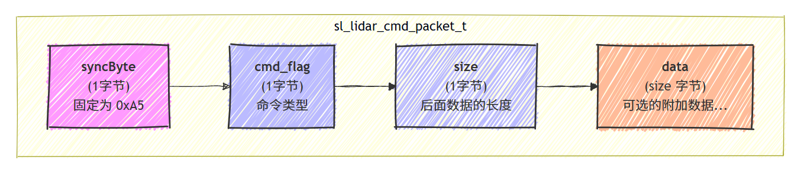
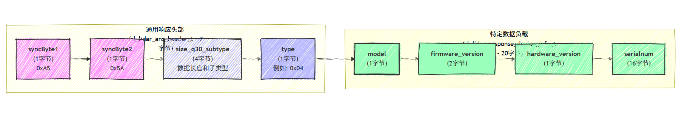
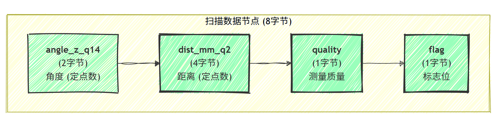
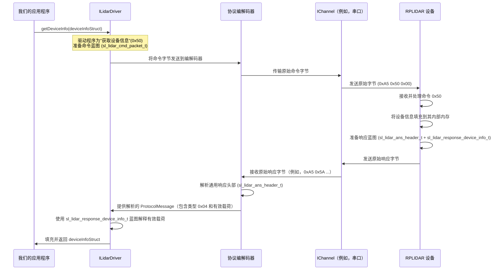

# 第三章：激光雷达协议数据结构

欢迎回来

在我们迄今为止的旅程中，我们探索了如何使用[激光雷达驱动接口 (ILidarDriver)](01_lidar_driver_interface__ilidardriver__.md)（我们汽车的仪表盘）来命令我们的 RPLIDAR，以及[激光雷达样本数据解包器](02_lidar_sample_data_unpacker_.md)如何将原始数据处理成可用的扫描点。

但是，解包器接收的那些"原始数据"到底*是*什么？当 `ILidarDriver` 向激光雷达发送命令时，它如何知道要使用什么格式？

想象一下我们和我们的激光雷达正在尝试相互交流。即使有了仪表盘（`ILidarDriver`）和流水线（`LIDARSampleDataUnpacker`），我们双方也需要说同一种语言。本章的全部内容就是理解这种"语言"：**激光雷达协议数据结构**。

### 激光雷达协议数据结构解决什么问题？

当我们的计算机向 RPLIDAR 发送命令，或者当 RPLIDAR 发送回扫描数据时，它不是发送人类可读的文本。它发送的是原始字节流（如 `01001101 01100101 01100001 01110011 ...`）。如果没有预定义的结构，这些字节只是噪音。

**==激光雷达协议数据结构是精确的蓝图或"表单"，定义了这些原始字节的确切布局和含义==。** 它们是我们的软件和激光雷达传感器都同意的共享字典和语法。它们告诉我们：

*   "此消息的第一个字节表示'命令类型'。"
*   "接下来的两个字节是'距离测量'。"
*   "这个特定的数字表示'新扫描从这里开始'。"

它们至关重要，因为它们将一堆原始电信号转换为有意义的信息，如扫描点的角度和距离，或设备的固件版本。没有这些结构，就无法进行通信

### 激光雷达的"语言"：命令和响应

激光雷达协议定义了两种主要的数据结构类型：

1.  **命令结构（我们对激光雷达说话）：** 这些是我们的软件发送*给* RPLIDAR 的消息模板。例如，告诉它"开始扫描"或"获取设备健康状况"。
2.  **响应结构（激光雷达对我们说话）：** 这些是 RPLIDAR 发送*回*我们软件的消息模板。例如，发送回扫描数据，或其设备信息。

让我们看看我们已经遇到或将要遇到的关键数据结构，使用我们已经看到的示例。

#### 1. 🎢通用命令数据包：`sl_lidar_cmd_packet_t`



我们的软件发送给激光雷达的每个命令都以一个小的头部开始。这个头部告诉激光雷达它是什么类型的命令以及它有多长。

```cpp
// 来自: sdk/include/sl_lidar_protocol.h
typedef struct sl_lidar_cmd_packet_t
{
    sl_u8 syncByte; // 必须是 SL_LIDAR_CMD_SYNC_BYTE (0xA5)
    sl_u8 cmd_flag; // 命令代码 + 有效载荷存在标志
    sl_u8 size;     // 命令有效载荷的大小（如果有）
    sl_u8 data[0];  // 实际有效载荷数据的占位符
} __attribute__((packed)) sl_lidar_cmd_packet_t;
```

*   **`syncByte`**：一个特殊字节（始终为 `0xA5`），告诉激光雷达，"嘿，一个新命令从这里开始！"
*   **`cmd_flag`**：包含实际的命令代码（例如，`0x50` 表示"获取设备信息"）和一个标志，指示后面是否有更多数据（"有效载荷"）。
*   **`size`**：如果命令有额外的信息要发送（如特定的扫描模式 ID），这会告诉激光雷达该额外信息（有效载荷）有多少字节。
*   **`data[0]`**：这不是一个真正的数组；这是一个 C 技巧，表示"任何额外的数据（有效载荷）都会紧跟在这个头部之后。"

我们在末尾看到的 `__attribute__((packed))` 非常重要！它告诉编译器*不要*在结构的字段之间添加任何额外的间距（填充）。这确保了结构的字节与激光雷达期望的确切布局完全匹配，逐字节对应。

#### 2. 通用响应头部：`sl_lidar_ans_header_t`



类似地，来自激光雷达的每个响应都以一个通用头部开始，它告诉我们的软件有关传入消息的重要细节。

```cpp
// 来自: sdk/include/sl_lidar_protocol.h
typedef struct sl_lidar_ans_header_t
{
    sl_u8  syncByte1; // 必须是 SL_LIDAR_ANS_SYNC_BYTE1 (0xA5)
    sl_u8  syncByte2; // 必须是 SL_LIDAR_ANS_SYNC_BYTE2 (0x5A)
    sl_u32 size_q30_subtype; // 编码的有效载荷大小和子类型
    sl_u8  type;      // 响应有效载荷的类型（例如，设备信息、扫描数据）
} __attribute__((packed)) sl_lidar_ans_header_t;
```

*   **`syncByte1`, `syncByte2`**：一个双字节"签名"（`0xA5 0x5A`），指示来自激光雷达的响应的开始。
*   **`size_q30_subtype`**：这是一个巧妙的字段，打包了两条信息：响应有效载荷的总大小和一个"子类型"（可用于响应的不同变体）。`_q30` 表示大小的定点编码。
*   **`type`**：这很关键！它告诉我们的软件消息主体（有效载荷）中是*什么类型的数据*。例如，`0x04` 表示设备信息，`0x83` 表示 HQ 扫描数据。

这些通用头部就像消息的"信封"。它们告诉我们谁发送的，有多大，以及里面是什么类型的信件。

#### 3. 特定响应：设备信息（`sl_lidar_response_device_info_t`）

我们在[第一章：激光雷达驱动接口 (ILidarDriver)](01_lidar_driver_interface__ilidardriver__.md)中看到了这个结构，当我们调用 `getDeviceInfo()` 时。这是激光雷达在被要求提供其基本信息时发送的数据的确切蓝图。

```cpp
// 来自: sdk/include/sl_lidar_cmd.h
typedef struct _sl_lidar_response_device_info_t
{
    sl_u8   model;           // 激光雷达的型号 ID
    sl_u16  firmware_version; // 固件版本（主版本.次版本）
    sl_u8   hardware_version; // 硬件版本
    sl_u8   serialnum[16];   // 唯一序列号（16 字节）
} __attribute__((packed)) sl_lidar_response_device_info_t;
```

让我们分解一下如何读取这些字段，就像我们的软件所做的那样：

| 字段               | 数据类型  | 描述                                                         |
| :----------------- | :-------- | :----------------------------------------------------------- |
| `model`            | `sl_u8`   | 表示激光雷达特定型号的单个字节（例如，A1M8 为 `18`）。       |
| `firmware_version` | `sl_u16`  | 一个双字节无符号整数。固件版本通常打包到其中：高 8 位是**主**版本，低 8 位是**次**版本。<br> _示例：_ 如果 `firmware_version` 是 `0x0118`，那么 `0x01` 是主版本（1），`0x18` 是次版本（24），所以是 `1.24`。 |
| `hardware_version` | `sl_u8`   | 表示硬件修订版的单个字节。                                   |
| `serialnum[16]`    | `sl_u8[]` | 一个 16 字节的数组，构成激光雷达的唯一序列号。               |

注意 `sl_u8`、`sl_u16`、`sl_u32` 类型。这些是平台无关的类型（在 `sl_types.h` 中定义），确保 `sl_u8` 始终是 1 字节，`sl_u16` 是 2 字节，`sl_u32` 是 4 字节，无论我们是在 Windows 还是 Linux 上编译。这种一致性对于精确的字节级通信至关重要。

#### 4. 特定响应：高质量扫描数据（`sl_lidar_response_measurement_node_hq_t`）



这是我们应用程序最常见和最重要的结构，因为它保存了实际的扫描测量值。我们在[第二章：激光雷达样本数据解包器](02_lidar_sample_data_unpacker_.md)中遇到了它，当我们的监听器接收扫描点时。

```cpp
// 来自: sdk/include/sl_lidar_protocol.h
typedef struct sl_lidar_response_measurement_node_hq_t {
    sl_u16   angle_z_q14;
    sl_u32   dist_mm_q2;
    sl_u8    quality;
    sl_u8    flag;
} __attribute__((packed)) sl_lidar_response_measurement_node_hq_t;
```

让我们解码这个蓝图：

| 字段          | 数据类型 | 描述                                                         |
| :------------ | :------- | :----------------------------------------------------------- |
| `angle_z_q14` | `sl_u16` | 这是一个双字节无符号整数，以 **Q14 定点格式**表示角度。定点数是一种仅使用整数表示分数值的方法，节省空间。<br> 要将 `angle_z_q14` 转换为度数：`angle_in_degrees = (float)node->angle_z_q14 / 16384.0f;`（因为 1 << 14 是 16384）。完整的 360 度旋转被映射到 `sl_u16` 范围内。此字段还包含一个"同步位"（`RPLIDAR_RESP_MEASUREMENT_HQ_SYNCBIT`）来指示新的 360 度扫描的开始。 |
| `dist_mm_q2`  | `sl_u32` | 一个四字节无符号整数，用于距离，以 **Q2 定点格式**表示，以毫米为单位。<br> 要将 `dist_mm_q2` 转换为毫米：`distance_in_mm = (float)node->dist_mm_q2 / 4.0f;`（因为 1 << 2 是 4）。除以 1000 也可以得到米。 |
| `quality`     | `sl_u8`  | 表示此特定测量质量的单个字节，通常范围从 0（最低）到 255（最高）。质量值越高意味着测量越可靠。 |
| `flag`        | `sl_u8`  | 用于各种标志的单个字节。这里最重要的标志是 `RPLIDAR_RESP_MEASUREMENT_HQ_SYNCBIT`（`0x01`）。如果设置了此位，则意味着此测量节点是新的 360 度扫描旋转中的*第一个*。 |

### SDK 如何使用这些结构（底层）

作为使用 `ILidarDriver` 的应用程序开发者，我们通常不会直接创建这些结构或自己转换原始字节。SDK 为我们完成了所有这些艰苦的工作！

让我们重新审视 `getDeviceInfo()` 的工作原理，重点关注数据结构：



如我们所见，`ILidarDriver` 使用这些蓝图来组装要发送给激光雷达的命令消息。当激光雷达响应时，原始字节首先由[异步收发器和协议编解码器](04_asynchronous_transceiver___protocol_codec_.md)（我们将在下一章介绍！）处理，以识别一般消息类型和大小（使用 `sl_lidar_ans_header_t`）。然后，`ILidarDriver`（或用于扫描数据的[激光雷达样本数据解包器](02_lidar_sample_data_unpacker_.md)）使用*特定*的响应结构（如 `sl_lidar_response_device_info_t` 或 `sl_lidar_response_measurement_node_hq_t`）来正确解释有效载荷中的每个字节。

### 协议定义

这些结构在头文件中定义，如 `sdk/include/sl_lidar_protocol.h` 和 `sdk/include/sl_lidar_cmd.h`。让我们看看实际的 C++ 定义：

```cpp
// 来自: sdk/include/sl_lidar_protocol.h（简化）

// 通用命令数据包头部
typedef struct sl_lidar_cmd_packet_t
{
    sl_u8 syncByte; // 0xA5
    sl_u8 cmd_flag; // 命令代码 + has_payload 标志
    sl_u8 size;     // 有效载荷大小
    sl_u8 data[0];
} __attribute__((packed)) sl_lidar_cmd_packet_t;

// 通用应答头部
typedef struct sl_lidar_ans_header_t
{
    sl_u8  syncByte1; // 0xA5
    sl_u8  syncByte2; // 0x5A
    sl_u32 size_q30_subtype; // 编码的大小和子类型
    sl_u8  type;      // 特定响应类型（例如，设备信息为 0x04）
} __attribute__((packed)) sl_lidar_ans_header_t;
```
这些是几乎所有通信的基本构建块。

现在，对于我们接收的特定数据：
```cpp
// 来自: sdk/include/sl_lidar_cmd.h（简化）

// 设备信息响应有效载荷
typedef struct _sl_lidar_response_device_info_t
{
    sl_u8   model;
    sl_u16  firmware_version;
    sl_u8   hardware_version;
    sl_u8   serialnum[16];
} __attribute__((packed)) sl_lidar_response_device_info_t;
```

```cpp
// 来自: sdk/include/sl_lidar_protocol.h（简化）

// 高质量测量节点响应有效载荷
typedef struct sl_lidar_response_measurement_node_hq_t
{
    sl_u16   angle_z_q14;  // Q14 定点格式的角度
    sl_u32   dist_mm_q2;   // Q2 定点格式的距离（mm）
    sl_u8    quality;      // 测量质量
    sl_u8    flag;         // 标志（例如，同步位）
} __attribute__((packed)) sl_lidar_response_measurement_node_hq_t;
```

这些代码片段是 SDK 用来解释从 RPLIDAR 获取的原始字节的字面定义。通过理解这些蓝图，我们可以更深入地了解我们的 `ILidarDriver` 和 `LIDARSampleDataUnpacker` 如何无缝地将低级电信号转换为我们应用程序的可用数据。

### 结论

在本章中，我们了解到激光雷达协议数据结构是我们的软件和 RPLIDAR 用来通信的基本"语言"。

这些精确的蓝图定义了交换的每个字节的确切含义，将原始数据转换为有意义的命令和传感器读数。我们查看了命令和响应的通用头部，然后深入研究了特定结构，如 `sl_lidar_response_device_info_t` 和 `sl_lidar_response_measurement_node_hq_t`，了解了它们的字段以及如何转换定点数。

接下来，我们将探索[异步收发器和协议编解码器](04_asynchronous_transceiver___protocol_codec_.md)，它是负责通过通信通道实际发送和接收这些结构化字节的组件。

