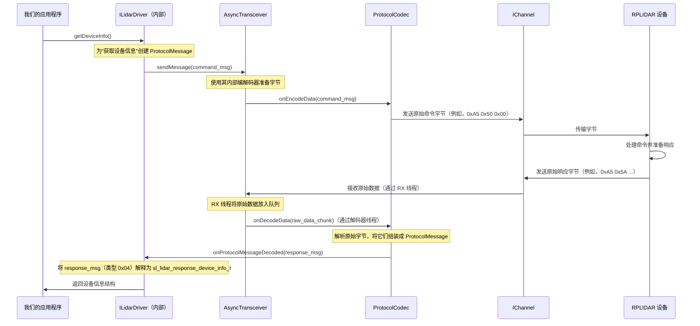

# 第四章：🎢异步收发器和协议编解码器

欢迎回来

在[第三章：激光雷达协议数据结构](03_lidar_protocol_data_structures_.md)中，我们了解了我们的软件和 RPLIDAR 传感器用来通信的精确"语言"（命令和响应结构）。我们现在知道消息*看起来*是什么样的。

但是仅仅知道一种语言是不够的；我们还需要一种有效地*说*和*听*它的方式。这就是**异步收发器**和**协议编解码器**发挥作用的地方。这对强大的组合构成了通信骨干，确保我们的激光雷达与我们的计算机顺畅通信，而不会拖累我们的主程序。

### 异步收发器和协议编解码器解决什么问题？

想象一下我们正在尝试向国外发送和接收信件（命令和数据）。我们面临两个主要挑战：

1.  **邮政服务（发送/接收）：** 我们需要一个可靠的邮政服务，可以快速发送我们的外发信件并不断检查传入邮件，而无需我们整天站在邮箱旁边。如果我们必须等待每封信到达后才能做其他事情，我们的生活会非常缓慢！
2.  **翻译（理解语言）：** 一旦邮件到达，它是用外语写的。我们需要一个熟练的翻译将这些传入的外国信件转换成我们的语言，并将我们的外发消息翻译成外语供邮政服务使用。

在 RPLIDAR 的世界中，`AsyncTransceiver` 是我们的**邮政服务**，`ProtocolCodec` 是我们的**翻译**。

激光雷达不断旋转并发出激光束，产生连续的数据流。我们的计算机还需要发送命令（如"开始扫描"）并接收响应。这种通信是：
*   **连续的：** 特别是对于扫描数据，它是一个永无止境的流。
*   **低级的：** 它是通过串口或网络的原始字节，不容易理解。
*   **时间敏感的：** 我们希望尽快获得数据。

`AsyncTransceiver` 和 `ProtocolCodec` 协同工作，高效地管理这种复杂、连续的通信，而无需我们的主程序不断监视通信通道或手动解码原始字节。这确保了**流畅、高效和非阻塞的通信**。

### "邮政服务"和"翻译"类比

让我们用我们的类比来分解这两个组件：

| 组件                 | 类比                 | 在 RPLIDAR SDK 中的角色                                      |
| :------------------- | :------------------- | :----------------------------------------------------------- |
| **AsyncTransceiver** | 邮政服务             | 在后台线程中不断从[通信通道 (IChannel)](05_communication_channel__ichannel__.md)读取原始数据块，并向其发送原始命令字节。它确保连续的数据流而不会阻塞我们的主程序。 |
| **ProtocolCodec**    | 翻译                 | 接收 `AsyncTransceiver` 接收的原始字节，并将它们解释为有意义的 `ProtocolMessage` 对象（翻译激光雷达的"语言"）。它还将外发的 `ProtocolMessage` 对象转换为用于发送的原始字节。 |
| **ProtocolMessage**  | 标准信件（在传输中） | 一个通用的、结构化的信封，在翻译之前或之后以标准化格式保存外发命令或传入响应。 |

### 概念 1：`AsyncTransceiver`（我们的后台邮政服务）

`AsyncTransceiver` 负责通过物理连接（如 USB 串口）实际发送和接收数据。"Async"部分至关重要：它意味着**异步**，这意味着它在后台完成工作，释放我们的主程序去做其他事情。

它通常使用两个内部线程：
*   **RX 线程（传入邮件）：** 此线程不断监视[通信通道 (IChannel)](05_communication_channel__ichannel__.md)以获取传入的原始数据。当数据到达时，它抓取原始字节并将它们放入内部队列，就像邮递员从许多邮箱收集信件并将它们带回邮局。
*   **解码器线程（分拣传入邮件）：** 此线程不断从 RX 线程填充的队列中获取原始数据块，并将它们传递给 `ProtocolCodec` 进行翻译。这就像邮局工作人员将收集的邮件分拣到不同的箱子中。

`AsyncTransceiver` 不理解字节的*含义*；它只处理它们的移动。

### 概念 2：`ProtocolCodec`（我们的专职翻译）

`ProtocolCodec` 是理解 RPLIDAR "语言"（我们在第三章中讨论的[激光雷达协议数据结构](03_lidar_protocol_data_structures_.md)）的大脑。它执行两个主要功能：

*   **编码（翻译外发命令）：** 当我们的 `ILidarDriver` 想要发送命令（如"获取设备信息"）时，它会创建一个 `ProtocolMessage`。`ProtocolCodec` 接收此 `ProtocolMessage` 并将其转换为激光雷达理解的确切原始字节序列，添加同步字节、大小、校验和等。
*   **解码（翻译传入响应）：** 当 `AsyncTransceiver` 从激光雷达接收原始字节时，它将它们馈送给 `ProtocolCodec`。然后，`ProtocolCodec` 智能地解析这些字节，识别它们的类型，验证它们（例如，校验和），并将它们重建为有意义的 `ProtocolMessage` 对象。一旦完整的消息被解码，它就会通知"监听器"（通常是 `ILidarDriver`）。

### 概念 3：`ProtocolMessage`（标准化信封）

`ProtocolMessage` 是 SDK *内部*使用的简单、标准化容器，用于表示命令或响应。它是 `AsyncTransceiver` 传递给 `ProtocolCodec` 的通用格式，也是 `ProtocolCodec` 生成或消费的内容。

它通常包含：
*   `cmd`：表示外发消息的命令代码或传入消息的响应类型的单个字节。
*   `len`：实际数据有效载荷的大小。
*   `data`：指向构成实际有效载荷的原始字节的指针（例如，设备信息结构或扫描数据）。

将其视为通用信件模板：它有发件人/收件人地址（`cmd`）、信件长度（`len`）和信件的实际内容（`data`）。`ProtocolCodec` 填充或读取这些字段。

### 如何使用（或者更确切地说，理解）这种抽象

作为使用 `ILidarDriver` 的应用程序开发者，我们通常**不直接与** `AsyncTransceiver` 或 `ProtocolCodec` 交互。它们是 `ILidarDriver` 的低级内部组件。`ILidarDriver` 在幕后使用它们来执行所有复杂的通信，就像我们使用汽车的方向盘而无需知道动力转向泵的工作原理一样。

然而，理解它们的作用对于掌握 SDK 的功能至关重要：

*   当我们调用 `lidar->getDeviceInfo()` 时，`ILidarDriver` 为"获取设备信息"命令形成一个 `ProtocolMessage`。
*   这个 `ProtocolMessage` 被交给 `AsyncTransceiver` 发送。
*   `AsyncTransceiver` 将其传递给 `ProtocolCodec` 以编码为原始字节。
*   这些原始字节通过[通信通道 (IChannel)](05_communication_channel__ichannel__.md)发送到激光雷达。
*   当激光雷达响应时，原始字节通过 `IChannel` 返回。
*   `AsyncTransceiver` 的 RX 线程接收它们。
*   `AsyncTransceiver` 的解码器线程将它们传递给 `ProtocolCodec`。
*   `ProtocolCodec` 将原始字节解码回 `ProtocolMessage`，然后通知内部监听器（它是 `ILidarDriver` 的一部分）。
*   最后，`ILidarDriver` 从解码的 `ProtocolMessage` 中提取信息，并给我们提供干净的 `sl_lidar_response_device_info_t`。

由于这些组件，整个过程在后台自动发生！

### "底层"发生了什么？

让我们看看 `getDeviceInfo()` 调用的简化事件序列，重点关注 `AsyncTransceiver` 和 `ProtocolCodec`。



#### 代码

让我们看看这些组件在 SDK 中是如何构造和交互的。

**1. `ProtocolMessage` 结构（`sdk/src/sl_async_transceiver.h`）**

这是消息的标准信封。

```cpp
// 来自: sdk/src/sl_async_transceiver.h（简化）
class ProtocolMessage {
public:
    size_t len;
    _u8 cmd;
protected:
    _u8* data; // 实际有效载荷字节
    // ... 其他用于内存管理的内部细节
public:
    ProtocolMessage(); // 构造函数
    ProtocolMessage(_u8 cmd, const void* buffer, size_t size); // 用于外发
    // ... 如 fillData()、getDataBuf() 等方法
};
```
当 `ILidarDriver` 想要发送命令或当 `ProtocolCodec` 解码了响应时，它会将数据包装在 `ProtocolMessage` 中。

**2. `IAsyncProtocolCodec` 接口（`sdk/src/sl_async_transceiver.h`）**

这定义了任何协议编解码器的契约。`RPLidarProtocolCodec`（处理实际的 RPLIDAR 协议）实现了这一点。

```cpp
// 来自: sdk/src/sl_async_transceiver.h（简化）
class IAsyncProtocolCodec {
public:
    // 当通道出现错误时调用
    virtual void onChannelError(u_result errCode) {}
    // 调用以重置解码器状态
    virtual void onDecodeReset() {}
    // 当接收到原始数据时由 AsyncTransceiver 调用
    virtual void onDecodeData(const void* buffer, size_t size) = 0;
    // 由 AsyncTransceiver 调用以了解编码所需的缓冲区大小
    virtual size_t estimateLength(message_autoptr_t& message) = 0;
    // 由 AsyncTransceiver 调用以将 ProtocolMessage 转换为原始字节
    virtual void onEncodeData(message_autoptr_t& message, _u8* txbuffer, size_t* size) = 0;
};
```
此接口清楚地显示了"翻译"的职责：将 `ProtocolMessage` 编码为原始字节，并将原始字节解码回消息。

**3. `AsyncTransceiver`（`sdk/src/sl_async_transceiver.cpp` 和 `.h`）**

这是中央"邮政服务"。它在其构造函数中接收一个 `IAsyncProtocolCodec`。

```cpp
// 来自: sdk/src/sl_async_transceiver.h（简化）
class AsyncTransceiver {
public:
    AsyncTransceiver(IAsyncProtocolCodec& codec); // 接收其翻译的引用
    u_result openChannelAndBind(IChannel* channel);
    u_result sendMessage(message_autoptr_t& msg); // 用于发送命令
protected:
    sl_result _proc_rxThread();     // RX 线程函数
    sl_result _proc_decoderThread(); // 解码器线程函数
private:
    IChannel* _bindedChannel;
    IAsyncProtocolCodec& _codec; // 翻译实例
    rp::hal::Thread _rxThread;
    rp::hal::Thread _decoderThread;
    // ... 内部队列和锁
};
```

让我们看看发送消息的核心：

```cpp
// 来自: sdk/src/sl_async_transceiver.cpp（简化）
u_result AsyncTransceiver::sendMessage(message_autoptr_t& msg) {
    // ... 检查是否工作 ...
    size_t requiredBufferSize = _codec.estimateLength(msg); // 询问编解码器缓冲区大小
    _u8* txBuffer = new _u8[requiredBufferSize];
    _codec.onEncodeData(msg, txBuffer, &requiredBufferSize); // 编解码器填充缓冲区
    int txSize = _bindedChannel->write(txBuffer, requiredBufferSize); // 通过通道发送
    delete[] txBuffer;
    return (txSize < 0) ? RESULT_OPERATION_FAIL : RESULT_OK;
}
```
在这里，`AsyncTransceiver` 将编码任务委托给其 `_codec`，然后使用 `_bindedChannel` 发送原始字节。

`_proc_rxThread` 和 `_proc_decoderThread` 是后台线程。`_proc_rxThread` 只是从通道读取：
```cpp
// 来自: sdk/src/sl_async_transceiver.cpp（简化）
sl_result AsyncTransceiver::_proc_rxThread() {
    while (_isWorking) {
        size_t hintedSize = 0;
        _bindedChannel->waitForDataExt(hintedSize, 1000); // 等待传入数据
        if (hintedSize) {
            Buffer* decodeBuffer = new Buffer(); // 分配缓冲区
            decodeBuffer->data = new _u8[hintedSize];
            decodeBuffer->size = _bindedChannel->read(decodeBuffer->data, hintedSize); // 读取原始字节
            _rxLocker.lock();
            _rxQueue.push_back(decodeBuffer); // 添加到队列
            _dataEvt.set(); // 通知解码器线程
            _rxLocker.unlock();
        }
    }
    return RESULT_OK;
}
```
`_proc_decoderThread` 从队列中获取数据并将其传递给 `_codec`：
```cpp
// 来自: sdk/src/sl_async_transceiver.cpp（简化）
sl_result AsyncTransceiver::_proc_decoderThread() {
    _codec.onDecodeReset(); // 重置编解码器的内部状态
    while (_isWorking) {
        // ... 等待 _rxQueue 中的数据 ...
        Buffer* bufferToDecode = _rxQueue.front();
        _rxQueue.pop_front();
        _codec.onDecodeData(bufferToDecode->data, bufferToDecode->size); // 将原始数据传递给编解码器
        delete bufferToDecode;
    }
    return RESULT_OK;
}
```

**4. `RPLidarProtocolCodec` 实现（`sdk/src/sl_lidarprotocol_codec.cpp` 和 `.h`）**

此类实现 `IAsyncProtocolCodec` 并包含翻译 RPLIDAR 协议的实际逻辑。它有一个内部状态机来解析传入的字节。

```cpp
// 来自: sdk/src/sl_lidarprotocol_codec.h（简化）
class RPLidarProtocolCodec : public IAsyncProtocolCodec {
public:
    // ... 构造函数、其他方法
    virtual void onDecodeData(const void* buffer, size_t size); // 核心解码逻辑
    void setMessageListener(IProtocolMessageListener* l); // 通知 ILidarDriver
protected:
    IProtocolMessageListener* _listener; // 解码消息时通知谁
    ProtocolMessage _decodingMessage;     // 存储正在组装的消息
    _u32 _working_states;                  // 内部状态（例如，等待同步字节 1，然后 2，然后大小...）
    int _rx_pos;
};
```

`onDecodeData` 方法很复杂，因为它逐字节读取，检查同步字，读取大小，然后收集有效载荷。当它成功解码完整消息时，它会通知其监听器：

```cpp
// 来自: sdk/src/sl_lidarprotocol_codec.cpp（简化）
void RPLidarProtocolCodec::onDecodeData(const void* buffer, size_t size) {
    const _u8* data = reinterpret_cast<const _u8*>(buffer);
    const _u8* dataEnd = data + size;

    while (data != dataEnd) {
        _u8 currentByte = *data;
        ++data;

        switch (_working_states & ((_u32)STATUS_LOOP_MODE_FLAG - 1)) {
            case STATUS_WAIT_SYNC1: // 检查 0xA5
                if (currentByte == RPLIDAR_ANS_SYNC_BYTE1) { _working_states = STATUS_WAIT_SYNC2; }
                break;
            case STATUS_WAIT_SYNC2: // 检查 0x5A
                if (currentByte == RPLIDAR_ANS_SYNC_BYTE2) { _working_states = STATUS_WAIT_SIZE_FLAG; _rx_pos = 0; }
                else { _working_states = STATUS_WAIT_SYNC1; } // 错误，重新开始
                break;
            // ... 更多状态以读取大小、类型和有效载荷 ...
            case STATUS_RECV_PAYLOAD:
                _decodingMessage.getDataBuf()[_rx_pos++] = currentByte;
                if ((size_t)_rx_pos == _decodingMessage.getPayloadSize()) {
                    // 完整消息已接收！通知监听器。
                    if (_listener) {
                        _listener->onProtocolMessageDecoded(_decodingMessage);
                    }
                    _working_states = STATUS_WAIT_SYNC1; // 为下一条消息重置
                    _rx_pos = 0;
                }
                break;
        }
    }
}
```
这个简化的 `onDecodeData` 显示了 `ProtocolCodec` 如何持续处理传入的原始字节，通过状态转换来识别消息结构（同步字节、大小、类型），然后收集有效载荷。

一旦形成完整的 `ProtocolMessage`，它就会调用 `_listener->onProtocolMessageDecoded()` 将结构化消息传递给其注册的监听器（在 SDK 的内部架构中，它是 `ILidarDriver` 实现）。

### 结论

`AsyncTransceiver` 和 `ProtocolCodec` 是 `rplidar_sdk` 像专业的==邮政服务和翻译==一样协同工作，不断发送命令和接收原始数据，然后将这些原始字节==转换==为有意义的 `ProtocolMessage` 对象（反之亦然）。这在后台高效地发生，==确保我们的主应用程序可以专注于*如何处理*激光雷达数据，而不是*如何*与硬件通信==。

在下一章[通信通道 (IChannel)](05_communication_channel__ichannel__.md)中，我们将探索这个通信链的最底层：代表物理连接的抽象接口，如串口或网络套接字，`AsyncTransceiver` 使用它来物理交换字节。

