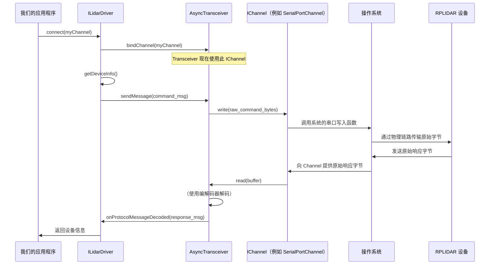
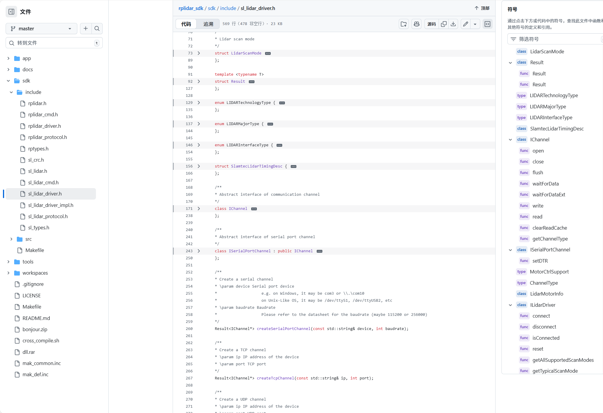

# 第五章：通信通道 (IChannel)

欢迎回来

在[第四章：异步收发器和协议编解码器](04_asynchronous_transceiver___protocol_codec__.md)中，我们了解了 `AsyncTransceiver` 如何充当后台邮政服务，`ProtocolCodec` 如何充当专职翻译，确保我们的激光雷达的语言被理解而不会拖累我们的主程序。它们处理激光雷达协议的"说"和"听"。

但即使是最高效的邮政服务也需要一条物理道路或连接来递送邮件。

这就是**通信通道 (IChannel)** 的作用所在。它是实际的物理链路，是在我们的计算机和 RPLIDAR 之间传输原始字节的"电线"或"网络连接"。

### `IChannel` 解决什么问题？

我们的 RPLIDAR 传感器可以通过几种方式连接到我们的计算机：
*   **通过 ==USB 转串口==适配器：** 这是最常见的连接方式，显示为"串口"（例如，Linux 上的 `/dev/ttyUSB0`，Windows 上的 `COM11`）。
*   **通过以太网 (==TCP/IP==)：** 一些高级 RPLIDAR 型号使用标准以太网电缆直接连接到我们的网络，并通过 TCP 通信。
*   **通过以太网 (==UDP==)：** 其他型号可能使用 UDP 通过以太网进行特定类型的数据传输。

> 这些连接类型中的每一种在底层的工作方式都非常不同。

通过串口发送字节涉及的系统调用与通过 TCP 套接字或 UDP 套接字发送字节不同。如果 `ILidarDriver`（我们汽车的仪表盘）必须了解所有这些复杂的差异，它将变得非常复杂且难以维护。

==`IChannel` 抽象通过为任何物理通信链路提供**统一接口**来解决这个问题==。这就像我们家里有一个标准的电源插座。无论我们的设备是灯还是电视，它都插入相同类型的插座，插座处理提供电力的复杂性。`ILidarDriver` 不关心字节是*如何*物理发送或接收的；它只需要一个*可以*发送和接收它们的通道。

### 连接我们计算机和激光雷达的"电缆"

将 `IChannel` 视为连接我们的计算机和 RPLIDAR 的**标准连接器或电缆**。它为任何类型的物理连接提供了一组通用操作：

*   **`open()`**：连接电缆。
*   **`close()`**：断开电缆。
*   **`write(data, size)`**：通过电缆发送原始字节。
*   **`read(buffer, size)`**：通过电缆接收原始字节。
*   **`waitForData(...)`**：等待字节到达电缆。

针对每种物理连接存在不同类型的 `IChannel` 实现：

| 通道类型            | 描述                             | 工作原理（简化）                      |
| :------------------ | :------------------------------- | :------------------------------------ |
| `SerialPortChannel` | 通过串口连接（例如，USB 转串口） | 使用操作系统的串口函数发送/接收字节。 |
| `TcpChannel`        | 通过 TCP/IP 网络连接             | 使用标准 TCP 套接字操作。             |
| `UdpChannel`        | 通过 UDP 网络连接                | 使用标准 UDP 套接字操作。             |

这种设计意味着 SDK 的更高层（如 `ILidarDriver` 和 `AsyncTransceiver`）只需要知道如何使用 `IChannel` 接口，而不需要了解串口、TCP 或 UDP 通信的具体细节。

### 如何使用 `IChannel`

我们在[第一章：激光雷达驱动接口 (ILidarDriver)](01_lidar_driver_interface__ilidardriver__.md)中创建第一个激光雷达应用程序时已经使用过 `IChannel`！让我们重新审视那个示例，突出显示 `IChannel` 部分。

`rplidar_sdk` 提供了辅助函数来轻松创建不同类型的 `IChannel` 对象。

#### 1. 创建串口通道

对于大多数 RPLIDAR，我们将通过串口连接。`createSerialPortChannel` 函数为我们完成此操作。

```cpp
#include "sl_lidar.h"
#include "sl_lidar_driver.h" // 包含 IChannel 定义

// 为串口创建通信通道实例
// 将 "/dev/ttyUSB0" 替换为我们激光雷达的串口（例如，Windows 上的 "COM11"）
// 将 115200 替换为我们激光雷达型号的正确波特率。
sl::Result<sl::IChannel*> channelResult = sl::createSerialPortChannel("/dev/ttyUSB0", 115200);

// 始终检查通道是否成功创建
if (!channelResult) {
    fprintf(stderr, "创建串口通道失败！\r\n");
    return -1; // 处理错误
}
sl::IChannel* _channel = *channelResult; // 从 Result 对象获取原始指针
```
此代码片段创建了一个 `SerialPortChannel` 类型的对象（尽管我们只看到它是 `IChannel*`）。此对象现在已准备好管理物理串口连接。

#### 2. 创建 TCP 通道（用于网络连接的激光雷达）

如果我们有一个支持网络的 RPLIDAR，我们将使用 `createTcpChannel`：

```cpp
// 创建 TCP 通道的示例
// 将 "192.168.1.200" 替换为我们激光雷达的 IP 地址，将 8080 替换为其端口。
sl::Result<sl::IChannel*> tcpChannelResult = sl::createTcpChannel("192.168.1.200", 8080);

if (!tcpChannelResult) {
    fprintf(stderr, "创建 TCP 通道失败！\r\n");
    // 处理错误
}
sl::IChannel* _tcpChannel = *tcpChannelResult;
```
这为我们提供了一个实际上内部是 `TcpChannel` 的 `IChannel`。

#### 3. 打开通道并连接驱动程序

一旦我们有了 `IChannel` 实例，我们就将其传递给 `ILidarDriver::connect()` 方法。然后驱动程序将使用此通道进行所有通信。

```cpp
// 创建 ILidarDriver 实例（如第一章所示）
sl::Result<sl::ILidarDriver*> lidarResult = sl::createLidarDriver();
sl::ILidarDriver* lidar = *lidarResult; // 为简洁起见假设成功

// 将激光雷达驱动程序连接到通信通道
sl_result res = lidar->connect(_channel); // 在此处传递我们创建的 IChannel

if (SL_IS_FAIL(res)) {
    fprintf(stderr, "连接到激光雷达失败！错误代码：%08x\r\n", res);
    // 处理错误和清理
} else {
    printf("通过通道成功连接到激光雷达！\n");
    // 现在我们可以使用 lidar->getDeviceInfo()、lidar->startScan() 等。
}

// 完成后不要忘记关闭和删除（如第一章所示）
lidar->disconnect();
delete lidar;
delete _channel;
```
`ILidarDriver` 不需要知道 `_channel` 是串口、TCP 还是 UDP 连接。它只是在 `IChannel` 接口上调用 `open()`、`write()`、`read()` 和 `close()` 方法，正确的底层实现会处理具体细节。

### "底层"发生了什么？

当我们的 `ILidarDriver` 调用 `connect(_channel)` 时，它本质上告诉其内部通信组件（特别是[异步收发器](04_asynchronous_transceiver___protocol_codec__.md)）开始使用此 `IChannel` 进行所有数据交换。

然后，`AsyncTransceiver` 调用 `_channel->write()` 等方法来发送命令，调用 `_channel->read()` 来接收响应。`IChannel` 实现（例如 `SerialPortChannel`）将这些请求转换为实际的系统级操作以与硬件交互。

 `IChannel` 如何融入通信流程的简化视图：


如我们所见，`IChannel` 是高级软件抽象与操作系统处理的低级物理硬件通信之间的关键桥梁。

#### 代码

通过看源码 我们可以很清晰的感知到架构



`IChannel` 在 `sdk/include/sl_lidar_driver.h` 中定义为 C++ 抽象类（接口）：

```cpp
// 来自: sdk/include/sl_lidar_driver.h（简化）
class IChannel
{
public:
    virtual ~IChannel() {}

public:
    // 具体类必须实现的纯虚函数
    virtual bool open() = 0;
    virtual void close() = 0;
    virtual void flush() = 0;
    virtual bool waitForData(size_t size, sl_u32 timeoutInMs = -1, size_t* actualReady = nullptr) = 0;
    virtual sl_result waitForDataExt(size_t& size_hint, sl_u32 timeoutInMs = 1000) = 0;
    virtual int write(const void* data, size_t size) = 0;
    virtual int read(void* buffer, size_t size) = 0;
    virtual void clearReadCache() = 0;
    virtual int getChannelType() = 0;
};
```
每个虚函数末尾的 `= 0` 意味着 `IChannel` 本身不提供实现；它仅指定通道必须支持*哪些*操作。

现在，让我们看看 `SerialPortChannel` 如何实现其中一些方法。这些实现通常依赖于更低级的平台特定 I/O 原语，我们将在[第六章：硬件抽象层 (HAL) 原语](06_hardware_abstraction_layer__hal__primitives_.md)中讨论。

**`SerialPortChannel` 实现**

```cpp
// 来自: sdk/src/sl_serial_channel.cpp（简化）
namespace sl {
    class SerialPortChannel : public ISerialPortChannel // ISerialPortChannel 继承自 IChannel
    {
    public:
        SerialPortChannel(const std::string& device, int baudrate)
            : _rxtxSerial(rp::hal::serial_rxtx::CreateRxTx()) // 创建低级串口处理程序
        {
            _device = device;
            _baudrate = baudrate;
        }

        bool open() override {
            if (!bind(_device, _baudrate)) return false;
            return _rxtxSerial->open(); // 调用低级串口打开
        }

        void close() override {
            _rxtxSerial->close(); // 调用低级串口关闭
        }

        int write(const void* data, size_t size) override {
            // 将数据转换为预期类型并调用低级串口写入
            return _rxtxSerial->senddata(static_cast<const sl_u8*>(data), size);
        }

        int read(void* buffer, size_t size) override {
            // 将缓冲区转换为预期类型并调用低级串口读取
            return _rxtxSerial->recvdata(static_cast<sl_u8*>(buffer), size);
        }

        // ... 其他 IChannel 方法以类似方式实现
    private:
        rp::hal::serial_rxtx* _rxtxSerial; // 实际的低级串口处理程序
        std::string _device;
        int _baudrate;
    };

    // 创建实例的辅助函数
    Result<IChannel*> createSerialPortChannel(const std::string& device, int baudrate) {
        return new SerialPortChannel(device, baudrate);
    }
}
```
注意 `SerialPortChannel` 如何依赖 `rp::hal::serial_rxtx`。这个 `rp::hal::serial_rxtx` 是硬件抽象层 (HAL) 的一部分，它处理真正的系统特定细节（如与 Linux 上的 `/dev/ttyUSB0` 或 Windows 上的 `COM` 端口交互）。

`TcpChannel` 和 `UdpChannel` 也存在类似的实现，它们将分别在内部使用 `rp::net::StreamSocket` 和 `rp::net::DGramSocket` 来处理网络通信。

```cpp
// 来自: sdk/src/sl_tcp_channel.cpp（简化）
namespace sl {
    class TcpChannel : public IChannel
    {
    public:
        TcpChannel(const std::string& ip, int port)
            : _binded_socket(rp::net::StreamSocket::CreateSocket()) // 创建低级 TCP 套接字处理程序
        {
            _ip = ip;
            _port = port;
        }

        bool open() override {
            // ... 绑定逻辑 ...
            return IS_OK(_binded_socket->connect(_socket)); // 调用低级 TCP 连接
        }

        int write(const void* data, size_t size) override {
            return _binded_socket->send(data, size); // 调用低级 TCP 发送
        }

        int read(void* buffer, size_t size) override {
            size_t lenRec = 0;
            _binded_socket->recv(buffer, size, lenRec); // 调用低级 TCP 接收
            return (int)lenRec;
        }
        // ... 其他 IChannel 方法
    private:
        rp::net::StreamSocket* _binded_socket; // 低级 TCP 套接字处理程序
        rp::net::SocketAddress _socket;
        std::string _ip;
        int _port;
    };
    // 辅助函数
    Result<IChannel*> createTcpChannel(const std::string& ip, int port) {
        return new TcpChannel(ip, port);
    }
}
```
这展示了 `IChannel` 如何提供一种干净、一致的方式与我们的 RPLIDAR 通信，抽象掉底层物理连接的复杂、平台特定的细节。

### 结论

在本章中，我们了解到 `IChannel` 是我们的计算机和 RPLIDAR 之间物理通信链路的基本抽象。无论是串口、TCP 还是 UDP，`IChannel` 都提供了一个统一的接口（`open`、`close`、`read`、`write`），像 `ILidarDriver` 这样的更高级组件可以使用它而无需了解低级细节。这种模块化设计使 SDK 灵活且易于扩展。

在下一章也是最后一章[硬件抽象层 (HAL) 原语](06_hardware_abstraction_layer__hal__primitives_.md)中，我们将==了解 SDK 的最底层：`IChannel` 实现所依赖的平台特定代码==，以实际与我们计算机的硬件通信。

