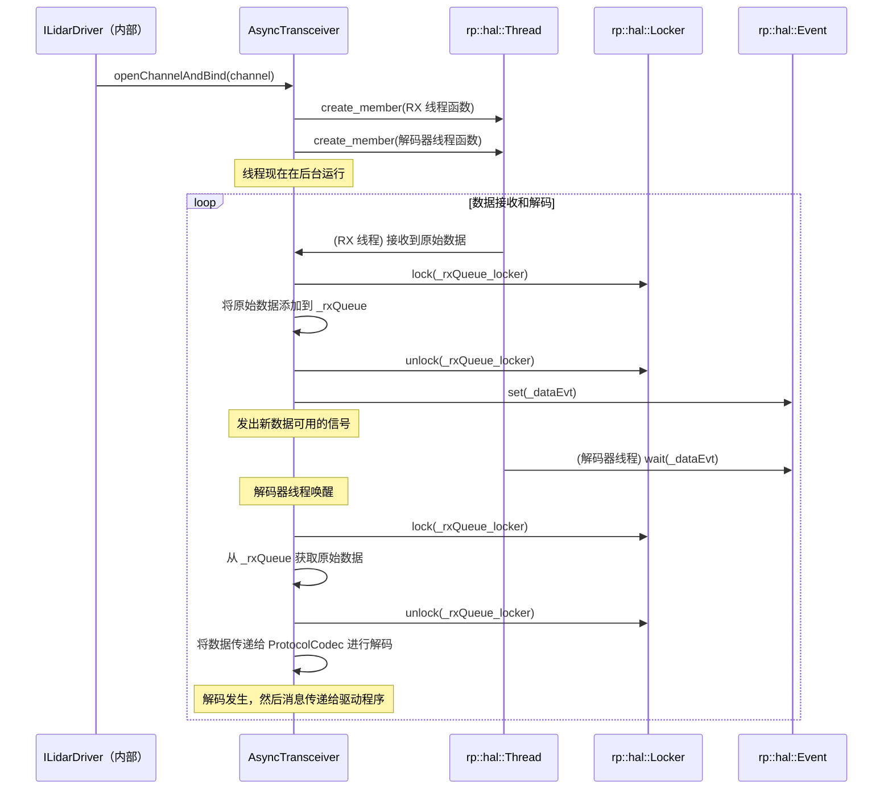
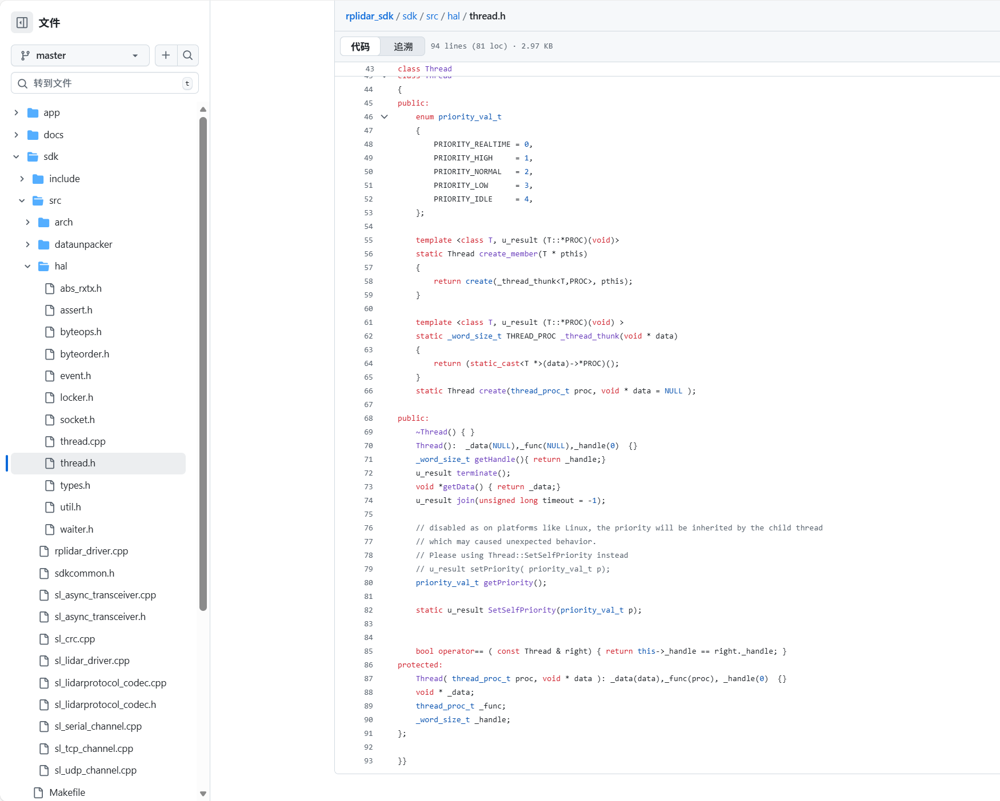

# 第六章：硬件抽象层 (HAL) 原语

在我们的上一章[通信通道 (IChannel)](05_communication_channel__ichannel__.md)中，我们==了解到=`IChannel` 充当标准化的"电缆"，将我们的计算机连接到 RPLIDAR，抽象掉它是串口还是网络连接==。

但是 `IChannel` 实际上如何*==打开==*串口或通过网络*发送*字节？[异步收发器和协议编解码器](04_asynchronous_transceiver___protocol_codec__.md)如何在后台==运行其任务而不冻结我们的程序==？答案在于**硬件抽象层 (HAL) 原语**。

### HAL 原语解决什么问题？

想象一下我们正在为我们的 RPLIDAR 编写软件。我们希望它在 Windows、macOS 和 Linux 上无缝运行。这听起来很好，但这些操作系统 (OS) 处理基本任务的方式非常不同：

*   **创建"工人"（线程）：** 在 Windows 上，我们可能使用 `CreateThread()`。在 Linux/macOS 上，我们使用 `pthread_create()`。
*   **控制"交通"（锁）：** Windows 使用 `CreateMutex()` 或 `CreateSemaphore()`。Linux/macOS 使用 `pthread_mutex_init()`。
*   **发送"信号"（事件）：** Windows 使用 `CreateEvent()`。Linux/macOS 一起使用 `pthread_cond_init()` 和 `pthread_mutex_init()`。
*   **测量时间（定时器）：** Windows 使用 `GetTickCount()` 或 `QueryPerformanceCounter()`。Linux/macOS 使用 `clock_gettime()` 或 `gettimeofday()`。

如果 SDK 每次需要创建线程或锁定数据时都必须为*每个* OS 编写单独的代码，代码库将变得庞大、混乱且容易出错。

- **硬件抽象层 (HAL) 原语**通过为这些低级、特定于 OS 的操作提供**"通用翻译器"或"标准工具包"**来解决这个问题。

定义了 SDK 其余部分可以使用的一组通用工具（线程、锁、事件、定时器），然后为每个操作系统提供不同的实现。这使得整个 SDK **可移植**且**健壮**，允许它在任何地方运行而无需重大代码更改。

### 用于 OS 交互的"通用工具包"

将 HAL 原语视为**基本构建块**，允许 SDK 执行基本任务，无论它在哪个建筑工地（操作系统）上。这些工具抽象掉了底层 OS 的混乱细节：

| HAL 原语   | 类比               | 在 RPLIDAR SDK 中的角色                                      |
| :--------- | :----------------- | :----------------------------------------------------------- |
| **Thread** | 独立的"工人"       | 允许 SDK 的部分（如 `AsyncTransceiver`）在后台运行任务而不阻塞主程序，确保流畅、连续的数据处理。 |
| **Locker** | "交通警察"或"门锁" | 确保一次只有一个"工人"（线程）访问共享数据（如数据队列），防止数据损坏和崩溃。 |
| **Event**  | "标志"或"信号灯"   | 使"工人"（线程）能够在发生重要事情时相互通知（例如，"新数据可用！"），使他们能够有效地协调任务。 |
| **Timer**  | "秒表"或"时钟"     | 提供精确的时间测量和受控延迟，对于定时通信、超时和确保准确的传感器数据时间戳至关重要。 |

### 如何使用（或者更确切地说，理解）HAL 原语

作为使用 `rplidar_sdk` 的应用程序开发者，我们几乎**永远不会直接与** HAL 原语交互。它们是 SDK 更高层使用的深层内部组件。

例如：
*   `AsyncTransceiver`（我们在[第四章](04_asynchronous_transceiver___protocol_codec__.md)中的邮政服务）使用 `rp::hal::Thread` 创建其后台线程。
*   它使用 `rp::hal::Locker` 保护其内部数据队列，使用 `rp::hal::Event` 在新数据到达时发出信号。
*   `IChannel` 实现（如[第五章](05_communication_channel__ichannel__.md)中的 `SerialPortChannel`）可能使用 HAL 定时器在等待数据时管理超时。

我们可能间接看到 HAL 概念的少数例外是在诸如 `delay()` 用于暂停，或 `getms()`/`getus()` 用于获取当前时间等实用程序中，它们作为便利函数公开。

**示例：简单延迟（间接 HAL 定时器使用）**

```cpp
#include "sl_lidar.h" // 间接包含相关的 HAL 头文件

// ... 我们的主应用程序代码 ...

printf("等待 1 秒...\n");
delay(1000); // 内部使用 rp::hal::delay
printf("等待完成！\n");

// 获取当前时间（微秒）
_u64 currentTimeUs = getus(); // 内部使用 rp::arch::rp_getus
printf("当前时间（微秒）：%llu\n", currentTimeUs);
```
在这里，`delay()` 和 `getus()` 是宏/函数，内部使用 HAL 提供的正确的特定于 OS 的定时器实现。我们不需要知道它在 Linux 上是 `usleep` 还是在 Windows 上是 `Sleep`；`rplidar_sdk` 为我们处理这些。

### "底层"发生了什么？

让我们追踪[异步收发器和协议编解码器](04_asynchronous_transceiver___protocol_codec__.md)如何依赖 HAL 原语。回想一下，`AsyncTransceiver` 有一个 RX 线程（接收原始数据）和一个解码器线程（解码原始数据）。



如我们所见，`AsyncTransceiver` 使用 `rp::hal::Thread` 生成其工作线程，使用 `rp::hal::Locker` 在两个线程可能尝试访问共享的 `_rxQueue` 时保护它，并使用 `rp::hal::Event` 在数据准备好时在 RX 和解码器线程之间发出信号。

#### 代码



HAL 的强大之处在于使用 `#ifdef _WIN32` 或 `#if defined(__GNUC__)` 的条件编译。这允许根据目标 OS 编译不同的代码。

**1. `rp::hal::Thread`（定义和创建线程）**

`rp::hal::Thread` 类为创建和管理线程提供了一个通用接口。它的实际实现隐藏在特定于 OS 的文件中，但头文件（`sdk/src/hal/thread.h`）定义了其公共方法。

```cpp
// 来自: sdk/src/hal/thread.h（简化）
namespace rp{ namespace hal{

class Thread
{
public:
    // 创建线程的工厂方法（通常与成员函数一起使用）
    template <class T, u_result (T::*PROC)(void)>
    static Thread create_member(T * pthis) { /* ... 内部逻辑 ... */ return create(_thread_thunk<T,PROC>, pthis); }

    // 加入方法以等待线程完成
    u_result join(unsigned long timeout = -1);
    // ... 其他方法如 terminate、getPriority ...
protected:
    // 内部线程句柄和函数指针
    void * _data;
    thread_proc_t _func;
    _word_size_t _handle; // 这将存储特定于 OS 的线程句柄
};

}}
```
当 `AsyncTransceiver` 调用 `create_member` 时，它实际上触发特定于 OS 的代码来创建线程。

例如，在 Linux 上，这最终将调用 `pthread_create()`。在 Windows 上，它将调用 `_beginthreadex()`（`CreateThread()` 的常见 C++ 运行时包装器）。

**2. `rp::hal::Locker`（保护共享数据）**

`rp::hal::Locker` 类提供了一种跨平台的方式来创建用于线程同步的互斥锁或信号量。

```cpp
// 来自: sdk/src/hal/locker.h（简化）
namespace rp{ namespace hal{ 

class Locker
{
public:
    Locker(bool recursive = false) { /* ... 特定于 OS 的初始化 ... */ }
    ~Locker() { /* ... 特定于 OS 的清理 ... */ }

    // 锁定资源
    Locker::LOCK_STATUS lock(unsigned long timeout = 0xFFFFFFFF);
    // 解锁资源
    void unlock();

protected:
#ifdef _WIN32
    HANDLE  _lock; // Windows 使用 HANDLE 用于互斥锁/信号量
    bool _recusive;
#else
    pthread_mutex_t _lock; // Linux/macOS 使用 pthread_mutex_t
#endif
};

// AutoLocker 用于方便的 RAII 风格锁定
class AutoLocker {
public:
    AutoLocker(Locker &l): _binded(l) { _binded.lock(); }
    ~AutoLocker() { _binded.unlock(); }
    Locker & _binded;
};

}}
```
注意 `#ifdef _WIN32` 块。这就是魔法发生的地方：Windows 构建使用 `HANDLE` 存储锁，而 Linux/macOS 构建使用 `pthread_mutex_t`。

然后，`lock()` 和 `unlock()` 方法在 Windows 上内部调用 `WaitForSingleObject()` / `ReleaseMutex()`，或在 Linux/macOS 上调用 `pthread_mutex_lock()` / `pthread_mutex_unlock()`。

**3. `rp::hal::Event`（线程间信号传递）**

`rp::hal::Event` 类允许一个线程向另一个线程发出信号。

```cpp
// 来自: sdk/src/hal/event.h（简化）
namespace rp{ namespace hal{

class Event
{
public:
    Event(bool isAutoReset = true, bool isSignal = false) { /* ... 特定于 OS 的初始化 ... */ }
    ~Event() { /* ... 特定于 OS 的清理 ... */ }

    // 发出事件信号，唤醒等待的线程
    void set( bool isSignal = true );
    // 等待事件被发出信号
    unsigned long wait( unsigned long timeout = 0xFFFFFFFF );

protected:
#ifdef _WIN32
    HANDLE _event; // Windows 使用 HANDLE 用于事件对象
#else
    pthread_cond_t         _cond_var;   // Linux/macOS 使用 pthread 条件变量
    pthread_mutex_t        _cond_locker; // 以及一个互斥锁来保护条件变量
    bool                   _is_signalled;
    bool                   _isAutoReset;
#endif
};

}}
```
同样，`#ifdef _WIN32` 展示了特定于 OS 的实现。`set()` 在 Windows 上调用 `SetEvent()`，或在 Linux/macOS 上调用 `pthread_cond_signal()`。`wait()` 在 Windows 上调用 `WaitForSingleObject()`，或在 Linux/macOS 上调用 `pthread_cond_wait()`/`pthread_cond_timedwait()`。

**4. HAL 定时器（`sdk/src/arch/*/timer.h`）**

定时器函数提供时间测量和延迟功能。为了性能，这些通常实现为简单的宏或内联函数。

```cpp
// 来自: sdk/src/arch/linux/timer.h（为 Linux/macOS 简化）
#include <unistd.h> // 用于 usleep

static inline void delay(_word_size_t ms){
    // ... 将 ms 转换为微秒并调用 usleep 的逻辑 ...
    usleep(ms*1000); // Linux/macOS 特定的延迟函数
}

namespace rp{ namespace arch{
    _u64 rp_getus(); // 在 .cpp 中使用 clock_gettime 实现
    _u64 rp_getms();
}}

#define getms() rp::arch::rp_getms()
#define getus() rp::arch::rp_getus()
```

```cpp
// 来自: sdk/src/arch/win32/timer.h（为 Windows 简化）
#include <windows.h> // 用于 Sleep

#define delay(x)   ::Sleep(x) // Windows 特定的延迟函数

namespace rp{ namespace arch{
    // ... 使用 QueryPerformanceCounter 进行高分辨率定时的函数 ...
    _u64 getHDTimer();   // 高清定时器（毫秒）
    _u64 getHDTimer_us(); // 高清定时器（微秒）
}}

#define getms()   rp::arch::getHDTimer()
#define getus()   rp::arch::getHDTimer_us()
```
这些代码片段清楚地显示了 `delay()` 宏如何直接映射到 Linux/macOS 上的 `usleep()` 和 Windows 上的 `Sleep()`。类似地，`getms()` 和 `getus()` 被定义为使用每个平台的适当高分辨率定时器函数。

### 结论

硬件抽象层 (HAL) 原语构成了 `rplidar_sdk` 的基础。

通过==为线程、锁、事件和定时器提供跨平台接口，HAL 使整个 SDK 能够在 Windows、macOS 和 Linux 等不同操作系统上稳健地运行==。

作为应用程序开发者，我们很少直接与这些原语交互，但它们的存在对于 SDK 的可移植性以及我们的 RPLIDAR 应用程序的流畅、高效运行至关重要。

这种低级抽象是拼图的最后一块，展示了 SDK 如何设法在不同的计算机系统上从高级应用程序与物理传感器通信。

END *★,°*:.☆(￣▽￣)/.°★* 。