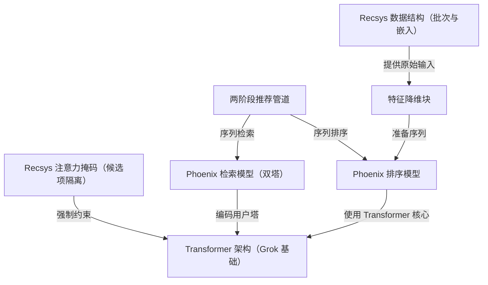

links:[xai-org/x-algorithm: Algorithm powering the For You feed on X](https://github.com/xai-org/x-algorithm)

# docs：x-algorithm

Phoenix 是一个分两个阶段运行的==个性化内容推荐引擎==

首先，**Phoenix 检索模型**（*第 1 阶段*）使用快速相似性搜索（双塔架构）快速将数百万个潜在项目缩小到数百个相关候选项。

其次，**Phoenix 排序模型**（*第 2 阶段*）使用源自 Grok 的深度 *Transformer 架构*，
==应用专门的 **Recsys 注意力掩码**来精心评分并排序候选项==，以生成最终的用户信息流。


## 可视化



## 章节

1. [两阶段推荐管道
](01_two_stage_recommendation_pipeline_.md)
2. [Transformer 架构（Grok 基础）
](02_transformer_architecture__grok_base__.md)
3. [Phoenix 检索模型（双塔）
](03_phoenix_retrieval_model__two_tower__.md)
4. [Recsys 注意力掩码（候选项隔离）
](04_recsys_attention_mask__candidate_isolation__.md)
5. [Recsys 数据结构（批次与嵌入）
](05_recsys_data_structures__batch___embeddings__.md)
6. [特征降维块
](06_feature_reduction_blocks_.md)
7. [Phoenix 排序模型
](07_phoenix_ranking_model_.md)

---


# X For You 信息流算法

本仓库包含支持 X 上"For You"信息流的核心推荐系统

结合了网络内内容（来自我们关注的账户）和网络外内容（通过基于机器学习的检索发现），并使用基于 Grok 的 transformer 模型对所有内容进行排序。

注意：transformer 实现是从 xAI 的 Grok-1 开源版本移植而来，针对推荐系统用例进行了调整。

## 目录
- 概述
- 系统架构
- 组件
  - Home Mixer
  - Thunder
  - Phoenix
  - Candidate Pipeline
- 工作原理
  - 管道阶段
  - 评分和排序
  - 过滤
- 关键设计决策

## 概述

For You 信息流算法从两个来源检索、排序和过滤帖子：

- **网络内（Thunder）**：来自我们关注的账户的帖子
- **网络外（Phoenix Retrieval）**：从全球语料库中发现的帖子

两个来源被组合在一起，并使用 Phoenix（一个基于 Grok 的 transformer 模型）进行排序，该模型预测每个帖子的参与概率。最终分数是这些预测参与度的加权组合。

我们已经从系统中消除了每一个手工设计的特征和大多数启发式方法。基于 Grok 的 transformer 通过理解我们的参与历史（我们喜欢什么、回复什么、分享什么等）来完成所有繁重的工作，并使用它来确定哪些内容与我们相关。

## 系统架构

```
┌─────────────────────────────────────────────────────────────────────────────────────────────┐
│                                    FOR YOU 信息流请求                                        │
└─────────────────────────────────────────────────────────────────────────────────────────────┘
                                               │
                                               ▼
┌─────────────────────────────────────────────────────────────────────────────────────────────┐
│                                         HOME MIXER                                          │
│                                        (编排层)                                              │
├─────────────────────────────────────────────────────────────────────────────────────────────┤
│                                                                                             │
│   ┌─────────────────────────────────────────────────────────────────────────────────────┐   │
│   │                                   查询水化                                           │   │
│   │  ┌──────────────────────────┐    ┌──────────────────────────────────────────────┐   │   │
│   │  │ 用户操作序列              │    │ 用户特征                                      │   │   │
│   │  │ (参与历史)                │    │ (关注列表、偏好等)                            │   │   │
│   │  └──────────────────────────┘    └──────────────────────────────────────────────┘   │   │
│   └─────────────────────────────────────────────────────────────────────────────────────┘   │
│                                              │                                              │
│                                              ▼                                              │
│   ┌─────────────────────────────────────────────────────────────────────────────────────┐   │
│   │                                  候选来源                                            │   │
│   │         ┌─────────────────────────────┐    ┌────────────────────────────────┐       │   │
│   │         │        THUNDER              │    │     PHOENIX RETRIEVAL          │       │   │
│   │         │    (网络内帖子)             │    │   (网络外帖子)                  │       │   │
│   │         │                             │    │                                │       │   │
│   │         │  来自我们关注的              │    │  基于机器学习的相似性搜索        │       │   │
│   │         │  账户的帖子                  │    │  跨全球语料库                   │       │   │
│   │         └─────────────────────────────┘    └────────────────────────────────┘       │   │
│   └─────────────────────────────────────────────────────────────────────────────────────┘   │
│                                              │                                              │
│                                              ▼                                              │
│   ┌─────────────────────────────────────────────────────────────────────────────────────┐   │
│   │                                      水化                                            │   │
│   │  获取额外数据：核心帖子元数据、作者信息、媒体实体等。                                  │   │
│   └─────────────────────────────────────────────────────────────────────────────────────┘   │
│                                              │                                              │
│                                              ▼                                              │
│   ┌─────────────────────────────────────────────────────────────────────────────────────┐   │
│   │                                      过滤                                            │   │
│   │  移除：重复项、旧帖子、自己的帖子、被屏蔽的作者、静音的关键词等。                      │   │
│   └─────────────────────────────────────────────────────────────────────────────────────┘   │
│                                              │                                              │
│                                              ▼                                              │
│   ┌─────────────────────────────────────────────────────────────────────────────────────┐   │
│   │                                       评分                                           │   │
│   │  ┌──────────────────────────┐                                                       │   │
│   │  │  Phoenix 评分器           │    基于 Grok 的 Transformer 预测：                    │   │
│   │  │  (机器学习预测)           │    P(喜欢), P(回复), P(转发), P(点击)...              │   │
│   │  └──────────────────────────┘                                                       │   │
│   │               │                                                                     │   │
│   │               ▼                                                                     │   │
│   │  ┌──────────────────────────┐                                                       │   │
│   │  │  加权评分器               │    加权分数 = Σ (权重 × P(操作))                      │   │
│   │  │  (组合预测)               │                                                       │   │
│   │  └──────────────────────────┘                                                       │   │
│   │               │                                                                     │   │
│   │               ▼                                                                     │   │
│   │  ┌──────────────────────────┐                                                       │   │
│   │  │  作者多样性               │    衰减重复作者分数                                    │   │
│   │  │  评分器                   │    以确保信息流多样性                                  │   │
│   │  └──────────────────────────┘                                                       │   │
│   └─────────────────────────────────────────────────────────────────────────────────────┘   │
│                                              │                                              │
│                                              ▼                                              │
│   ┌─────────────────────────────────────────────────────────────────────────────────────┐   │
│   │                                      选择                                            │   │
│   │                    按最终分数排序，选择前 K 个候选项                                   │   │
│   └─────────────────────────────────────────────────────────────────────────────────────┘   │
│                                              │                                              │
│                                              ▼                                              │
│   ┌─────────────────────────────────────────────────────────────────────────────────────┐   │
│   │                              过滤（选择后）                                           │   │
│   │                 可见性过滤（已删除/垃圾/暴力/血腥等）                                  │   │
│   └─────────────────────────────────────────────────────────────────────────────────────┘   │
│                                                                                             │
└─────────────────────────────────────────────────────────────────────────────────────────────┘
                                               │
                                               ▼
┌─────────────────────────────────────────────────────────────────────────────────────────────┐
│                                     排序后的信息流响应                                        │
└─────────────────────────────────────────────────────────────────────────────────────────────┘
```

## 组件

### Home Mixer
位置：home-mixer/

组装 For You 信息流的编排层。它利用 CandidatePipeline 框架，包含以下阶段：

| 阶段         | 描述                                 |
| ------------ | ------------------------------------ |
| 查询水化器   | 获取用户上下文（参与历史、关注列表） |
| 来源         | 从 Thunder 和 Phoenix 检索候选项     |
| 水化器       | 用额外数据丰富候选项                 |
| 过滤器       | 移除不合格的候选项                   |
| 评分器       | 预测参与度并计算最终分数             |
| 选择器       | 按分数排序并选择前 K 个              |
| 选择后过滤器 | 最终可见性和去重检查                 |
| 副作用       | 缓存请求信息以供将来使用             |

==服务器公开一个 gRPC 端点（ScoredPostsService），为给定用户返回排序后的帖子==。

### Thunder
位置：thunder/

一个内存中的帖子存储和实时摄取管道，跟踪所有用户的最近帖子。它：

- 从 Kafka 消费帖子创建/删除事件
- 为原始帖子、回复/转发和视频帖子维护每个用户的存储
- 从请求用户关注的账户提供"网络内"帖子候选项
- 自动修剪超过保留期的帖子

Thunder 实现了对网络内内容的亚毫秒级查找，无需访问外部数据库。

### Phoenix
位置：phoenix/

具有两个主要功能的机器学习组件：

**1. 检索（双塔模型）**
查找相关的网络外帖子：

- **用户塔**：将用户特征和参与历史编码为嵌入
- **候选塔**：将所有帖子编码为嵌入
- **相似性搜索**：通过点积相似性检索前 K 个帖子

**2. 排序（带候选隔离的 Transformer）**
预测每个候选项的参与概率：

- 将用户上下文（参与历史）和候选帖子作为输入
- 使用特殊的注意力掩码，使候选项不能相互关注
- 输出每种操作类型（喜欢、回复、转发、点击等）的概率

有关详细的架构文档，请参阅 phoenix/README.md。

### Candidate Pipeline
位置：candidate-pipeline/

用于构建推荐管道的可重用框架。定义以下特征：

| 特征       | 目的                             |
| ---------- | -------------------------------- |
| Source     | 从数据源获取候选项               |
| Hydrator   | 用额外特征丰富候选项             |
| Filter     | 移除不应显示的候选项             |
| Scorer     | 计算排序分数                     |
| Selector   | 排序并选择顶部候选项             |
| SideEffect | 运行异步副作用（缓存、日志记录） |

该框架在可能的情况下并行运行来源和水化器，具有可配置的错误处理和日志记录。

## 工作原理

### 管道阶段

1. **查询水化**：获取用户的最近参与历史和元数据（例如关注列表）

2. **候选来源**：从以下位置检索候选项：
   - **Thunder**：来自关注账户的最近帖子（网络内）
   - **Phoenix Retrieval**：从全球语料库中机器学习发现的帖子（网络外）

3. **候选水化**：用以下内容丰富候选项：
   - 核心帖子数据（文本、媒体等）
   - 作者信息（用户名、验证状态）
   - 视频时长（对于视频帖子）
   - 订阅状态

4. **评分前过滤**：移除以下帖子：
   - 重复项
   - 太旧的
   - 来自查看者自己的
   - 来自被屏蔽/静音账户的
   - 包含静音关键词的
   - 之前看过或最近提供的
   - 不合格的订阅内容

5. **评分**：按顺序应用多个评分器：
   - **Phoenix 评分器**：从 Phoenix transformer 模型获取机器学习预测
   - **加权评分器**：将预测组合成最终相关性分数
   - **作者多样性评分器**：衰减重复作者分数以实现多样性
   - **OON 评分器**：调整网络外内容的分数

6. **选择**：按分数排序并选择前 K 个候选项

7. **选择后处理**：对要提供的帖子候选项进行最终验证

### 评分和排序

Phoenix 基于 Grok 的 transformer 模型预测多种参与类型的概率：

```
预测：
├── P(收藏)
├── P(回复)
├── P(转发)
├── P(引用)
├── P(点击)
├── P(个人资料点击)
├── P(视频观看)
├── P(照片展开)
├── P(分享)
├── P(停留)
├── P(关注作者)
├── P(不感兴趣)
├── P(屏蔽作者)
├── P(静音作者)
└── P(举报)
```

加权评分器将这些组合成最终分数：

```
最终分数 = Σ (权重_i × P(操作_i))
```

积极操作（喜欢、转发、分享）具有正权重。消极操作（屏蔽、静音、举报）具有负权重，推低用户可能不喜欢的内容。

### 过滤

过滤器在两个阶段运行：

**评分前过滤器：**

| 过滤器                       | 目的                          |
| ---------------------------- | ----------------------------- |
| DropDuplicatesFilter         | 移除重复的帖子 ID             |
| CoreDataHydrationFilter      | 移除未能水化核心元数据的帖子  |
| AgeFilter                    | 移除超过阈值的旧帖子          |
| SelfpostFilter               | 移除用户自己的帖子            |
| RepostDeduplicationFilter    | 去重相同内容的转发            |
| IneligibleSubscriptionFilter | 移除用户无法访问的付费内容    |
| PreviouslySeenPostsFilter    | 移除用户已经看过的帖子        |
| PreviouslyServedPostsFilter  | 移除会话中已提供的帖子        |
| MutedKeywordFilter           | 移除包含用户静音关键词的帖子  |
| AuthorSocialgraphFilter      | 移除来自被屏蔽/静音作者的帖子 |

**选择后过滤器：**

| 过滤器                  | 目的                            |
| ----------------------- | ------------------------------- |
| VFFilter                | 移除已删除/垃圾/暴力/血腥等帖子 |
| DedupConversationFilter | 去重同一对话线程的多个分支      |

## 设计决策

### 1. 无手工设计特征
==系统完全依赖基于 Grok 的 transformer 从用户参与序列中学习相关性==。没有针对内容相关性的手动特征工程。这显著降低了我们数据管道和服务基础设施的复杂性。

### 2. 排序中的候选隔离
在 transformer 推理期间，候选项不能相互关注——只能关注用户上下文。这确保了帖子的分数不依赖于批次中的其他帖子，使分数一致且可缓存。

### 3. 基于哈希的嵌入
==检索和排序都使用多个哈希函数进行嵌入查找==

### 4. 多操作预测
该模型不是预测单个"相关性"分数，而是预测许多操作的概率。

### 5. 可组合的管道架构
candidate-pipeline crate 提供了一个灵活的框架，用于构建推荐管道，具有：

- 将管道执行和监控与业务逻辑分离
- 独立阶段的并行执行和优雅的错误处理
- 轻松添加新的来源、水化、过滤器和评分器
