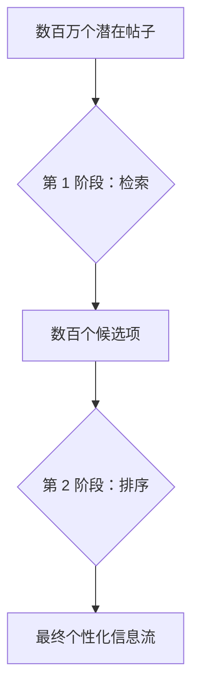
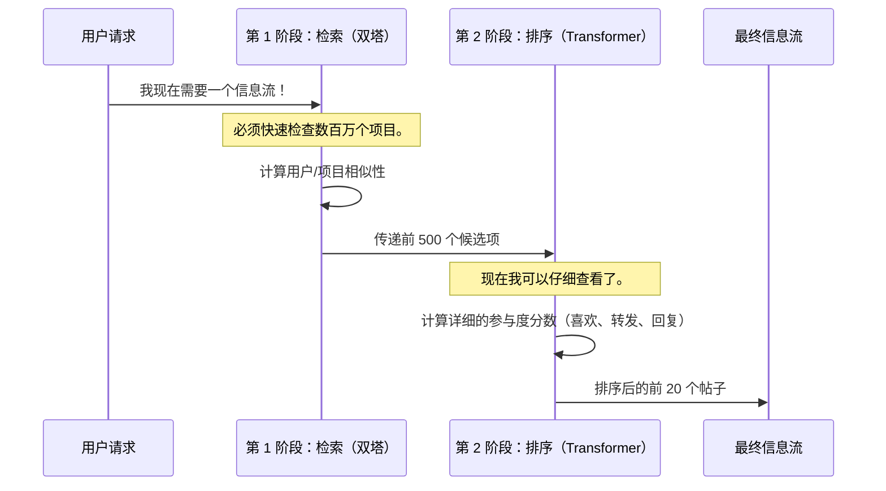

# 第 1 章：两阶段推荐管道

欢迎来到 **x-algorithm** 

在本教程中，我们将探索 Phoenix 背后的核心概念，这是==决定我们看到哪些内容==的系统。

我们的旅程从最基本的概念开始：==Phoenix 如何在几分之一秒内从数十亿个选项中为我们选择完美的帖子==。

## 毫秒级挑战

想象一下，我们正在运行一个拥有每天创建数百万条内容的大型网站

- 当用户打开他们的信息流时，系统必须立即决定向他们展示的绝对最佳的 20 条帖子。

如果我们试图使用最强大、最复杂的人工智能模型为每个用户对*每一个项目*进行评分，这个过程将需要数小时，而不是毫秒。

> 为了解决**速度**和**准确性**之间的权衡，Phoenix 使用了一种称为**两阶段推荐管道**的基本架构模式。

这个管道就像一个高速过滤漏斗。我们使用快速方法缩小范围，然后对剩余的小集合使用强大的方法。

## 过滤漏斗

整个推荐过程被分解为两个不同的阶段或阶段，它们按顺序工作：

1. **第 1 阶段：==检索==**（广撒网）
2. **第 2 阶段：==排序==**（精细排序器）

此过程可视化如下：



让我们看看每个阶段的贡献：

| 特征         | 第 1 阶段：检索                    | 第 2 阶段：排序                      |
| :----------- | :--------------------------------- | :----------------------------------- |
| **主要目标** | 效率和找到*相关*项目。             | 准确性和找到*最佳*顺序。             |
| **输入大小** | 数百万个项目（整个语料库）         | 数百个项目（检索到的候选项）         |
| **模型类型** | 简单、快速的相似性匹配（双塔模型） | 复杂、强大的评分（Transformer 模型） |
| **输出**     | 一个小的、未排序的候选项列表。     | 一个最终的、完美排序的项目列表。     |

---

## 第 1 阶段：检索（找到相关的少数）

检索的主要目标很简单：快速将候选项数量从数百万减少到可管理的数量（通常是几百个）。

为了快速做到这一点，检索不能深入查看帖子。相反，它依赖于一种称为**==相似性匹配==**的技术。

### 检索的工作原理

1.  **表示一切：** ==系统将每个用户和每条内容转换为单个数值向量==（或"嵌入"）。
2.  **快速搜索：** 系统使用简单的数学（如点积）快速测量用户向量与数百万个内容向量的"接近"程度。
3.  **输出：** 只保留与用户向量最接近的内容向量。

Phoenix 在此步骤中使用了一种特定的、高效的模型结构，称为 [Phoenix 检索模型（双塔）](03_phoenix_retrieval_model__two_tower__.md)。

检索阶段运行后，我们得到一个索引和分数列表：

```python
# 检索阶段后的输出结构
class RetrievalOutput(NamedTuple):
    # ... 为简单起见，排除了 user_representation ...
    top_k_indices: jax.Array      # [B, K] 指向项目的索引
    top_k_scores: jax.Array       # [B, K] 相似性分数

# 如果我们搜索 1 亿个项目（N）并检索 500 个（K）候选项：
print(retrieval_output.top_k_indices.shape)
# (Batch_Size, 500)
```
这为我们提供了"数百个候选项"（在本例中为 500 个），准备进入下一个更详细的阶段。

## 第 2 阶段：排序（为参与度评分）

现在列表很短（例如 500 个候选项），速度要求的压力减轻了，我们可以使用更强大、更复杂的模型来获得准确的分数。

排序阶段使用大型 **Transformer** 模型——类似于 Grok 等高级大型语言模型中使用的技术——来精心评分这几百个候选项。

### 为什么排序功能强大

排序模型不仅仅关注相似性；它还考虑简单检索模型跳过的深层、特定特征，例如：

*   用户最近的、细微的参与历史。
*   关于候选帖子及其作者的具体细节。
*   帖子将显示的上下文（或"产品界面"）。

排序模型预测特定操作，通常称为**多操作预测**。它不仅预测我们是否会"喜欢"一个帖子，还分别预测我们*喜欢*、*转发*或*回复*它的可能性。

[Phoenix 排序模型](07_phoenix_ranking_model_.md)的最终输出是每个候选项上每个可能操作的一组 logits（分数）：

```python
# 排序阶段后的输出结构
class RecsysModelOutput(NamedTuple):
    """推荐模型的输出。"""
    logits: jax.Array # 喜欢、转发、回复等的分数

# 如果我们对 500 个候选项（C）进行排序，预测 4 个操作（A）：
print(ranking_output.logits.shape)
# (Batch_Size, 500, 4)
```

最后，这些分数被组合（或加权）以为 500 个候选项中的每一个生成单个最终分数。帖子按从最高分到最低分排序，创建向用户显示的个性化信息流。

## 将管道组合在一起

两阶段推荐管道充当两个非常不同的工作之间的无缝交接——==一个大容量侦察员和一个高度精确的评判员==。



这种架构确保 Phoenix 既可扩展（它可以处理数百万用户和数十亿个项目）又相关（它在最有希望的候选项上使用尽可能复杂的模型）。

## 结论

在本章中，我们了解到 Phoenix 使用**两阶段推荐管道**来高效地找到个性化内容。

1.  **检索**使用简单的相似性匹配快速将数百万个项目过滤到数百个。
2.  **排序**然后获取这数百个候选项，并使用强大的模型精确地对它们进行评分和排序。

在下一章中，我们将==探讨检索用户塔和排序模型中使用的核心引擎：**Transformer 架构**==。

[下一章：Transformer 架构（Grok 基础）](02_transformer_architecture__grok_base__.md)

