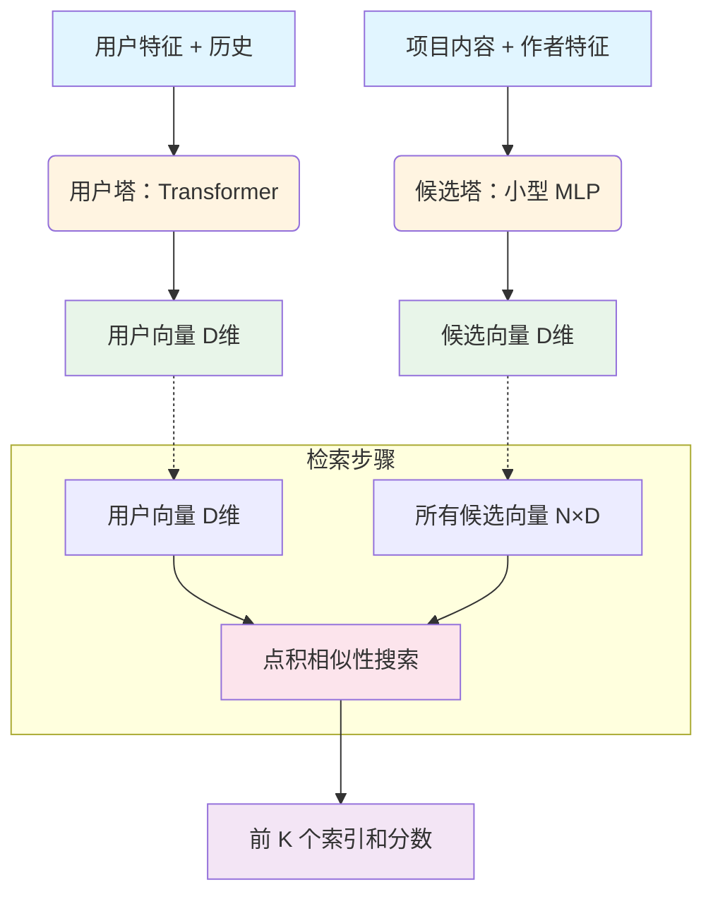
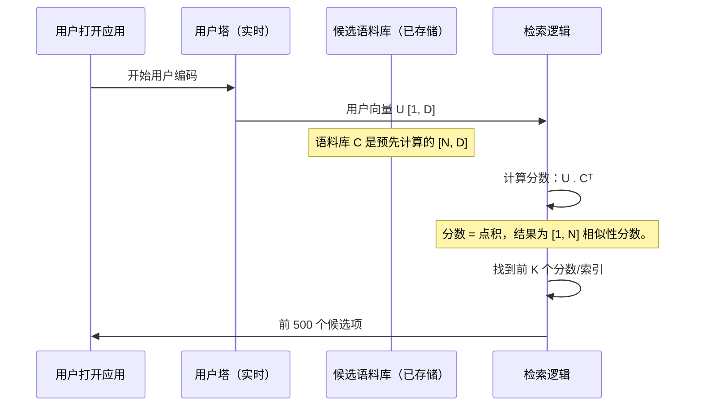

# 第 3 章：Phoenix 检索模型（双塔）

在第 1 章中，我们确定了**检索**阶段负责快速将数百万个潜在项目缩减到几百个有希望的候选项。我们在第 2 章中了解到，我们的引擎 Transformer 功能强大但计算成本高昂。

这引发了一个关键问题：我们如何使用像 Transformer 这样的复杂模型来深入理解用户，同时仍然在毫秒内跨大量目录执行搜索？

答案是 **Phoenix 检索模型**，它使用一种称为**双塔模型**的专门架构。

## 双塔类比：快速搜索

想象一下，我们正在寻找完美的匹配，但我们只有五秒钟来评估数百万个潜在伙伴。我们不能花几个小时了解每一个。

双塔模型通过==将复杂分析（"用户塔"）与简单、快速的表示（"候选塔"）分离==来解决这一挑战。

1.  **用户塔（媒人）：** 这个模型花时间精心分析我们——我们的历史、偏好和当前上下文——并将所有复杂数据浓缩成一个单一的、强大的、固定长度的向量，称为**用户向量**。这充当我们的"完美查询"。

2.  **候选塔（个人资料卡）：** 这个模型查看每条内容（帖子、作者等），并将其总结为一个单一的、固定长度的向量，称为**候选向量**。这就像一张简单的个人资料卡。

然后，==检索变成了一个闪电般快速的数学比较：只需找到"方向"最接近用户向量的候选向量==。

## 架构分解

两个塔完全独立地运行。这种独立性使得大规模速度和规模成为可能。



### 1. 用户塔（查询生成器）

用户塔是检索模型的"智能"部分。它使用繁重的 [Transformer 架构（Grok 基础）](02_transformer_architecture__grok_base__.md) 来处理用户历史和个人资料信息的序列。

**目标：** 合成一个单一的、归一化的用户向量，代表用户当前的意图。

在文件 `phoenix/recsys_retrieval_model.py` 中，`build_user_representation` 函数处理此操作。在 Transformer 处理序列后，我们对所有结果嵌入进行平均以创建一个最终向量：

```python
# build_user_representation 中的简化流程

def build_user_representation(self, batch, embeddings):
    # 1. 连接用户 + 历史嵌入
    embeddings = jnp.concatenate([user_embeddings, history_embeddings], axis=1)
    
    # 2. 通过 Transformer 运行（Grok 基础）
    model_output = self.model(embeddings, padding_mask)
    user_outputs = model_output.embeddings
    
    # 3. 池化（平均）所有上下文化的嵌入为一个向量
    user_embedding_sum = jnp.sum(user_outputs * mask, axis=1) 
    user_representation = user_embedding_sum / jnp.maximum(mask_sum, 1.0) 
    
    # 4. L2 归一化（关键步骤！）
    user_representation = user_representation / user_norm
    
    return user_representation
```
这个最终的用户向量是一个 L2 归一化向量，意味着它的长度正好是 1。这确保了只有*方向*（相似性）重要，而不是用户输入的复杂程度。

### 2. 候选塔（预计算目录）

候选塔是为速度而设计的。由于它为整个语料库中的每个帖子运行（可能数十亿），它必须简单。它使用一个小型多层感知器（MLP）网络。

**关键速度特性：** 候选塔仅在发布或更新新项目时运行一次。然后，生成的候选向量被**预先计算并存储**在一个大型数据库（语料库）中。当用户请求到来时，我们**不**运行候选塔；我们只是查找已经存储的向量。

在 `CandidateTower` 类中，过程是简单的投影和归一化：

```python
# phoenix/recsys_retrieval_model.py（CandidateTower 简化版）

@dataclass
class CandidateTower(hk.Module):
    def __call__(self, post_author_embedding):
        # 展平连接的项目特征
        flat_input = jnp.reshape(post_author_embedding, (B, C, -1))

        # 两个简单的密集层（MLP）
        hidden = jnp.dot(flat_input, proj_1)
        hidden = jax.nn.silu(hidden)
        candidate_embeddings = jnp.dot(hidden, proj_2)

        # L2 归一化：确保向量长度为 1
        candidate_norm = jnp.sqrt(jnp.sum(candidate_embeddings**2, axis=-1))
        normalized_rep = candidate_embeddings / candidate_norm

        return normalized_rep
```

## 检索机制：点积相似性

一旦实时计算出用户向量，并加载候选语料库向量，检索就是纯数学。

该方法使用**点积**（或余弦相似性，因为两个向量都已归一化）来找出用户向量与语料库中每个候选向量的对齐程度。

### 逐步检索

此过程使用专门的索引技术（近似最近邻搜索，尽管基本数学如下所示）快速对潜在的数百万个候选项执行。



### 代码聚焦：Top-K 搜索

在 `_retrieve_top_k` 函数中，魔法发生在两行中：矩阵乘法（点积）后跟 JAX 实用程序来找到最大值。

```python
# phoenix/recsys_retrieval_model.py（_retrieve_top_k 简化版）

def _retrieve_top_k(user_rep, corpus_embeddings, top_k):
    # 步骤 1：计算相似性（点积）
    # user_rep [B, D] * corpus_embeddings.T [D, N] = scores [B, N]
    scores = jnp.matmul(user_rep, corpus_embeddings.T)

    # 步骤 2：找到 k 个最高分数及其索引
    top_k_scores, top_k_indices = jax.lax.top_k(scores, top_k)

    return top_k_indices, top_k_scores
```

这种矩阵乘法在现代硬件上执行起来非常高效。由于向量已归一化，结果分数大致范围从 -1（相反）到 +1（完美匹配）。Phoenix 只保留具有最高正分数的候选项。

如演示运行器中所示，输出提供帖子 ID 及其分数，准备进入下一阶段：

| 排名 | 帖子 ID | 分数   |
| :--- | :------ | :----- |
| 1    | 421     | 0.8921 |
| 2    | 1005    | 0.8115 |
| 3    | 92      | 0.7904 |
| ...  | ...     | ...    |
| 10   | 733     | 0.6501 |

## 结论

**Phoenix 检索模型（双塔）**结构是我们管道第 1 阶段的速度引擎。

1.  它将复杂的、实时的用户建模（用户塔）与简单的、预先计算的项目建模（候选塔）分离。
2.  它使用共享的嵌入空间和 L2 归一化，允许使用简单、快速的点积来测量相似性。
3.  这种效率使 Phoenix 能够在排序阶段的详细分析时间内将数百万个选项缩小到数百个。

然而，我们在用户塔中生成的向量仍然包含我们下一阶段所需的深层上下文信息。在下一章中，我们将看看==排序模型如何使用这个上下文，同时使用一个特定的概念确保候选项得到公平评分：**Recsys 注意力掩码**==。

[下一章：Recsys 注意力掩码（候选项隔离）](04_recsys_attention_mask__candidate_isolation__.md)

