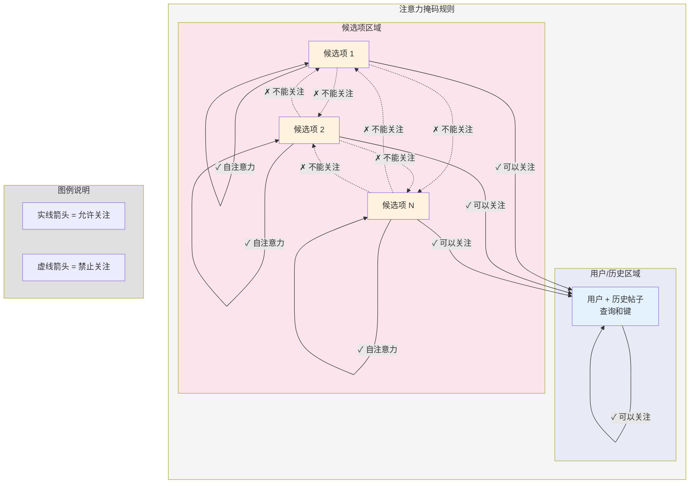

# 第 4 章：Recsys 注意力掩码（候选项隔离）

在前面的章节中，我们搭建了舞台：[Phoenix 检索模型（双塔）](03_phoenix_retrieval_model__two_tower__.md) 找到了前 500 个相关候选项

现在，我们将这些候选项交给强大的 [Phoenix 排序模型](07_phoenix_ranking_model_.md)，它使用 **Transformer 架构**（第 2 章）来计算精确的参与分数。

为了获得最准确和公平的分数，我们需要调整标准的 Transformer 模型。这种调整称为 **Recsys 注意力掩码（候选项隔离）**。

## 问题：不公平的评分

想象一下，我们是一名评委，为比赛的三个候选项（帖子 A、帖子 B、帖子 C）评分。

如果模型被允许使用标准的自注意力，当它计算**帖子 A** 的分数时，它可能会意外地查看当前在同一批次中的**帖子 B** 和**帖子 C** 的特征。

为什么这是一个问题？

1.  **依赖性：** 帖子 A 的最终分数不仅取决于用户，还取决于与它一起批处理的其他帖子。
2.  **波动性：** 如果我们用不同的候选项批次重新运行排序，帖子 A 的分数可能会剧烈变化，即使用户和帖子 A 完全相同。
3.  **作弊/泄漏：** 排序模型的核心目的是预测用户*如果单独显示*帖子 A 时将如何与之互动。允许候选项 A 偷看候选项 B 会造成不公平的信息泄漏。

为了解决这个问题，我们必须在注意力机制内创建一个**防火墙**。

## 解决方案：Recsys 注意力掩码

注意力掩码是在 Transformer 的 [MultiHeadAttention](02_transformer_architecture__grok_base__.md) 块内使用的关键矩阵。它是一个由 1 和 0 组成的过滤器：

*   **1（允许）：** 查询位置**可以**关注键位置。
*   **0（阻止）：** 查询位置**不能**关注键位置。

我们为推荐系统设计了一个专门的掩码，强制执行**候选项隔离**。

我们对排序 Transformer 的输入序列始终结构化为：
$$
\text{[用户个人资料, 历史帖子 1, ..., 历史帖子 S, 候选项 1, ..., 候选项 C]}
$$

掩码准确地规定了序列的每个部分可以关注什么：

### 规则 1：上下文始终可见

序列中的任何位置（用户、历史或候选项）必须能够关注**用户个人资料**和所有**历史帖子**。这是确定相关性所需的核心上下文。

### 规则 2：候选项隔离（防火墙）

严格禁止**候选项**关注序列中的任何**其他候选项**。每个候选项只能查看用户/历史上下文和自己的特征。

### 规则 3：历史流（因果注意力）

用户个人资料和历史帖子使用标准的因果掩码（如语言模型中），这意味着位置 $t$ 的历史帖子只能关注位置 $\le t$ 的帖子。

## 可视化注意力矩阵

这个图表，有时称为"隔离掩码"，清楚地显示了允许（`✓`）和阻止（`✗`）的注意力流：



更准确地说，当绘制为矩阵（查询行 vs. 键列）时：

| 查询 $\downarrow$ | 键 $\rightarrow$ | 用户 / 历史            | 候选项                               |
| :---------------- | :--------------- | :--------------------- | :----------------------------------- |
| **用户 / 历史**   | （查询上下文）   | 因果掩码（$1$ 或 $0$） | 阻止（$0$）                          |
| **候选项**        | （查询上下文）   | 允许（$1$）            | **隔离**（对角线 $1$，非对角线 $0$） |

右下角块是隔离特性的核心，确保当候选项 $C_1$ 计算其分数时，它只使用自己的特征和用户的上下文，忽略 $C_2, C_3,$ 等。

## 技术实现

负责构建这个精确防火墙的函数在 `phoenix/grok.py` 中定义：`make_recsys_attn_mask`。

让我们看看该函数构建掩码的简化步骤：

我们需要两个输入：`seq_len`（总长度）和 `candidate_start_offset`（候选项列表开始的索引）。

```python
# phoenix/grok.py（简化版）

def make_recsys_attn_mask(seq_len: int, candidate_start_offset: int):
    # 1. 从标准因果掩码开始
    # 这个矩阵 [1, 1, T, T] 只允许向左/向上流动（tril）
    causal_mask = jnp.tril(jnp.ones((1, 1, seq_len, seq_len)))

    # 2. 清零候选项到候选项的注意力
    # 这会清除候选项查询候选项的整个右下方块
    attn_mask = causal_mask.at[
        :, :, candidate_start_offset:, candidate_start_offset:
    ].set(0)

    # 3. 为候选项添加回自注意力
    # 这确保候选项 i 仍然可以查看自己的特征（行 i，列 i）
    candidate_indices = jnp.arange(candidate_start_offset, seq_len)
    attn_mask = attn_mask.at[
        :, :, candidate_indices, candidate_indices
    ].set(1)

    return attn_mask
```

### 代码示例

让我们用一个小序列来追踪：`[用户, H1, C1, C2]`。
*   `seq_len = 4`
*   `candidate_start_offset = 2`（C1 从索引 2 开始）

#### 步骤 1：初始因果掩码
如果完整序列使用因果掩码，$C_1$（索引 2）可以查看 $C_2$（索引 3）。

| 查询 $\downarrow$                   | U(0) | H1(1) | C1(2) | C2(3) |
| :---------------------------------- | :--- | :---- | :---- | :---- |
| **U(0)**                            | 1    | 0     | 0     | 0     |
| **H1(1)**                           | 1    | 1     | 0     | 0     |
| **C1(2)**                           | 1    | 1     | **1** | 0     |
| **C2(3)**                           | 1    | 1     | **1** | 1     |
| *（$C_2$ 关注 $C_1$ - **不好！**）* |      |       |       |       |

#### 步骤 2：清零候选项到候选项块

我们将整个右下块（从索引 2 开始）设置为 0。

| 查询 $\downarrow$ | U(0) | H1(1) | C1(2) | C2(3) |
| :---------------- | :--- | :---- | :---- | :---- |
| **U(0)**          | 1    | 0     | 0     | 0     |
| **H1(1)**         | 1    | 1     | 0     | 0     |
| **C1(2)**         | 1    | 1     | **0** | **0** |
| **C2(3)**         | 1    | 1     | **0** | **0** |

#### 步骤 3：添加回候选项自注意力

最后，我们恢复候选项位置（索引 2 和 3）的对角线。

| 查询 $\downarrow$ | U(0) | H1(1) | C1(2) | C2(3) |
| :---------------- | :--- | :---- | :---- | :---- |
| **U(0)**          | 1    | 0     | 0     | 0     |
| **H1(1)**         | 1    | 1     | 0     | 0     |
| **C1(2)**         | 1    | 1     | **1** | 0     |
| **C2(3)**         | 1    | 1     | 0     | **1** |

结果矩阵确保：
1.  所有候选项查看用户/历史（列 0 和 1 为 1）。
2.  候选项只查看自己（右下角的对角线 1）。
3.  没有候选项查看另一个候选项（非对角线 0）。

这个专业化的掩码随后通过排序模型中的每个 Transformer 层传递，保证为任何候选项计算的分数真正独立于其直接竞争对手。

## 结论

**Recsys 注意力掩码（候选项隔离）**是一项必要的技术措施，以确保强大的排序 Transformer 产生的分数是稳定的、公平的，并且仅基于用户的上下文和候选项的特征，防止在批次中同时评分的项目之间的泄漏。

在下一章中，我们将退后一步，查看流经这个精心掩码的 Transformer 的实际数值结构——批次和嵌入。

[下一章：Recsys 数据结构（批次与嵌入）](05_recsys_data_structures__batch___embeddings__.md)

