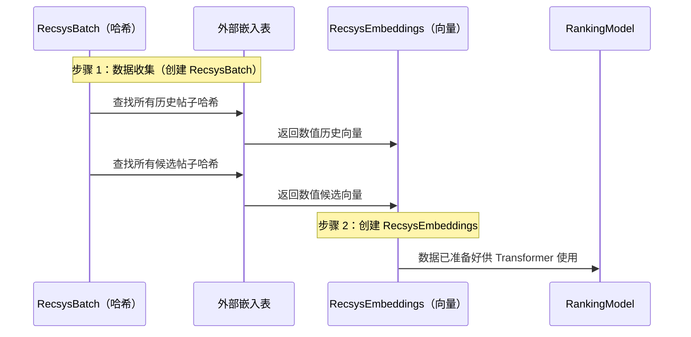

# 第 5 章：Recsys 数据结构（批次与嵌入）

在前面的章节中，我们学习了 [两阶段推荐管道](01_two_stage_recommendation_pipeline_.md) 的工作原理，依赖于强大的 Transformer 引擎（第 2 章）进行评分。我们还建立了关键的安全特性——[Recsys 注意力掩码（候选项隔离）](04_recsys_attention_mask__candidate_isolation__.md)——以确保排序期间的公平评分。

> 现在我们面临一个基本问题：当数据最终进入排序 Transformer 时，需要采用什么*格式*？

Transformer 是一个高级数学计算器。它只能处理高维数值向量（称为**嵌入**）。它无法读取原始标识符，如"用户 ID：987"或"帖子 ID：42"。

从原始输入特征到机器可读向量的转换需要两种不同的数据结构：

1.  **`RecsysBatch`**：原始的、符号化的标识符列表（哈希或索引）。
2.  **`RecsysEmbeddings`**：使用这些标识符查找的密集数值向量。

本章解释了为什么我们需要这两者以及它们如何流入模型。

## 问题：将 ID 映射到含义

想象一下，Phoenix 收到一个用户请求。系统收集数据：

| 特征           | 原始值（符号 ID） |
| :------------- | :---------------- |
| **用户 ID**    | `987123`          |
| **历史帖子 1** | `H772`            |
| **候选帖子 A** | `C110`            |

如果我们直接将这些 ID 传递给 Transformer，模型无法了解用户 987123 *是谁*或帖子 C110 *包含什么*。这些标识符是任意标签。

为了注入含义，我们使用**嵌入**。嵌入是描述实体属性的数值向量。例如，帖子 C110 的嵌入可能是一个包含 512 个数字的列表，其中一些表示"关于体育"，另一些表示"积极情绪"等。

数据结构的工作是管理这种转换。

---

## 结构 1：RecsysBatch（原始清单）

`RecsysBatch` 是在转换为描述性向量*之前*保存所有输入特征的结构。这些特征通常表示为**哈希**或**索引**——指向外部数据的简单整数。

原始数据为批次中的三个组收集：

1.  **用户数据：** 当前用户的唯一标识符。
2.  **历史数据：** 用户最近看过的帖子的标识符和操作（例如，喜欢、跳过）。
3.  **候选数据：** 我们当前正在排序的帖子的标识符。

以下是该结构的简化视图：

```python
# phoenix/recsys_model.py（简化的 RecsysBatch）

class RecsysBatch(NamedTuple):
    """使用原始哈希和索引的输入特征。"""

    # 用户特征（通常为冗余使用多个哈希）
    user_hashes: jax.Array # [Batch, Num_User_Hashes]

    # 历史序列（S 是序列长度，例如 128）
    history_post_hashes: jax.Array # [Batch, S, Num_Item_Hashes]
    history_actions: jax.Array # [Batch, S, Num_Actions]

    # 候选项（C 是候选项数量，例如 500）
    candidate_post_hashes: jax.Array # [Batch, C, Num_Item_Hashes]
```
`RecsysBatch` 的维度显示了原始输入的庞大数量：对于 128 个历史帖子和 500 个候选项，我们仅为一个用户就需要数千个单独的标识符！

## 桥梁：外部查找

`RecsysBatch` 中的数据是必要的但不充分的。要获得 Transformer 所需的描述性向量，我们必须使用哈希作为键在称为**嵌入表**的大型外部数据库中查找值。

这个查找过程发生在数据到达主排序模型*之前*。



## 结构 2：RecsysEmbeddings（数值向量）

`RecsysEmbeddings` 结构保存查找的结果——实际的高维数值向量。这是 Transformer 所需的格式。

当我们使用哈希检索嵌入时，我们将单个整数（例如 `987123`）替换为大小为 $D$ 的向量（维度，通常为 512 或 1024）。

`RecsysEmbeddings` 结构的维度更大，因为它们包含这个新维度 $D$。

```python
# phoenix/recsys_model.py（简化的 RecsysEmbeddings）

class RecsysEmbeddings:
    """为模型准备的数值向量（嵌入）。"""

    # 注意：D 是嵌入维度（例如 1024）
    user_embeddings: jax.Array # [Batch, Num_User_Hashes, D]

    # 历史序列：每个哈希现在产生一个大小为 D 的向量
    history_post_embeddings: jax.Array # [Batch, S, Num_Item_Hashes, D]
    
    # 候选项序列
    candidate_post_embeddings: jax.Array # [Batch, C, Num_Item_Hashes, D]
    # ... 和其他查找的向量 ...
```

注意形状的差异：
*   `RecsysBatch` 中的原始特征可能是 `[B, S, 2]`（批次、序列、2 个哈希）。
*   `RecsysEmbeddings` 中的相应特征是 `[B, S, 2, D]`（批次、序列、2 个哈希、维度 D）。

## 流入排序模型

模型的前向传递同时需要两种结构。

`RecsysBatch`（原始索引）主要用于两件事：

1.  生成**填充掩码**（告诉 Transformer 哪些序列项是真实的，哪些是填充零）。我们检查哈希是否等于零来确定填充。
2.  查找一些小的分类索引特征（如 `product_surface` 上下文，如果未哈希）。

`RecsysEmbeddings`（数值向量）是 Transformer 的实际数据源。

模型使用两者来构建最终的、上下文化的输入序列：

```python
# phoenix/recsys_model.py（简化的 __call__ 方法）

def __call__(self, batch: RecsysBatch, recsys_embeddings: RecsysEmbeddings):
    
    # 1. 将原始数据和嵌入数据组合成单个序列向量
    # （这涉及特征降维，在第 6 章中介绍）
    embeddings, padding_mask, candidate_offset = self.build_inputs(
        batch, recsys_embeddings
    )
    
    # 2. 将组合序列馈送到 Grok Transformer
    model_output = self.model(
        embeddings,
        padding_mask,
        candidate_start_offset=candidate_offset,
    )
    
    # ... 对候选项评分并返回 logits ...
```

这确保了馈送到 Transformer 的最终序列既有丰富的数值信息（来自 `RecsysEmbeddings`），又有正确的结构上下文（如填充掩码，从 `RecsysBatch` 派生）。

## 结论

要成功运行排序 Transformer，数据必须经历重要的转换。

1.  **`RecsysBatch`** 保存原始标识符（哈希），这对于稳定性和创建填充掩码是必要的。
2.  原始哈希用于检索 **`RecsysEmbeddings`**——携带实体实际含义和特征的密集、高维数值向量。

两种结构共同工作，将完整的上下文（用户、历史、候选项）传递给系统。

然而，`RecsysEmbeddings` 结构通常包含*太多*单独的向量（例如，2 个帖子哈希 + 2 个作者哈希 + 1 个操作向量，全部用于单个历史项）。我们需要==将这些多个向量浓缩为 Transformer 序列中每个位置的单一、连贯的表示==。这种必要的整合是下一章的重点。

[下一章：特征降维块](06_feature_reduction_blocks_.md)

