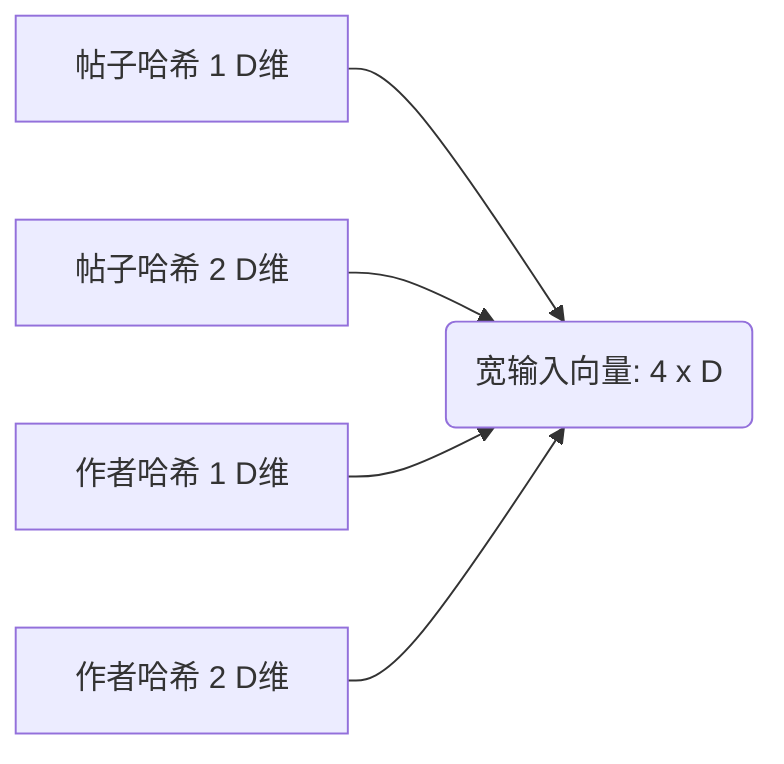
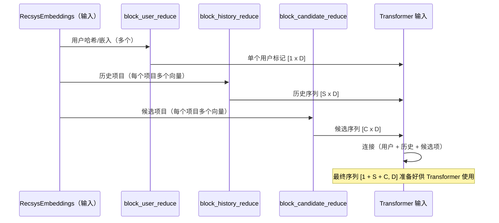

# 第 6 章：特征降维块

在 [第 5 章：Recsys 数据结构（批次与嵌入）](05_recsys_data_structures__batch___embeddings__.md) 中，我们了解到为了为 Transformer 准备数据，我们将原始哈希（ID）转换为称为 `RecsysEmbeddings` 的丰富数值向量。

这种转换给我们带来了一个问题：序列中的一个项目——比如，单个历史帖子——可能由**许多单独的向量**表示。

Transformer 架构旨在处理不同标记的序列，其中每个标记由单个高维向量表示（例如，$D=1024$）。

**特征降维块**的工作是充当一个关键的瓶颈：获取描述单个实体的多个详细输入向量，并将它们整合为**一个统一的向量**，准备好供 Transformer 使用。

## 问题：太多成分

想象一下，我们正在处理单个候选帖子。为了准确地对其评分，我们需要以下信息：

1.  **帖子本身：** 由两个哈希嵌入表示（用于冗余和覆盖）。
2.  **作者：** 由两个哈希嵌入表示。
3.  **上下文：** 产品界面（帖子显示的位置）。

如果这五个特征中的每一个都是大小为 $D=1024$ 的向量，那么一个候选项由 $5 \times 1024 = 5120$ 维的数据表示。

如果我们试图将所有五个向量作为序列中的五个单独标记传递，模型将失去上下文并且扩展性差。我们需要在序列中为候选帖子留一个位置，并且该位置必须包含整合到一个 $D=1024$ 向量中的*所有* $5120$ 维的含义。

## 解决方案：特征降维漏斗

特征降维块是专门的实用函数（通常是多层感知器或 MLP），它们在数学上组合信息。它们就像一个漏斗或搅拌机。

### 降维如何工作（3 个步骤）

当特征降维块接收单个实体（如历史帖子）的多个输入嵌入时，它执行三个主要步骤：

#### 步骤 1：展平和连接

该块获取所有单独的特征向量，并简单地将它们首尾相连，创建一个非常长、宽的向量。

如果我们有两个帖子向量（P1、P2）和两个作者向量（A1、A2），所有大小都为 $D$：



#### 步骤 2：投影（压缩）

现在我们有了一个巨大的向量，该块应用一个**密集层**（矩阵乘法）。这个乘法使用学习的权重智能地将信息从非常宽的输入向量压缩回目标维度 $D$。

这是核心的数学魔法：网络学习 $4D$ 大小输入的*哪些*部分最重要，并将它们压缩到 $D$ 大小的输出中。

#### 步骤 3：输出

结果是一个单一的、密集的向量——**标记嵌入**——它包含该特定项目（用户、历史帖子或候选项）的所有必要特征信息。这个向量现在已准备好放置在最终序列中并馈送到 Transformer。

## 代码聚焦：降维历史特征

`x-algorithm` 使用诸如 `block_user_reduce`、`block_history_reduce` 和 `block_candidate_reduce` 之类的函数来完成这些特定工作。

让我们看一个 `block_history_reduce` 的简化示例，它为一次历史交互组合帖子、作者、操作和产品界面特征。

我们从原始的、分离的嵌入开始：

```python
# 来自 RecsysEmbeddings 的变量（D 是嵌入大小）
history_post_embeddings # [B, S, num_item_hashes, D]
history_author_embeddings # [B, S, num_author_hashes, D]
history_actions_embeddings # [B, S, D]
history_product_surface_embeddings # [B, S, D]
```

### 1. 重塑和展平哈希

首先，我们展平多个哈希嵌入（帖子和作者），使它们成为宽特征维度的一部分。

```python
# phoenix/recsys_model.py（简化的 block_history_reduce）
B, S, _, D = history_post_embeddings.shape

# 将 2 个项目哈希 * D 大小展平为一个 2*D 特征维度
post_reshaped = history_post_embeddings.reshape((B, S, 2 * D))
author_reshaped = history_author_embeddings.reshape((B, S, 2 * D))
```

### 2. 连接所有特征

接下来，我们将所有特征组——重塑的帖子/作者特征，加上操作和界面特征——连接成一个巨大的输入：

```python
# phoenix/recsys_model.py（简化的 block_history_reduce）
post_author_embedding = jnp.concatenate(
    [
        post_reshaped,
        author_reshaped,
        history_actions_embeddings,
        history_product_surface_embeddings,
    ],
    axis=-1, # 沿特征维度连接
)
# 输出形状现在是 [B, S, (2*D + 2*D + D + D)] = [B, S, 6*D]
```

### 3. 应用投影层

最后，我们应用一个学习的投影矩阵（`proj_mat_3`）将 $6D$ 输入压缩回目标 $D$ 大小。

```python
# phoenix/recsys_model.py（简化的 block_history_reduce）
# proj_mat_3 是一个形状为 [6*D, D] 的学习矩阵
history_embedding = jnp.dot(
    post_author_embedding, 
    proj_mat_3
)

# 结果是历史标记的单一、统一向量
# 输出形状：[B, S, D]
```

这个结果 `history_embedding` 是一个由 $S$ 个标记组成的干净序列，其中每个标记包含帖子、作者、用户操作和产品上下文的完整上下文。

## 构建最终的 Transformer 序列

整体排序模型中的 `build_inputs` 函数负责协调这些降维块并组装进入 Transformer 的最终序列。

序列结构始终是：`[用户标记, 历史标记, 候选标记]`。



通过确保每个组件（用户、每个历史项目和每个候选项）都降维为大小为 $D$ 的单个向量，我们保证 Transformer 接收到预期格式的数据，允许 [Transformer 架构（Grok 基础）](02_transformer_architecture__grok_base__.md) 在整个序列长度上执行其复杂的上下文推理。

## 结论

**特征降维块**是必要的预处理步骤，它将碎片化的特征数据（多个哈希嵌入）转换为 Transformer 所需的连贯的、单标记向量表示。

1.  它们获取描述一个实体（如帖子及其作者）的许多向量。
2.  它们将它们连接成一个宽向量。
3.  它们使用密集投影层智能地将该信息压缩回模型的预期维度 $D$。

有了这个密集的、结构化的输入序列现在已准备好，我们准备深入研究利用所有这些概念来生成最终信息流的最终模型：**Phoenix 排序模型**。

[下一章：Phoenix 排序模型](07_phoenix_ranking_model_.md)

