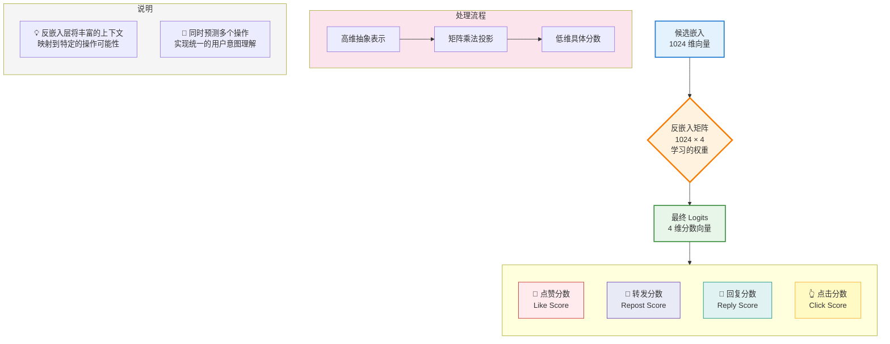

# 第 7 章：Phoenix 排序模型

欢迎来到 **x-algorithm** 架构的最终功能部分！在前面的章节中，我们涵盖了所有必要的先决条件：

1.  [Phoenix 检索模型（双塔）](03_phoenix_retrieval_model__two_tower__.md) 找到了我们的前几百个候选项。
2.  我们使用 [Recsys 数据结构（批次与嵌入）](05_recsys_data_structures__batch___embeddings__.md) 和 [特征降维块](06_feature_reduction_blocks_.md) 将输入特征准备成干净的、组合的嵌入序列。
3.  我们通过实施关键的 [Recsys 注意力掩码（候选项隔离）](04_recsys_attention_mask__candidate_isolation__.md) 确保了公平评分。

现在，我们将所有这些组件汇集到 **Phoenix 排序模型**中。这个抽象表示推荐管道的最终阶段（阶段 2），在这里我们从上下文理解转向最终的、具体的分数。

## 什么是 Phoenix 排序模型？

Phoenix 排序模型是负责获取高度上下文化的输入序列并将其转换为关于用户参与度（如点赞、转发、回复）的具体、可操作预测的组件。

它的主要工作是管理数据流通过强大的 [Transformer 架构（Grok 基础）](02_transformer_architecture__grok_base__.md)，然后执行从丰富的数值向量空间（嵌入）到简单分数（logits）的最终转换。

### 最终排序序列

回想一下，该模型的输入是一个单一的、合并的向量序列：

$$
\text{[用户标记 | 历史序列 | 候选序列]}
$$

这个序列的长度可能是，例如：$1 (\text{用户}) + 128 (\text{历史}) + 32 (\text{候选项}) = 161$ 个标记，每个标记由一个 1024 维向量表示。

排序模型的目标是迭代这个序列以产生最终分数，准备好进行排序。

## 步骤 1：上下文化序列

Phoenix 排序模型的第一个动作是将准备好的嵌入序列馈送到 Transformer 层堆栈中。

这就是**自注意力**的强大之处。当序列通过每一层时，模型根据每个标记与其他每个标记的关系不断重新计算每个单独标记（用户、历史、候选项）的值。

至关重要的是，[Recsys 注意力掩码（候选项隔离）](04_recsys_attention_mask__candidate_isolation__.md) 在这里应用。这个掩码保证当模型改进对候选项 A 的理解时，它可以查看用户和历史，但不能偷看候选项 B。

经过多层处理后，Transformer 输出一个**相同长度（161 个标记）**的序列，但现在这些输出向量已经深度上下文化。候选项 A 的输出向量现在不仅包含帖子 A 的特征，还包含关于这个帖子如何与*这个特定用户的*最近活动相关的细微信息。

## 步骤 2：提取候选项输出

Transformer 为*每个*位置输出一个上下文化向量：用户、所有历史帖子和所有候选项。

| 位置         | 上下文化输出向量       | 我们需要它吗？         |
| :----------- | :--------------------- | :--------------------- |
| **用户标记** | 高度上下文化的用户向量 | 否（工作完成）         |
| **历史序列** | 上下文化的历史向量     | 否（工作完成）         |
| **候选序列** | 上下文化的候选向量     | **是！**（准备好评分） |

出于排序的目的，我们只关心对应于候选项的向量。为什么？因为这些是模型将用来预测最终参与概率的向量。

Phoenix 排序模型使用预先计算的 `candidate_start_offset`（标记候选项开始的确切索引）来切片输出序列并仅提取候选项。

如果序列长度为 161 且候选项从索引 129 开始，模型只需从索引 129 开始获取输出。

```python
# 简化的提取逻辑
def extract_candidates(out_embeddings, candidate_start_offset):
    # out_embeddings: [B, Seq_Len, D]
    # candidate_start_offset: 整数（例如 129）
    
    # 切片输出张量以仅获取候选标记
    candidate_embeddings = out_embeddings[:, candidate_start_offset:, :]
    
    # candidate_embeddings 形状现在是 [B, Num_Candidates, D]
    return candidate_embeddings
```

## 步骤 3：反嵌入层（最终投影）

我们现在有了最终的、丰富的、上下文化的候选向量，其中每个候选项仍然是一个 1024 维向量（$D$）。

最后一步是将这个抽象的、高维的向量转换为具体的、低维的分数：*点赞*、*转发*和*回复*的可能性。

这是**反嵌入层**的工作。

### 反嵌入：翻译器

反嵌入层只是一个充当翻译器的大型学习矩阵。

*   **输入：** 丰富的候选嵌入（$D$ 维）。
*   **输出：** 我们想要预测的 $N$ 个操作的 Logits（分数）（例如，4 个操作）。

由于 $D$ 远大于 $N$（例如，1024 对 4），这一步通常称为**投影**。这是一个标准的矩阵乘法（点积），其中模型学习最优权重以将内部表示映射到最终分数。



### 多操作预测

Phoenix 排序模型最强大的特性之一是它能够同时执行**多操作预测**。

与其训练三个单独的模型（一个用于点赞，一个用于转发，一个用于回复），Transformer 被训练为一次输出*所有*相关操作的分数。这迫使模型学习对用户意图的统一、整体理解，从而在各个方面产生更准确的预测。

最终 logits 的输出形状是 `[Batch, Num_Candidates, Num_Actions]`。

## 代码中的完整前向传递

让我们看看 `PhoenixModel` 的 `__call__` 方法中的简化 Python 逻辑，它将过去几章的所有概念联系在一起，形成这个最终的排序阶段。

```python
# phoenix/recsys_model.py（简化的 PhoenixModel.__call__）
def __call__(self, batch: RecsysBatch, recsys_embeddings: RecsysEmbeddings):
    
    # 1. 构建完整序列，应用特征降维块（第 6 章）
    embeddings, padding_mask, candidate_start_offset = self.build_inputs(
        batch, recsys_embeddings
    )

    # 2. 通过 Transformer 运行（Grok 基础，第 2 章）
    # Recsys 注意力掩码（第 4 章）在这里隐式应用。
    model_output = self.model(
        embeddings,
        padding_mask,
        candidate_start_offset=candidate_start_offset,
    )
    
    out_embeddings = model_output.embeddings
    
    # 3. 仅提取候选嵌入（上面的步骤 2）
    candidate_embeddings = out_embeddings[:, candidate_start_offset:, :]

    # 4. 使用反嵌入矩阵进行最终投影（上面的步骤 3）
    unembeddings = self._get_unembedding()
    logits = jnp.dot(candidate_embeddings, unembeddings)

    # 输出：[B, num_candidates, num_actions]
    return RecsysModelOutput(logits=logits)
```

`logits` 是原始分数。这些分数然后通常被转换为概率（例如，使用 Softmax 函数）并使用自定义业务逻辑（例如，将"回复"分数的权重设置得高于"点赞"分数）进行组合，以产生帖子的单一最终排序分数。

然后按这个最终分数对候选项的最终列表进行排序，创建用户看到的个性化信息流。

## 结论

**Phoenix 排序模型**是两阶段推荐管道的强大结论。

1.  它包装了核心 [Transformer 架构（Grok 基础）](02_transformer_architecture__grok_base__.md)。
2.  它通过 Transformer 馈送序列，通过 [Recsys 注意力掩码（候选项隔离）](04_recsys_attention_mask__candidate_isolation__.md) 严格执行**候选项隔离**。
3.  它仅提取最终的、上下文化的候选向量。
4.  它使用**反嵌入层**将这些向量投影为最终的**多操作参与概率**（logits）。

这完成了我们对 `x-algorithm` 项目核心组件的深入研究，揭示了速度、上下文和强大的神经网络如何结合起来创建一个高度准确和可扩展的推荐系统。

