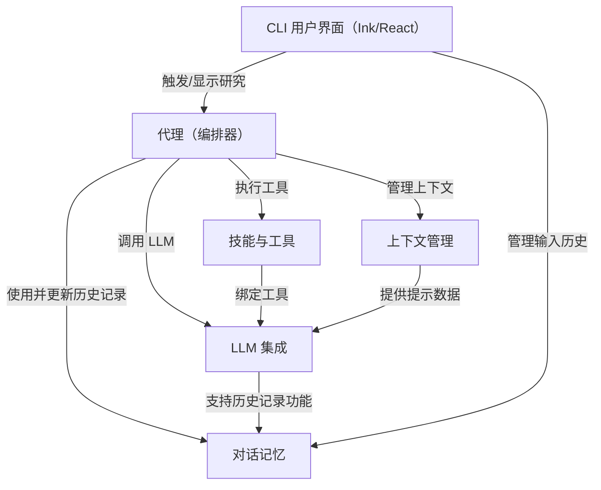
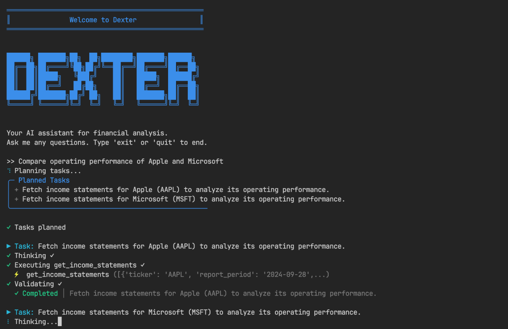
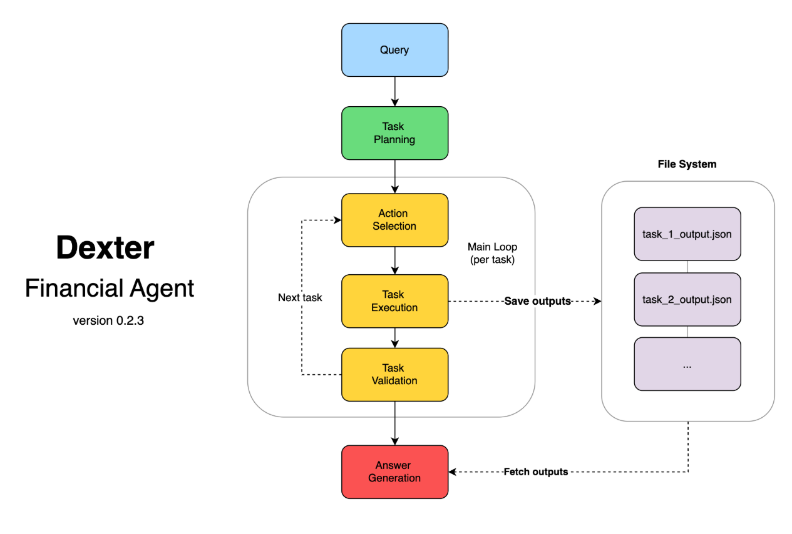
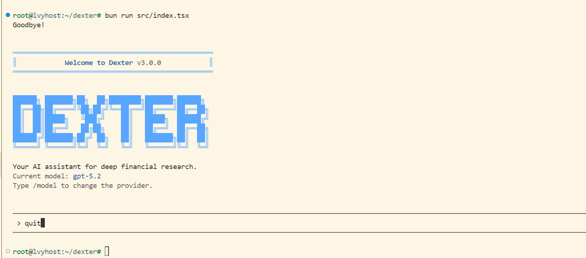

links:[virattt/dexter: An autonomous agent for deep financial research](https://github.com/virattt/dexter)

# docs：dexter

Dexter 是一个**==自主金融研究代理==**，旨在回答复杂的金融问题。
它能够**智能规划**研究步骤，*执行专业工具*来收集实时市场和公司数据，然后**综合生成全面的、有数据支撑的答案**。用户通过*动态命令行界面*与 Dexter 交互，该界面实时显示其思考过程和工具使用情况。它还可以*记住过去的对话*，为多轮讨论提供持续的上下文。

(idea: 还有各种细化的专业领域的代理可以做🤓)


## 可视化



## 章节

1. [CLI 用户界面（Ink/React）
](01_cli_user_interface__ink_react__.md)
2. [代理（编排器）
](02_the_agent__orchestrator__.md)
3. [LLM 集成
](03_llm_integration_.md)
4. [上下文管理
](04_context_management_.md)
5. [对话记忆
](05_conversation_memory_.md)
6. [技能与工具
](06_skills___tools_.md)

---

Dexter 是一个自主金融研究代理，它在工作时会思考、规划和学习。它使用任务规划、自我反思和实时市场数据执行分析。可以把它想象成 Claude Code，但专门为金融研究而构建。



## 概述
Dexter 接收复杂的金融问题，并将其转化为清晰的、分步骤的研究计划。它使用实时市场数据运行这些任务，检查自己的工作，并完善结果，直到获得一个可信的、有数据支持的答案。

主要功能：

- **智能任务规划**：自动将复杂查询分解为结构化的研究步骤
- **自主执行**：选择并执行正确的工具来收集金融数据
- **自我验证**：检查自己的工作并迭代，直到任务完成
- **实时金融数据**：访问损益表、资产负债表和现金流量表
- **安全功能**：内置循环检测和步骤限制，以防止失控执行



## 先决条件
- Bun 运行时（v1.0 或更高版本）
- OpenAI API 密钥（在此获取）
- Financial Datasets API 密钥（在此获取）
- Tavily API 密钥（在此获取）- 可选，用于网络搜索

## 安装 Bun
如果我们还没有安装 Bun，可以使用 curl 安装：

macOS/Linux：

```bash
curl -fsSL https://bun.com/install | bash
```

Windows：

```bash
powershell -c "irm bun.sh/install.ps1|iex"
```

安装后，重启终端并验证 Bun 已安装：

```bash
bun --version
```

## 安装 Dexter
克隆仓库：
```bash
git clone https://github.com/virattt/dexter.git
cd dexter
```

使用 Bun 安装依赖项：
```bash
bun install
```

设置环境变量：
```bash
# 复制示例环境文件（从父目录）
cp env.example .env

# 编辑 .env 并添加我们的 API 密钥（如果使用云提供商）
# OPENAI_API_KEY=your-openai-api-key
# ANTHROPIC_API_KEY=your-anthropic-api-key
# GOOGLE_API_KEY=your-google-api-key

# （可选）如果在本地使用 Ollama
# OLLAMA_BASE_URL=http://127.0.0.1:11434

# 其他必需的密钥
# FINANCIAL_DATASETS_API_KEY=your-financial-datasets-api-key
# TAVILY_API_KEY=your-tavily-api-key
```

## 使用方法
以交互模式运行 Dexter：

```bash
bun start
```

或在开发时使用监视模式：

```bash
bun dev
```



我还没配api key 所以没有测试...

## 示例查询

尝试向 Dexter 提出以下问题：

"苹果公司过去 4 个季度的收入增长是多少？"
"比较微软和谷歌 2023 年的营业利润率"
"分析特斯拉过去一年的现金流趋势"
"根据最近的财务数据，亚马逊的债务权益比是多少？"

Dexter 将自动：

- 将我们的问题分解为研究任务
- 获取必要的金融数据
- 执行计算和分析
- 提供全面的、数据丰富的答案

## 架构
Dexter 使用具有专门组件的多代理架构：

- **规划代理**：分析查询并创建结构化任务列表
- **行动代理**：选择适当的工具并执行研究步骤
- **验证代理**：验证任务完成情况和数据充分性
- **答案代理**：将研究结果综合为全面的响应

## 技术栈
- 运行时：Bun
- UI 框架：React + Ink（终端 UI）
- LLM 集成：LangChain.js，支持多提供商（OpenAI、Anthropic、Google）
- 模式验证：Zod
- 语言：TypeScript

## 更改模型
在 CLI 中输入 `/model` 可在以下模型之间切换：

- GPT 4.1（OpenAI）
- Claude Sonnet 4.5（Anthropic）
- Gemini 3（Google）