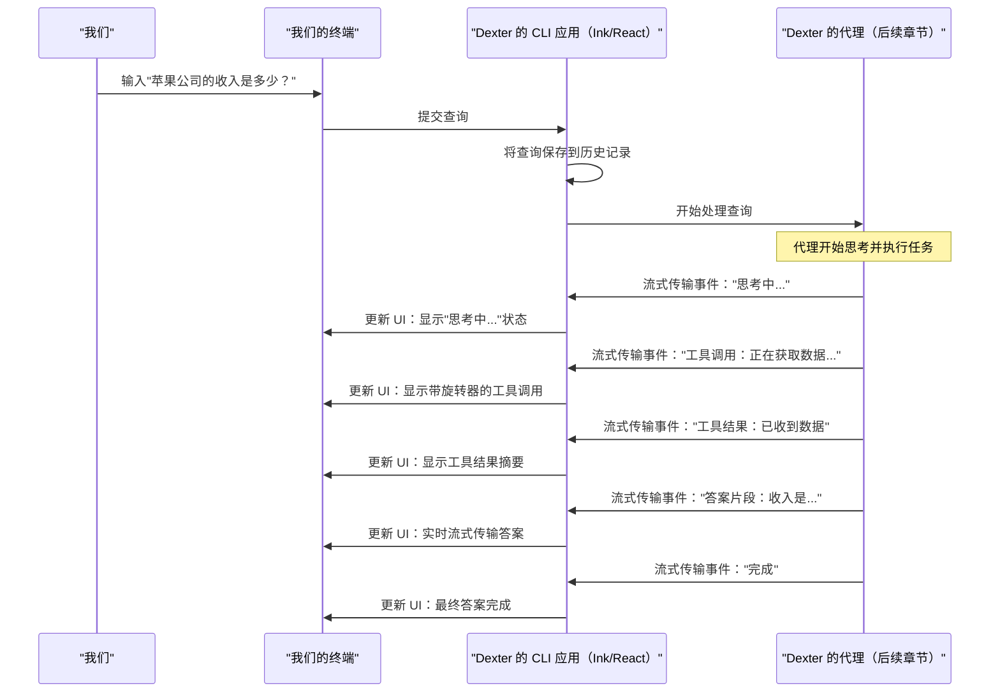

# 第 1 章：CLI 用户界面（Ink/React）

作为一个自主金融研究代理，Dexter 需要一种方式与我们交流，展示它正在做什么，并给出答案。这就是 Dexter 的 **CLI 用户界面（CLI UI）** 的作用。可以把它看作是 Dexter 在我们终端中的"仪表板"，使用一种很酷的技术构建，叫做 **Ink** 和 **React**。

## CLI UI 解决了什么问题？

想象一下，我们向 Dexter 提出一个复杂的问题，比如"苹果公司过去 4 个季度的收入增长是多少？"我们不会希望只是输入问题，然后盯着空白屏幕，等待几分钟后答案神奇地出现。我们会想看到：

*   "Dexter 正在思考我们的问题..."
*   "Dexter 正在查找苹果公司的财务报表..."
*   "Dexter 正在计算收入增长..."
*   最后，是经过充分研究的答案！

这正是 Dexter 的 CLI UI 所提供的。它是===一个动态的、实时的窗口，可以看到 Dexter 的"思维"，显示其进度、工具调用和最终响应==。就像拥有一个复杂的实时日志或专用的命令行控制台。

## 概念：构建动态终端界面

传统上，命令行应用程序通常只是逐行打印文本。但 Dexter 的 UI 不同——它*就地*更新，就像 Web 应用程序一样。它是如何做到的？

*   **CLI（命令行界面）**：这仅仅意味着我们通过在终端中输入命令并查看输出来与 Dexter 交互，而不是在图形窗口中点击按钮。
*   ==**Ink**：这是一个强大的库，可以让我们使用与 React 构建 Web 应用程序相同的概念，为终端构建交互式用户界面==。
*   **React**：一个流行的 JavaScript 库，用于构建用户界面。它的核心是将 UI 分解为小的、可重用的"组件"（如按钮、文本框或进度旋转器），并高效地仅更新需要更改的内容。

> 结合 Ink 和 React，Dexter 可以直接在我们的终端中创建丰富的动态体验，使其感觉不像是一个简单的脚本，而更像是一个智能助手。

好构想，&ui还可以用：[The Foundation for your Design System - shadcn-svelte](https://shadcn-svelte.com/)

之后我应该会参考这套方案 去尝试搓一个细分领域的智能体

## 开始使用 Dexter 的 UI

让我们看看 Dexter 的 UI 实际运行情况

首先，我们需要设置 Dexter。如果还没有，请按照 `README.md` 文件中的"先决条件"和"安装 Dexter"部分进行操作。我们需要安装 `Bun` 并在 `.env` 文件中配置 API 密钥。

一旦 Dexter 安装并配置完成，打开终端并导航到 `dexter` 项目文件夹。

### 运行 Dexter

要以交互模式启动 Dexter，只需运行：

```bash
bun start
```

我们将看到 Dexter 的介绍消息和等待输入的提示：

```
──────────────────────────────────────────────────────────────────
🤖 Dexter - 自主金融研究代理
──────────────────────────────────────────────────────────────────
你好！我是 Dexter，我们的金融研究助手。
今天我能帮我们什么？

> 
```

### 提出问题

现在，在提示符处输入一个问题并按 Enter。让我们试试：

```bash
> 苹果公司过去 4 个季度的收入增长是多少？
```

**我们将看到：**

终端 UI 将动态更新！

1.  我们的问题将出现，并突出显示。
2.  可能会显示"思考中..."消息。
3.  然后我们会看到一系列事件，如"获取财务指标快照（symbol=AAPL, metric=revenue）"。旁边会有一个小旋转器，表示 Dexter 正在主动获取数据。
4.  一旦获取数据，它会显示"在 X.X 秒内收到数据"。
5.  然后 Dexter 将处理数据，可能调用更多工具或进一步思考。
6.  最后，一个格式良好的答案将流式传输到终端。

这种实时反馈是 Dexter CLI UI 体验的核心。

## Dexter 的 UI 内部工作原理

让我们揭开帷幕，了解 Dexter 的动态 UI 是如何在我们的终端中渲染的。

### 流程：从我们的查询到动态显示

当我们向 Dexter 输入查询时，以下是发生的简化分步说明：

1.  **用户输入**：我们在终端中输入问题并按 Enter。
2.  **CLI 应用程序接收输入**：Dexter 的主 CLI 应用程序（由 Ink/React 驱动）捕获我们的输入。
3.  **代理开始工作**：CLI 应用程序将我们的查询交给 Dexter 的核心逻辑，该逻辑由[代理（编排器）](02_the_agent__orchestrator__.md)处理。
4.  **代理流式传输事件**：当代理思考并执行操作（如调用工具获取数据）时，它不会等到完成。相反，它会实时将小的更新或"事件""流式传输"回 CLI 应用程序。
5.  **UI 更新**：CLI 应用程序接收这些事件，并使用 React 高效地仅更新终端 UI 中需要更改的部分（例如，显示"思考中"消息、显示工具调用或流式传输最终答案的部分）。

以下是一个简单的序列图，用于可视化此过程：



### 代码

让我们看看 Dexter 代码库中的一些简化代码片段，了解如何使用 Ink 和 React 构建这些 UI 元素。

#### 主 CLI 应用程序（`src/cli.tsx`）

此文件是 Dexter 交互模式的入口点。它是一个 React 组件，设置整体布局并管理 UI 的不同部分。

```tsx
// src/cli.tsx（简化版）
import React from 'react';
import { Box, useApp } from 'ink'; // 用于布局的 Ink 组件
import { Input } from './components/Input.js'; // 我们的自定义输入组件
import { HistoryItemView, WorkingIndicator } from './components/index.js'; // 显示历史记录和状态
import { useAgentRunner } from './hooks/useAgentRunner.js'; // 管理代理执行
import { Intro } from './components/Intro.js'; // 欢迎消息

export function CLI() {
  const { exit } = useApp(); // 用于优雅退出 Ink 应用的钩子
  const { history, workingState, isProcessing, runQuery } = useAgentRunner(/* ...配置 */);

  // 处理提交查询时的情况
  const handleSubmit = async (query: string) => {
    if (query.toLowerCase() === 'exit') {
      exit(); // 退出应用程序
      return;
    }
    await runQuery(query); // 将查询发送到代理
  };

  return (
    <Box flexDirection="column"> {/* 主容器，垂直堆叠元素 */}
      <Intro /> {/* 显示欢迎消息 */}
      
      {/* 显示所有过去的查询及其结果 */}
      {history.map(item => (
        <HistoryItemView key={item.id} item={item} />
      ))}
      
      {/* 显示"思考中..."或"获取中..."及旋转器 */}
      {isProcessing && <WorkingIndicator state={workingState} />}
      
      {/* 我们输入的输入框 */}
      <Box marginTop={1}>
        <Input onSubmit={handleSubmit} />
      </Box>
    </Box>
  );
}
```

*   `Box`：这是 Ink 相当于 Web React 中 `div` 的组件——它是一个用于排列其他组件的灵活容器。`flexDirection="column"` 表示其中的项目垂直堆叠。
*   `useApp`：一个 Ink 钩子，提供有用的函数，如 `exit()` 来关闭终端应用程序。
*   `Input`：这是我们接下来要看的自定义组件，负责实际的文本输入字段。
*   `HistoryItemView`：另一个自定义组件，显示单个交互（我们的查询、Dexter 的步骤和答案）。
*   `WorkingIndicator`：当 Dexter 忙碌时显示旋转器和状态消息。
*   `useAgentRunner`：这是一个自定义 React Hook（在[代理（编排器）](02_the_agent__orchestrator__.md)中有更详细的介绍），管理与 Dexter 核心逻辑的通信，并根据事件更新 UI。

#### 捕获用户输入（`src/components/Input.tsx`）

`Input` 组件是 CLI 的关键部分。它使用一个名为 `ink-text-input` 的特殊 Ink 组件来处理输入。

```tsx
// src/components/Input.tsx（简化版）
import React, { useState } from 'react';
import { Box, Text } from 'ink';
import TextInput from 'ink-text-input'; // Ink 中用于文本输入的组件

export function Input({ onSubmit }: { onSubmit: (value: string) => void }) {
  const [value, setValue] = useState(''); // 存储当前正在输入的文本

  const handleSubmit = (val: string) => {
    if (!val.trim()) return; // 忽略空提交
    onSubmit(val); // 调用从父组件（CLI 组件）传递的函数
    setValue(''); // 提交后清除输入字段
  };

  return (
    <Box>
      <Text>{'> '}</Text> {/* '>' 提示符 */}
      <TextInput
        value={value} // 输入的当前值
        onChange={setValue} // 在我们输入时更新 'value'
        onSubmit={handleSubmit} // 按 Enter 时调用
        focus={true} // 使此输入在应用启动时处于活动状态
      />
    </Box>
  );
}
```

*   `useState`：一个基本的 React 钩子，让函数组件拥有自己的状态。这里，`value` 存储我们正在输入的内容。
*   `TextInput`：这是来自 `ink-text-input` 的神奇组件，在终端内提供功能齐全的文本输入字段。
*   `onChange`：每次我们输入一个字符时更新 `value` 状态。
*   `onSubmit`：当我们按 Enter 时触发 `handleSubmit` 函数，将我们的查询发送到主 `CLI` 组件。

#### 显示历史记录和事件（`src/components/HistoryItemView.tsx`）

一旦我们提交查询，Dexter 会将其添加到 `history` 中。此 `history` 中的每个项目都由 `HistoryItemView` 组件渲染。

```tsx
// src/components/HistoryItemView.tsx（简化版）
import React from 'react';
import { Box, Text } from 'ink';
import { EventListView } from './AgentEventView.js'; // 显示思考/工具调用
import { AnswerBox } from './AnswerBox.js'; // 显示最终答案

export function HistoryItemView({ item }: { item: any }) {
  return (
    <Box flexDirection="column" marginBottom={1}>
      {/* 我们输入的查询 */}
      <Box>
        <Text>{`❯ ${item.query} `}</Text>
      </Box>
      
      {/* 显示代理的思考步骤和工具调用 */}
      <EventListView
        events={item.events} // 事件列表（思考、tool_start、tool_end）
        activeToolId={item.activeToolId} // 当前运行的工具的 ID
      />
      
      {/* 显示 Dexter 的最终答案（如果可用）*/}
      {item.answer && (<AnswerBox text={item.answer} />)}
    </Box>
  );
}
```

*   `item`：此 prop 包含单个交互的所有信息：我们提出的 `query`、`events` 列表（Dexter 做了什么）以及最终的 `answer`。
*   `EventListView`：此组件与 `AgentEventView`（接下来介绍）一起，负责显示 Dexter 采取的详细步骤。
*   `AnswerBox`：一个简单的组件，格式化并显示 Dexter 的最终响应。

#### 可视化代理事件（`src/components/AgentEventView.tsx`）

此组件获取 Dexter 代理的原始事件，并将其转换为终端中用户友好的消息。

```tsx
// src/components/AgentEventView.tsx（简化版）
import React from 'react';
import { Box, Text } from 'ink';
import Spinner from 'ink-spinner'; // 用于动画加载点

// 显示"思考中..."消息
export function ThinkingView({ message }: { message: string }) {
  return (
    <Box>
      <Text>⏺ </Text> {/* 一个小点 */}
      <Text>{message}</Text>
    </Box>
  );
}

// 在工具启动时显示，可能带有活动旋转器
export function ToolStartView({ tool, args, isActive = false }: { tool: string; args: any; isActive?: boolean }) {
  return (
    <Box flexDirection="column">
      <Box>
        <Text>⏺ </Text>
        <Text>{tool}</Text> {/* 例如，"get_financial_metrics_snapshot" */}
        <Text>({JSON.stringify(args)})</Text> {/* 例如，(symbol=AAPL, metric=revenue) */}
      </Box>
      {isActive && ( // 如果此工具当前处于活动状态，显示旋转器
        <Box marginLeft={2}>
          <Text>⎿  </Text>
          <Text><Spinner type="dots" /></Text> {/* 动画点 */}
          <Text> 获取中…</Text>
        </Box>
      )}
    </Box>
  );
}
// 存在类似的组件用于 ToolEndView（工具完成时）和 ToolErrorView（工具失败时）。
```

*   `Spinner`：来自 `ink-spinner` 的一个很酷的 Ink 组件，显示动画点，提供视觉反馈，表明某些事情正在积极发生。
*   `ThinkingView`、`ToolStartView`、`ToolEndView`、`ToolErrorView`：这些是专门的组件，以清晰一致的方式格式化和显示代理的不同类型事件，类似于 Claude Code 等应用程序中显示工具的方式。

## 结论

在本章中，我们了解到 Dexter 的 CLI 用户界面远不止是一个简单的基于文本的应用程序。通过利用 **Ink** 和 **React**，Dexter 提供了一个动态的、实时的"仪表板"，让我们了解其内部思考过程和操作。我们看到了如何运行 Dexter、与其交互，并了解了使这种交互体验成为可能的代码，从捕获我们的输入到通过实时更新显示代理事件。

这个用户界面是我们进入 Dexter 世界的窗口。但 Dexter *内部*到底发生了什么，产生了所有这些事件？这就是我们将在下一章中探索的内容，我们将深入 Dexter 的核心：[代理（编排器）](02_the_agent__orchestrator__.md)。

