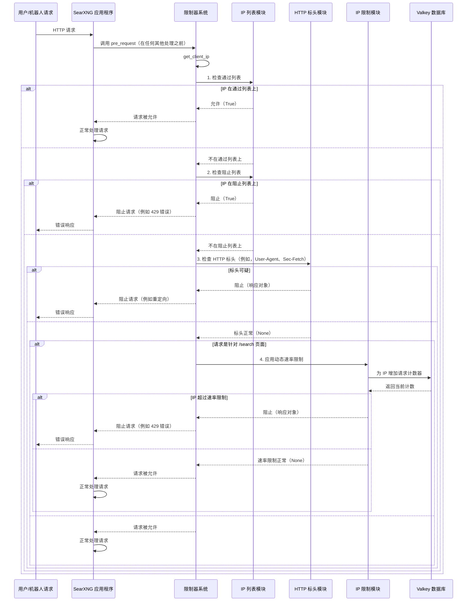

# 第 7 章：机器人检测/限制器

欢迎回来

在我们的上一章**[插件](06_plugins_.md)**中，我们学习了如何扩展 SearXNG 的功能并自定义其行为。现在，让我们把注意力转向我们的 SearXNG 实例的一个非常重要的守护者：**机器人检测/限制器**系统。

### 机器人检测/限制器解决什么问题？

想象一下我们已经建立了一个公共 SearXNG 实例，许多人正在使用它。这很好！但有时，自动化程序（称为**机器人**）可能会尝试使用我们的实例，而不是真人。机器人可以有多种形式：有些可能是无害的，但其他的可能试图：

*   **压垮我们的实例：** 在短时间内发送数千次搜索，使其对真实用户来说变慢或无法使用。
*   **滥用外部搜索引擎：** 因为 SearXNG 将我们的查询发送到*其他*搜索引擎（[引擎](04_engines__.md)），恶意机器人可能会使用我们的 SearXNG 作为代理向这些外部引擎发送滥用流量。这可能导致我们的 SearXNG 实例被阻止或需要解决验证码，这会影响我们所有的用户。
*   **消耗过多资源：** 每次搜索都会消耗一些 CPU、内存和网络带宽。太多的机器人请求会耗尽这些资源。

这就是**机器人检测/限制器**解决的问题。它就像我们的 SearXNG 实例入口处的**保镖**。它的工作是：
1.  **识别**可疑的访客（机器人）。
2.  如果他们行为不当，**限制**他们的访问。
3.  **保护**我们的实例和它所依赖的外部搜索引擎。

如果没有这个系统，我们的 SearXNG 实例很容易成为滥用的目标，导致每个人的体验下降。

### 我们的用例：保护我们的 SearXNG 实例

假设我们想确保我们的 SearXNG 实例受到保护，免受机器人攻击。具体来说，我们想要：
*   通过 IP 地址阻止已知的不良行为者。
*   允许受信任的 IP（如我们自己的监控服务）。
*   动态减慢或阻止在短时间内发送过多请求的用户，特别是如果他们看起来可疑。

本章将向我们展示 SearXNG 如何实现这一点。

### 概念

机器人检测/限制器系统使用几种技术，共同工作以识别和管理机器人流量。

#### 1. HTTP 标头分析（"我们的着装"检查）

当我们的网络浏览器向 SearXNG 发送请求时，它包括各种"HTTP 标头"。这些就像关于请求的信息片段，例如我们使用的浏览器（`User-Agent`）或我们的浏览器期望如何接收响应（`Accept`）。

机器人通常使用奇怪或不完整的 HTTP 标头，看起来不像真正的浏览器。限制器可以检查这些标头并标记看起来"不对"的请求。

*   **`Sec-Fetch-*` 标头**：现代浏览器发送特殊标头，如 `Sec-Fetch-Mode` 和 `Sec-Fetch-Dest`。这些告诉服务器请求是*如何*发起的（例如，通过导航到新页面，或获取资源）。机器人通常会省略或发送这些的无效值，使它们更容易被发现。

#### 2. IP 列表（"宾客名单"和"黑名单"）

我们可以使用明确的 IP 地址列表配置 SearXNG：

*   **通过列表**：始终允许绕过某些机器人检测检查的 IP 地址或网络范围列表。将其视为"VIP 宾客名单"。这对我们自己的监控服务或受信任的内部网络很有用。
*   **阻止列表**：始终被拒绝访问的 IP 地址或网络范围列表。这是我们对已知不良行为者的"黑名单"。

#### 3. 动态速率限制（"太多请求，太快"检查）

这是一种强大的技术，监控在特定时间范围内来自特定 IP 地址的请求数量。

*   **滑动窗口**：SearXNG 不只是在固定的时间块中计数请求。它使用"滑动窗口"来跟踪请求。想象一个不断向前滑动的时间窗口（例如，60 秒）。如果 IP 在该滑动窗口*内*发送了太多请求，它被认为是可疑的。
*   **可疑行为**：看起来不像典型人类交互的请求（例如，快速点击许多链接，或对非 HTML 格式发出许多请求）可能会被标记为"可疑"。如果 IP 可疑，它会获得更严格的速率限制。
*   **Valkey 数据库**：对于这种动态跟踪，SearXNG 高效地使用**[Valkey（Redis）集成](09_valkey__redis__integration_.md)**数据库。Valkey（发音为"Val-key"）是一个超快的内存数据库，非常适合计数请求和存储关于 IP 地址的临时信息。

### 如何启用和配置限制器

要使用机器人检测/限制器系统，我们需要在我们的 SearXNG **[设置管理](02_settings_management_.md)**中启用它，并提供一个**[Valkey（Redis）集成](09_valkey__redis__integration_.md)** URL。

#### 步骤 1：在 `settings.yml` 中启用

编辑我们的自定义 `settings.yml` 文件（例如，`/etc/searxng/settings.yml`）：

```yaml
# 在我们的 settings.yml 中
server:
  limiter: true # 启用机器人检测和速率限制器

valkey:
  url: valkey://localhost:6379/0 # 确保这指向我们的 Valkey 数据库
```
-   `limiter: true`：这告诉 SearXNG 激活限制器。
-   `valkey.url`：限制器*需要* Valkey 才能运行，特别是对于速率限制。确保此 URL 对我们的 Valkey 服务器是正确的。（我们将在专门的章节中了解更多关于 Valkey 的信息）。

#### 步骤 2：在 `limiter.toml` 中配置特定规则

机器人检测的详细规则在单独的文件中配置，通常是 `/etc/searxng/limiter.toml`。此文件使用 TOML 格式。我们只需要添加我们想要从默认值更改的设置。

**示例 `limiter.toml`：**

```toml
# 在我们的 limiter.toml 中（例如，/etc/searxng/limiter.toml）

[botdetection.ip_lists]
pass_ip = [
  '192.168.1.0/24',  # 允许来自我们本地网络的所有 IP
  '203.0.113.42',    # 允许特定的受信任 IP
]
block_ip = [
  '93.184.216.34',   # 阻止特定的问题 IP
]

[botdetection.ip_limit]
link_token = true # 启用对可疑链接令牌的额外检查
```
-   `[botdetection.ip_lists]`：此部分定义我们的 IP 通过和阻止列表。
    *   `pass_ip`：此列表中的 IP 通常会绕过检测。
    *   `block_ip`：此列表中的 IP 将立即被阻止。
-   `[botdetection.ip_limit]`：这配置动态速率限制器。
    *   `link_token = true`：激活更高级的检查（`link_token` 方法），可以检测请求是否看起来可疑（例如，尝试猜测 URL 或绕过直接链接）。如果这处于活动状态，可疑 IP 会获得更严格的速率限制。

进行这些更改后，重启我们的 SearXNG 实例以使其生效。

### 内部实现：保镖如何工作

让我们看看机器人检测/限制器系统在幕后如何运作。

#### 逐步概述：

1.  **启动和初始化**：
    *   当 SearXNG 启动时，它读取 `settings.yml` 和 `limiter.toml`。
    *   如果 `server.limiter` 为 `true` 并且配置了 Valkey 数据库，则限制器被 `_INSTALLED`。
    *   一个特殊函数（`pre_request`）被注册到 Flask（SearXNG 使用的 Web 框架），以在**每个**传入的 Web 请求**之前**运行。
2.  **传入请求**：
    *   用户（或机器人）向我们的 SearXNG 实例发送请求。
    *   因为 `pre_request` 已注册，它是*第一个*运行的东西。
    *   `pre_request` 调用主要的 `filter_request` 函数。
3.  **`filter_request`（主要保镖逻辑）**：
    *   它确定客户端的**真实 IP 地址**。
    *   它首先检查**通过列表**：如果 IP 在通过列表上，请求立即被允许，不执行进一步的机器人检查。
    *   如果不在通过列表上，它检查**阻止列表**：如果 IP 在阻止列表上，请求立即被阻止（例如，使用 HTTP 429"请求过多"错误或重定向）。
    *   如果不在任何一个列表上，它然后继续进行一系列**HTTP 标头检查**：它检查标头，如 `User-Agent` 和 `Sec-Fetch-*`。如果这些标头中的任何一个看起来可疑，请求可能会被阻止或重定向。
    *   最后，如果请求专门针对 `/search` 页面，它应用**动态速率限制**：
        *   它使用 Valkey 计算此 IP 在短和长"滑动窗口"中发出的请求数量。
        *   如果启用了 `link_token` 并且请求可疑，它应用更严格的限制。
        *   如果 IP 超过这些限制，请求将被阻止。
4.  **决定**：
    *   如果 `filter_request` 决定阻止或重定向请求，它立即返回错误响应（例如，HTTP 429）。请求*永远不会*到达 SearXNG 应用程序的其余部分。
    *   如果 `filter_request` 没有发现任何可疑之处，它返回 `None`，允许请求继续进行 SearXNG 的正常处理（如[搜索编排（处理器）](01_search_orchestration__processor__.md)）。

序列图：



#### 代码

让我们看看来自 `searx/limiter.py` 和 `searx/botdetection/` 模块的简化代码片段。

**1. 初始化限制器（`searx/limiter.py`）**

`initialize` 函数在启动时设置限制器。

```python
# 来自 searx/limiter.py（简化）
import flask
import searx.botdetection # 我们的机器人检测模块
from searx import valkeydb

_INSTALLED = False # 限制器状态的全局标志

def initialize(app: flask.Flask, settings):
    global _INSTALLED

    cfg = get_cfg() # 从 limiter.toml 加载设置
    valkey_client = valkeydb.client() # 获取 Valkey 客户端

    # 初始化底层机器人检测系统
    searx.botdetection.init(cfg, valkey_client)

    # 检查限制器是否在 settings.yml 中启用或 public_instance 是否为 true
    if not (settings['server']['limiter'] or settings['server']['public_instance']):
        return # 限制器未激活

    if not valkey_client:
        # Valkey 对限制器是必需的
        logger.error("限制器需要 Valkey...")
        # 对于公共实例，如果缺少 Valkey，则退出
        if settings['server']['public_instance']: sys.exit(1)
        return

    _INSTALLED = True # 限制器现在处于活动状态！
    app.before_request(pre_request) # 在每个请求之前挂钩我们的过滤器
```
-   `get_cfg()`：加载 `limiter.toml` 配置。
-   `searx.botdetection.init()`：初始化核心机器人检测函数（如设置 Valkey 连接）。
-   代码检查 `settings['server']['limiter']`（来自[设置管理](02_settings_management_.md)）以查看我们是否启用了限制器。
-   如果启用，并且 Valkey 可用，`_INSTALLED` 设置为 `True`，并且 `app.before_request(pre_request)` 注册我们的 `pre_request` 函数以对每个传入的 Web 请求运行。

**2. 主请求过滤器（`searx/limiter.py`）**

`filter_request` 函数是编排所有机器人检测方法的核心逻辑。

```python
# 来自 searx/limiter.py（简化）
from searx.botdetection import (
    http_sec_fetch, ip_limit, ip_lists, # 特定检测方法
    get_network, dump_request, # 辅助函数
)
import flask

def filter_request(request: flask.Request) -> flask.Response | None:
    cfg = get_cfg() # 获取 limiter.toml 配置
    real_ip = ip_address(request.remote_addr)
    network = get_network(real_ip, cfg) # 获取客户端 IP

    # 1. IP 列表检查
    match, msg = ip_lists.pass_ip(real_ip, cfg)
    if match:
        logger.warning("PASS %s: 匹配通过列表", network.compressed)
        return None # 允许，停止处理

    match, msg = ip_lists.block_ip(real_ip, cfg)
    if match:
        logger.error("BLOCK %s: 匹配阻止列表", network.compressed)
        return flask.make_response(('IP 在阻止列表上', 429)) # 阻止

    # 2. 一般 HTTP 标头检查（例如，http_user_agent）
    # （在提供的 'limiter.py' 中仅列出了 http_user_agent 用于一般请求）
    for func in [http_user_agent]: # 实际上这里可能有更多函数
        val = func.filter_request(network, request, cfg)
        if val is not None:
            logger.debug(f"NOT OK ({func.__name__}): {network}")
            return val # 被标头检查阻止

    # 3. /search 特定检查（包括 Sec-Fetch 和 IP 速率限制）
    if request.path == '/search':
        for func in [
            http_sec_fetch, # 特定的 Sec-Fetch 标头检查
            ip_limit,       # 动态 IP 速率限制
        ]:
            val = func.filter_request(network, request, cfg)
            if val is not None:
                logger.debug(f"NOT OK ({func.__name__}): {network}")
                return val # 被搜索特定检查阻止

    logger.debug(f"OK {network}: 请求被允许")
    return None # 没有可疑之处，允许请求继续
```
-   此函数充当中央调度程序，按特定顺序调用不同的机器人检测模块（`ip_lists`、`http_sec_fetch`、`ip_limit`）。
-   如果这些模块中的任何一个返回 `flask.Response` 对象（意味着它们决定阻止或重定向），该响应立即返回，短路请求。

**3. IP 列表模块（`searx/botdetection/ip_lists.py`）**

此模块实现了根据配置的通过列表和阻止列表检查 IP 地址的逻辑。

```python
# 来自 searx/botdetection/ip_lists.py（简化）
from ipaddress import ip_network, IPv4Address, IPv6Address
from . import config # 配置对象

def pass_ip(real_ip: IPv4Address | IPv6Address, cfg: config.Config) -> tuple[bool, str]:
    # 检查 IP 是否在已知的 SearXNG 相关 IP 列表中
    # （例如，check.searx.space）
    if cfg.get('botdetection.ip_lists.pass_searxng_org', default=True):
        # ... 针对 SEARXNG_ORG IP 检查的逻辑 ...
        return True, "IP 匹配 SEARXNG_ORG 列表。" # 如果匹配

    # 根据来自 limiter.toml 的用户配置的 pass_ip 列表检查
    for net_entry in cfg.get('botdetection.ip_lists.pass_ip', default=[]):
        try:
            net = ip_network(net_entry, strict=False) # 将字符串转换为网络对象
        except ValueError:
            logger.error("pass_ip 列表中的无效 IP %s", net_entry)
            continue
        if real_ip in net: # 检查客户端 IP 是否在此网络内
            return True, f"IP 匹配 pass_ip 中的 {net.compressed}。"
    return False, "IP 未在通过列表中找到。"

def block_ip(real_ip: IPv4Address | IPv6Address, cfg: config.Config) -> tuple[bool, str]:
    # 类似于 pass_ip 的逻辑，但用于 block_ip 列表
    for net_entry in cfg.get('botdetection.ip_lists.block_ip', default=[]):
        try:
            net = ip_network(net_entry, strict=False)
        except ValueError:
            logger.error("block_ip 列表中的无效 IP %s", net_entry)
            continue
        if real_ip in net:
            return True, f"IP 匹配 block_ip 中的 {net.compressed}。联系维护者。"
    return False, "IP 未在阻止列表中找到。"
```
-   `ip_network(net_entry)`：此函数将像 `'192.168.1.0/24'` 这样的字符串转换为网络对象，允许轻松检查 `real_ip` 是否在该范围内。
-   `real_ip in net`：这是它检查 IP 是否属于网络范围的方式。

**4. HTTP `Sec-Fetch` 标头模块（`searx/botdetection/http_sec_fetch.py`）**

此模块专注于验证现代浏览器发送的特定 HTTP 标头。

```python
# 来自 searx/botdetection/http_sec_fetch.py（简化）
import flask
import re

def is_browser_supported(user_agent: str) -> bool:
    # 检查 User-Agent 字符串是否表明浏览器*应该*发送 Sec-Fetch 标头
    # ...（简化逻辑）...
    if "chrome/" in user_agent.lower() and int(re.search(r'chrome/(\d+)', user_agent).group(1)) >= 80:
        return True # Chrome 的示例
    return False

def filter_request(network, request: flask.Request, cfg) -> flask.Response | None:
    if not request.is_secure:
        logger.warning("无法验证非安全请求的 Sec-Fetch。")
        return None # 仅检查安全（HTTPS）请求

    user_agent = request.headers.get('User-Agent', '')
    if is_browser_supported(user_agent): # 仅在浏览器支持时检查
        mode = request.headers.get("Sec-Fetch-Mode", "")
        if mode not in ('navigate', 'cors'): # 真实浏览器的有效模式
            logger.debug("无效的 Sec-Fetch-Mode '%s'", mode)
            return flask.redirect(flask.url_for('index'), code=302) # 重定向机器人

        # ... 类似的 Sec-Fetch-Site 和 Sec-Fetch-Dest 检查 ...
    return None
```
-   `is_browser_supported()`：此辅助函数通过仅在 `User-Agent` 建议浏览器应该发送 `Sec-Fetch` 标头时检查它们来防止误报。
-   `mode not in ('navigate', 'cors')`：此行检查接收到的 `Sec-Fetch-Mode` 标头值是否是预期的合法值之一。如果不是，它可能是机器人，请求将被重定向。

**5. IP 速率限制模块（`searx/botdetection/ip_limit.py`）**

此模块使用 Valkey 实现动态速率限制。

```python
# 来自 searx/botdetection/ip_limit.py（简化）
import flask
from searx.valkeylib import incr_sliding_window, drop_counter
from . import link_token, valkeydb, _helpers # 其他机器人检测组件

BURST_WINDOW = 20 # 秒
BURST_MAX = 15    # BURST_WINDOW 中的最大请求数
BURST_MAX_SUSPICIOUS = 2 # 可疑请求的更严格限制

def filter_request(network, request: flask.Request, cfg) -> flask.Response | None:
    valkey_client = valkeydb.get_valkey_client()

    if cfg['botdetection.ip_limit.link_token']:
        suspicious = link_token.is_suspicious(network, request, True)
        if suspicious:
            # 如果可疑，使用更严格的限制
            c = incr_sliding_window(valkey_client, 'ip_limit.BURST_WINDOW:' + network.compressed, BURST_WINDOW)
            if c > BURST_MAX_SUSPICIOUS:
                return _helpers.too_many_requests(network, "太多可疑请求")
            # ... 类似的 LONG_WINDOW 与 LONG_MAX_SUSPICIOUS ...
            return None # 尚未超过限制
        else:
            # 不可疑，删除任何可疑计数器
            drop_counter(valkey_client, 'ip_limit.SUSPICIOUS_IP_WINDOW' + network.compressed)

    # 标准（非可疑）速率限制
    c = incr_sliding_window(valkey_client, 'ip_limit.BURST_WINDOW:' + network.compressed, BURST_WINDOW)
    if c > BURST_MAX:
        return _helpers.too_many_requests(network, "BURST_WINDOW 中的请求过多")

    # ... 类似的 LONG_WINDOW 与 LONG_MAX ...
    return None
```
-   `valkeydb.get_valkey_client()`：检索 Valkey 连接。
-   `incr_sliding_window()`：这是 `searx.valkeylib` 提供的强大函数。它原子地为特定键（例如，`'ip_limit.BURST_WINDOW:192.0.2.1'`）在 Valkey 中增加计数器，并设置过期时间（`BURST_WINDOW`）。Valkey 自动处理"滑动窗口"逻辑。
-   `_helpers.too_many_requests()`：此辅助函数创建 `flask.Response` 以阻止客户端（通常是 HTTP 429）。
-   `link_token.is_suspicious()`：这是确定请求是否表现可疑的外部检查，导致更严格的 `BURST_MAX_SUSPICIOUS` 限制。

### 结论

机器人检测/限制器系统是任何 SearXNG 实例不可或缺的守护者，特别是那些向公众开放的实例。通过采用包括 HTTP 标头分析、明确的 IP 列表和由 Valkey 支持的动态速率限制的分层防御，SearXNG 有效地识别和缓解滥用流量。这确保了公平的资源使用，防止我们的实例被外部引擎阻止，并为合法用户提供流畅的体验。理解和配置此系统对于维护健康和强大的 SearXNG 部署至关重要。

接下来，我们将了解 ==SearXNG 如何处理与外部世界的所有通信，从获取搜索结果到与其他服务交互==，在**[网络处理](08_network_handling_.md)**章节中

[下一章：网络处理](08_network_handling_.md)

