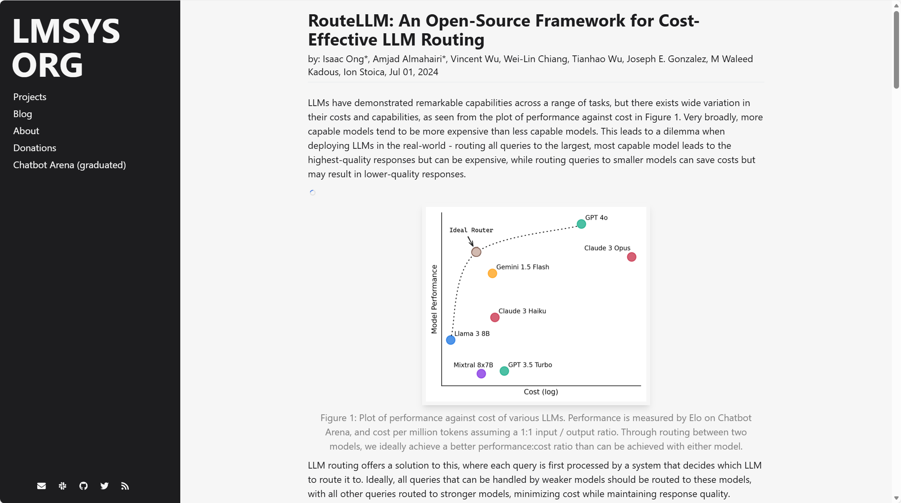
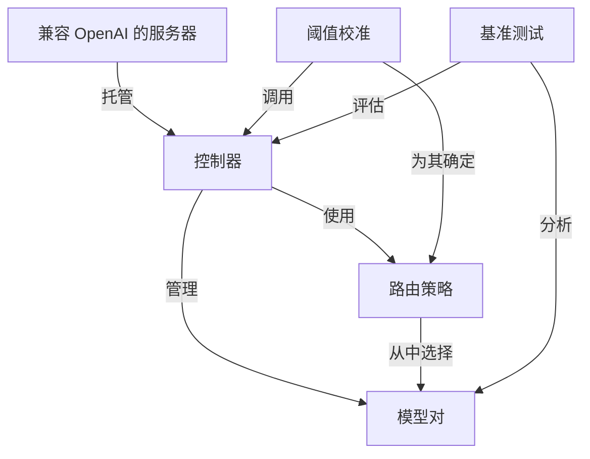

链接：[RouteLLM: An Open-Source Framework for Cost-Effective LLM Routing | LMSYS Org](https://lmsys.org/blog/2024-07-01-routellm/)

# docs：RouteLLM

RouteLLM 是一个旨在**智能路由**大语言模型查询的框架，它在*功能强大但昂贵的模型*和*更便宜但较弱的模型*之间进行选择。它充当一个**兼容 OpenAI 的代理**，==使用各种*路由策略*和*校准的成本阈值*来决定每个请求的最优模型==，旨在显著**降低成本**，同时保持高质量的响应。

## 可视化

## 章节

1. [兼容 OpenAI 的服务器
](01_openai_compatible_server_.md)
2. [模型对
](02_modelpair_.md)
3. [控制器
](03_controller_.md)
4. [路由策略
](04_router_strategy_.md)
5. [阈值校准
](05_threshold_calibration_.md)
6. [基准测试
](06_benchmark_.md)

