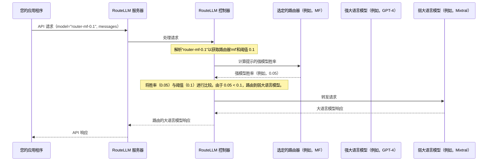

# 第 1 章：兼容 OpenAI 的服务器

在第一章中，我们将探索一个概念，它使 RouteLLM 能够非常容易地集成到现有应用程序中：**兼容 OpenAI 的服务器**。

## 问题：昂贵的大语言模型和代码变更

想象一下，我们已经构建了一个出色的应用程序，使用 OpenAI 的强大语言模型（如 GPT-4）来回答用户问题。

GPT-4 非常强大，但它也可能相当昂贵，特别是对于不需要其全部功能的简单查询。

RouteLLM 正是为了解决这个问题而设计的：它通过智能地将简单问题路由到更便宜的"弱"模型，==只将复杂问题发送到像 GPT-4 这样昂贵的"强"模型，从而帮助我们节省成本==。

然而，如果我们的应用程序已经设置为直接与 OpenAI 通信，我们如何在不重写大量代码的情况下切换到使用 RouteLLM 的智能路由呢？这就是**兼容 OpenAI 的服务器**发挥作用的地方

## 解决方案：一个熟悉的网关

`兼容 OpenAI 的服务器`充当"==中间人=="或"熟悉的网关"。可以这样理解：

我们的应用程序*认为*它仍然像往常一样直接与 OpenAI 的服务器通信。但实际上，我们将应用程序指向 RouteLLM 的服务器。我们的服务器随后秘密拦截这些请求，应用其智能路由逻辑，并将它们转发到*实际的*强或弱大语言模型。最后，它将大语言模型的响应发送回我们的应用程序，而应用程序对此毫不知情

这允许**==无缝集成==**，而无需修改现有客户端代码的核心逻辑。这是一个"即插即用的替代品"，让我们的应用程序立即从 RouteLLM 的成本节省中受益。

## 入门：设置服务器

让我们逐步了解如何运行这个服务器并在应用程序中使用它。

### 步骤 1：安装 RouteLLM

首先，我们需要安装 RouteLLM。此命令包含运行服务器所需的一切：

```bash
pip install "routellm[serve,eval]"
```

*说明：此命令从 PyPI 获取并安装 RouteLLM 库，以及运行服务器和评估工具所需的额外组件（`[serve,eval]`）。*

### 步骤 2：启动兼容 OpenAI 的服务器

现在，让我们启动服务器。为此，RouteLLM 需要知道它应该在哪些实际大语言模型之间进行路由。我们将指定一个"强"模型（如 GPT-4）和一个"弱"模型（如 Mixtral）。我们还需要提供 API 密钥，以便 RouteLLM 可以与这些真实的大语言模型通信。

```bash
export OPENAI_API_KEY=sk-XXXXXX # 您的 OpenAI API 密钥
export ANYSCALE_API_KEY=esecret_XXXXXX # 您的 Anyscale API 密钥

python -m routellm.openai_server \
  --routers mf \
  --strong-model gpt-4-1106-preview \
  --weak-model anyscale/mistralai/Mixtral-8x7B-Instruct-v0.1 \
  --port 6060 # 如果需要，可以更改端口
```

*说明：此命令启动 RouteLLM 服务器。它设置了两个环境变量，用于访问实际大语言模型所需的 API 密钥。*

*`--routers mf` 部分告诉 RouteLLM 使用 `mf`（矩阵分解）[路由策略](04_router_strategy.md)来做出路由决策。`--strong-model` 和 `--weak-model` 定义了 RouteLLM 将在其中选择的[模型对](02_modelpair_.md)。然后服务器将开始监听请求，通常在 `http://0.0.0.0:6060`。*

### 步骤 3：向 RouteLLM 服务器发出请求

现在，在我们的应用程序中，我们不再将 OpenAI 客户端指向 `api.openai.com`，而是将其指向正在运行的 RouteLLM 服务器。

一个关键细节是如何告诉 RouteLLM *如何*路由每个特定请求。我们通过更改 `client.chat.completions.create` 调用中的 `model` 参数来实现。格式为 `router-[路由器名称]-[阈值]`。

*   `[路由器名称]` 指的是我们想要使用的[路由策略](04_router_strategy.md)（例如，`mf`）。
*   `[阈值]` 是一个介于 0.0 和 1.0 之间的数字，用于控制成本-质量权衡。我们稍后将详细探讨[阈值校准](05_threshold_calibration.md)，但现在，可以将其视为一个旋钮：较高的阈值会将更多请求发送到更便宜的模型，而较低的阈值会将更多请求发送到更强的模型。

以下是如何使用标准 OpenAI Python 客户端的示例：

```python
from openai import OpenAI

# 1. 将 OpenAI 客户端指向 RouteLLM 服务器的地址
client = OpenAI(
    base_url="http://localhost:6060/v1", # 这是 RouteLLM 服务器运行的位置
    api_key="sk-whatever-you-want",      # RouteLLM 不使用此 API 密钥，可以是虚拟的
)

# 2. 像往常一样发出聊天完成请求
response = client.chat.completions.create(
    # 在模型名称中指定路由器（'mf'）和阈值（0.1）
    model="router-mf-0.1",
    messages=[
        {"role": "user", "content": "用一句话解释光合作用。"},
    ]
)

print(response.choices[0].message.content)
```

*说明：注意这段代码看起来多么熟悉！唯一显著的变化是 `base_url` 和 `model` 参数的特殊格式。我们的应用程序将其请求发送到本地 RouteLLM 服务器，然后该服务器根据 `mf` 路由器和 `0.1` 阈值智能地决定是将"用一句话解释光合作用..."发送到 GPT-4 还是 Mixtral。*

## 内部机制：工作原理

让我们揭开帷幕，了解当我们的应用程序向 RouteLLM 兼容 OpenAI 的服务器发送请求时会发生什么。

### "邮局"类比

将 RouteLLM 服务器想象成一个非常智能的邮局：

1.  **我们的应用程序（发件人）** 写了一封信（API 请求）并将其寄给"OpenAI"。
2.  **RouteLLM 服务器（我们的智能邮局）** 拦截了这封信。它注意到我们将其寄到了它的地址（`http://localhost:6060/v1`），而不是实际的 OpenAI 地址。
3.  然后它读取信上的一个特殊注释（`model="router-mf-0.1"` 部分）。这个注释告诉邮局使用哪种"路由策略"（`mf`）以及这封信的"紧急程度"（阈值 `0.1`）是什么。
4.  **RouteLLM 控制器（邮政局长）** 接受这些指令。它使用 `mf` [路由策略](04_router_strategy.md)来决定这封信是否足够简单，可以交给"弱大语言模型邮件室"（例如，Mixtral），还是需要"强大语言模型快递服务"（例如，GPT-4）。
5.  然后邮政局长将信转发到*选定的*实际大语言模型。
6.  **实际大语言模型（GPT-4 或 Mixtral）** 处理这封信并写下回复。
7.  回复返回到 **RouteLLM 控制器**，然后将其传递回 **RouteLLM 服务器**。
8.  最后，**RouteLLM 服务器** 将回复交付给**我们的应用程序**。我们的应用程序甚至没有意识到它的信经过了智能路由系统的绕道！

### 请求流程



### 代码

让我们看一些来自 RouteLLM 的简化代码片段，了解这个内部过程如何转化为实际实现。

#### 1. 服务器入口点（`routellm/openai_server.py`）

此文件包含监听传入请求的 FastAPI 应用程序。当服务器启动时，它初始化 `Controller`，这是 RouteLLM 的大脑。

```python
# routellm/openai_server.py（为清晰起见进行了简化）
from fastapi.concurrency import asynccontextmanager
from routellm.controller import Controller
# ... 其他导入 ...

CONTROLLER = None # 这将保存我们的主要 RouteLLM 大脑

@asynccontextmanager
async def lifespan(app):
    global CONTROLLER
    # 当服务器启动时，它创建控制器。
    # 此控制器了解指定的路由器和模型对。
    CONTROLLER = Controller(
        routers=args.routers,       # 例如，["mf"]
        strong_model=args.strong_model, # 例如，"gpt-4-1106-preview"
        weak_model=args.weak_model,   # 例如，"anyscale/mistralai/Mixtral-8x7B-Instruct-v0.1"
        # ... 其他配置 ...
    )
    yield # 服务器现在准备好接收请求
    CONTROLLER = None # 服务器关闭清理
```

*说明：`lifespan` 函数确保当 `routellm.openai_server` 启动时，它创建一个单一的全局 `Controller` 实例。这个 `Controller` 是所有路由逻辑的中心枢纽，并预加载了我们在启动服务器时定义的[路由策略](04_router_strategy.md)选项和[模型对](02_model_pair.md)。*

当我们的应用程序发送请求时，`create_chat_completion` 端点捕获它并将其直接传递给这个 `CONTROLLER`：

```python
# routellm/openai_server.py（为清晰起见进行了简化）
# ... 导入和模型定义 ...

@app.post("/v1/chat/completions")
async def create_chat_completion(request: ChatCompletionRequest):
    try:
        # 服务器将请求交给控制器。
        # 然后控制器将处理路由和实际的大语言模型调用。
        res = await CONTROLLER.acompletion(
            **request.model_dump(exclude_none=True),
        )
    except RoutingError as e:
        # 如果'model'参数格式错误或路由器不存在。
        return JSONResponse(ErrorResponse(message=str(e)).model_dump(), status_code=400)

    # ... 处理流式传输或直接 JSON 响应 ...
    return JSONResponse(content=res.model_dump())
```

*说明：这个 FastAPI 端点是 HTTP 入口点。它接收我们应用程序的请求（看起来像标准的 OpenAI API 请求）。然后它将解析模型名称、做出路由决策和调用实际大语言模型的复杂任务委托给 `CONTROLLER` 实例。*

#### 2. 控制器：RouteLLM 的大脑（`routellm/controller.py`）

`Controller` 类是核心路由智能所在的地方。

首先，它需要理解我们的特殊 `model` 字符串：

```python
# routellm/controller.py（为清晰起见进行了简化）
class Controller:
    # ... __init__ 和其他方法 ...

    def _parse_model_name(self, model: str):
        # 示例：model = "router-mf-0.1"
        # 这将字符串分割成部分：['', 'mf', '0.1']
        _, router_name, threshold_str = model.split("-", 2)
        try:
            # 将阈值部分从字符串转换为数字
            threshold = float(threshold_str)
        except ValueError as e:
            raise RoutingError(f"阈值 {threshold_str} 必须是浮点数。") from e
        
        # 基本验证
        if not model.startswith("router"):
            raise RoutingError("无效的模型格式。")
        
        return router_name, threshold
```

*说明：此方法至关重要。它接受 `model` 字符串（如 `router-mf-0.1`），用连字符分割它，并提取 `router_name`（`mf`）和 `threshold` 值（`0.1`）。这就是 RouteLLM 如何知道使用哪个[路由策略](04_router_strategy.md)以及该特定请求的"成本-质量旋钮"。*

接下来，`Controller` 使用解析的信息做出路由决策：

```python
# routellm/controller.py（为清晰起见进行了简化）
class Controller:
    # ... __init__ 和其他方法 ...

    def _get_routed_model_for_completion(
        self, messages: list, router_name: str, threshold: float
    ):
        # 获取特定的路由器实例（例如，'mf'路由器）
        router_instance = self.routers[router_name]

        # 核心路由决策在这里发生！
        # 路由器决定强模型还是弱模型最适合提示，
        # 考虑我们提供的'threshold'。
        routed_model_name = router_instance.route(
            messages[-1]["content"], # 路由器主要查看最后一条用户消息
            threshold,
            self.model_pair # 关于强模型和弱模型的信息
        )
        return routed_model_name
```

*说明：在这里，`Controller` 检索与 `router_name` 对应的特定[路由策略](04_router_strategy.md)实例（例如，`mf` 路由器）。然后它调用该路由器的 `route` 方法，传入用户的提示、`threshold` 和定义的[模型对](02_modelpair_.md)。路由器的逻辑根据阈值评估提示，并返回所选模型的名称（例如，"gpt-4-1106-preview"或"anyscale/mistralai/Mixtral-8x7B-Instruct-v0.1"）。*

最后，`Controller` 中的 `acompletion` 方法对所选的大语言模型进行实际调用：

```python
# routellm/controller.py（为清晰起见进行了简化）
from litellm import acompletion # 一个轻松调用各种大语言模型的库
from typing import Optional

class Controller:
    # ... 其他方法 ...

    async def acompletion( # 这是异步版本
        self,
        *,
        router: Optional[str] = None,
        threshold: Optional[float] = None,
        **kwargs, # 我们的应用程序发送给 OpenAI 的所有其他参数
    ):
        if "model" in kwargs:
            # 如果存在'model'，解析它以获取路由器和阈值
            router, threshold = self._parse_model_name(kwargs["model"])

        self._validate_router_threshold(router, threshold)

        # 解析和验证后，RouteLLM 决定使用哪个模型
        kwargs["model"] = self._get_routed_model_for_completion(
            kwargs["messages"], router, threshold
        )

        # 这是进行实际大语言模型调用的地方！
        # RouteLLM 使用 LiteLLM 将请求发送到所选的（强或弱）大语言模型。
        return await acompletion(
            api_base=self.api_base, api_key=self.api_key, **kwargs
        )
```

*说明：这个 `acompletion` 方法是 `Controller` 与外部大语言模型交互的核心。在确定要使用哪个 `router` 和 `threshold`，然后从[模型对](02_modelpair_.md)中调用哪个特定的 `strong_model` 或 `weak_model` 之后，它更新 `kwargs` 中的 `model`。然后，它使用 `litellm` 库将请求分派到*实际的*大语言模型。这使得 RouteLLM 与各种大语言模型提供商兼容，而不仅仅是 OpenAI。*

## 结论

在本章中，我们了解到**兼容 OpenAI 的服务器**是 RouteLLM 充当"智能代理"的巧妙方式。

允许我们现有的应用程序（已经为 OpenAI 的 API 配置）轻松利用 RouteLLM 的成本节省路由，而无需进行重大代码更改。我们现在知道如何安装 RouteLLM、启动服务器，并将 OpenAI 客户端指向它，在 `model` 字段中指定路由参数。

接下来，我们将==探讨[模型对](02_modelpair_.md)的概念==，它定义了 RouteLLM 在其之间智能路由的强和弱大语言模型。

[下一章：模型对](02_modelpair_.md)

