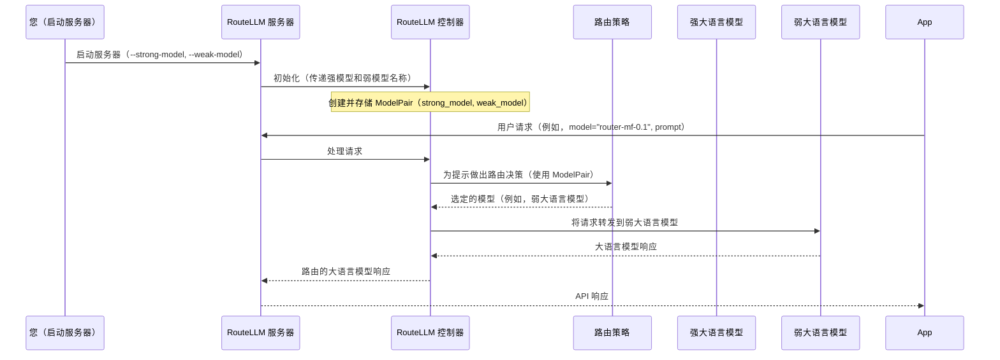

# 第 2 章：模型对

在[第 1 章：兼容 OpenAI 的服务器](01_openai_compatible_server_.md)中，我们了解了 RouteLLM 如何充当一个聪明的中间人，允许现有应用程序无缝使用其智能路由。

> RouteLLM 究竟在*什么之间*进行路由呢？

这就引出了**模型对**的核心概念。

## 路由决策的核心：两个模型

RouteLLM 的全部目的是帮助我们在保持质量的同时节省成本。它通过做出一个明智的决策来实现这一点："我应该将此请求发送到一个超强大、昂贵的模型，还是一个更基础、更便宜的模型就能很好地处理它？"

为了做出这个决策，RouteLLM 需要知道它应该从*哪*两个模型中进行选择。这正是 `ModelPair` 抽象所定义的。它是所有路由决策的**基本选择**：一个强大、有能力的模型和一个弱、具有成本效益的模型。

可以把它想象成在工具箱中为特定工作准备两种不同的工具：

*   **一个强大、昂贵的冲击钻**用于坚硬的混凝土（我们的 `strong_model`）。
*   **一个更简单、更便宜的手钻**用于基本的木材或石膏板（我们的 `weak_model`）。

如果手钻可以完成工作，我们不会对每项任务都使用冲击钻，对吧？那是大材小用，而且更贵

- `ModelPair` 告诉 RouteLLM 它可以使用哪两个"钻头"。

### 模型对中的关键概念

一个 `ModelPair` 由两个不同的大语言模型（LLM）组成：

| 特性              | 强模型                           | 弱模型                             |
| :---------------- | :------------------------------- | :--------------------------------- |
| **能力**          | 高度有能力，能很好地执行复杂任务 | 能力较弱，高效处理简单任务         |
| **成本**          | 每个请求更昂贵                   | 每个请求便宜得多                   |
| **示例**          | GPT-4、Claude 3 Opus             | Mixtral、GPT-3.5 Turbo、Llama 3 8B |
| **RouteLLM 目标** | 仅在真正必要时使用               | 为节省成本的首选选择               |

这两个模型一起形成了 RouteLLM 用于平衡每个请求的成本和质量的"两层系统"。

## 定义模型对：如何设置

我们通常不会在应用程序代码中直接创建 `ModelPair` 对象。相反，我们在**启动 RouteLLM 服务器**时定义所需的强模型和弱模型。

还记得[第 1 章：兼容 OpenAI 的服务器](01_openai_compatible_server_.md)中的 `python -m routellm.openai_server` 命令吗？那就是我们指定将形成 `ModelPair` 的模型的地方。

以下是服务器启动命令的相关部分：

```bash
python -m routellm.openai_server \
  --routers mf \
  --strong-model gpt-4-1106-preview \
  --weak-model anyscale/mistralai/Mixtral-8x7B-Instruct-v0.1 \
  --port 6060
```

*说明：`--strong-model` 参数告诉 RouteLLM 使用哪个特定的强大模型（例如，`gpt-4-1106-preview`）。`--weak-model` 参数指定更便宜的替代方案（例如，`anyscale/mistralai/Mixtral-8x7B-Instruct-v0.1`）。这两个模型成为 RouteLLM 服务器将用于所有路由决策的 `ModelPair`。*

一旦服务器使用这些参数启动，它就"知道"了它的 `ModelPair`。从那时起，每当我们的应用程序发送请求时，[控制器](03_controller.md)和[路由策略](04_router_strategy.md)将在这两个特定模型之间做出选择。

## 内部机制：RouteLLM 如何处理模型对

让我们揭开帷幕，看看 RouteLLM 的内部组件如何使用 `ModelPair`。

### 控制器的知识

当 RouteLLM 服务器启动时，它初始化 RouteLLM 的中央大脑，称为[控制器](03_controller.md)。在此初始化期间，`ModelPair` 信息被设置并存储在控制器中。

想象一下第 1 章中我们的智能邮局。邮政局长（[控制器](03_controller.md)）在一天开始时收到一张便条："今天，我们的邮件递送有两个选项：'强大语言模型快递'和'弱大语言模型常规服务'。"这张"便条"就是我们的 `ModelPair`。

以下是显示如何建立 `ModelPair` 然后使用它



### 代码

让我们看看定义和使用 `ModelPair` 的实际代码。

#### 1. `ModelPair` 定义（`routellm/controller.py`）

`ModelPair` 本身是一个非常简单的 Python 类，称为 `dataclass`。它只保存两条信息：强模型的名称和弱模型的名称。

```python
# routellm/controller.py（简化版）
from dataclasses import dataclass

@dataclass
class ModelPair:
    strong: str # 存储强模型的名称（例如，"gpt-4-1106-preview"）
    weak: str   # 存储弱模型的名称（例如，"anyscale/mistralai/Mixtral-8x7B-Instruct-v0.1"）
```

*说明：这个 `ModelPair` 类就像一个小容器。当我们在服务器启动期间提供 `--strong-model` 和 `--weak-model` 参数时，它们的值被存储在这个 `ModelPair` 类的实例中。*

#### 2. 控制器初始化模型对（`routellm/controller.py`）

`Controller` 是 RouteLLM 的"大脑"。当它被创建时，它接受我们的 `strong_model` 和 `weak_model` 参数，并使用它们创建一个 `ModelPair` 实例，然后存储它。

```python
# routellm/controller.py（简化版）
class Controller:
    def __init__(
        self,
        routers: list[str],
        strong_model: str, # 这来自我们的 --strong-model 参数
        weak_model: str,   # 这来自我们的 --weak-model 参数
        # ... 其他配置 ...
    ):
        # 在这里，ModelPair 被创建并存储为控制器的属性。
        self.model_pair = ModelPair(strong=strong_model, weak=weak_model)
        self.routers = {}
        # ... 其余初始化 ...
```

*说明：`Controller` 类的 `__init__` 方法（构造函数）接收我们指定的模型名称。然后它使用它们创建一个 `ModelPair` 对象并将其保存在 `self.model_pair` 中。现在，`Controller` 始终知道它正在使用哪些强模型和弱模型。*

#### 3. 路由器使用模型对（`routellm/controller.py`）

当我们的应用程序发送请求时，[控制器](03_controller.md)要求选定的[路由策略](04_router_strategy.md)（如第 1 章中的 `mf` 路由器）做出决策。`Controller` 将 `ModelPair` 信息传递给路由器，以便它知道它在哪两个模型之间做决定。

```python
# routellm/controller.py（简化版）
class Controller:
    # ... __init__ 和其他方法 ...

    def _get_routed_model_for_completion(
        self, messages: list, router: str, threshold: float
    ):
        prompt = messages[-1]["content"] # 获取用户的最新消息
        router_instance = self.routers[router] # 获取特定的路由器（例如，'mf'）

        # 路由器决定使用哪个模型。
        # 它需要提示、阈值和 self.model_pair
        # 以了解它在哪两个模型之间进行选择。
        routed_model = router_instance.route(
            prompt,
            threshold,
            self.model_pair # 在这里 ModelPair 被传递给路由器！
        )

        # ... 跟踪选择了哪个模型 ...
        return routed_model
```

*说明：在这个关键步骤中，`Controller` 中的 `_get_routed_model_for_completion` 方法调用选定的[路由策略](04_router_strategy.md)的 `route` 方法。它传递 `prompt`、`threshold`（我们将在[第 5 章：阈值校准](05_threshold_calibration.md)中介绍），以及重要的 `self.model_pair`。然后路由器使用这个 `ModelPair` 返回强模型或弱模型的名称，[控制器](03_controller.md)然后使用 `litellm` 调用它。*

这个流程确保路由器始终根据我们配置的特定强模型和弱模型做出决策。

## 结论

`ModelPair` 是 RouteLLM 中一个简单但基础的概念。它正式==定义了两层系统——一个 `strong_model` 和一个 `weak_model`——所有路由决策都建立在此基础上==。我们在启动 RouteLLM 服务器时配置这对模型，在内部，[控制器](03_controller.md)存储此信息并将其传递给[路由策略](04_router_strategy.md)以做出智能的成本节省选择。

现在我们了解了 RouteLLM 在*什么之间*进行路由，让我们通过了解中央协调器来探索这些路由决策是*如何*做出的：[控制器](03_controller.md)。

[下一章：控制器](03_controller_.md)

