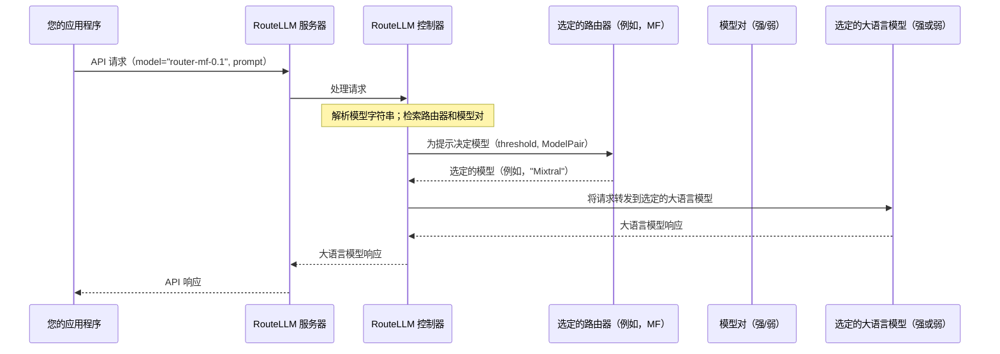

# 第 3 章：控制器

在[第 1 章：兼容 OpenAI 的服务器](01_openai_compatible_server_.md)中，我们了解了 RouteLLM 如何拦截大语言模型请求，在[第 2 章：模型对](02_modelpair_.md)中，我们定义了它在其之间进行路由的两个模型（强和弱）。现在，是时候认识==协调所有这一切的中央大脑了：**控制器**==。

## RouteLLM 的大脑：做出明智的决策

想象一下我们正在运营一个繁忙的机场，许多飞机（我们的大语言模型请求）正在进场。

我们有两条主要跑道：一条非常长、设备齐全的跑道用于大型重要飞机（我们的 `strong_model`），以及一条较短、更基础的跑道用于较小、更简单的飞机（我们的 `weak_model`）。

> 谁决定哪架飞机去哪条跑道？这就是**空中交通管制员**的工作。

在 RouteLLM 中，`Controller` 正是扮演这个角色。

当我们的应用程序向 RouteLLM 服务器发送大语言模型请求时，`Controller` 是该服务器内部负责做出关键决策的核心组件：**"这个特定查询应该发送到强大、昂贵的模型，还是更便宜、较弱的模型可以有效处理它？"**

它是连接所有部分的中央枢纽：我们的传入请求、可用的[模型对](02_modelpair_.md)、选定的[路由策略](04_router_strategy.md)，以及与实际大语言模型的最终通信。

## 控制器

`Controller` 就像一个超级智能的管理者，有几项重要工作：

1.  **解释我们的请求：** 它理解来自客户端应用程序的特殊 `model` 名称（如 `router-mf-0.1`），以了解*使用哪个*[路由策略](04_router_strategy.md)以及我们为该请求设置的*什么*成本节省目标（阈值）。
2.  **管理模型可用性：** 它跟踪[模型对](02_modelpair_.md)——我们指定的强和弱大语言模型——因此它知道其路由选项。
3.  **应用路由逻辑：** 它咨询选定的[路由策略](04_router_strategy.md)（例如，`mf` 表示矩阵分解）和指定的成本 `threshold`，以决定当前查询的最佳模型。
4.  **处理 API 通信：** 一旦做出决策，就是 `Controller` 实际将请求发送到选定的大语言模型（强或弱）并接收其响应。
5.  **充当即插即用的替代品：** 因为它在内部处理所有 API 通信，所以我们的应用程序只需通过服务器与 RouteLLM `Controller` 对话，就像直接与 OpenAI 对话一样，使集成变得轻松。

## 当我们发出请求时控制器如何工作

我们不会通过特定的 API 调用直接"使用"`Controller`；它是 RouteLLM 服务器的内部组件。然而，每次我们向正在运行的 RouteLLM 服务器发送请求时（如[第 1 章：兼容 OpenAI 的服务器](01_openai_compatible_server_.md)所示），`Controller` 都会在幕后开始工作。

让我们重新审视客户端代码：

```python
from openai import OpenAI

client = OpenAI(
    base_url="http://localhost:6060/v1",
    api_key="sk-whatever-you-want",
)

response = client.chat.completions.create(
    model="router-mf-0.1", # 这告诉控制器该做什么！
    messages=[
        {"role": "user", "content": "用一句话解释光合作用。"},
    ]
)

print(response.choices[0].message.content)
```

当此请求到达我们的 `http://localhost:6060` 服务器时，服务器内部的 `Controller` 是执行以下操作的组件：

1.  接收完整的请求，包括 `model="router-mf-0.1"` 和用户的 `messages`。
2.  解析 "router-mf-0.1" 以识别 `mf` [路由策略](04_router_strategy.md)和 `0.1` 阈值。
3.  询问 `mf` 路由器："根据此查询和 0.1 的阈值，我应该使用来自我的[模型对](02_modelpair_.md)的强模型（GPT-4）还是弱模型（Mixtral）？"
4.  接收路由器的决策（例如，"使用 Mixtral！"）。
5.  将原始查询发送到*实际的* Mixtral 模型。
6.  获取 Mixtral 的答案。
7.  打包该答案并通过 RouteLLM 服务器将其发送回我们的应用程序。

我们的应用程序只看到一个正常的响应，完全不知道刚刚发生的智能路由！

## 内部机制：控制器的实际运作

让我们深入了解 `Controller` 的内部，看看它如何执行这些任务。

### 空中交通管制员类比

将 `Controller` 视为主要的空中交通管制员：

1.  **请求到达（飞机接近）：** 我们的应用程序向 RouteLLM 服务器发送大语言模型请求。服务器将其传递给 `Controller`。
2.  **识别目的地和规则（检查飞行计划）：** `Controller` 查看我们请求中的 `model` 参数（`router-mf-0.1`）。它迅速确定我们想要使用 `mf` [路由策略](04_router_strategy.md)和 `0.1` 的 `threshold`。
3.  **咨询路由逻辑（检查跑道条件）：** 然后 `Controller` 调用 `mf` 路由器（它在服务器启动期间加载的），并说："这是用户的问题，这是我们的 `threshold` 0.1。另外，这是我们的[模型对](02_modelpair_.md)：GPT-4 是强的，Mixtral 是弱的。此请求应该发送到哪个模型？"
4.  **做出决策（分配跑道）：** `mf` 路由器计算其数字并告诉 `Controller`："这看起来像一个更简单的查询。将其发送到 Mixtral！"
5.  **直接通信（引导飞机到跑道）：** 然后 `Controller` 获取原始请求并将其直接发送到 Mixtral 的 Anyscale API 端点（或者如果选择了 GPT-4，则发送到 OpenAI）。
6.  **接收响应（飞机降落，收到消息）：** 选定的大语言模型处理请求并将其响应发送回 `Controller`。
7.  **转发到应用程序（向乘客转发消息）：** `Controller` 接收大语言模型的响应并通过 RouteLLM 服务器将其发送回我们的应用程序，然后应用程序将其作为标准大语言模型响应接收。

时序图：



### 代码

让我们看看这些职责如何转化为 `routellm/controller.py` 文件。

#### 1. 控制器初始化

当 RouteLLM 服务器启动时（[第 1 章：兼容 OpenAI 的服务器](01_openai_compatible_server_.md)），它创建一个 `Controller` 的单一实例。这是 `Controller` 配备其工具的地方：[模型对](02_model_pair.md)和可用的[路由策略](04_router_strategy.md)。

```python
# routellm/controller.py（简化版）
class Controller:
    def __init__(
        self,
        routers: list[str], # 例如，来自服务器启动的 ["mf"]
        strong_model: str,   # 例如，"gpt-4-1106-preview"
        weak_model: str,     # 例如，"anyscale/mistralai/Mixtral-8x7B-Instruct-v0.1"
        # ... 其他配置 ...
    ):
        # 存储模型对（强和弱模型名称）
        self.model_pair = ModelPair(strong=strong_model, weak=weak_model)
        self.routers = {} # 这将存储路由策略的实例
        # ... 其他设置 ...

        for router_name in routers:
            # 对于每个路由器名称（例如，"mf"），创建一个实例
            self.routers[router_name] = ROUTER_CLS[router_name](**config.get(router_name, {}))
```

*说明：`Controller` 的 `__init__` 方法就像设置其控制面板。它将 `strong_model` 和 `weak_model` 存储为 `ModelPair`，并为我们指定的每个[路由策略](04_router_strategy.md)创建实际实例，使它们准备好使用。*

#### 2. 解析模型名称

`Controller` 对传入请求做的第一件事是理解其特殊的 `model` 字段。

```python
# routellm/controller.py（简化版）
class Controller:
    # ... __init__ 和其他方法 ...

    def _parse_model_name(self, model_name_string: str):
        # 示例：model_name_string = "router-mf-0.1"
        # 分割为 ['', 'mf', '0.1']
        _, router_name, threshold_str = model_name_string.split("-", 2)
        try:
            threshold = float(threshold_str)
        except ValueError as e:
            raise RoutingError(f"阈值 {threshold_str} 必须是浮点数。") from e

        if not model_name_string.startswith("router"):
            raise RoutingError("无效的模型格式。")
        
        return router_name, threshold
```

*说明：这个辅助方法对于从我们应用程序提供的 `model` 字符串中提取 `router_name`（例如，`mf`）和 `threshold`（例如，`0.1`）至关重要。这告诉 `Controller` 如何准确地路由这个特定请求。*

#### 3. 做出路由决策

在识别了路由器和阈值后，`Controller` 调用相关的[路由策略](04_router_strategy.md)以获取实际的模型名称。

```python
# routellm/controller.py（简化版）
class Controller:
    # ... __init__ 和其他方法 ...

    def _get_routed_model_for_completion(
        self, messages: list, router_name: str, threshold: float
    ):
        prompt = messages[-1]["content"] # 获取用户的最新消息
        router_instance = self.routers[router_name] # 获取特定的路由器（例如，'mf' 实例）

        # 核心决策：路由器根据提示、阈值和模型对在强/弱之间做出决定。
        routed_model = router_instance.route(
            prompt,
            threshold,
            self.model_pair # 将模型对传递给路由器！
        )
        return routed_model
```

*说明：在这里，`Controller` 获取用户的提示、阈值和其自己存储的 `ModelPair` 信息，并将它们传递给选定的 `router_instance`。然后路由器应用其特定逻辑并返回应该处理请求的大语言模型（`strong` 或 `weak`）的名称。*

#### 4. 处理实际的大语言模型调用

最后，`Controller` 充当代理，使用 `litellm` 库调用路由器选择的大语言模型。

```python
# routellm/controller.py（简化版）
from litellm import acompletion # 用于进行异步大语言模型调用

class Controller:
    # ... 其他方法 ...

    async def acompletion( # 这是服务器调用的主要方法
        self,
        *,
        router: Optional[str] = None,
        threshold: Optional[float] = None,
        **kwargs, # 包括 'model'、'messages'、'temperature' 等
    ):
        if "model" in kwargs:
            # 如果提供了像 "router-mf-0.1" 这样的模型名称，解析它
            router, threshold = self._parse_model_name(kwargs["model"])

        self._validate_router_threshold(router, threshold) # 确保值有效

        # 使用选定的大语言模型的名称更新 kwargs 中的 'model'
        kwargs["model"] = self._get_routed_model_for_completion(
            kwargs["messages"], router, threshold
        )

        # 这是控制器调用实际大语言模型（强或弱）的地方
        return await acompletion(api_base=self.api_base, api_key=self.api_key, **kwargs)
```

*说明：`acompletion` 方法是 `Controller` 内处理 API 请求的入口点。在解析模型名称并做出路由决策（使用 `_get_routed_model_for_completion` 方法）后，它用实际的 `strong_model` 或 `weak_model` 名称覆盖我们请求中的 `model` 参数。

然后，它使用 `litellm` 将请求发送到选定的大语言模型并返回其响应。这就是它作为即插即用替代品的工作方式！

## 结论

`Controller` 是 RouteLLM 的中央大脑，充当大语言模型查询的智能空中交通管制员。

- 接收我们的请求，解释我们的路由指令，使用指定的[模型对](02_model_pair.md)和阈值咨询[路由策略](04_router_strategy.md)，然后将查询定向到最合适（且最具成本效益）的大语言模型。

- 通过在幕后处理所有这些逻辑和通信，它确保 RouteLLM 与我们现有的应用程序无缝集成。

现在我们==了解了 `Controller` 在协调路由中的作用，让我们通过探索不同的[路由策略](04_router_strategy.md)选项来了解它做出这些决策的各种方式==。

[下一章：路由策略](04_router_strategy.md)

