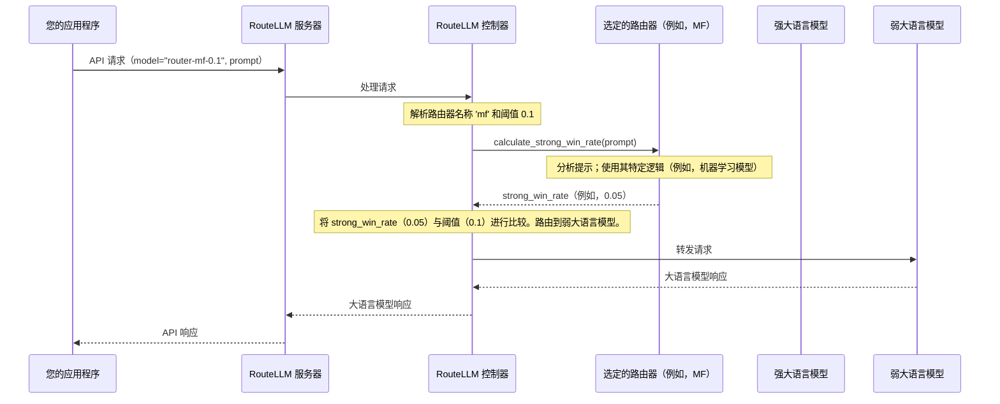

# 第 4 章：路由策略

欢迎回来

在[第 3 章：控制器](03_controller_.md)中，我们看到 `Controller` 是 RouteLLM 的中央大脑，协调所有路由决策。但 `Controller` 实际上*如何*做出这些明智的选择呢？它如何知道何时将查询发送到强大、昂贵的模型，而不是更便宜、较弱的模型？

这就是**路由策略**概念发挥作用的地方。

## 问题：做出智能路由决策

想象一下，我们正在尝试管理使用大语言模型的应用程序的成本。我们已经准备好了[模型对](02_modelpair_.md)：一个强模型（如 GPT-4）和一个弱模型（如 Mixtral）。当新的用户查询到达时，例如"用一句话解释光合作用"，我们如何决定哪个模型应该处理它？

*   将其发送到 GPT-4 对于如此简单的查询来说是大材小用，浪费金钱。
*   将非常复杂的查询发送到 Mixtral 可能会导致质量差的答案，让用户感到沮丧。

我们需要一种智能的方式来预测，对于每个单独的查询，哪个模型*最有可能*提供足够好的答案，同时仍然考虑成本。

## 解决方案：专业的专家顾问

`Router` 策略就像为每个查询聘请一位**专业的专家顾问**。这位顾问的工作是查看用户的提示，并对我们的*强模型*相对于*弱模型*在该特定提示上"获胜"（即表现明显更好）的可能性做出有根据的猜测。

这个预测称为**"强模型胜率"**——通常是介于 0 和 1 之间的数字。

工作原理如下：

1.  **分析查询：** 路由策略检查用户的提示。
2.  **预测"强模型胜率"：** 根据其内部逻辑（不同策略之间可能非常不同），它预测一个 `strong_win_rate`。
    *   高 `strong_win_rate`（例如，0.9）意味着强模型很可能优于弱模型。
    *   低 `strong_win_rate`（例如，0.1）意味着弱模型可能表现得一样好，或者强模型并没有明显更好。
3.  **与阈值比较：** 然后 `Controller` 获取这个 `strong_win_rate` 并将其与我们提供的 `threshold` 进行比较。这个 `threshold` 是我们的"成本-质量旋钮"——它决定了我们愿意为强模型付费的频率。
    *   如果 `strong_win_rate >= threshold`，`Controller` 将查询路由到**强模型**。
    *   如果 `strong_win_rate < threshold`，`Controller` 将查询路由到**弱模型**。

这使得 RouteLLM 能够为*每一个请求*做出智能的、数据驱动的决策，平衡质量和成本。

## 🎢不同方法的不同路由策略

RouteLLM 提供了几个"专家顾问"，每个都使用不同的方法来计算关键的 `strong_win_rate`：

| 策略名称     | 工作原理（类比）                                            | 核心逻辑                                           | 何时使用                                             |
| :----------- | :---------------------------------------------------------- | :------------------------------------------------- | :--------------------------------------------------- |
| `mf`         | **矩阵分解：** 像电影推荐系统一样学习隐藏偏好。             | 使用提示和模型的嵌入来根据过去的数据预测胜率。     | 良好的通用路由器，在大型对战数据集上训练。           |
| `sw_ranking` | **相似度加权排名：** 查找类似的过去问题。                   | 寻找最相似的过去提示并使用它们的结果进行预测。     | 当我们有一个良好的标记提示数据集时有效。             |
| `bert`       | **BERT 分类器：** 专门的文本分析模型。                      | 微调的 BERT 模型对提示的难度或强模型偏好进行分类。 | 非常适合一般文本分类任务。                           |
| `causal_llm` | **因果大语言模型：** 专门训练用于预测分数的小型大语言模型。 | 一个紧凑的语言模型，输出表示强模型预期性能的分数。 | 对于使用大语言模型的推理理解提示中的细微差别很有用。 |
| `random`     | **随机：** 掷骰子。                                         | 简单地返回 0 和 1 之间的随机数。                   | 用于测试、基准测试或作为基线比较。                   |

每种策略都有其优势，并且根据我们的数据和特定用例可能更合适。

## 在应用程序中使用路由策略

我们在向 RouteLLM 服务器发出 API 请求时，直接在 `model` 参数中指定要使用的路由策略。

还记得[第 1 章：兼容 OpenAI 的服务器](01_openai_compatible_server_.md)和[第 3 章：控制器](03_controller_.md)中的这一行吗？

```python
from openai import OpenAI

client = OpenAI(
    base_url="http://localhost:6060/v1",
    api_key="sk-whatever-you-want",
)

response = client.chat.completions.create(
    # 这里的 'mf' 选择了矩阵分解路由策略
    model="router-mf-0.1",
    messages=[
        {"role": "user", "content": "用一句话解释光合作用。"},
    ]
)

print(response.choices[0].message.content)
```

*说明：通过设置 `model="router-mf-0.1"`，我们指示[控制器](03_controller_.md)为这个特定请求使用 `mf`（矩阵分解）路由策略。`0.1` 是 `threshold`（我们将在[第 5 章：阈值校准](05_threshold_calibration.md)中详细探讨）。`mf` 策略将分析"用一句话解释光合作用"，计算一个 `strong_win_rate`，然后 `Controller` 将使用该率和 `0.1` 阈值来决定是 GPT-4 还是 Mixtral 回答问题。*

## 内部机制：控制器如何咨询路由策略

让我们揭开帷幕，看看 `Controller` 实际上如何与这些"专家顾问"交互。

### 重新审视"专家顾问"类比

想象[控制器](03_controller_.md)（邮政局长）收到一封信（我们的 API 请求）。

1.  **邮政局长（控制器）阅读指令：** 邮政局长在信上看到"router-mf-0.1"。"啊，"他想，"这封信需要 `mf` 专家，我的紧急程度旋钮设置为 0.1。"
2.  **邮政局长咨询 `mf` 专家：** 邮政局长将信的内容（用户提示）交给 `mf` 专家。"我们的'强大语言模型快递服务'处理这封信比我们的'弱大语言模型常规服务'做得明显更好的可能性有多大？"
3.  **`mf` 专家计算：** `mf` 专家分析这封信。它可能会将其与之前看到的数千封其他信件进行比较，寻找模式。它计算一些数字并返回一个"强模型胜率"——比如说，0.05。
4.  **邮政局长做出最终决定：** 邮政局长将专家的 `strong_win_rate`（0.05）与 `threshold`（0.1）进行比较。由于 0.05 *小于* 0.1，邮政局长决定："好的，弱服务对这个就足够了。"
5.  **信件被路由：** 邮政局长将信件发送到"弱大语言模型常规服务"。

### 请求流程



### 代码

让我们看看使这些路由策略工作的实际代码。

#### 1. 基础路由器类（`routellm/routers/routers.py`）

RouteLLM 中的所有路由策略都遵循一个共同的蓝图，由抽象的 `Router` 类定义。这确保它们都有一个 `calculate_strong_win_rate` 方法和一个 `route` 方法。

```python
# routellm/routers/routers.py（简化版）
import abc

class Router(abc.ABC):
    @abc.abstractmethod
    def calculate_strong_win_rate(self, prompt):
        # 每个路由器都必须实现这个：
        # 它接受一个提示并返回一个浮点数（0-1）
        # 表示强模型的预测胜率。
        pass

    def route(self, prompt, threshold, routed_pair):
        # 这是所有策略的通用路由逻辑！
        if self.calculate_strong_win_rate(prompt) >= threshold:
            return routed_pair.strong # 使用模型对中的强模型
        else:
            return routed_pair.weak   # 使用模型对中的弱模型
```

*说明：`Router` 类定义了接口。每个特定的路由器（如 `mf` 或 `causal_llm`）都必须有一个 `calculate_strong_win_rate` 方法。`route` 方法只实现一次：它调用 `calculate_strong_win_rate`，然后将结果与 `threshold` 进行比较，从[模型对](02_model_pair.md)（`routed_pair`）中选择 `strong` 或 `weak` 模型。*

#### 2. 示例策略：矩阵分解（`routellm/routers/matrix_factorization/model.py` 和 `routellm/routers/routers.py`）

`MatrixFactorizationRouter` 是 `Router` 类的具体实现。它使用训练来预测胜率的小型神经网络。

```python
# routellm/routers/matrix_factorization/model.py（简化版）
import torch
from huggingface_hub import PyTorchModelHubMixin

class MFModel(torch.nn.Module, PyTorchModelHubMixin):
    # ... 神经网络的 __init__ 和其他方法 ...

    @torch.no_grad()
    def pred_win_rate(self, model_a_id, model_b_id, prompt):
        # 此方法使用训练好的神经网络进行预测。
        # 它接受两个模型 ID（强和弱）和提示。
        logits = self.forward([model_a_id, model_b_id], prompt)
        winrate = torch.sigmoid(logits[0] - logits[1]).item()
        return winrate
```

```python
# routellm/routers/routers.py（简化的 MatrixFactorizationRouter）
from routellm.routers.matrix_factorization.model import MODEL_IDS, MFModel

class MatrixFactorizationRouter(Router):
    def __init__(self, checkpoint_path, strong_model, weak_model, **kwargs):
        # 加载预训练的 MF 神经网络模型
        self.model = MFModel.from_pretrained(checkpoint_path, **kwargs)
        self.model = self.model.eval().to("cuda" if torch.cuda.is_available() else "cpu")
        # 存储强模型和弱模型的内部 ID
        self.strong_model_id = MODEL_IDS[strong_model]
        self.weak_model_id = MODEL_IDS[weak_model]

    def calculate_strong_win_rate(self, prompt):
        # 这是控制器将调用的核心逻辑！
        winrate = self.model.pred_win_rate(
            self.strong_model_id, self.weak_model_id, prompt
        )
        return winrate
```

*说明：`MatrixFactorizationRouter` 通过从 `checkpoint_path` 加载预训练的神经网络（`MFModel`）进行初始化。然后，它的 `calculate_strong_win_rate` 方法只需调用加载的神经网络的 `pred_win_rate` 函数，传入强模型和弱模型 ID 以及用户的 `prompt`，以获得 `strong_win_rate` 预测。*

#### 3. 另一个示例：因果大语言模型路由器（`routellm/routers/causal_llm/model.py` 和 `routellm/routers/routers.py`）

`CausalLLMRouter` 使用不同的方法：训练来输出分数的小型语言模型。

```python
# routellm/routers/causal_llm/model.py（简化版）
import numpy as np
import torch

class CausalLLMClassifier:
    def __init__(self, config, ckpt_local_path, prompt_format, score_threshold, **kwargs):
        # 加载专门的因果大语言模型及其分词器
        self.model = torch.load(ckpt_local_path) # 简化版，实际使用 get_model
        self.tokenizer = ... # 简化版，实际使用 get_tokenizer
        self.score_threshold = score_threshold
        # ... 其他设置 ...

    def __call__(self, row):
        # 此方法使用大语言模型生成预测
        input_ids = torch.as_tensor(row["input_ids"]).to("cuda").reshape(1, -1)
        with torch.no_grad():
            output_new = self.model.generate(input_ids, ...) # 简化版
        
        # 生成后，它根据大语言模型预测的分数分布计算路由概率（binary_prob）。
        binary_prob, softmax_scores = self.compute_routing_prob(...) # 简化版
        row["binary_prob"] = binary_prob
        return row
    
    def compute_routing_prob(self, score_logits):
        # 将预测的 logits 转换为路由概率
        exp_scores = np.exp(score_logits - np.max(score_logits))
        softmax_scores = exp_scores / np.sum(exp_scores)
        # 对高于某个阈值的分数的概率求和（例如，5 分中的 4 或 5 分）
        binary_prob = np.sum(softmax_scores[self.score_threshold - 1 :])
        return binary_prob, softmax_scores
```

```python
# routellm/routers/routers.py（简化的 CausalLLMRouter）
from routellm.routers.causal_llm.model import CausalLLMClassifier

class CausalLLMRouter(Router):
    def __init__(self, checkpoint_path, score_threshold=4, **kwargs):
        # 使用其模型和配置初始化 CausalLLMClassifier
        self.router_model = CausalLLMClassifier(
            ckpt_local_path=checkpoint_path,
            score_threshold=score_threshold,
            # ... 基于 kwargs 的其他配置 ...
        )
        self.to_openai_messages = ... # 用于为大语言模型格式化提示的辅助工具

    def calculate_strong_win_rate(self, prompt):
        input_data = {}
        input_data["messages"] = self.to_openai_messages([prompt])
        output = self.router_model(input_data) # 调用 CausalLLMClassifier
        if output is None:
            return 1 # 回退：如果预测失败，则路由到强模型
        else:
            # CausalLLMClassifier 预测*弱*模型足够的概率。
            # 因此，强模型胜率是 1 -（弱模型足够的概率）。
            return 1 - output["binary_prob"]
```

*说明：`CausalLLMRouter` 使用特殊的 `CausalLLMClassifier` 初始化其 `router_model`。当调用 `calculate_strong_win_rate` 时，它为此分类器格式化提示，运行分类器，然后获取 `binary_prob`（表示弱模型足够的可能性）并将其转换为 `1 - binary_prob` 以获得 `strong_win_rate`。*

#### 4. 在控制器中加载路由器（`routellm/controller.py`）

最后，还记得[第 3 章：控制器](03_controller_.md)中 `Controller` 在服务器启动时加载这些路由策略：

```python
# routellm/controller.py（简化版）
from routellm.routers.routers import ROUTER_CLS # 导入路由器类的字典

class Controller:
    def __init__(self, routers: list[str], strong_model: str, weak_model: str, **kwargs):
        self.model_pair = ModelPair(strong=strong_model, weak=weak_model)
        self.routers = {} # 这将存储实际的路由器实例

        # 对于服务器启动期间提供的每个路由器名称（例如，"mf"）
        for router_name in routers:
            # 创建特定路由器类的实例并存储它
            self.routers[router_name] = ROUTER_CLS[router_name](
                strong_model=strong_model,
                weak_model=weak_model,
                **kwargs.get(router_name, {}) # 传递路由器特定的配置
            )

    # ... 其他方法，包括 _get_routed_model_for_completion ...
    def _get_routed_model_for_completion(
        self, messages: list, router_name: str, threshold: float
    ):
        prompt = messages[-1]["content"]
        router_instance = self.routers[router_name] # 获取特定的路由器实例
        
        # 调用路由器的 route 方法以获取选定的模型
        routed_model = router_instance.route(
            prompt, threshold, self.model_pair
        )
        return routed_model
```

*说明：`Controller` 的 `__init__` 方法使用 `ROUTER_CLS` 字典为路由器名称找到正确的 Python 类（例如，`mf` 映射到 `MatrixFactorizationRouter`）。然后它创建该类的实例，传入 `strong_model` 和 `weak_model` 名称，以及任何路由器特定的配置。当请求进来时，`_get_routed_model_for_completion` 方法只需检索已创建的路由器实例并调用其 `route` 方法。*

这种设置使 RouteLLM 具有高度灵活性：我们可以轻松添加新的路由策略，`Controller` 只需通过查找其名称即可使用其中任何一个。

## 结论

路由策略是 RouteLLM 智能路由背后的"大脑"。

每个策略都是一个专门的算法，它分析我们的提示并计算 `strong_win_rate`——对强模型表现会好多少的预测。然后[控制器](03_controller_.md)将此预测与我们指定的 `threshold` 进行比较，以在我们的[模型对](02_modelpair_.md)之间做出最终路由决策。

- 提供不同的策略，如 `mf`、`sw_ranking`、`bert`、`causal_llm` 和 `random`，RouteLLM 允许我们为特定需求选择最佳的"专家顾问"。

现在我们了解了==路由决策是*如何*做出的==，下一个合乎逻辑的问题是：我们==如何选择正确的 `threshold` 来控制成本-质量平衡==？让我们在下一章中探讨这个问题

[下一章：阈值校准](05_threshold_calibration_.md)

