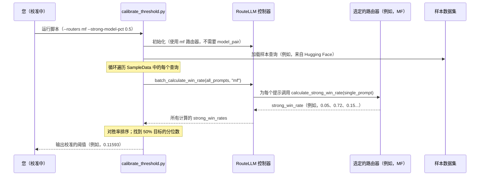

# 第 5 章：阈值校准

在[第 4 章：路由策略](04_router_strategy.md)中，我们了解到 `Router Strategy` 是为每个查询预测 `strong_win_rate` 的"专家顾问"。我们还看到[控制器](03_controller.md)然后使用 `threshold` 来决定是否将查询发送到强模型或弱模型。但一个关键问题仍然存在：**我们如何选择正确的 `threshold` 值？**

这就是**阈值校准**发挥作用的地方。

## 问题：找到成本和质量的最佳平衡点

我们有[模型对](02_model_pair.md)（一个强模型和一个弱模型）和一个强大的[路由策略](04_router_strategy.md)（如 `mf`），可以预测强模型的表现。`threshold` 充当我们的"成本-质量旋钮"：

*   **非常低的 `threshold`**（例如，0.05）：几乎所有查询都将发送到昂贵的强模型，因为很容易超过如此低的标准。这意味着高质量，但也意味着高成本。
*   **非常高的 `threshold`**（例如，0.95）：只有最复杂的查询才会到达强模型。大多数将发送到更便宜的弱模型。这节省了很多钱，但一些查询可能会得到比预期更低质量的响应。

挑战在于不同的应用程序和不同类型的查询有不同的需求。我们可能想节省成本，但仍然需要一定比例的重要、复杂查询肯定能到达强模型以保持用户满意度。我们如何找到在成本节省和质量之间实现*我们特定平衡*的 `threshold`？

**阈值校准**是精确调整此 `threshold` 以实现所需平衡的过程，通常表示为强模型调用的特定百分比，基于我们典型查询的样本。

## 阈值校准中的关键概念

让我们分解校准阈值背后的想法：

1.  **`threshold` 作为我们的"成本-质量旋钮"：**
    *   它是一个数字，通常在 0.0 和 1.0 之间。
    *   `strong_win_rate >= threshold` 意味着选择**强模型**。
    *   `strong_win_rate < threshold` 意味着选择**弱模型**。
    *   更高的阈值 = 更多弱模型调用 = 更低成本。
    *   更低的阈值 = 更多强模型调用 = 更高成本。

2.  **针对"强模型调用百分比"：**
    *   与其猜测 `threshold`，通常更容易说，"我希望大约 70% 的查询由弱模型处理（为了节省成本），这意味着 30% 由强模型处理（用于关键任务）。"
    *   校准帮助我们找到确切的 `threshold`，为我们的数据产生所需的强模型调用百分比。

3.  **样本数据的重要性：**
    *   路由器的 `strong_win_rate` 预测在很大程度上取决于它看到的*查询类型*。适用于简单聊天机器人问候的 `threshold` 可能不适用于复杂的技术支持问题。
    *   要获得真正有效的 `threshold`，我们需要在代表应用程序实际接收内容的查询集合上"测试"路由器。这些样本数据使我们能够根据经验确定特定用例的最佳 `threshold`。

## 使用阈值校准：找到理想的平衡

RouteLLM 提供了一个方便的脚本来执行此校准。假设我们希望确保对于典型查询，强模型被调用的请求约为**50%**。这意味着路由器应该保守，将 50% 的查询发送到弱模型，仅将*最具挑战性*的 50% 路由到强模型。

以下是我们如何使用校准工具：

```bash
# 校准 'mf' 路由器以实现 50% 强模型调用的示例命令
python -m routellm.calibrate_threshold \
  --routers mf \
  --strong-model-pct 0.5 \
  --config config.example.yaml
```

*说明：
*   `python -m routellm.calibrate_threshold`：这调用 RouteLLM 的校准脚本。
*   `--routers mf`：我们指定要特别校准 `mf`（[矩阵分解路由器](04_router_strategy.md)）。如果我们想校准所有路由器，可以在这里列出多个路由器。
*   `--strong-model-pct 0.5`：这是我们的目标！我们告诉脚本，"找到 `threshold`，使得 50% 的查询将被路由到强模型。"
*   `--config config.example.yaml`：这指向定义如何加载 `mf` 路由器的配置文件（例如，其检查点路径）。RouteLLM 提供了一个良好的默认值。
*   默认情况下，此脚本使用大型公共数据集（`lmsys-arena-human-preference-55k`）作为其样本数据来进行这些计算。为了获得最佳结果，如果我们的数据与通用聊天机器人交互非常不同，我们可能希望用自己的特定查询数据替换它。*

然后脚本将使用 `mf` 路由器处理样本数据，为每个查询计算 `strong_win_rate`，并确定满足我们目标的 `threshold`。

以下是输出可能的样子示例：

```
For 50.0% strong model calls for mf, threshold = 0.11593
```

现在我们有了神奇的数字！`0.11593` 是 `threshold`，当与样本数据上的 `mf` 路由器一起应用时，将导致大约 50% 的查询发送到强模型。

### 在应用程序中使用校准的阈值

一旦我们有了这个 `threshold`，我们只需在发出请求时将其插入 `model` 参数：

```python
from openai import OpenAI
from routellm.controller import Controller # 假设我们直接使用控制器

# 1. 使用所需的路由器和模型对初始化控制器
client = Controller(
  routers=["mf"],
  strong_model="gpt-4-1106-preview",
  weak_model="anyscale/mistralai/Mixtral-8x7B-Instruct-v0.1",
)

# 2. 在 API 调用中使用校准的阈值
calibrated_threshold = 0.11593 # 来自校准脚本输出

response = client.chat.completions.create(
  # 指定路由器（'mf'）和我们校准的阈值
  model=f"router-mf-{calibrated_threshold}",
  messages=[
    {"role": "user", "content": "法国的首都是什么？"}
  ]
)

print(response.choices[0].message.content)
```

*说明：现在，我们使用 `router-mf-0.11593` 发送的每个请求都将使用 `mf` 路由器为查询预测 `strong_win_rate`，只有当该 `strong_win_rate` 为 `0.11593` 或更高时，请求才会发送到强模型（例如，GPT-4）。否则，它将发送到弱模型（例如，Mixtral）。*

## 内部机制：校准如何工作

让我们揭开运行 `calibrate_threshold` 脚本时发生的事情的神秘面纱。

### "阈值顾问"

将 `calibrate_threshold` 脚本视为我们聘请的"阈值顾问"：

1.  **我们（用户）**告诉"阈值顾问"（脚本）："我想使用 `mf` [路由策略](04_router_strategy.md)，我想将 50% 的请求发送到强模型。"
2.  **顾问获取样本查询：**"阈值顾问"访问大量不同的样本查询集合（`battles_dataset`）。
3.  **顾问向路由器请求预测：**对于样本中的*每个*查询，"顾问"将其发送到 `mf` "专家"（[路由策略](04_router_strategy.md)）并询问，"*这个特定查询*的 `strong_win_rate` 是多少？"
4.  **路由器返回预测：**`mf` 专家分析每个查询并为每个样本查询返回其预测的 `strong_win_rate`（0 到 1 之间的数字）。
5.  **顾问收集所有预测：**"顾问"现在有一个长长的 `strong_win_rate` 值列表，每个样本查询一个。
6.  **顾问排序并找到截止点：**"顾问"将此 `strong_win_rate` 值列表从最低到最高排序。然后，它找到标记所需百分比截止点的特定 `strong_win_rate` 值。如果我们想要 50% 的强模型调用，它会找到 50% 的 `strong_win_rate` 高于它、50% 低于它的值。这个值就是我们校准的 `threshold`。
7.  **顾问给我们阈值：**"顾问"报告："根据我们的样本查询和 `mf` 路由器，`0.11593` 的 `threshold` 将为我们提供 50% 的强模型调用。"

### 请求流程



### 代码

让我们看看来自 `routellm/calibrate_threshold.py` 和 `routellm/controller.py` 的简化代码片段。

#### 1. `calibrate_threshold.py` 脚本

此脚本协调整个校准过程。

```python
# routellm/calibrate_threshold.py
import argparse
import yaml
from datasets import load_dataset
from routellm.controller import Controller

if __name__ == "__main__":
    parser = argparse.ArgumentParser()
    # ... 路由器、strong-model-pct、config 的参数定义 ...
    args = parser.parse_args()

    if args.task == "calibrate":
        # 如果可用，加载预计算的胜率数据集
        # 此数据集已经为许多提示计算了 'strong_win_rate'
        thresholds_df = load_dataset(
            "routellm/lmsys-arena-human-preference-55k-thresholds", split="train"
        ).to_pandas()

        for router_name in args.routers:
            # 校准的核心：找到位于（1 - 目标百分比）分位数的值。
            # 例如，对于 50% 的强调用，q=0.5。对于 70% 的强调用，q=0.3。
            threshold = thresholds_df[router_name].quantile(q=1 - args.strong_model_pct)
            print(
                f"For {args.strong_model_pct * 100}% strong model calls for {router_name}, "
                f"threshold = {round(threshold, 5)}"
            )
    # 'generate' 任务（未显示）如果未预计算，则从头开始计算这些胜率。
```

*说明：
*   脚本首先解析我们的命令行参数（如 `--routers mf` 和 `--strong-model-pct 0.5`）。
*   它加载一个数据集，为方便起见，该数据集已经包含使用不同路由器为许多提示预先计算的 `strong_win_rate` 值。（如果这些预计算的数据不可用，RouteLLM 将首先运行 `generate` 任务，使用[控制器](03_controller.md)和[路由策略](04_router_strategy.md)从原始提示计算这些胜率）。
*   对于每个指定的路由器，它对 `strong_win_rate` 列使用 `.quantile()`。`q=1 - args.strong_model_pct` 逻辑是关键：如果我们想要 50% 的强模型调用，我们想要从*底部*第 50 个百分位的 `strong_win_rate` 值（意味着 50% 低于它，50% 高于它）。这个值就是我们的 `threshold`。*

#### 2. `Controller.batch_calculate_win_rate` 方法

[控制器](03_controller.md)中的此方法负责有效地为许多提示获取 `strong_win_rate` 预测。

```python
# routellm/controller.py
import pandas as pd
from tqdm import tqdm # 用于进度条

class Controller:
    # ... __init__ 和其他方法 ...

    # 此方法主要由校准和评估脚本使用
    def batch_calculate_win_rate(
        self,
        prompts: pd.Series, # 要处理的提示列表/系列
        router_name: str,   # 要使用的特定路由器（例如，"mf"）
    ):
        # 检索路由器实例（例如，MatrixFactorizationRouter 对象）
        router_instance = self.routers[router_name]

        # 将路由器的 calculate_strong_win_rate 方法应用于每个提示。
        # 这是对样本中的每个查询进行实际预测的地方。
        if self.progress_bar:
            return prompts.progress_apply(router_instance.calculate_strong_win_rate)
        else:
            return prompts.apply(router_instance.calculate_strong_win_rate)
```

*说明：
*   `batch_calculate_win_rate` 方法接受一个 `pd.Series`（列表）提示和 `router_name`。
*   它检索在[控制器](03_controller.md)初始化期间加载的实际[路由策略](04_router_strategy.md)实例（例如，`MatrixFactorizationRouter`）。
*   然后它对 `prompts` 列表中的*每个单独提示*调用该路由器的 `calculate_strong_win_rate` 方法。这就是生成所有 `strong_win_rate` 值的方式，然后 `calibrate_threshold` 脚本使用这些值来找到正确的 `threshold`。*

## 结论

阈值校准是优化 RouteLLM 设置的关键步骤。

- ==超越猜测，科学地确定实现成本节省和保持响应质量之间所需平衡的 `threshold`==。
- 通过分析样本数据并针对特定百分比的强模型调用，我们可以战略性地管理大语言模型费用，同时确保最重要的查询获得最佳答案。

现在我们知道如何配置路由器并校准其阈值，我们如何验证设置实际上按预期执行？这就是我们将在下一章中探讨的内容：[基准测试](06_benchmark_.md)。

[下一章：基准测试](06_benchmark_.md)

