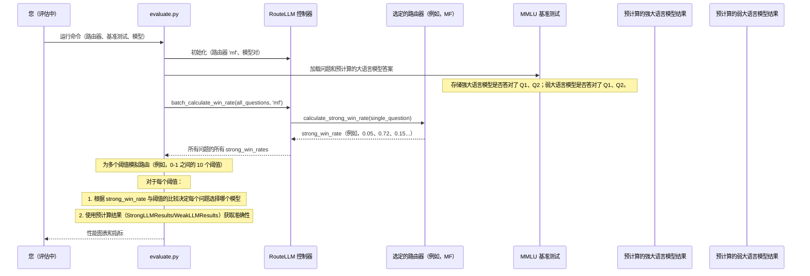

# 第 6 章：基准测试

在[第 5 章：阈值校准](05_threshold_calibration_.md)中，我们学习了如何精确调整 `threshold` 以在大语言模型调用的成本和质量之间实现所需的平衡。我们选择了一个[路由策略](04_router_strategy.md)并设置了其"成本-质量旋钮"。但一个关键问题仍然存在：**我们如何知道精心调整的设置实际上在现实世界中做出了明智的决策并为我们节省了成本？**

这就是**基准测试**概念变得非常宝贵的地方。

## 问题：证明路由器有效

想象一下，我们已经使用 RouteLLM 启动了应用程序，使用选定的[路由策略](04_router_strategy.md)和校准的[阈值校准](05_threshold_calibration_.md)在[模型对](02_model_pair_.md)之间自信地路由查询。我们*希望*它在保持用户满意的同时节省成本。但我们如何确定呢？

*   我们的路由器是否在不牺牲太多质量的情况下将足够多的简单查询发送到更便宜的模型？
*   它是否正确识别了*需要*昂贵强模型的复杂查询？
*   它的性能与始终使用便宜模型或始终使用昂贵模型相比如何？
*   如果我们想尝试不同的[路由策略](04_router_strategy.md)——我们如何客观地比较它们？

如果没有办法衡量这些事情，我们基本上是在盲目飞行。

## 解决方案：路由器的标准化测试

`Benchmark` 就像是**路由器的标准化测试**。就像学生参加标准化测试来衡量他们在某个学科的知识一样，RouteLLM 使用基准测试来衡量不同路由策略的表现如何。

它提供了一组一致的问题和清晰的评分机制来定量测量：

*   **准确性：** 路由系统生成的响应有多正确？
*   **成本效率：** 有多少百分比的请求被路由到昂贵的强模型（表示成本）？
*   **强模型利用率：** 强模型是否仅在必要时才被有效使用？

通过针对已知基准测试运行[路由策略](04_router_strategy.md)，我们可以：

1.  **量化性能：** 获得路由器准确性和成本节省的具体数字。
2.  **比较策略：** 查看哪种[路由策略](04_router_strategy.md)最适合我们的需求。
3.  **验证决策：** 确保[阈值校准](05_threshold_calibration_.md)有效。
4.  **跟踪进度：** 监控随时间的改进。

这使我们能够做出数据驱动的决策，并确认 RouteLLM 正在帮助我们实现所需的质量和成本节省目标。

## 🎢基准测试中的关键概念

RouteLLM 使用来自大语言模型社区的知名基准测试，将它们适配用于路由评估。以下是一些关键概念：

| 概念              | 描述                                                         | RouteLLM 示例                                                |
| :---------------- | :----------------------------------------------------------- | :----------------------------------------------------------- |
| **测试数据集**    | 具有已知正确答案或质量分数的各种问题或任务的集合。           | **MMLU：** 学术多项选择题 <br> **MT-Bench：** 由 GPT-4 评估的多轮聊天机器人对话 <br> **GSM8K：** 小学数学应用题。 |
| **评分机制**      | 一种定义的方式来判断大语言模型对每个问题的响应的质量或正确性。 | **准确性（MMLU、GSM8K）：** 答案是否正确（真/假）？ <br> **平均分数（MT-Bench）：** 平均 GPT-4 评判分数（1-10）。 |
| **预计算结果**    | 为了节省时间和金钱，基准测试不会实时运行大语言模型。相反，它们使用已经生成并存储的 `strong_model` 和 `weak_model` 的结果。 | 对于每个问题，RouteLLM 知道 GPT-4 是否答对了，以及 Mixtral 是否答对了。 |
| **成本-质量曲线** | 通过模拟跨越许多不同 `threshold` 值的路由，基准测试可以绘制一条曲线，显示随着强模型调用百分比（成本）的增加，准确性如何变化。 | 一个图表，x 轴为"强模型调用（%）"，y 轴为"性能"（例如，准确性或分数）。 |

## 使用基准测试：评估路由器

RouteLLM 提供了一个脚本 `evaluate.py` 来运行这些基准测试。假设我们想在 `MMLU` 基准测试上评估 `mf` [路由策略](04_router_strategy.md)，使用 `gpt-4-1106-preview` 作为强模型，使用 `anyscale/mistralai/Mixtral-8x7B-Instruct-v0.1` 作为弱模型。

以下是我们如何使用评估工具：

```bash
# 在 MMLU 基准测试上评估 'mf' 路由器的示例命令
python -m routellm.evals.evaluate \
  --routers mf \
  --benchmark mmlu \
  --strong-model gpt-4-1106-preview \
  --weak-model anyscale/mistralai/Mixtral-8x7B-Instruct-v0.1 \
  --config config.example.yaml \
  --output ./my_mmlu_results
```

*说明：
*   `python -m routellm.evals.evaluate`：这调用 RouteLLM 的评估脚本。
*   `--routers mf`：我们指定要测试的[路由策略](04_router_strategy.md)（这里是 `mf`）。我们可以提供多个路由器。
*   `--benchmark mmlu`：我们选择要使用的基准数据集（这里是 `mmlu`）。
*   `--strong-model` 和 `--weak-model`：这些定义了基准测试的[模型对](02_model_pair_.md)。基准测试需要知道哪些大语言模型构成我们的强和弱选项。
*   `--config config.example.yaml`：这指向路由器的配置详细信息，类似于我们启动[兼容 OpenAI 的服务器](01_openai_compatible_server_.md)的方式。
*   `--output ./my_mmlu_results`：这指定一个目录，图表和指标将保存在其中。*

当我们运行此命令时，RouteLLM 将向控制台输出一个指标表并生成一个图表。该图表通常会显示：

*   我们的路由器在一系列强模型调用百分比上的性能。
*   显示始终使用弱模型或始终使用强模型的基线性能的水平线。
*   通常还有一条"最优"线，显示如果路由器*始终*在强模型更好时选择它的最佳可能性能。

这种可视化表示使我们能够快速评估路由器的有效性及其权衡。

## 内部机制：基准测试如何工作

让我们揭开运行 `evaluate.py` 脚本时发生的事情的神秘面纱。

### "审计员"

将 `evaluate.py` 脚本视为检查路由器决策的**审计员**：

1.  **我们（用户）**告诉"审计员"（脚本）："在 MMLU 测试上评估我的 `mf` 路由器，使用 GPT-4 作为强模型，Mixtral 作为弱模型。"
2.  **审计员准备工具：** 审计员使用我们的 `mf` 路由器和[模型对](02_model_pair_.md)初始化[控制器](03_controller_.md)。它还获取 MMLU 测试问题，关键是，每个问题的 GPT-4 和 Mixtral 的*已知答案*。
3.  **审计员向路由器请求预测：** 对于 MMLU 测试中的*每一个问题*，审计员将其发送到 `mf` "专家"（通过[控制器](03_controller_.md)的[路由策略](04_router_strategy.md)）并询问："*这个特定问题*的 `strong_win_rate` 是多少？"
4.  **路由器返回预测：** `mf` 专家快速计算并为每个问题返回 `strong_win_rate`（0 到 1 之间的数字）。
5.  **审计员在不同阈值下模拟路由：** 然后审计员假装应用*许多不同的 `threshold` 值*（例如，0.1、0.2、0.3...一直到 0.9）。对于每个 `threshold`：
    *   它查看所有 `strong_win_rate` 预测。
    *   它模拟哪些问题会发送到强模型（`strong_win_rate >= threshold`），哪些发送到弱模型（`strong_win_rate < threshold`）。
6.  **审计员检查模拟答案：** 对于每个模拟的路由决策，审计员知道选定模型（强或弱）会给出的*真实答案*（因为它预先加载了结果）。它将此与正确答案进行比较以计算准确性。
7.  **审计员报告性能：** 审计员收集所有计算的准确性和每个模拟 `threshold` 对应的强模型调用百分比。然后它生成一个图表和详细的指标，总结我们路由器的性能。

### 请求流程



### 代码

让我们看看来自 `routellm/evals/benchmarks.py` 和 `routellm/evals/evaluate.py` 的简化代码片段。

#### 1. `Benchmark` 基类（`routellm/evals/benchmarks.py`）

所有基准测试实现（MMLU、MTBench、GSM8K）都继承自一个通用的 `Benchmark` 类，该类定义了评估的标准方法。

```python
# routellm/evals/benchmarks.py
import abc

class Benchmark(abc.ABC):
    """评估模型的基类。"""

    @abc.abstractmethod
    def evaluate(
        self,
        controller, # RouteLLM 控制器
        router,     # 路由器策略的名称（例如，'mf'）
        num_results,# 要评估多少个阈值点
        overwrite_router_cache,
    ) -> tuple:
        """接受一个路由器并返回性能指标。"""
        pass

    @abc.abstractmethod
    def get_model_accuracy(self, model: str) -> float:
        """返回单个模型（强或弱）在此基准测试上的准确性。"""
        pass

    # ... 其他抽象方法，如 get_optimal_accuracy ...
```

*说明：`Benchmark` 类定义了一个契约：任何特定的基准测试（如 `MMLU` 或 `MTBench`）都必须实现 `evaluate` 来运行路由器，实现 `get_model_accuracy` 来提供单个模型的基线分数。*

#### 2. 示例：`MMLU` 基准测试（`routellm/evals/benchmarks.py`）

`MMLU` 类实现了 `Benchmark` 接口。它的 `evaluate` 方法协调模拟。

```python
# routellm/evals/benchmarks.py
import numpy as np
import pandas as pd
from collections import Counter

class MMLU(Benchmark):
    def __init__(self, domains, routed_pair, overwrite_cache):
        self.routed_pair = routed_pair # 存储强和弱模型名称
        # ... 加载 MMLU 数据集和来自强/弱模型的预计算答案 ...
        # self.all_data 是一个 DataFrame，包含 'prompt'、'gpt-4-1106-preview'（如果正确则为 True/False）、'mistralai/Mixtral-8x7B-Instruct-v0.1'（如果正确则为 True/False）

    def evaluate(self, controller, router, num_results, overwrite_router_cache):
        # 1. 从控制器获取所有提示的 strong_win_rates
        strong_win_rates = controller.batch_calculate_win_rate(
            prompts=self.all_data["prompt"], router=router
        )
        self.all_data["strong_win_rates"] = strong_win_rates

        # 2. 确定要评估的阈值（例如，10 个等间距的百分位数）
        _, thresholds = pd.qcut(strong_win_rates, num_results, retbins=True)

        for i, threshold in enumerate(thresholds):
            # 3. 为此阈值模拟路由决策
            selection = self.all_data["strong_win_rates"] >= threshold

            # 4. 使用预计算结果获取结果
            results = np.where(
                selection,
                self.all_data[self.routed_pair.strong], # 如果选择了强模型的答案
                self.all_data[self.routed_pair.weak],  # 如果选择了弱模型的答案
            )
            # 5. 跟踪选择了哪个模型
            models = np.where(
                selection, self.routed_pair.strong, self.routed_pair.weak
            )
            model_counts = Counter(models) # 统计强与弱调用

            # 6. 为此阈值产生结果
            yield threshold, sum(results) / len(results) * 100, model_counts, len(results)
```

*说明：`MMLU` 基准测试的 `evaluate` 方法首先要求[控制器](03_controller_.md)获取所有 MMLU 问题的 `strong_win_rate` 预测。然后，它生成几个 `threshold` 值。对于每个 `threshold`，它模拟路由决策（使用 `np.where`），查找选定模型响应的预先记录的正确/不正确状态（`self.all_data[self.routed_pair.strong]` 或 `self.all_data[self.routed_pair.weak]`），并计算该 `threshold` 的整体准确性和模型利用率。*

#### 3. `evaluate.py` 脚本（`routellm/evals/evaluate.py`）

这是将所有内容联系在一起的主脚本。

```python
# routellm/evals/evaluate.py
import argparse
import pandas as pd
import matplotlib.pyplot as plt # 用于绘图
from routellm.controller import Controller
from routellm.evals.benchmarks import MMLU, MTBench, GSM8K

if __name__ == "__main__":
    parser = argparse.ArgumentParser()
    # ... 参数定义（路由器、基准测试、强/弱模型等）...
    args = parser.parse_args()

    # 初始化控制器，它加载我们选择的路由器
    controller = Controller(
        routers=args.routers,
        strong_model=args.strong_model,
        weak_model=args.weak_model,
        # ... 其他配置 ...
    )

    # 初始化特定的基准测试（例如，MMLU）
    if args.benchmark == "mmlu":
        benchmark = MMLU(ALL_MMLU_DOMAINS, controller.model_pair, args.overwrite_cache)
    # ... elif 用于 mt-bench、gsm8k ...

    all_results = pd.DataFrame()
    for router in controller.routers:
        router_results = []
        for threshold, accuracy, model_counts, total in benchmark.evaluate(
            controller, router, args.num_results, False
        ):
            # 收集此路由器和阈值的结果
            router_results.append({
                "method": str(router),
                "threshold": threshold,
                "strong_percentage": model_counts[controller.model_pair.strong] / total * 100,
                "accuracy": accuracy,
            })
        all_results = pd.concat([all_results, pd.DataFrame(router_results)])

    # 生成图表并打印指标
    generate_results(all_results, benchmark, args.benchmark, controller.model_pair, args.output)
```

*说明：`evaluate.py` 脚本首先解析我们的命令行参数。然后它初始化中央[控制器](03_controller_.md)和特定的 `Benchmark` 对象（如 `MMLU`）。它循环遍历我们想要评估的每个[路由策略](04_router_strategy.md)，调用 `benchmark.evaluate()` 方法以获取跨不同阈值的所有性能数据（准确性、强模型百分比）。最后，它使用这些收集的数据生成图表并打印出详细的指标，使我们能够可视化和定量评估路由器的性能。*

## 结论

`Benchmark` 是验证和比较 RouteLLM 设置的终极工具。

- 通过使用一致的数据集和清晰的评分运行标准化测试，我们可以定量测量[路由策略](04_router_strategy.md)的有效性，确保[阈值校准](05_threshold_calibration_.md)是最优的，并就如何最好地实现成本节省和质量目标做出明智的决策。

我们对 RouteLLM 核心概念的学习之旅 END *★,°*:.☆(￣▽￣)/.°★* 。